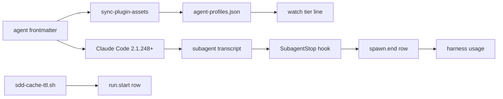

# Design Document — agent-cache-ttl
Document version: v1

## Overview

The three orchestrator agent files get the line `experimental: { cacheTtl: 1h }`, the profile builder and the watch view carry the declared lifetime, the `SubagentStop` hook writes three cache fields on `spawn.end`, `harness usage` folds them into three columns, and a new shipped script records overrides on `run.start`. The change sits in the harness (agents, hook, supervisor skill), the build script, and the watch and usage modules of the server. It reuses the hook's per-`message.id` dedupe (`harness/hooks/sdd-activity.sh:47-55`), the profile sync (`scripts/sync-plugin-assets.cjs:85-128`), the usage fold (`src/watch/usage.ts:90-242`) and the shipped-script pattern of `harness/skills/sdd-continue/references/sdd-providers.sh:1-30`.

## Steering Document Alignment

### Technical Standards (tech.md)
No `tech.md` exists; the design follows `.spec-workflow/agent-rules.md`: tests in `__tests__` next to the code, node 20 guaranteed fields only, `harness/` as source and `plugins/` generated.

### Project Structure (structure.md)
No `structure.md` exists; the one new shipped file goes beside its sibling scripts in `harness/skills/sdd-continue/references/`, new tests go in `src/__tests__/`, and verification helpers go under `/tmp/scratchpad/sdd/agent-cache-ttl/`.

### Design System (design-system.md) — if applicable
N/A.

## Architecture

Claude Code reads the frontmatter lifetime and writes the lifetime split into each transcript line; the hook reads it back; the ledger carries it; the usage fold and the watch view read the ledger and the profiles. The only new seam is `sdd-cache-ttl.sh`, which the supervisor calls at Step 0. The pre-merge live verification adds a scratch Claude Code configuration home that links the branch's harness, so no file under `~/.claude` changes.



## Components and Interfaces

### C1 — Orchestrator frontmatter
- **Purpose:** declare one hour for the three agents that wait.
- **Interfaces:** in `harness/agents/sdd-document-orchestrator.md`, `harness/agents/sdd-implementation-orchestrator.md` and `harness/agents/sdd-closeout-orchestrator.md`, insert `experimental: { cacheTtl: 1h }` as a new line 6, directly after `effort: high` (line 5 in each). The other nine files do not change.
- **Dependencies:** Claude Code 2.1.248 or later. Probe of the installed 2.1.281 binary (2026-09-24): a function reads the frontmatter `experimental` object, finds the key `cachettl` case-insensitively, and accepts only `5m` or `1h`; both the file-agent loader and the plugin-agent loader copy that value onto the agent definition, and the frontmatter schema describes it as ignored while a subscription is in overage.
- **Reuses:** the whole-directory copy `scripts/sync-plugin-assets.cjs:67-74` puts the line into every plugin root unchanged.

### C2 — Profile builder
- **Purpose:** write `cacheTtl` per agent into `harness/agent-profiles.json`.
- **Interfaces:**
  - `cacheTtlOf(experimental: string | undefined): string` — returns the trimmed capture of `/cacheTtl:([^}]*)\}/` on the raw value the per-line split stored under `experimental` (`scripts/sync-plugin-assets.cjs:94-98`), or `default` when the value is absent, has no match, or the capture trims to empty.
  - `buildProfiles(agentsDir = AGENTS_DIR): string` — the optional trailing parameter serves the test; the object literal at `scripts/sync-plugin-assets.cjs:107` becomes `{ model, effort, role, cacheTtl: cacheTtlOf(front.experimental) }`.
  - `module.exports = { buildProfiles, cacheTtlOf }`, and the unconditional `main();` at `scripts/sync-plugin-assets.cjs:166` becomes `if (require.main === module) main();`.
- **Dependencies:** none new.
- **Reuses:** `syncProfiles` (`scripts/sync-plugin-assets.cjs:112-128`) unchanged, so `--check` fails on a stale file (Requirement 1 criterion 6).

### C3 — Watch view profile and tier line
- **Purpose:** show `1h` beside the declared model and effort.
- **Interfaces:**
  - `AgentProfile` (`src/watch/ledger.ts:38-42`) gains `cacheTtl?: string`.
  - `loadAgentProfiles` (`src/watch/ledger.ts:51-78`): the validity check at lines 65-69 is unchanged; line 70 builds `{ model, effort, role }` and adds `cacheTtl: v.cacheTtl` only when `typeof v.cacheTtl === 'string'`.
  - `agentLines` (`src/watch/render.ts:220`): `declared` becomes `model effort` plus ` <cacheTtl>` when `profile.cacheTtl` is set and is not `default`. The pad at line 226 becomes `Math.max(24, stripAnsi(declared).length + 1)`.
- **Dependencies:** `harness/agent-profiles.json` or its `dist/` copy.
- **Reuses:** `padRight` (`src/watch/render.ts:55-58`), which never truncates.

### C4 — `SubagentStop` hook cache fields
- **Purpose:** write `cacheWrite5m`, `cacheWrite1h` and `gapRewrites` on every hook-written `spawn.end`.
- **Interfaces:** inside the single-quoted node body (`harness/hooks/sdd-activity.sh:36-165`), with no apostrophes (line 83):
  - The dedupe map at lines 47-55 keeps, per key, `{ u, model, t }`. `t` is the smallest `Date.parse(e.timestamp)` that is finite over all lines of that key, else `null`. A line with no id keeps its own `t`.
  - New `cacheFields(calls)` over `byId.values()` returns `{ cacheWrite5m, cacheWrite1h, gapRewrites }`, each a string:
    1. If any call has `u.cache_creation` that is not an object, or its `ephemeral_5m_input_tokens` or `ephemeral_1h_input_tokens` is not a finite number, all three are `unknown`.
    2. Else `cacheWrite5m` and `cacheWrite1h` are the decimal sums of those two fields.
    3. If any call has `t === null`, `gapRewrites` is `unknown`. Else, with the calls stably sorted by `t`, it is the count of calls at index `i` of 1 or more where `t[i] - t[i-1] > 300000` and `num(cache_creation_input_tokens[i]) > prefix[i-1] / 2`, where `prefix` is `num(input_tokens) + num(cache_creation_input_tokens) + num(cache_read_input_tokens)`.
  - `readUsage` returns the three strings beside its existing keys. The `u` branch at line 157 adds them to the row; the `else` branch at line 160 adds all three as `unknown`.
- **Dependencies:** transcript lines with top-level `timestamp` and `message.usage.cache_creation`; probe of a live subagent transcript on 2026-09-24 (Claude Code 2.1.281): `cache_creation` holds `ephemeral_1h_input_tokens` and `ephemeral_5m_input_tokens` beside `cache_creation_input_tokens`.
- **Reuses:** the one parse pass of `readUsage` (`harness/hooks/sdd-activity.sh:41-64`); the 5-second hook timeout (`harness/hooks/hooks.json:27-37`) is unchanged.

### C5 — Usage fold and tables
- **Purpose:** carry the cache numbers through every cell and print three columns.
- **Interfaces:**
  - `UsageCell` (`src/watch/usage.ts:13`) becomes `{ spawns, tokens, unknown, cacheWrite5m, cacheWrite1h, gapRewrites, cacheUnknownWrite, cacheUnknownGap }`, all numbers; `emptyCell` (lines 57-59) and `addCell` (lines 65-69) cover all eight.
  - `ReducedSpawn` (lines 48-55) gains `cache: { w5m: number; w1h: number; gap: number; unknownWrite: 0 | 1; unknownGap: 0 | 1 }`.
  - `reduceSpawn` (lines 195-207): the row that sets `tokens` also sets `cache`. When that row's `cacheWrite5m` or `cacheWrite1h` is not a digit string, `unknownWrite` is 1 and the three sums are 0. Else the two sums are taken, and `gapRewrites` gives `gap` when it is a digit string, else `unknownGap` is 1 and `gap` is 0. With no such row, `unknownWrite` is 1.
  - Aggregation (lines 131-151): when `r.provider === 'anthropic'`, add `cache` to the agent cell, `ph.total` and `ph.providers.anthropic`; else add nothing. The report totals (lines 171-181) add the five fields the same way.
  - New `cacheCols(c: UsageCell, anthropicSpawns: number): [string, string, string]`. With `anthropicSpawns` 0 it returns `['-', '-', '-']`. Else each write column is `unknown` when `c.cacheUnknownWrite === anthropicSpawns`, else `grp(sum)`. The gap column is `unknown` when `c.cacheUnknownWrite + c.cacheUnknownGap === anthropicSpawns`, else `grp(c.gapRewrites)` followed by ` (+N unknown)` when that sum N is above 0.
  - The Anthropic count is the cell's `spawns` for an agent key without `@deepseek`, 0 for a key with it, `ph.providers.anthropic.spawns` for a phase total, and `report.providers.anthropic.spawns` for the grand total.
  - `formatOne` (lines 288-299): the header becomes `phase | agent | spawns | tokens | cw5m | cw1h | gapRewrites`, and each agent, phase-total and grand-total line puts ` | cw5m | cw1h | gap` directly after its token cell.
  - `formatCompare` (lines 301-330): the header repeats the four columns `tokens | cw5m | cw1h | gapRewrites` after each `spawns`. `pair` (line 310) takes the Anthropic count as a second argument and returns `- | - | - | - | -` for an absent cell. The delta text is unchanged.
- **Dependencies:** `LedgerEvent` already admits any string key (`src/watch/ledger.ts:18-24`).
- **Reuses:** `usageAction` (`src/tools/harness.ts:1063-1084`) returns `data.report` and `data.compare` as built, so the new fields reach the tool result with no change there.

### C6 — Override probe `sdd-cache-ttl.sh`
- **Purpose:** report whether the frontmatter lifetime can apply.
- **Interfaces:** `bash harness/skills/sdd-continue/references/sdd-cache-ttl.sh`, no arguments, working directory = code root. It prints exactly one stdout line `cacheTtl=VALUE` and exits 0 in every case. The node body is in a single-quoted string with no apostrophes. It decides VALUE in order, first match wins:
  1. `unknown` when `execFileSync("claude", ["--version"], { encoding: "utf8", timeout: 10000 })` throws, or its output has no match for `/(\d+)\.(\d+)\.(\d+)/`.
  2. `unsupported` when the three numbers, compared as numbers in order, are below 2, 1, 248.
  3. `FORCE_PROMPT_CACHING_5M=` plus its value, when the variable is non-empty and not `0`.
  4. `CLAUDE_CODE_SUBAGENT_PROMPT_CACHE_TTL=` plus its value, when non-empty.
  5. `subagentPromptCacheTtl=` plus `String(value)` from the first of `.claude/settings.local.json`, `.claude/settings.json` (both in the working directory) and the user settings file, whose parsed JSON has the key with a value that is not `null` and not empty. The user settings file is `$CLAUDE_CONFIG_DIR/settings.json` when that variable is set, else `~/.claude/settings.json` via `os.homedir()`. A file that is missing or does not parse is skipped.
  6. `per-agent`.
- **Dependencies:** `claude` on `PATH`.
- **Reuses:** the header and node-in-shell shape of `sdd-providers.sh` (`harness/skills/sdd-continue/references/sdd-providers.sh:1-30`).

### C7 — Supervisor and ledger format
- **Purpose:** record and warn once, and block the retrospective on missing live evidence.
- **Interfaces:**
  - `harness/skills/sdd-continue/SKILL.md` Step 0 (lines 33-56) gains item 5, **Cache lifetime**. It runs `bash <base dir>/references/sdd-cache-ttl.sh` and keeps the text after `cacheTtl=` as `CACHE_TTL`. When `CACHE_TTL` is not `per-agent`, it prints the one warning line of Requirement 5 criterion 4 and continues. It never stops the run.
  - The `run.start` call (lines 100-102) adds `cacheTtl=<CACHE_TTL>`.
  - Step 3 rule 1 (lines 153-156) gains one sentence. Before the retrospective phase, if `specs/<spec>/verification-evidence.md` exists and any line that starts with `- (` does not have `passed` as its status word, print the status line with `retrospective blocked — verification-evidence.md (N) STATUS` and stop.
  - `harness/skills/sdd-continue/references/formats.md` adds `cacheTtl` (`per-agent`, `unsupported`, `unknown`, or `NAME=VALUE`) to the `run.start` row (line 194). It adds `cacheWrite5m`, `cacheWrite1h` (digits or `unknown`) and `gapRewrites` (calls more than 300 s after the previous call that wrote more than half its prefix; digits or `unknown`) to the `spawn.end` row (line 199).
- **Dependencies:** C6.
- **Reuses:** the warn-and-continue pattern at `harness/skills/sdd-continue/SKILL.md:53-55`, and the `event.sh` split at the first `=` (`harness/skills/sdd-continue/references/formats.md:179`).

### C8 — Live verification before the merge (scratch, not shipped)
- **Purpose:** run scenarios (1), (2), (3) and (5) against the branch's agents, hook and supervisor skill before the merge, without touching `~/.claude`.
- **Interfaces:** four files under `/tmp/scratchpad/sdd/agent-cache-ttl/`, written by an implementation task:
  - `e2e-setup.sh WORKTREE` sets `E2E=/tmp/scratchpad/sdd/agent-cache-ttl/e2e`, `H=$E2E/claude-home` and `ROOT=$E2E/root`. It runs `npm run build` and `node scripts/sync-plugin-assets.cjs` in `WORKTREE`. It runs `CLAUDE_CONFIG_DIR=$H bash WORKTREE/scripts/dev-link.sh`, which links the branch's agents and skills into `$H` and registers the branch's hook in `$H/settings.json` (`scripts/dev-link.sh:19`, `scripts/dev-link.sh:37-38`, `scripts/dev-link.sh:50-64`). It writes the probe agents `$H/agents/sdd-cache-probe.md` and `$H/agents/sdd-cache-probe-worker.md`. It runs `git init $ROOT` and writes `$ROOT/.mcp.json` in the shape of `.mcp.json:1-12`, with the args `WORKTREE/dist/index.js`. It writes `$ROOT/.spec-workflow/spec-decomposition/decomposition.md` with one entry, `cache-probe` (a one-function greeting). It creates `$ROOT/.spec-workflow/specs/cache-gap-probe/`. It writes three UUIDs to `$E2E/sid-1`, `$E2E/sid-2` and `$E2E/sid-5`, then prints the launch commands below.
  - `e2e-setup.sh --probe-pointer` appends one tab-separated line to the pointer file (`${XDG_STATE_HOME:-$HOME/.local/state}/sdd/active-run`): `$ROOT`, `$ROOT/.spec-workflow/specs/cache-gap-probe` and `probe-` plus the UTC time. `e2e-setup.sh --clear-pointer` removes only the lines whose first field equals `$ROOT`, so it never removes a line from another run.
  - `sdd-cache-probe.md`: `name: sdd-cache-probe`. It has the `model:`, `effort:` and `experimental:` lines copied by `grep -E '^(model|effort|experimental):'` from `WORKTREE/harness/agents/sdd-document-orchestrator.md`, and `tools: [Agent]`. Its body: spawn `sdd-cache-probe-worker` in the foreground with the prompt `wait`, then reply `DONE`.
  - `sdd-cache-probe-worker.md`: `model: claude-sonnet-5`, `tools: [Bash]`. Its body: call Bash `sleep 330` with timeout 400000 twice, then reply `DONE`. The probe's call after the worker returns comes more than 660 s after its previous call.
  - `recompute.mjs` does not import or copy the hook code (Requirement 6 criterion 3). It reads `$ROOT/.spec-workflow/specs/{cache-probe,cache-gap-probe}/harness-events.jsonl` and the `harness-activity.jsonl` beside each. It joins each `spawn.end` row to the `agent.stop` activity line with the same `ts` and `agent`; the hook writes both from one `ts` (`harness/hooks/sdd-activity.sh:96`, lines 140 and 157). It opens `$H/projects/*/SESSION/subagents/agent-AGENTID.jsonl`, recomputes the three values from its own reading of Requirement 3 criteria 2 to 7, and prints one match or mismatch line per row. It prints the four evidence lines of the data model below. With `--write PATH`, it replaces the four scenario lines in that file.
- **Launch sequence** (operator, after the PR opens and before the merge):
  1. `bash /tmp/scratchpad/sdd/agent-cache-ttl/e2e-setup.sh WORKTREE`
  2. `cd $ROOT && CLAUDE_CONFIG_DIR=$H claude`, then `/login` with the same subscription account, approve the `spec-workflow` server, and `/exit`. Never copy a credentials file.
  3. Scenario (1): `cd $ROOT && CLAUDE_CONFIG_DIR=$H claude --session-id "$(cat $E2E/sid-1)" --model claude-opus-5-5 "continue the sdd process"`. Exit when the supervisor reports the first orchestrator's `PHASE:` line or asks gate A. Then run `e2e-setup.sh --clear-pointer`.
  4. Scenario (2): run `e2e-setup.sh --probe-pointer`, then `cd $ROOT && CLAUDE_CONFIG_DIR=$H claude --session-id "$(cat $E2E/sid-2)" --model claude-opus-5-5 "Spawn the sdd-cache-probe agent in the foreground with the prompt start and report its reply"`. Exit after `DONE`, then run `--clear-pointer`.
  5. Scenario (5): `cd $ROOT && FORCE_PROMPT_CACHING_5M=1 CLAUDE_CONFIG_DIR=$H claude --session-id "$(cat $E2E/sid-5)" --model claude-opus-5-5 "continue the sdd process"`. Exit once the new `run.start` row is in the `cache-probe` ledger, then run `--clear-pointer`.
  6. `node /tmp/scratchpad/sdd/agent-cache-ttl/recompute.mjs --write /home/mcf/repo/spec-workflow-mcp/.spec-workflow/specs/agent-cache-ttl/verification-evidence.md`, then commit that file in the spec store repository as `docs(sdd): agent-cache-ttl verification evidence`.
- **Dependencies:** `CLAUDE_CONFIG_DIR`. Probe of the 2.1.281 binary: it names the variable as where the user's own settings are found and requires an absolute path. `dev-link.sh` honours the variable at `scripts/dev-link.sh:19`.
- **Reuses:** the pointer and marker mechanism of the hook (`harness/hooks/sdd-activity.sh:11-35`); the markers are keyed by run, session and agent, so they do not collide with other runs.

## Data Models

### `spawn.end` row (hook, with usage)
```
{ ts, type: "spawn.end", run, spec, agent,
  input, output, cacheWrite, cacheRead, tokens,   // unchanged digit strings
  cacheWrite5m: "digits" | "unknown",
  cacheWrite1h: "digits" | "unknown",
  gapRewrites:  "digits" | "unknown",
  model? }
// no usage: { ts, type, run, spec, agent, tokens: "unknown",
//             cacheWrite5m: "unknown", cacheWrite1h: "unknown", gapRewrites: "unknown" }
```

### Profile entry (`harness/agent-profiles.json`)
```
"sdd-document-orchestrator": { "model": "claude-opus-4-8", "effort": "high",
  "role": "document-phase orchestrator", "cacheTtl": "1h" }   // "default" for the other nine
```

### `run.start` row
```
{ ..., providers, cacheTtl: "per-agent" | "unsupported" | "unknown" | "NAME=VALUE" }
```

### `verification-evidence.md` (tracked, spec store)
```
# Verification evidence — agent-cache-ttl
- (1) STATUS — session SID — orchestrator cw1h N cw5m 0; worker cw5m N cw1h 0
- (2) STATUS — session SID — gap S s, read P% of previous prefix, gapRewrites 0
- (3) STATUS — session SID — R rows, all equal to recompute
- (5) STATUS — session SID — run.start cacheTtl=FORCE_PROMPT_CACHING_5M=1, W warning lines
```
STATUS is `pending`, `passed` or `failed`. The implementation task that writes C8 also creates this file with four `pending` lines and commits it, so the Step 3 check (C7) finds the file.

## Error Handling

1. **A transcript without `cache_creation` on any counted call:** all three fields are `unknown`; the other keys are as today (Requirement 3 criterion 6).
2. **A call without a parseable `timestamp`:** `gapRewrites` is `unknown`; the two write sums stay.
3. **No transcript or no assistant usage:** the `tokens: "unknown"` row carries three `unknown` fields; the hook never skips the row.
4. **An old ledger row without the keys:** it counts in `cacheUnknownWrite`; the table prints `unknown`, never 0.
5. **An older `dist/agent-profiles.json` without `cacheTtl`:** it loads; the tier line is as today.
6. **`claude` missing or slow:** the probe prints `cacheTtl=unknown` after at most 10 s, exits 0, and the supervisor warns once.
7. **Malformed settings file:** it is skipped, and the next file or `per-agent` decides.
8. **A live scenario fails:** `recompute.mjs` writes `failed`; the PR gets a fix commit and the sequence runs again. If the merge happened first, the Step 3 check blocks the retrospective.

## Testing Strategy

- **Unit:**
  - `src/__tests__/sync-plugin-assets.test.ts` (new) loads the script with `createRequire`. It writes two fixture agent files to a temp dir: one with `experimental: { cacheTtl: 1h }` and one without. It asserts `cacheTtlOf` and the `buildProfiles(tempDir)` output carry the literal `"1h"` and `"default"`. It also asserts two runs are byte-identical.
  - `src/watch/__tests__/render.test.ts`: the orchestrator assertion at line 55 becomes `declared claude-opus-4-8 high 1h +actual`. Add a case at width 80 that asserts a space before `actual` for the `1h` and default agents, and a case where a profile without `cacheTtl` renders as today.
  - `src/watch/__tests__/usage.test.ts`: ledger fixtures for Requirement 4 criteria 2 to 8. They cover a digit row, a write-unknown row, a gap-only-unknown row that keeps its write sums, a `spawn.usage`-only spawn, a mixed Anthropic and DeepSeek phase, an all-DeepSeek phase total printing `-`, a gap column with ` (+N unknown)`, a ledger with no new keys printing `unknown` with the tokens columns unchanged, and a compare of one ledger with the keys against one without.
  - `src/__tests__/cache-ttl-probe.test.ts` (new), patterned on `src/__tests__/providers-map.test.ts:17-18`. A stub `claude` on `PATH` prints a set version or exits 1. The working directory is a temp code root, `HOME` is a separate temp dir, and the environment has no `FORCE_PROMPT_CACHING_5M`, `CLAUDE_CODE_SUBAGENT_PROMPT_CACHE_TTL` or `CLAUDE_CONFIG_DIR` unless a case sets them. There is one case for each of the six values. Settings files in all three places prove local-over-project-over-user and first-file-wins. One case points `CLAUDE_CONFIG_DIR` at a dir whose `settings.json` sets the key. Asserts use only exit status and stdout.
- **Integration:** `src/__tests__/hook-spawn-events.test.ts` drives the real hook with its `runHook` helper (lines 36-41) over new fixture transcripts. It covers a 5m and 1h split, a multi-line message counted once, a gap over 300 s with a large rewrite (counted), a gap over 300 s with a small write (not counted), a gap under 300 s with a large write (not counted), one call without `cache_creation` (three `unknown`), and no transcript (three `unknown`). The test computes the expected values from its own fixture literals.
- **End-to-end:**
  - Scenario (4), at the implementation gate: a scratch store `/tmp/scratchpad/sdd/agent-cache-ttl/usage-store/` has its own `XDG_STATE_HOME` and pointer file, so the real pointer is never touched. Its ledger comes from running the worktree hook on two real subagent transcripts of this spec's runs. `/tmp/scratchpad/sdd/agent-cache-ttl/usage-check.mjs` imports `WORKTREE/dist/watch/usage.js` (the fold `usageAction` calls) and prints the table for that ledger and for the `provider-per-role` ledger. Pass: digits on the first, `unknown` on the second.
  - Scenario (6), at the gate: `npm run check:plugin-assets`, `claude plugin validate . --strict` at the repository root, and `npm test`.
  - Scenarios (1), (2), (3) and (5): the C8 sequence. Pass is the four `passed` lines that `recompute.mjs` writes.

## Decisions taken in this document

- D1 — How the live scenarios run before the merge against the branch: a scratch Claude Code configuration home, set by the configuration-directory variable and filled by the existing dev-link script run against the worktree, so the branch's agents, skills and hook are the only harness the session sees; options were the command-line agents flag (the installed 2.1.281 reads the cache lifetime only for file and plugin agents, per binary probe), loading the branch's generated plugin with the plugin-dir flag (prefixed agents sit next to the linked main agents, and the main hook in user settings still fires, so two hooks write one ledger), or repointing the symlinks in the user configuration (it switches every running harness session on this machine); chosen because it isolates the branch completely, needs no change to shipped code, and leaves other sessions alone.
- D2 — Scenario (2) runs on a probe agent pair whose lifetime, model and effort lines are copied from the branch's document orchestrator; options were waiting for a natural gap over ten minutes in the fixture run (not deterministic), or prompting the real orchestrator to wait (its phase skill fixes its behaviour); chosen because a worker that sleeps 660 s gives a certain gap on the branch's own lifetime line.
- D3 — The retrospective block is a generic supervisor check on any spec's evidence file, with the file created at implementation holding pending lines; options were a rule for this spec only, or a HANDOFF note; chosen because it is one sentence, it holds for later specs that defer live checks, and a pending line blocks just as a missing pass does.
- D4 — The profile test lives in the server test directory and loads the build script through exports and a main-module guard; options were a test beside the script (the test runner includes only the source tree) or widening the runner include; chosen because it changes no test configuration.
- D5 — Tier-line pad width: 24, or the declared text length plus one when longer; options were a fixed 26, or dropping the pad; chosen because the longest text today with the lifetime is 23 characters, and the rule keeps a space at any length.
- D6 — The override probe reads user settings from the configuration-directory variable when it is set; options were the home directory only, as the requirement wrote it; chosen because Claude Code reads user settings from there, and the pre-merge session in D1 sets it.
- D7 — The hook computes the three fields in the same pass as the usage sums, keeping the earliest timestamp per message; options were a second read of the transcript; chosen because it keeps one parse inside the 5-second hook timeout.
- D8 — The compare table prints dashes for all five cells of an absent side; options were printing zero for the cache columns; chosen because an absent agent has no rows, and zero would read as a saving.
- D9 — The live scenarios run after the PR opens and before the merge, and the requirement's retrospective block stays as the backstop; options were running them only after the merge and a restart (a failure then needs a second PR); chosen because a failure is fixed on the same branch.

## Scope notes

- Carried note 1 (per-kind unknown): pinned in C5 as `cacheUnknownWrite` and `cacheUnknownGap` on `UsageCell`, `ReducedSpawn.cache` and `reduceSpawn`.
- Carried note 2 (evidence file): pinned in C8 (writer), Data Models (format) and C7 (the Step 3 check that reads it before the retrospective starts).
- Carried note 3 (all-DeepSeek total): pinned in C5 `cacheCols`. With an Anthropic count of 0, all three columns print `-`.
- Not shipped: the C8 files and `usage-check.mjs` stay under `/tmp/scratchpad/sdd/agent-cache-ttl/`; only the evidence file is tracked.
- Kept from requirements: no `cacheTtl` in the watch header, no detection of the usage-credit fallback, no managed settings in the probe, and no change to the supervisor's own cache, the retro orchestrator, the DeepSeek launcher rows or the compare delta.
- `claude plugin validate . --strict` runs at the repository root only; the plugin-level hook-path warnings are pre-existing and stay out of scope.

## Revision History

- **v1** (2026-09-24) — Initial draft.
