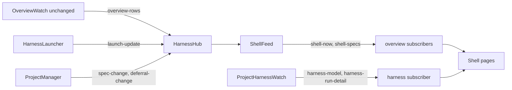

# Design Document — dashboard-shell

Document version: v1

## Overview

This design replaces the dashboard frontend shell with five routes (Now, Runs, Specs, Usage, Deferrals), a project-filter sidebar and a list-plus-panel layout, and deletes the legacy pages. All row and wait derivation moves into new server modules under `src/dashboard/shell/`, pushed to the browser on the existing overview view of the harness hub, so vitest covers it (vitest.config.ts:7-8). It reuses `buildModel`, the overview and project harness watches, the launcher and the existing setup, launch, stop, task-review and deferrals routes without changing any of them except two additive sends.

## Steering Document Alignment

### Technical Standards (tech.md)
N/A: `.spec-workflow/steering/` is empty; the design follows `agent-rules.md` (server tests next to the module, `npx tsc --noEmit`, node 20 field limits).

### Project Structure (structure.md)
N/A: no structure.md; new server modules go in `src/dashboard/shell/` with tests in `src/dashboard/shell/__tests__/`, new frontend code in `src/dashboard_frontend/src/modules/shell/`, beside the existing `harness/` folders of each tree.

### Design System (design-system.md) — if applicable
N/A: no design-system.md. The shell uses only the existing theme tokens of `src/dashboard_frontend/src/modules/theme/theme.css` and the `dark` class the ThemeProvider sets (src/dashboard_frontend/src/modules/theme/ThemeProvider.tsx:13-30), so light and dark parity holds by construction.

## Architecture

The browser opens one WebSocket with no `projectId` and holds the `overview` view for the life of the page. The hub (src/dashboard/harness/hub.ts:29-133) owns a new `ShellFeed` next to the unchanged `OverviewWatch`: the feed starts and stops with the overview view, recomputes on each `overview-rows` the watch emits, on launcher `launch-update`, on project-manager `spec-change` and `deferral-change`, and on a 30 s tick, and pushes `shell-now` and `shell-specs` to overview subscribers. The run page holds the existing per-project `harness` view; `ProjectHarnessWatch.rebuild` adds one `harness-run-detail` send built from the files it already reads. No file watcher is added and no watch set changes (Requirement 8 AC 2).



## Components and Interfaces

### C1 — Shell wire types
- **Purpose:** One typed home for the new server-to-client shapes (Data Models).
- **Interfaces:** `src/dashboard/shell/types.ts` exports `Wait`, `NowModel`, its row types, `SpecListRow`, `SpecDetail`, `RunDetail`, `ShellMessage`. `HarnessMessage` (src/dashboard/harness/types.ts:77-83) gains `harness-run-detail`. The frontend keeps a hand copy in `src/dashboard_frontend/src/modules/shell/types.ts`, as for the harness types (src/dashboard_frontend/src/modules/harness/types.ts:1-7), because root `tsc` excludes the frontend (tsconfig.json:20).
- **Reuses:** `LedgerEvent`, `ActivityEvent`, `PhaseRow` (src/watch/ledger.ts:18-36, 89-95).

### C2 — File cache
- **Interfaces:** `src/dashboard/shell/file-cache.ts`: `class FileCache { text(path: string): string | undefined; jsonl<T>(path: string): T[]; mtimeMs(path: string): number | null }`. An entry is reused while the file's `statSync` `mtimeMs` and `size` are unchanged; a missing or unreadable file gives `undefined`, `[]` or `null` and never throws; `jsonl` uses `parseJsonl`, so a torn line is skipped (src/watch/ledger.ts:186-199).

### C3 — Wait derivation
- **Purpose:** Requirement 2.
- **Interfaces:** `src/dashboard/shell/waits.ts`:
  - `gateOrRuling(ledger: LedgerEvent[]): { kind: 'gate' | 'ruling'; row: LedgerEvent } | null` — pure; scopes to the last `run.start`'s rows as `buildModel` does (src/watch/ledger.ts:256-261); the newest `phase.end` with result `gate-a`/`gate-b` gives `gate`, `escalate` gives `ruling`, only with no later `phase.start` of that run.
  - `deriveProjectWaits(project: ProjectContext, pointer: PointerLine | undefined, launch: LaunchRecord | null, now: number, cache?: FileCache): Wait[]`. `gate`, `ruling` and `quiet` read the overview watch's spec: the pointer spec, else the HANDOFF active spec (src/dashboard/harness/overview-watch.ts:238-265). `retro` reads every spec directory: proposals present and the plan absent or its first `Status:` value starting `DRAFT`; `count` is the `DECISION NEEDED: yes` lines. `exited`: `launch.state` is `exited` and its `runId` is null or has no `run.end` in the record's spec ledger. `quiet`: a pointer line, an open spawn in `buildModel({ spec, ledger, activity: [] })`, and `harness-activity.jsonl` `mtimeMs` over 15 minutes before `now`; only then is the activity file parsed, for the panel's last tool.
  - `orderWaits(waits: Wait[]): Wait[]` — kinds `gate`, `ruling`, `retro`, `exited`, `quiet`, then `since` ascending.
- **Reuses:** `parseHandoffRouting`, `parseGateSections` (src/dashboard/harness/project-watch.ts:27-40, 62-65); `handoffPath` (src/watch/index.ts:34-39).

### C4 — Now model
- **Purpose:** Requirement 3 and the Requirement 4 AC 1 list.
- **Interfaces:** `src/dashboard/shell/now-model.ts`: `buildNowModel(projects: ProjectContext[], pointers: PointerLine[], launchOf: (projectId: string) => LaunchRecord | null, now: number, cache?: FileCache): Promise<NowModel>`:
  - `waits`: `orderWaits` over every project.
  - `live`: one row per project with a pointer line under its specs directory; `detail` is the newest open level-2 spawn's agent with `round N` or `task N`, else `waits on gate A`/`B` when the project has a gate wait, else the live phase; `tokens` is `buildModel`'s `tokensTotal`; `startedAt` is `runStartedAt`.
  - `idle`: projects with no pointer line; `launchable` and `disabledReason` from `IndexGenerator.snapshot()` routing by the rule of src/dashboard/harness/run-setup.ts:166-168.
  - `closed`: specs whose HANDOFF phase log has a `closeout` row with result `closed` dated within 7 calendar days (`parseHandoffPhaseRows`, src/watch/ledger.ts:202-218).
  - `runs`: projects whose `resolveSpec` (src/watch/index.ts:42-56) names a spec with a ledger; `state` is `live` with a pointer line, else the launch record's `stopped` or `exited` when its spec matches, else `ended`.
  - `launches`: per project, the launch record's `state`, `pid`, `runId`, or null.
- **Reuses:** src/core/index-generator.ts:59-91; `readPointer` (src/dashboard/harness/state-files.ts:50-67).

### C5 — Spec rows and spec detail
- **Purpose:** Requirement 5.
- **Interfaces:** `src/dashboard/shell/spec-rows.ts`:
  - `buildSpecRows(project: ProjectContext, pointers: PointerLine[], cache?: FileCache): Promise<SpecListRow[]>` — one row per snapshot spec (every spec directory, src/dashboard/parser.ts:27-45). State, first match wins: `live` (a pointer line names it), `closed` (`closeout`/`closed` phase-log row or plan `Status: CLOSED`), `deferred` (`SpecIndexEntry.deferred`), `not-started` (no requirements, design or tasks document and no ledger), else `in-progress`. `phase`: live phase, else newest phase-log stage, else snapshot `currentPhase`. `versions`: per document phase, the newest phase-log `State` matching `v` plus digits. `prs`: distinct `PR #` numbers in its phase-log notes (sample: HANDOFF.md:60). `deferrals`: `DeferralStorage.list({ status: 'deferred', originSpec })` length (src/core/deferral-storage.ts:266). `retro`: the plan's `Status:` first word, else null. `updated`: newest ledger `ts` or phase-log date.
  - `buildSpecDetail(project: ProjectContext, spec: string): Promise<SpecDetail | null>` — null when `spec` fails `/^[A-Za-z0-9._-]+$/` or is no directory under the specs directory. `order`: the `### N.` heading of `spec-decomposition/decomposition.md` naming the spec in backticks; `dependsOn`: that entry's `**Depends on**` paragraph; `runs`: one per `run.start`, with `end` and `status` from its `run.end` and `tokens` from `buildModel` over that run's rows; `phases` from `parseHandoffPhaseRows`; `deferrals`: id, title, status of records whose `originSpec` is the spec; `files`: top-level regular files with `path` built on the original `workflowRootPath` (src/dashboard/project-manager.ts:11-23). No file content leaves the server.

### C6 — Run detail
- **Purpose:** Requirement 4 AC 3, 5 and 7 fields absent from `RunModel`.
- **Interfaces:** `src/dashboard/shell/run-detail.ts`: `buildRunDetail(input: { spec: string; ledger: LedgerEvent[]; activity: ActivityEvent[]; handoffMd?: string; rowCap?: number }): RunDetail` — pure; `rowCap` is optional, default 500. `phaseStrip`: the six `PHASE_ORDER` phases (src/watch/ledger.ts:87), each with the newest `v`-plus-digits state, the count of ledger `round` rows of that phase across all runs, the date of the newest `approved`, `complete` or `closed` row, and `live` for `buildModel`'s live phase. `taskMeta[id]`: `risk` from the newest note `gate: task` id `pass`/`fail` `risk low`/`high` (harness/skills/sdd-implementation-phase/SKILL.md:80-82); `fixRounds` from the newest `task.done` `rounds`. `ledgerRows`, `activityRows`: the current run's rows, oldest first, newest `rowCap` kept.
- **Change to `ProjectHarnessWatch.rebuild`** (src/dashboard/harness/project-watch.ts:242-278): parse ledger and activity once, feed both `buildModel` and `buildRunDetail`, send `harness-run-detail` after `harness-gates`; `snapshot()` (170-188) appends it. `WATCHED_FILES` (79-81) is unchanged.

### C7 — ShellFeed and hub wiring
- **Interfaces:** `src/dashboard/shell/shell-feed.ts`: `class ShellFeed { constructor(projects: ProjectManager, launcher: HarnessLauncher, send: (m: ShellMessage) => void, opts?: { throttleMs?: number; tickMs?: number; now?: () => number }); start(): Promise<void>; schedule(): void; snapshot(): ShellMessage[]; close(): void }`. `start` computes and sends both messages. `schedule` arms one non-resetting `throttleMs` timer (default 1000) when none is armed. A flush reads the pointer once, runs `buildNowModel` and `buildSpecRows` for every project, and sends `shell-now` then `shell-specs`. A `tickMs` interval (default 30000) calls `schedule`. `snapshot` returns the last pair; `close` clears both timers. A project whose read throws is omitted and logged.
- **Hub** (src/dashboard/harness/hub.ts): `reconcile` starts and closes the feed with the overview watch (82-90); the watch's send callback forwards to `sendOverview` and calls `schedule()` on `overview-rows`; `onLaunchUpdate` (126-128) calls `schedule()`; new `spec-change` and `deferral-change` listeners call `schedule()` and are removed in `close`; `overviewSnapshot()` (98-101) appends `feed.snapshot()`. `sendOverview` widens to `HarnessMessage | ShellMessage`.

### C8 — Server routes and pushes
- `GET /api/shell/projects/:projectId/specs/:specName` in `src/dashboard/multi-server.ts` returns `SpecDetail`, else 404 `Project not found` or `Spec not found`.
- The `deferral-change` handler (src/dashboard/multi-server.ts:491-507) sends `deferrals-update` once to each client whose `projectId` matches or whose `views` hold `overview`, through a new private `sendToProjectOrOverview`.
- No existing route is removed or changed (Requirement 6 AC 6).

### C9 — Frontend shell
- **Interfaces** (`src/dashboard_frontend/src/modules/shell/` unless named):
  - `WebSocketProvider` drops its `projectId` prop, opens `/ws` once, and calls each handler of a message's `type` with `(data, projectId)`. The shell holds at most one `harness` view at a time, because a connection has one `projectId` (src/dashboard/multi-server.ts:314-324).
  - `ProjectProvider` keeps the list fetch and poll (src/dashboard_frontend/src/modules/projects/ProjectProvider.tsx:62-105), drops `currentProjectId`, and adds `enabled` and `toggle(projectId)`, stored in `localStorage` key `shell.projects`; an absent id is on.
  - `ShellProvider` holds the `overview` view for the page's life and exposes the latest `NowModel`, spec rows, per-project deferrals payloads (fetched from `/api/projects/:id/deferrals`, replaced on `deferrals-update`) and `density` (`localStorage` key `shell.density`, default `comfortable`), setting CSS variable `--row-h` to 32px or 36px.
  - `Sidebar`: `nav-now` `/`, `nav-runs` `/runs`, `nav-specs` `/specs`, `nav-usage` `/usage`, `nav-deferrals` `/deferrals`, counts on all but Usage; one `project-toggle-PROJECTID` switch per project; the gear at the foot; a drawer below the Tailwind `lg` breakpoint.
  - `Gear`: theme toggle, the existing `LanguageSelector`, density radio, the existing `VolumeControl`, the version and a link to the existing `ChangelogModal`.
  - Primitives: `Group` (collapse per page in `localStorage` key `shell.groups.PAGE`), `Chips`, `SearchBox` (200 ms debounce over row text), `Pager` (20 rows, shown above 20), `Row` (height `var(--row-h)`, truncating).
  - `PageLayout`: panel right of the list from the Tailwind `xl` breakpoint, 80rem, 1280 px at the default root size (probe: node_modules/tailwindcss/theme.css:281, tailwindcss 4.1.18), stacked below it otherwise; wide tables scroll inside their own box.
  - `App` routes: `/`, `/runs`, `/runs/:projectId` (`useParams`, probe: node_modules/react-router/dist/lib/hooks.d.ts:79, react-router 6.30.3), `/specs`, `/usage`, `/deferrals`, and `*` to `/` with `Navigate replace`; under the `HashRouter` (src/dashboard_frontend/src/main.tsx:16-18) every removed path falls to `*`.
  - New strings are `shell.` keys in `en.json` only; other locales fall back through `fallbackLng: 'en'` (src/dashboard_frontend/src/i18n.ts:80).

### C10 — Pages
- **Now:** the four groups (Recently closed collapsed by default) from `NowModel`, filtered by project; rows `wait-row-KIND-PROJECTID`; the panel renders the wait's `detail` read-only with no action control; a Live runs row opens `/runs/PROJECTID`; ages tick each second.
- **Runs:** `/runs` lists `NowModel.runs` in groups Live and Ended. The Launch chip opens one card per filtered project: launchable spec, saved setup in five lines, Launch, Edit setup. `/runs/:projectId` holds the `harness` view and shows, from `harness-model` and `harness-run-detail`: the phase strip; each open spawn's agent, role, declared and actual model, elapsed, `lastTool`, and an age badge marked past 15 minutes since `lastActivityAt`; the task table with verdict and `tdd` from the task-review summary route polled every 5 s while the spec has tasks, `taskMeta` risk and fix rounds, status chips and pager; rounds and spawns tables, collapsed; tabs Ledger, Activity and Process log (`harness-log` lines), each with a text filter and a follow toggle. The panel: run id, start, code root, worktree, headless, providers, tokens, launch pid; Stop on the existing stop route, enabled only while the launch state is `running` or `stopping`; the setup route's `saved`, else its defaults, as a collapsed table.
- **Launch card:** `SetupInput` is the setup view defaults overlaid with the saved file's `supervisorModel`, `worktree` and `roles` when one exists, `spec` always `launchable`, posted as src/dashboard_frontend/src/modules/pages/HarnessPage.tsx:211-244 does. Launch is disabled with a reason when the idle row has no `launchable`, when a live run row exists, or when `launches[projectId].state` is `running` or `stopping`. Edit setup shows the Harness form fields as a table and saves through the existing PUT setup route.
- **Specs:** rows `spec-row-PROJECTID-SPEC` grouped by project, the five state chips, versions as `R4 D3 T2` without missing parts. Selecting a row fetches the C8 route; each file row's Copy path writes `path` to the clipboard, else shows it in a selected read-only field.
- **Usage:** one placeholder sentence; no fetch.
- **Deferrals:** every filtered project's records grouped by project, status chips deferred, resolved, superseded, search, pager; the panel shows the selected record.

### C11 — Removal
- **Deletes:** pages DashboardStatistics, SteeringPage, TasksPage, LogsPage, ApprovalsPage, AdversarialPage, SettingsPage, JobExecutionHistory, JobFormModal, JobTemplates, SpecViewerPage, the old SpecsPage, HarnessPage, OverviewPage; components KanbanBoard, KanbanTaskCard, ProjectDropdown, PageNavigationSidebar; folders `approvals/`, `diff/`, `mdx-editor/`; `api/api.tsx`; `Header` (src/dashboard_frontend/src/modules/app/App.tsx:30-191); then any module left with no importer.
- **NotificationProvider:** loses `useApi`, the approval toast (src/dashboard_frontend/src/modules/notifications/NotificationProvider.tsx:183-208) and the `task-status-update` subscription (292-297); toast, sound and volume state (25-57) stay.
- **Locales:** keys no remaining source references go from all eleven files; `npm run validate:i18n` passes.
- **e2e:** delete `e2e/batch-approvals.spec.ts`; rewrite `e2e/worktree-no-shared.spec.ts` on the toggles and Specs page without its approvals test; `e2e/worktree-shared.spec.ts` calls only API routes (401-405) and stays.
- Server routes, server modules and npm dependencies stay.

### C12 — Docs
- docs/SDD-HARNESS.md:261-339 describes the five pages, the waits and the Launch card; docs/USER-GUIDE.md:171-198 sends approvals to the VS Code extension and adversarial reviews to the CLI.

## Data Models

Field names and types below are the wire contract; the declaration form is illustrative — verify against the test fake.

```ts
type WaitKind = 'gate' | 'ruling' | 'retro' | 'exited' | 'quiet';
interface Wait {
  kind: WaitKind; projectId: string; projectName: string; spec: string | null;
  since: string;            // ISO time the age runs from
  summary: string;          // the one-line detail of the row
  detail:
    | { kind: 'gate'; gate: 'A' | 'B'; items: { header: string; question: string; options: string[] }[] | null; questions: string | null }
    | { kind: 'ruling'; phase: string; state: string; note: string }
    | { kind: 'retro'; count: number; lines: string[] }
    | { kind: 'exited'; exitCode: number | null; signal: string | null; endedAt: string | null; logPath: string }
    | { kind: 'quiet'; agent: string; lastTool: string | null; lastActivityAt: string };
}
interface LiveRunRow { projectId: string; projectName: string; spec: string; runId: string; phase: string | null; detail: string; tokens: number; startedAt: string | null }
interface IdleRow { projectId: string; projectName: string; launchable: string | null; disabledReason: string | null }
interface ClosedRow { projectId: string; projectName: string; spec: string; closedOn: string }
interface RunListRow { projectId: string; projectName: string; spec: string; runId: string | null; state: 'live' | 'ended' | 'stopped' | 'exited'; phase: string | null; since: string | null }
interface NowModel { waits: Wait[]; live: LiveRunRow[]; idle: IdleRow[]; closed: ClosedRow[]; runs: RunListRow[];
  launches: Record<string, { state: LaunchRecord['state']; pid: number; runId: string | null } | null>; generatedAt: string }
interface SpecListRow { projectId: string; projectName: string; spec: string;
  state: 'live' | 'in-progress' | 'closed' | 'deferred' | 'not-started'; phase: string | null;
  versions: { requirements: string | null; design: string | null; tasks: string | null };
  tasks: { done: number; total: number }; prs: number[]; deferrals: number; retro: string | null; updated: string | null }
interface SpecDetail { order: number | null; dependsOn: string | null;
  runs: { runId: string; start: string; end: string | null; status: string | null; tokens: number }[];
  phases: PhaseRow[]; deferrals: { id: string; title: string; status: string }[];
  files: { name: string; path: string; size: number; modified: string }[] }
interface RunDetail { spec: string;
  phaseStrip: { phase: string; version: string | null; rounds: number; approvedOn: string | null; live: boolean }[];
  taskMeta: Record<string, { risk: 'low' | 'high' | null; fixRounds: number | null }>;
  ledgerRows: LedgerEvent[]; activityRows: ActivityEvent[] }
type ShellMessage =
  | { type: 'shell-now'; data: NowModel }
  | { type: 'shell-specs'; data: { rows: SpecListRow[] } };
```

## Error Handling

1. **Missing, empty or torn harness file:** C2 returns empty, so the row or wait is absent and nothing fails (Requirement 2 AC 10).
2. **One project's snapshot or read throws:** the feed omits that project, logs one line and sends the rest.
3. **Unparsable gate JSON:** `items` is null and the panel shows the `questions.md` section, else "no gate payload".
4. **Bad, missing or foreign spec name on the detail route:** 404; the panel shows "spec not found".
5. **Launch or setup refusal:** the card shows the 409 `reason`, the 400 `field` and `error`, or the 500 `step` and `detail`.
6. **Socket closed:** a disconnected marker in the sidebar; on reconnect the held views re-subscribe and the hub snapshot restores the pages.
7. **Clipboard unavailable or rejected:** the path shows in a selected read-only field.
8. **Run page for a project with no ledger:** "no run for this project"; Stop disabled.

## Testing Strategy

- **Unit (vitest, `src/dashboard/shell/__tests__/`):**
  - `waits.test.ts`: each kind holds and does not (gate A and B, a later `phase.start`, an earlier run's gate, escalate; retro with absent, DRAFT, APPROVED, CLOSED plans and the count; exited with null run id, with and without `run.end`; quiet at 14 and 16 minutes, with and without an open spawn and pointer); missing, empty and torn files; `orderWaits`. Times use `fs.utimesSync` and `statSync().mtimeMs`, both in the node 20 fs docs.
  - `now-model.test.ts`: live detail (round, task, gate fallback), tokens, idle launchable and reason, closed at 6 and 8 days, runs states.
  - `spec-rows.test.ts`: states and precedence, versions, PRs, deferral count, retro word, updated; detail order, depends, two runs with tokens, original-root file paths, null for `../x`, `a/b` and a missing directory.
  - `run-detail.test.ts`: strip version, rounds across two runs, approval date, live flag; risk, fix rounds; the cap keeps the newest current-run rows.
  - `shell-feed.test.ts`: a 10 ms trigger stream with `throttleMs` 50 flushes within 100 ms; with `tickMs` 50 and an injected `now`, a quiet wait appears and clears with no file event (Requirement 2 AC 6); `close` stops sends.
- **Integration (vitest, new `src/dashboard/__tests__/shell-routes.test.ts`, live server as in src/dashboard/__tests__/harness-routes.test.ts:267-291):** an overview subscriber gets both shell messages; a `gate-a` append gives a gate wait within 5 s (Requirement 2 AC 9); a proposals write gives a retro wait within 5 s and an APPROVED plan clears it (Requirement 3 AC 9); a `launch-update` for an exited record gives an exited wait; a spec markdown, deferral or HANDOFF write gives new `shell-specs` within 5 s (Requirement 5 AC 7); a deferral write reaches an overview-only socket; a ledger append gives `harness-run-detail` within 5 s (Requirement 4 AC 7); an encoded `..` spec name gives 404. Existing `project-watch.test.ts` and `harness-routes.test.ts` filter messages by type, so no asserted value changes.
- **Invariants (verified, not red-first):** the diff from the merge base touches nothing under `src/watch/` or `harness/`, nor `overview-watch.ts` or `WATCHED_FILES` (Requirement 8 AC 1-3); a grep of route registrations in `src/dashboard/multi-server.ts` at base and head finds no base route missing (Requirement 6 AC 6).
- **End-to-end (Playwright, worktree config, only where a task names it):** both web servers get a temporary `XDG_STATE_HOME`. New `e2e/worktree-shell.spec.ts`: five nav links in order; removed and unknown paths land on Now; a project toggle hides its Specs rows across a reload; density switches row height between 32 and 36 px; a collapsed group survives a reload; with a HANDOFF naming a seeded spec, a `gate-a` append shows `wait-row-gate-PROJECTID` within 5 s; at 1000 and 375 px on every page the document `scrollWidth` does not exceed `clientWidth`, and at 1000 px the panel sits below the list. The rewritten `worktree-no-shared.spec.ts` checks both projects as toggles and their Specs rows.
- **Operator evidence:** `verification-evidence.md` gets a `pending` line for each of decomposition checks 1 to 4 (Now with two live runs, idle and closed rows; run page against `--watch` with the Ledger tab following; Launch from a card and its disabled reason; the Specs panel of a closed spec with two runs). Checks 5 and 6 are the build, `npm test` and the e2e suite.

## Decisions taken in this document

- D1 — Shell data rides the existing overview view through a hub-owned feed: options were a new view type, REST polling per page; chosen because every page needs the sidebar counts and the overview watch already emits the triggers.
- D2 — The overview watch and its row and to-do messages stay unchanged with no reader: options were removing them; chosen because Requirement 8 AC 2 pins its watch set and its tests stay green.
- D3 — The feed flushes on a non-resetting one-second timer: options were a resetting debounce, no throttle; chosen because a resetting debounce starves under a steady ledger stream.
- D4 — The quiet check ticks every 30 seconds: options were 60 or 10 seconds; chosen because a 60-second tick can overrun the 60-second bound.
- D5 — Run log tabs carry the newest 500 current-run rows per file: options were every row, a paged route; chosen because activity files reach 1.3 MB and each rebuild resends the payload.
- D6 — Run-page extras come as a message from the project harness watch: options were a new route; chosen because the watch already reads both files on each change.
- D7 — The phase strip counts ledger round rows across runs and dates approval from the newest approved, complete or closed row: options were parsing the phase-log note; chosen because ledger rows are structured.
- D8 — The Launch card overlays the saved setup on the defaults and always names the launchable spec: options were defaults only, as the Harness form starts today, or the saved file only for a matching spec; chosen because Requirement 4 AC 9 and 10 launch the saved setup.
- D9 — Copy path copies the original path, with a text-field fallback: options were the translated path, no fallback; chosen because the operator pastes on the host and a LAN page over plain HTTP may lack the clipboard.
- D10 — Spec state precedence is live, closed, deferred, not started, in progress: options were other orders; chosen because a live run outranks stored markers.
- D11 — One socket with no project; the run page binds one project at a time: options were a socket per project; chosen because the server keeps one project per connection.
- D12 — The deferrals push reaches overview subscribers once per socket: options were adding a second send, which duplicates; chosen because the shell socket has no fixed project.
- D13 — The gear keeps the version and changelog link of the removed header: options were dropping both; chosen because no requirement removes them.
- D14 — Wide tables scroll in their own box and the sidebar is a drawer below 1024 px: options were hiding columns; chosen because every column stays reachable without page scroll.
- D15 — Deferrals keeps today's status filter as chips: options were no chips; chosen because the filter exists today.

## Scope notes

- RE-DECIDED: Requirement 4 AC 7 — the Ledger and Activity tabs show the newest 500 current-run rows of each file, not every row (D5).
- No requirement or decomposition item is cut beyond the requirements' own cuts (deferral-owner wait to spec 17, notification settings to spec 16).
- The overview row and to-do messages stay on the wire with no reader (D2); a later spec may remove them with their tests.
- Decomposition checks 1 to 4 become operator lines in `verification-evidence.md`; the within-N-seconds criteria map to the tests named in the Testing Strategy.
- Carried items: none.

## Revision History

- **v1** (2026-10-06) — Initial draft.
