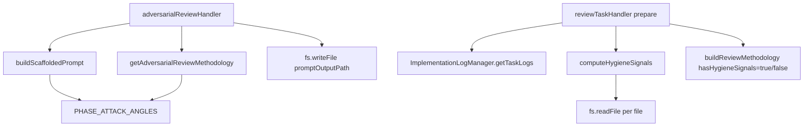

# Design Document

## Overview

Two independent changes under one spec, both motivated by the same principle: deterministic work belongs in the handler, not in the LLM.

- **Adversarial review scaffold**: `adversarialReviewHandler` writes a 90%-complete prompt file to `promptOutputPath` with two HTML-comment placeholder blocks the agent fills in. The phase-specific persona + attack-angle reference is sourced from a shared constant that `getAdversarialReviewMethodology()` also uses, so the table never drifts between the methodology docstring and the scaffold.
- **Hygiene pre-computation**: `review-task prepare` now returns a `hygieneSignals` array populated by a small regex utility that scans the files listed in the latest implementation log. The LLM triages signals instead of hunting for them.

No external services, no new dependencies, no changes to on-disk spec layout, no schema changes to persisted artifacts.

## Steering Document Alignment

### Technical Standards (tech.md)

- Handlers remain thin; heavy lifting lives in `src/core/`. The new hygiene utility goes under `src/core/hygiene-signals.ts`, matching `src/core/task-review-manager.ts`, `src/core/git-utils.ts`, `src/core/task-parser.ts`.
- File I/O uses `fs/promises`, consistent with the rest of the codebase.
- No `child_process.spawn` / `execSync` in this pass. The only existing uses are git operations (`src/core/git-utils.ts`) and the dashboard's fresh-context runner (`src/dashboard/task-review-runner.ts`) — neither is a template for what we're adding.

### Project Structure (structure.md)

- Tool logic stays in `src/tools/*.ts`, persistence managers stay in `src/core/*.ts`, shared types stay in `src/types.ts`. Tests mirror the source tree under `src/tools/__tests__/` and can add `src/core/__tests__/` for the new utility if helpful.

## Code Reuse Analysis

### Existing Components to Leverage

- **`src/tools/adversarial-review.ts` — `getAdversarialReviewMethodology()` (lines 237–366)**: the phase attack-angle table (lines 272–277) is the source material for the shared constant. Extract it, consume it from two places.
- **`src/tools/adversarial-review.ts` — `getNextVersion()`, `findLatestAnalysis()`, `findExistingFiles()`, `findPriorPhaseDocs()`**: unchanged; already compute all the paths the scaffold needs.
- **`src/tools/review-task.ts` — `handlePrepare()` (lines 116–228)**: already gathers `allFiles` from the implementation log (line 177). Hygiene computation slots in directly after that.
- **`src/tools/review-task.ts` — `buildReviewMethodology()` (lines 353–437)**: already takes flags for optional sections (`hasTechSteering`, `hasPriorReviews`). Adding `hasHygieneSignals` follows the same pattern.
- **`ImplementationLogManager` (`src/dashboard/implementation-log-manager.ts`)**: already provides `filesModified` + `filesCreated` via `getTaskLogs()`. No changes needed.

### Integration Points

- **`adversarial-settings.json` override**: `getMethodologyOverride()` (both tool files) is unchanged. If a user overrides the review methodology, they still get the scaffold — the scaffold is structural boilerplate, the override replaces the methodology text returned in `data.methodology`.
- **Existing tests**: `src/tools/__tests__/adversarial-review.test.ts` (versioning + decomposition paths) and `src/tools/__tests__/review-task.test.ts` (real-fs temp dirs via `fs.mkdtemp`) keep working; new tests are additive.

## Architecture

### Modular Design Principles

- **Single File Responsibility**: `src/core/hygiene-signals.ts` owns the regex scan and nothing else. `buildScaffoldedPrompt()` (inside `adversarial-review.ts`) owns the scaffold string and nothing else.
- **Component Isolation**: both new pieces are pure functions of their inputs plus `fs` reads. No global state, no singletons.
- **Service Layer Separation**: tool handlers orchestrate; core utilities compute.



## Components and Interfaces

### Component 1 — `PHASE_ATTACK_ANGLES` constant (new, in `adversarial-review.ts`)

- **Purpose:** single source of truth for phase-specific review personas and attack-angle guidance.
- **Shape:**
  ```ts
  type PhaseGuidance = { persona: string; attackSurface: string; exampleAngles: string };
  const PHASE_ATTACK_ANGLES: Record<string, PhaseGuidance> = {
    requirements: { persona: "...", attackSurface: "Completeness, ambiguity, scope", exampleAngles: "..." },
    design:       { ... },
    tasks:        { ... },
    decomposition:{ ... },
    product:      { ... },
    tech:         { ... },
    structure:    { ... },
  };
  ```
- **Consumers:** `buildScaffoldedPrompt` (new) and `getAdversarialReviewMethodology` (updated to interpolate rows from this constant instead of hard-coding them).
- **Reuses:** derived from current methodology text at `adversarial-review.ts:272-277`.

### Component 2 — `buildScaffoldedPrompt` (new, in `adversarial-review.ts`)

- **Purpose:** produce the scaffold text for the prompt file.
- **Interface:**
  ```ts
  function buildScaffoldedPrompt(args: {
    specName: string;
    phase: string;
    version: number;
    targetFile: string;
    analysisOutputPath: string;
    memoryFilePath: string;
    latestAnalysisPath: string | null;
  }): string
  ```
- **Dependencies:** `PHASE_ATTACK_ANGLES`.
- **Reuses:** nothing else; pure string builder.

### Component 3 — `adversarialReviewHandler` (modified, `adversarial-review.ts`)

- **Change:** after computing paths and the methodology, call `buildScaffoldedPrompt(...)` and write the result to `promptOutputPath` with `fs.writeFile`. If the write throws, return `{ success: false, message: ... }`.
- **Response shape:** additive only — same `data` fields as today, same `nextSteps` keys. `nextSteps` wording tightened to reflect the scaffold.
- **Reuses:** existing path computation, versioning helpers, methodology lookup.

### Component 4 — `HygieneSignal` type + `computeHygieneSignals` (new, `src/core/hygiene-signals.ts`)

- **Purpose:** scan a list of files and return grep-style hits for debug leftovers.
- **Interface:**
  ```ts
  export type HygieneSignal = {
    file: string;
    line: number;
    pattern: 'console' | 'todo' | 'fixme' | 'debugger';
    text: string;
  };
  export async function computeHygieneSignals(files: string[]): Promise<HygieneSignal[]>;
  ```
- **Behavior:**
  - Reads each file concurrently via `Promise.all`.
  - For each file that exists, is readable, and is under 1 MB, splits on newlines and applies four regexes:
    - `/console\.(log|warn|error|debug|info|trace)\s*\(/`
    - `/\bTODO\b/`
    - `/\bFIXME\b/`
    - `/\bdebugger\b/`
  - Returns one `HygieneSignal` per match, `line` 1-indexed, `text` trimmed + truncated to 120 characters.
  - A file that throws on `stat` or `readFile` is skipped silently.
- **Reuses:** `fs/promises` only.

### Component 5 — `reviewTaskHandler.handlePrepare` (modified, `review-task.ts`)

- **Change:** after `allFiles` is computed (current line 177), call `const hygieneSignals = await computeHygieneSignals(allFiles);`. Include `hygieneSignals` in `data`. Pass `hygieneSignals.length > 0` as the new `hasHygieneSignals` parameter into `buildReviewMethodology`.
- **Reuses:** existing parsing + manager calls.

### Component 6 — `buildReviewMethodology` (modified, `review-task.ts`)

- **Change:** add parameter `hasHygieneSignals: boolean`. When true, replace item 9 (current line 414) with a directive pointing to `hygieneSignals`, plus a sentence reminding the LLM to still check for signals the grep can't find (secrets, commented-out code, unused imports/vars). When false, keep the current item 9 text verbatim.
- **Reuses:** existing section assembly pattern.

## Data Models

### HygieneSignal

```
HygieneSignal
- file: string        (absolute path)
- line: number        (1-indexed)
- pattern: 'console' | 'todo' | 'fixme' | 'debugger'
- text: string        (trimmed, ≤120 chars)
```

### Scaffold prompt structure (written to `promptOutputPath`)

```
# Adversarial Review — {specName}/{phase} (v{version})

{persona paragraph from PHASE_ATTACK_ANGLES[phase].persona}

## Target document
{absolute path to targetFile}

## Analysis dimensions

<!-- PLACEHOLDER:ANALYSIS_DIMENSIONS
Replace this block with 3–6 numbered sections tailored to the target document.
Each section: a specific topic/decision + 3–5 directive bullets grounded in the
target document's actual content, not generic advice.

Attack surface for this phase: {PHASE_ATTACK_ANGLES[phase].attackSurface}
Example angles: {PHASE_ATTACK_ANGLES[phase].exampleAngles}
-->

## Closing deliverables
- Top N risks/gaps (3 for short docs, 5 for long)
- Top 3 conclusions to challenge or reverse, with reasoning
- What's missing — work that should be done before acting on this document

Be specific and concrete. Cite failure scenarios, not abstract risks. If something
is actually fine, say so briefly and move on.

## Output
Write your analysis to: {analysisOutputPath}

[only when version > 1]
## Prior review context

<!-- PLACEHOLDER:PRIOR_REVIEW_CONTEXT
Read {memoryFilePath} (if present) and {latestAnalysisPath}. Replace this block with:
- Summary of prior findings
- Which were addressed, which persist
- Directive to focus on novel issues
- Classification scheme: novel / compounding / recurring
Then update the memory file per the methodology format.
-->
```

## Error Handling

### Error Scenarios

1. **Scaffold write fails (disk full / permission denied)**
   - **Handling:** handler returns `{ success: false, message: 'Failed to write scaffolded prompt: {err.message}' }`; no partial state left behind (the `reviewsDir` is already created, that's fine).
   - **User Impact:** the MCP response reports the failure with the exact filesystem error.

2. **Unknown `phase` passed to scaffold builder** (e.g. caller invents a phase name)
   - **Handling:** `PHASE_ATTACK_ANGLES[phase]` is undefined; fall back to a generic persona/attack-surface pair and emit the scaffold anyway. The scaffold is still useful, just less phase-tuned.
   - **User Impact:** prompt file is written; placeholder guidance is generic but functional.

3. **Hygiene utility hits a missing / unreadable / oversize file**
   - **Handling:** skip silently and continue with the remaining files.
   - **User Impact:** none — `hygieneSignals` may be empty or undercount for that file, but the LLM's methodology still instructs it to check for hygiene issues broadly.

4. **Regex accidentally matches a pre-existing comment in a large untouched file**
   - **Handling:** not the handler's concern — signals are advisory. The LLM triage step filters out non-findings.
   - **User Impact:** slightly more signals to triage than strictly necessary; acceptable per the "advisory, not auto-findings" design decision.

## Testing Strategy

### Unit Testing

- **`src/tools/__tests__/adversarial-review.test.ts`**
  - v1 scaffold: handler succeeds, file exists at `promptOutputPath`, contains `PLACEHOLDER:ANALYSIS_DIMENSIONS`, does NOT contain `PLACEHOLDER:PRIOR_REVIEW_CONTEXT`, contains `analysisOutputPath` in Output section, contains the correct persona for the phase.
  - v2 scaffold: same assertions, plus contains `PLACEHOLDER:PRIOR_REVIEW_CONTEXT`, plus references `memoryFilePath` and `latestAnalysisPath`.
  - Decomposition scaffold: works for `phase: 'decomposition'`, `specName: 'decomposition'`.
  - Unknown phase: falls back to generic persona, still writes scaffold.
  - Write failure: simulate by making `reviewsDir` read-only, assert handler returns `success: false`.

- **`src/core/__tests__/hygiene-signals.test.ts`** (new)
  - File with one `console.log` and one `TODO`: returns two signals with correct lines and pattern names.
  - File with `debugger` statement: returns signal with `pattern: 'debugger'`.
  - File with lowercase `todo` only: returns no `todo` signal (case sensitivity).
  - Non-existent file path: skipped silently, no throw.
  - Oversize file (> 1 MB mock): skipped silently.
  - Multiple files processed concurrently: all signals returned, order within a file is ascending by line.

- **`src/tools/__tests__/review-task.test.ts`**
  - `prepare` returns `hygieneSignals` array (even empty).
  - `prepare` with files containing debug leftovers: `data.hygieneSignals` populated correctly.
  - `buildReviewMethodology` emits the triage directive when signals are present, and the full fallback directive when absent.

### Integration Testing

- Run `adversarial-review` against a real target doc in `.spec-workflow/specs/fast-reviews/requirements.md` (v1) and again (v2). Inspect the written prompt files manually.
- Run `review-task action: prepare` on an existing task whose implementation contains a known `console.log` and verify `hygieneSignals` contains it.

### End-to-End Testing

- Full flow: run the scaffolded adversarial prompt through a fresh-context subagent. Confirm the subagent treats `PLACEHOLDER:ANALYSIS_DIMENSIONS` as "I should produce tailored sections here" (not "leave this verbatim"). If scaffold wording causes generic output, tighten the placeholder directive.
- Full flow: run `review-task` end to end on a task with and without hygiene leftovers. Confirm the reviewing agent promotes real leftovers to findings and ignores intentional `console.error`s in error paths.
