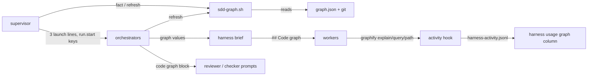

# Design Document — graph-orientation
Document version: v1

## Overview

A new shipped script resolves the code-graph fact and runs the refresh, the supervisor carries its three lines into every launch prompt and the `run.start` row, the `harness` `brief` action appends a `## Code graph` section when the caller passes graph values, the document skill adds the same block to reviewer and checker prompts, and `harness usage` gains a `graph` column folded from `harness-activity.jsonl`. The change sits in the supervisor, document, implementation and close-out skills, the `harness` tool (`src/tools/harness.ts`) and the usage fold (`src/watch/usage.ts`). It reuses the one-line probe-script pattern of `harness/skills/sdd-continue/references/sdd-cache-ttl.sh:1-22`, the live-phase window rule of `src/watch/usage.ts:277-294`, the activity row type of `src/watch/ledger.ts:26-36` and the per-run scratch-script pattern of `event.sh` (`harness/skills/sdd-continue/references/formats.md:170-183`).

## Steering Document Alignment

### Technical Standards (tech.md)
No `tech.md` exists; the design follows `.spec-workflow/agent-rules.md`: tests in `__tests__` next to the code, node 20 guaranteed fields only, `harness/` as source and `plugins/` generated.

### Project Structure (structure.md)
No `structure.md` exists; the one new shipped script goes beside its sibling scripts in `harness/skills/sdd-continue/references/`, its test goes in `src/__tests__/`, and the live-verification record is a tracked file in the spec dir.

### Design System (design-system.md) — if applicable
N/A.

## Architecture

The supervisor calls `sdd-graph.sh fact` after the roots step and copies the script into the run's scratch dir; the orchestrators call the scratch copy with `refresh` after each implementer report when `WORKTREE: no`. Every orchestrator forwards its current three values into every `harness` `brief` call; the tool turns them into text and never reads the graph. `harness usage` joins activity rows to the ledger's phase windows in the tool layer and passes both to a new pure function in the usage module.



## Components and Interfaces

### C1 — Graph script `sdd-graph.sh` (new)
- **Purpose:** Req 1 AC1-4 and Req 2 AC4-5, AC7 in one tested file.
- **Interfaces:**
  - `bash sdd-graph.sh fact CODE_ROOT MAIN_CHECKOUT` prints exactly three lines and exits 0:
    ```
    GRAPH: <MAIN_CHECKOUT>/graphify-out/graph.json | none
    GRAPH_BEHIND: <n> | unknown | n/a
    GRAPH_BUILT_AT: <sha> | unknown | n/a
    ```
    `GRAPH` is `none`, and both freshness lines `n/a`, when the file is missing or `command -v graphify` fails. Otherwise node reads the top-level `built_at_commit` string; `GRAPH_BEHIND` is the stdout of `git -C CODE_ROOT rev-list --count SHA..HEAD`. A missing or empty key, a JSON parse error, or a non-zero `git` exit sets both freshness lines to `unknown`. The caller passes `MAIN_CHECKOUT` equal to `CODE_ROOT` when not in a worktree, so one rule covers Req 1 AC1.
  - `bash sdd-graph.sh refresh CODE_ROOT [TIMEOUT_S]` runs `graphify update CODE_ROOT` through node `spawnSync` with `stdio: 'ignore'`, `timeout: TIMEOUT_S * 1000` (default 100) and an environment copy without `GRAPHIFY_FORCE`. Exit status 0 prints `refresh: ok`, `GRAPH_BEHIND: 0` and `GRAPH_BUILT_AT:` the output of `git -C CODE_ROOT rev-parse HEAD` (`unknown` when that fails). A non-zero status prints `refresh: failed exit <n>`; `error.code === 'ETIMEDOUT'` prints `refresh: failed timeout <TIMEOUT_S>s`; another spawn error prints `refresh: failed <error.code>`; any other signal death prints `refresh: failed signal <signal>`. The script always exits 0 and never passes `--force`.
- **Dependencies:** `bash`, `node`, `git`, the `graphify` binary on `PATH`.
- **Reuses:** the `set -u` plus single-quoted `node -e` shape of `harness/skills/sdd-continue/references/sdd-cache-ttl.sh:1-22`. The installed CLI treats `GRAPHIFY_FORCE=1` as `--force` (context file probe, "graph script precedents (design)"), so the environment scrub enforces Req 2 AC7. A killed update leaves no stale lock: the rebuild lock releases when the process is killed (context file probe). The update writes to the path argument's own `graphify-out/` (context file probe).

### C2 — Supervisor (`harness/skills/sdd-continue/SKILL.md`, `references/formats.md`)
- **Purpose:** Req 1 AC1-8, Req 2 AC1 and AC6.
- **Interfaces:**
  - Step 1 roots (`harness/skills/sdd-continue/SKILL.md:66-94`) gains a **Code graph** bullet after the worktree check: run `bash <base dir>/references/sdd-graph.sh fact <CODE_ROOT> <main checkout, or CODE_ROOT>` and keep its three lines as `GRAPH`, `GRAPH_BEHIND`, `GRAPH_BUILT_AT`. Never against `SPEC_STORE_REPO` (Req 1 AC7).
  - The run-ledger paragraph (`harness/skills/sdd-continue/SKILL.md:96-116`), before the `run.start` call: when `GRAPH` is a path, `cp` the script to `/tmp/scratchpad/sdd/<spec>/sdd-graph.sh`; then, when `GRAPH_BEHIND` is not `0` and `WORKTREE` is `no`, run `bash /tmp/scratchpad/sdd/<spec>/sdd-graph.sh refresh <CODE_ROOT>`. On `refresh: ok` take its two lines; otherwise keep the old values and hold the refresh line. The `run.start` call adds `graph=<GRAPH> graphBehind=<GRAPH_BEHIND>` only when `GRAPH` is a path (Req 1 AC8). A held failure line becomes `note "text=graph refresh: <line>"` right after `run.start`.
  - The launch prompt block (`harness/skills/sdd-continue/SKILL.md:224-247`) gains `GRAPH:`, `GRAPH_BEHIND:` and `GRAPH_BUILT_AT:` after `LAUNCHER:`.
  - The worktree rule (`harness/skills/sdd-continue/SKILL.md:320-327`): after the re-run worktree check, re-run `fact` with the new `CODE_ROOT` and the main checkout; no refresh (Req 2 AC6).
  - Scratch-wipe recovery (`harness/skills/sdd-continue/SKILL.md:262-269`) also re-copies `sdd-graph.sh` when `GRAPH` is a path.
  - `harness/skills/sdd-continue/references/formats.md:194` (`run.start` keys) adds `graph`, `graphBehind` (only when a graph exists).
- **Dependencies:** C1.
- **Reuses:** the `bash <base dir>/references/...` call shape of `harness/skills/sdd-continue/SKILL.md:81-86`.

### C3 — Brief section by tooling (`src/tools/harness.ts`)
- **Purpose:** Req 3 AC1-8.
- **Interfaces:**
  ```ts
  export function codeGraphSection(graph: string, builtAt: string, behind: string): string
  ```
  returns exactly this text, one line each, ending in a newline, with the last line only when `behind !== '0'`:
  ```
  ## Code graph
  Graph: `<graph>` (the code graph of the code root).
  - `graphify explain "<symbol>" --graph <graph>`: one symbol and its edges. Use it first.
  - `graphify path "A" "B" --graph <graph>`: the chain between two symbols.
  - `graphify query "<terms>" --budget 800 --graph <graph>`: one area; take the terms from the graph's labels.
  Rule: run `explain` on a symbol before you open its code file, then read only the cited range to confirm it. Never use the graph for the spec store. When `explain` prints "No node matching", read the file as before. An `[INFERRED]` edge is never a citation. A citation in a document or the context file names a range you read.
  Freshness: built at <builtAt>, <behind> commits behind HEAD.
  A `file:line` from the graph is a hint to confirm, not a citation.
  ```
  `briefAction` (`src/tools/harness.ts:547-655`) changes in two places. After the output-path check (`src/tools/harness.ts:568`): when `values.graph` is a non-empty string other than `none`, it collects `graphBuiltAt` and `graphBehind` that are `undefined` or `null` and fails with `brief: graph value(s) 'graphBuiltAt', 'graphBehind' missing (values.graph is set); no file written`, naming only the missing ones. After the fill (`src/tools/harness.ts:633-635`): the same condition appends one blank line and `codeGraphSection(String(values.graph), String(values.graphBuiltAt), String(values.graphBehind))`; the separator is `\n` when the filled text ends in a newline, else `\n\n`. Any other `values.graph` (absent, `none`, a non-string) leaves the filled text untouched, so the output is byte-identical (Req 3 AC5). No template gains a `{{graph...}}` placeholder (Req 3 AC7), and the section is template-independent (Req 3 AC1).
  - The `values` property description (`src/tools/harness.ts:76`) names the three graph values.
- **Dependencies:** none new; no file read, no process (Req 3 AC8).
- **Reuses:** the missing-value message shape of `src/tools/harness.ts:617-631`.

### C4 — Orchestrator skills pass the graph
- **Purpose:** Req 2 AC2-3, Req 4 AC1-5, Req 5 AC1-4.
- **Interfaces:**
  - Launch-key lists gain `GRAPH`, `GRAPH_BEHIND`, `GRAPH_BUILT_AT`: `harness/skills/sdd-document-phase/SKILL.md:8-12`, `harness/skills/sdd-implementation-phase/SKILL.md:14-19`, `harness/skills/sdd-closeout-phase/SKILL.md:14-20`.
  - One standing rule in each of the three skills, after the read-and-obey rule (`harness/skills/sdd-document-phase/SKILL.md:43-44`, `harness/skills/sdd-implementation-phase/SKILL.md:37-38`, `harness/skills/sdd-closeout-phase/SKILL.md:33-34`): "When `GRAPH` is a path, every `harness` `brief` call carries `values.graph`, `values.graphBuiltAt` and `values.graphBehind`, set to your current `GRAPH`, `GRAPH_BUILT_AT` and `GRAPH_BEHIND`. When `GRAPH` is `none`, pass none of them. Never read `graph.json` or run a graphify read call yourself."
  - Implementation per-task loop (`harness/skills/sdd-implementation-phase/SKILL.md:84-159`): after step 3 reads an implementer report and after each fix spawn's report in step 5, when `GRAPH` is a path and `WORKTREE` is `no`, run `bash /tmp/scratchpad/sdd/<SPEC>/sdd-graph.sh refresh <CODE_ROOT>` before the gate. `refresh: ok` replaces the two freshness values; any other output keeps them and writes `note "text=graph refresh: <first line>"`.
  - Close-out (`harness/skills/sdd-closeout-phase/SKILL.md:120-159`): the same call after each `sdd-implementer` report for a `harness` or `code` batch, with the landing root, only when that root is `CODE_ROOT` and `WORKTREE` is `no`. Today those batches land in a retro worktree (`harness/skills/sdd-closeout-phase/SKILL.md:108-119`), so it does not fire (requirements D12).
  - `harness/skills/sdd-document-phase/references/briefs.md` gains a `## Code graph block` section: one sentence ("fill `<GRAPH>`, `<GRAPH_BUILT_AT>`, `<GRAPH_BEHIND>`; drop the last line when `GRAPH_BEHIND` is `0`") and a fenced block equal to `codeGraphSection('<GRAPH>', '<GRAPH_BUILT_AT>', '<GRAPH_BEHIND>')`. The round section (`harness/skills/sdd-document-phase/references/briefs.md:136-208`) and the narrow-check prompt (`harness/skills/sdd-document-phase/references/briefs.md:386-409`) each end with `<GRAPH is a path: the code graph block, filled.>`. Step 2 item 3 (`harness/skills/sdd-document-phase/SKILL.md:161-163`) and Step 4b item 1 (`harness/skills/sdd-document-phase/SKILL.md:283-286`) name that block.
  - The drafter brief's `## Codebase context` text (`harness/skills/sdd-document-phase/references/briefs.md:50-59`) gains `<GRAPH is a path, requirements: build the file from graphify explain and query output for each area the decomposition entry names; open a code file only to confirm the range you cite. | GRAPH is a path, design or tasks: extend the file the same way.>` and the line "A graph node alone is not a citation; every line cites a range you read at both ends." inside the same condition. The shape bullets stay (Req 5 AC3).
- **Dependencies:** C1 (scratch copy), C3.
- **Reuses:** the conditional `<phase: text>` convention of `harness/skills/sdd-document-phase/references/briefs.md:1-4`.

### C5 — Graph column in `harness usage` (`src/watch/usage.ts`, `src/tools/harness.ts`)
- **Purpose:** Req 6 AC1-8.
- **Interfaces:**
  ```ts
  // src/watch/usage.ts
  export function isGraphCall(row: ActivityEvent): boolean
  export function applyGraphCounts(report: UsageReport, events: LedgerEvent[], activity: ActivityEvent[]): UsageReport
  function windowPhase(at: number, phaseStarts: LedgerEvent[], phaseEnds: LedgerEvent[]): string | undefined
  // src/tools/harness.ts
  async function readSpecActivity(workflowRoot: string, specName: string): Promise<{ activity: ActivityEvent[] } | { error: string }>
  ```
  - `isGraphCall`: `row.event === 'tool'`, `row.tool === 'Bash'`, and `summary` matches `/(^|[\s;&|(])graphify\s+(explain|query|path)\b/`. One row counts once; `graphify update` and a quoted `"graphify explain"` inside a `grep` do not match.
  - `windowPhase` is lifted unchanged from `src/watch/usage.ts:283-292`; `reduceSpawn` calls it, so spawn attribution is unchanged.
  - `applyGraphCounts` sorts the events by `ts` as `buildUsageReport` does, takes the `phase.start` and `phase.end` rows, and for each graph-call row adds 1 to `graph` on the cell `phases[windowPhase(ms(ts)) ?? 'unknown'].agents[row.agent ?? 'unknown']`, on that phase's `total`, on its `providers.anthropic`, and on the report's `total` and `providers.anthropic`. A missing phase gets an empty `UsagePhase`, and the phases are re-sorted by `cmpPhase`. A missing agent gets an empty cell with 0 spawns (Req 6 AC5). The function mutates and returns `report`. `buildUsageReport` is unchanged apart from `emptyCell` and `addCell` (Req 6 AC4).
  - `readSpecActivity` reads `harness-activity.jsonl` beside the ledger (`harness/hooks/sdd-activity.sh:28-29`) through `PathUtils.safeJoin`. `ENOENT` returns `[]` (Req 6 AC1); another read error returns the `Failed to read <path>` error, as `src/tools/harness.ts:1029-1064` does. It parses with `parseJsonl` (`src/watch/ledger.ts:176-189`).
  - `usageAction` (`src/tools/harness.ts:1072-1093`) calls `applyGraphCounts(buildUsageReport(events, spec), events, activity)` for the primary spec and for `compareSpecName` (Req 6 AC6).
  - Tables (`src/watch/usage.ts:361-410`): `graph` is the last column of each group. The one-report header is `phase | agent | spawns | tokens | cw5m | cw1h | gapRewrites | graph`. Agent rows, phase totals (before `  orch`) and the spec total (before the kinds text) print `| <grp(graph)>`. In the compare table, `cols` gains `| graph`, `pair` prints the graph cell, and an absent side prints six dashes. A `@deepseek` row prints its graph cell, which is 0 (Req 6 AC8). No existing cell changes value (Req 6 AC7).
- **Dependencies:** `ActivityEvent` (`src/watch/ledger.ts:26-36`).
- **Reuses:** `emptyCell`/`addCell` (`src/watch/usage.ts:75-92`), `readSpecLedger` (`src/tools/harness.ts:1029-1064`).

### C6 — Docs
- **Purpose:** Req 7 AC1-2.
- **Interfaces:** `docs/TOOLS-REFERENCE.md:547-579`: the `brief` bullet names `graph`, `graphBuiltAt`, `graphBehind` and the appended `## Code graph` section. The `usage` bullet names the `graph` column (Agent-tool workers only, from `harness-activity.jsonl`). `docs/SDD-HARNESS.md` gains a `## Code graph` section after `## Workspace contract` (`docs/SDD-HARNESS.md:253-264`) that states the three launch lines, the refresh rule (run start when behind, after each implementer report, main checkout only, 100 s timeout, failure is a note) and that `graphify-out/` stays untracked.

### C7 — Live verification record (tracked, spec store)
- **Purpose:** Req 7 AC3-4.
- **Interfaces:** `<spec dir>/verification-evidence.md`, in the shape of the `agent-cache-ttl` record: one line per live scenario, `- (<n>) pending — <what runs>` until an operator replaces it with `- (<n>) passed — <evidence>`. The lines are (2)-live, (3) and (4) (see Testing Strategy).

## Data Models

### Launch prompt lines (supervisor to every orchestrator)
```
GRAPH: <path> | none
GRAPH_BEHIND: <n> | unknown | n/a
GRAPH_BUILT_AT: <sha> | unknown | n/a
```

### `run.start` row (only with a graph)
```
{ ..., "graph": "<path>", "graphBehind": "<n> | unknown" }
```

### `brief` values (optional, not placeholders)
```
graph?: string          // a path, or "none"
graphBuiltAt?: string   // required when graph is a path
graphBehind?: string    // required when graph is a path; "0" drops the hint line
```

### `UsageCell`
```ts
interface UsageCell { spawns; tokens; unknown; cacheWrite5m; cacheWrite1h; gapRewrites;
  cacheUnknownWrite; cacheUnknownGap; graph: number }   // graph is new, 0 in emptyCell
```

## Error Handling

1. **No graph or no `graphify` binary:** `fact` prints `GRAPH: none`; the launch lines read `none`/`n/a`, `run.start` has no graph keys, no brief gets a section, no refresh runs.
2. **Missing `built_at_commit`, bad JSON, or failing `git rev-list`:** both freshness values are `unknown`. The section still prints, with the hint line.
3. **Refresh non-zero, timeout or spawn error:** the values stay, one `note` names the line, the phase continues. A shrink-guard refusal is a non-zero exit (requirements Reliability).
4. **Scratch copy missing when an orchestrator refreshes:** `bash` fails, the output is not `refresh: ok`, and rule 3 applies.
5. **Brief with a graph path but no freshness value:** the call fails naming the missing values and writes no file; the orchestrator fixes its call.
6. **Activity file missing:** every graph count is 0. **Unreadable:** `usage` fails naming the path. **Torn or malformed rows:** skipped by `parseJsonl`.

## Testing Strategy

- **Unit (`src/tools/__tests__/harness.test.ts`):**
  - For each of the five templates: with `graph`, `graphBuiltAt: 'abc1234'`, `graphBehind: '3'`, the file ends with `codeGraphSection(...)` after one blank line and contains the hint line. With `graphBehind: '0'` there is no hint line. Without graph values, and with `graph: 'none'`, the output is identical to each other and has no `## Code graph`. The existing byte-for-byte implementer test (`src/tools/__tests__/harness.test.ts:165`) stays green.
  - `graph` set without `graphBehind`: `success: false`, the message names `graphBehind`, no file.
  - Drift guard: read `harness/skills/sdd-document-phase/references/briefs.md` from the repo, take the fenced block under `## Code graph block`, and assert it equals `codeGraphSection('<GRAPH>', '<GRAPH_BUILT_AT>', '<GRAPH_BEHIND>')`.
  - `usage` with a `harness-activity.jsonl` fixture: graph rows counted per agent and phase, a no-spawn agent row, `unknown` outside every window, a `graphify update` row and a grep of the text not counted, the compare spec's count read from its own file, and a missing activity file giving 0.
  - Update the cell literals that gain `graph: 0`: `src/tools/__tests__/harness.test.ts:523-538` and `src/tools/__tests__/harness.test.ts:587-598`. Find every one with `grep -n "cacheUnknownGap" src/tools/__tests__/harness.test.ts src/watch/__tests__/usage.test.ts`.
- **Unit (`src/watch/__tests__/usage.test.ts`):** the `ce` helper (`src/watch/__tests__/usage.test.ts:8-11`) defaults `graph: 0`. The compare-table expectations (`src/watch/__tests__/usage.test.ts:320-355`) gain the graph cells and the six-dash side. New cases cover `isGraphCall` (match and no-match summaries), `applyGraphCounts` window attribution, and a phase present only through graph rows.
- **Integration (`src/__tests__/sdd-graph.test.ts`, new):** drives the script with `execFileSync('bash', ...)` in a temp git repo, as `src/__tests__/providers-map.test.ts:17-34` does, and asserts only on exit status and stdout (node 20 fields). A stub `graphify` on a temp `PATH` exits 0, exits 1, or sleeps. Cases: no file gives `none` and `n/a`; no binary gives `none`; two commits after `built_at_commit` give `GRAPH_BEHIND: 2`; a missing key gives `unknown`; refresh ok prints HEAD; refresh exit 1 prints `failed exit 1`; `TIMEOUT_S` 1 with a sleeping stub prints `failed timeout 1s`; with `GRAPHIFY_FORCE=1` in the caller's environment, the stub records an empty value; every case exits 0.
- **End-to-end (decomposition scenarios):**
  - (1) the brief unit cases above.
  - (2) the `fact` no-binary case in-loop; the live launch with `GRAPH: none` and a pre-spec ledger is `pending` in C7.
  - (3) live requirements phase on a fixture spec with a graph, `pending` in C7.
  - (4) the Req 7 AC4 fixture checkout, `pending` in C7.
  - (5) in-loop after `npm run build`: a `node` script under `/tmp/scratchpad/sdd/graph-orientation/` imports `dist/tools/harness.js` and calls `harnessHandler({ action: 'usage', specName: 'graph-orientation', compareSpecName: 'agent-cache-ttl' }, { projectPath: <repo>, workspacePath: <repo> })`. The table must print the `graph` header, and the `agent-cache-ttl` side must print 0, which matches the context file's probe.
  - (6) `npm test`, `npm run check:plugin-assets`, `claude plugin validate . --strict`.

## Decisions taken in this document

- D1 — One shipped script with fact and refresh modes: options were a script, inline commands in each skill, a new harness tool action; chosen because the timeout, the environment scrub and the silenced output need code, a script is testable like the providers probe, and the harness tool must spawn no process.
- D2 — Refresh timeout 100 s inside the script: options were 100 s inside the script, a longer Bash tool timeout the orchestrator must pass, no timeout; chosen because it fits the Bash tool's default and an update of this repo from 201 commits behind took 13.4 s (context file probe).
- D3 — The refresh removes the force variable from the child environment: options were remove it, leave the environment alone; chosen because the installed CLI treats that variable as the force flag the requirements forbid.
- D4 — Orchestrators reach the script through a per-run scratch copy the supervisor makes: options were a scratch copy, a fourth launch line naming the script, a path relative to a sibling skill; chosen because it keeps the requirements' three launch lines and follows the event and retro script pattern.
- D5 — The graph count is a new field on the usage cell, printed as the last column: options were a cell field, a separate graph map on the report; chosen because the existing totals logic sums it for free and no existing column moves; the cost is test literals gaining a zero.
- D6 — The code graph text lives in server code and is mirrored in the document skill's references, guarded by a test: options were a guarded mirror, an unguarded mirror, orchestrators rendering a throwaway brief to copy; chosen because reviewer and checker prompts are not brief templates and a test keeps the two copies equal.
- D7 — The supervisor computes the graph values once per run, plus once after worktree entry, and does not take back an orchestrator's refreshed values: options were once per run, a re-read before every orchestrator spawn; chosen because a re-read would undo the rule that a successful refresh means current, as an unchanged graph keeps its old commit. A later launch prompt in the same run can therefore state a stale count; the effect is only that graph lines read as hints.
- D8 — A graph call is a summary where graphify starts a command or follows a space or shell separator: options were that token rule, any substring naming the three verbs; chosen because a grep for the phrase is a raw read, not a graph call. This refines requirement 6 criterion 2.
- D9 — Graph counts also go to the Anthropic provider cell: options were the Anthropic cell, no provider cell; chosen because the activity hook sees only Agent-tool workers.
- D10 — A supervisor refresh failure is noted right after the run-start row: options were after the run-start row, before it; chosen because the run-start row is the first row of a run in today's ledgers.
- D11 — Scenario (5) runs in-loop against the built server through a node import: options were in-loop through the built module, deferred to a restarted session; chosen because the fold needs no hook or session, only the committed ledgers and activity logs.

## Scope notes

- Carried from requirements: none.
- Deferred: spec 11's test-author template does not exist; the section is template-independent and covers it when added (requirements Scope notes).
- Deferred to the tracked evidence file: the live halves of scenarios (2), (3) and (4) (Req 7 AC3-4).
- Not changed: `harness/hooks/sdd-activity.sh` (a sensitive path; its rows already carry what the fold needs), agent frontmatter, `.graphifyignore`, the global PreToolUse nudge, the retrospective orchestrator (it receives the launch lines and ignores them).
- `usageDelta` and its delta text stay spawns and tokens only; the requirements ask for a column, not a delta.

## Revision History

- **v1** (2026-09-25) — Initial draft.
  - **Lint pass.** 4 fixed (L-3, L-4, L-5, L-15); rejected: L-6 to L-14, L-16 to L-35, L-37 to L-41, L-44, L-45 (GRAPH, GRAPH_BEHIND, GRAPH_BUILT_AT, SPEC_STORE_REPO, WORKTREE, CODE_ROOT, graph, none, graphBuiltAt, graphBehind, isGraphCall, applyGraphCounts, readSpecActivity are artifacts this design adds, or existing launch keys it cross-references, at the cited insertion points; every range verified as the correct existing anchor), L-1, L-2, L-36, L-42, L-43, L-46 to L-51 (citations name a reused pattern or an existing anchor — the probe-script shape, the window loop inside `reduceSpawn`, the byte-for-byte implementer test, the providers-script test harness — not a claim the paired term appears verbatim in that range; every range verified).
