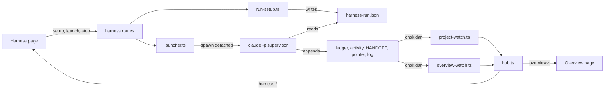

# Design Document — harness-control-pane

Document version: v1

## Overview

The dashboard gains a Harness page (set up, launch, stop and watch one run of one project) and an Overview page (all projects plus the operator to-do list), served by new modules under `src/dashboard/harness/`. The supervisor applies `.spec-workflow/harness-run.json` through a new reference script, and the phase skills pass worker model overrides. The live view reuses `buildModel` (src/watch/ledger.ts:243-457) and the TUI watch options (src/watch/index.ts:101-104) unchanged; the spec list reuses the INDEX logic through a read-only `IndexGenerator.snapshot()`.

## Steering Document Alignment

### Technical Standards (tech.md)
N/A (no steering documents); the design follows `.spec-workflow/agent-rules.md`.

### Project Structure (structure.md)
N/A. Server code goes in `src/dashboard/harness/`, pages in `src/dashboard_frontend/src/modules/pages/`, harness changes in `harness/skills/`.

### Design System (design-system.md) — if applicable
N/A: no design-system.md; the pages reuse the CSS variables and Tailwind classes of src/dashboard_frontend/src/modules/app/App.tsx:226-237.

## Architecture

A hub owns the per-project harness watchers, one shared overview watcher set, and the launcher. The websocket handler (src/dashboard/multi-server.ts:263-293) learns four view messages; after every subscription change or connection removal the hub recounts subscribers from the client set and starts or closes watchers to match. Launch and stop are Fastify routes under the global security, rate-limit and audit hooks (src/dashboard/multi-server.ts:184-192). The child runs detached, logging to a file.



## Components and Interfaces

### C1 — Read-only index snapshot
- **Purpose:** INDEX order, per-spec phase and routing without writing INDEX.md (Req 1 AC 1-2).
- **Interfaces:** `IndexGenerator.snapshot(): Promise<{ active, deferred, other, routing }>`. `generate()` becomes `snapshot()` plus the existing render and write (src/core/index-generator.ts:66-72); its output does not change.
- **Reuses:** the entry loop, `categorize` and `deriveRouting` call of src/core/index-generator.ts:44-67.

### C2 — State files (`state-files.ts`)
- **Purpose:** The machine-wide files.
- **Interfaces:**
  - `stateHome()` = `process.env.XDG_STATE_HOME || join(homedir(), '.local/state')`, the default of harness/hooks/sdd-activity.sh:11; `pointerPath()` and `hudPath()` add `sdd/active-run` and `sdd/overwatch-hud.json`.
  - `harnessStateDir()` = `join(getGlobalDir(), 'harness')` (src/core/global-dir.ts:40-51): records at `launches/<projectId>.json`, logs at `logs/<projectId>-<launch time>.log`.
  - `readPointer(): PointerLine[]` — tab-split lines; no file gives `[]`.
  - `removePointerLine(path, runId)` — the algorithm of harness/skills/sdd-continue/references/formats.md:266-281 (filter on the third field, delete at zero lines, temp file plus rename), plus a re-read before the rename that restarts the filter when the content changed, up to five tries.
  - `readTodos(): Todo[]` — the `todos` array; a missing file, bad JSON or no array gives `[]` (Req 5 AC 7).

### C3 — Run setup (`run-setup.ts`)
- **Purpose:** The form, its validation and `harness-run.json` (Req 1).
- **Interfaces:**
  - `readAgentRules(workflowRoot)` — `worktree` (`yes` on `worktree-per-change: required`), `gates` (a `gates:` line, else `block`), `worktreeSetup` (the first code span of the `worktree-setup:` line, .spec-workflow/agent-rules.md:6), `providers` (`## Providers` rows, grammar of harness/skills/sdd-continue/references/sdd-providers.sh:42).
  - `buildSetupView(project): Promise<SetupView>` — specs from C1, `parseHandoffRouting` (C5), one row per `AGENT_PROFILES` key (src/watch/ledger.ts:84) in sorted order, the supervisor row (`claude-opus-5-5`, `high`), and `launchable` = `routing.spec` when `routing.state` is `active`, else `null` with `disabledReason` = `routing.reason` (Req 1 AC 10).
  - `validateSetup(input, view): ValidationError | null` — Req 1 AC 6 and AC 8: an anthropic role takes an alias in `MODEL_ALIASES = ['opus', 'sonnet', 'fable']` or a value starting `claude-`; a deepseek role takes a model of harness/skills/sdd-continue/references/sdd-providers.sh:29; only the roles of harness/skills/sdd-continue/references/sdd-providers.sh:23 may leave `anthropic`; `input.spec` must equal `launchable`; the supervisor follows the anthropic rule.
  - `toRunFile(input, view, now): HarnessRunFile` — keeps a role only when its model or provider differs from its default (Req 1 AC 12); a kept role carries both.
  - `writeRunFile(workflowRoot, file)` (temp plus rename) and `deleteRunFileIf(workflowRoot, writtenAt)` (deletes only when `writtenAt` matches).
- A role's default model is its declared model, except that a role the map routes to deepseek defaults to the map's model (D3).

### C4 — Launcher (`launcher.ts`)
- **Purpose:** Launch, stop, reattach and finalise one detached run per project (Req 3).
- **Interfaces:**
  ```ts
  class HarnessLauncher extends EventEmitter { // emits 'launch-update' (LaunchRecord)
    constructor(opts?: { cli?: string; stateDir?: string; pointerPath?: string;
                         stopGraceMs?: number; pollMs?: number; setupTimeoutMs?: number });
    restore(): Promise<void>;
    get(projectId: string): LaunchRecord | null;
    admission(project: ProjectContext): { ok: true } | { ok: false; runId: string | null; reason: string };
    launch(project: ProjectContext, file: HarnessRunFile, worktreeSetup: string | null): Promise<LaunchRecord>;
    stop(projectId: string): Promise<LaunchRecord>;
    noteRunId(projectId: string, runId: string): void;
  }
  class LaunchError extends Error { step: 'worktree' | 'worktree-setup' | 'spawn'; detail: string }
  ```
  Defaults: `cli` `claude`, `stopGraceMs` 10000 (Req 3 AC 9), `pollMs` 1000, `setupTimeoutMs` 900000.
- **Admission** (Req 3 AC 7-8): refuse when a launch is in progress for the project, when a pointer line's resolved spec dir starts with `<projectPath>/.spec-workflow/specs/` (return its run id), or when the project's record is `running` or `stopping` and alive.
- **Launch:**
  1. Mark the project in-flight.
  2. Worktree when `file.worktree` is `yes` (Req 3 AC 3): `execFile('git', …)` with `cwd` `project.workspacePath`. Reuse the `git worktree list --porcelain` entry on `refs/heads/feat/<spec>`; else `git worktree add <checkout>/.claude/worktrees/<spec> feat/<spec>` when the branch exists, else with `-b feat/<spec>`. That path is where EnterWorktree puts worktrees in this checkout.
  3. When `<git dir>/sdd-setup-done` is absent (`git rev-parse --absolute-git-dir` in the worktree), run `worktreeSetup` with `bash -c` (the agent-rules command, never form text) and `setupTimeoutMs`; write the marker on success. An unmarked worktree is never used before its setup completes (Req 3 AC 14).
  4. Open the log with `fs.openSync(path, 'a')` and spawn `cli` with `['-p', 'continue the sdd process', '--model', file.supervisorModel, '--effort', 'high', '--permission-mode', 'auto']` (docs/SDD-HARNESS.md:247), `cwd` the checkout or worktree, `detached: true`, `stdio: ['ignore', fd, fd]`, env `{ ...scrubbedGitEnv(), SPEC_WORKFLOW_WORKSPACE: cwd, SPEC_WORKFLOW_SHARED_ROOT: project.projectPath }` (src/core/git-utils.ts:5-6, 45-51). On the `spawn` event, `unref()` and write the record with `pgid` = `pid`.
  5. Any failure throws `LaunchError`, calls `deleteRunFileIf`, removes the empty log and writes no record.
- **Carried R3-minor-1:** only the argument and env pattern of `runAgent` (src/dashboard/adversarial-runner.ts:156-180) is reused. Neither `JOB_TIMEOUT_MS` (15 minutes at src/dashboard/adversarial-runner.ts:46; its error text at :187 says 10) nor any other run timeout is adopted, and nothing like `shutdown()` (src/dashboard/adversarial-runner.ts:250-254, called at src/dashboard/multi-server.ts:2271) kills a launched run.
- **Liveness:** `process.kill(-pgid, 0)` succeeds and `ps -o args= -p <pid>` contains `continue the sdd process` (D7).
- **Stop** (Req 3 AC 9): `state: 'stopping'`, `SIGTERM` to `-pgid`, poll every `pollMs`, `SIGKILL` to `-pgid` if alive after `stopGraceMs`, finalise once gone.
- **Finalise** (Req 3 AC 10; idempotent; `restore()` runs it for a gone record):
  1. Run id: `record.runId`, else the newest `run.start` at or after `launchedAt`, else a pointer line for the spec dir whose run id time is at or after `launchedAt`.
  2. If that run has a `run.start` and no `run.end`, append `{ ts, run, spec, type: 'run.end', status: 'stopped from the dashboard' }`, the row of harness/skills/sdd-continue/references/formats.md:178.
  3. `removePointerLine` for that run id (Req 3 AC 13).
  4. `deleteRunFileIf(workflowRoot, record.setupWrittenAt)` (D14).
  5. `state: 'stopped'`, `endedAt`; write the record; emit.
- **Own exit** (Req 3 AC 11): an `exit` with no stop request sets `exited`, `exitCode` and `signal` and touches no ledger or pointer.
- **Run id** (Req 3 AC 6): C5 calls `noteRunId` on a `run.start` at or after `launchedAt`.
- **Carried R3-minor-2:** Launch always writes `gates: 'record'` (Req 3 AC 1), overwriting a setup saved for a terminal run with `block`. This is intended: the file holds one pending run, and a headless run cannot ask.

### C5 — Project harness watch (`project-watch.ts`)
- **Purpose:** Run model, gates and log for one project's harness subscribers (Req 4).
- **Interfaces:** `class ProjectHarnessWatch { constructor(project, launcher, send, opts?: { debounceMs?: number }); start(); close(); snapshot(): HarnessMessage[] }`; `parseHandoffRouting(md)` (spec via src/watch/ledger.ts:219-223, then the `Live phase`, `state`, `last result` fields of harness/skills/sdd-continue/references/formats.md:75-76); `parseGateSections(md)` (raw text under `## Gate A` and `## Gate B`).
- **Behaviour:** The spec is `resolveSpec` (src/watch/index.ts:42-59) on `<projectPath>/.spec-workflow`, `null` when it throws. It watches the four files and options of src/watch/index.ts:101-104, plus `questions.md` and the launch log. A change schedules one rebuild after `debounceMs` (default 300, as src/dashboard/multi-server.ts:91). The rebuild reads as `renderOnce` does (src/watch/index.ts:61-71), calls `buildModel`, and sends `harness-model` and `harness-gates`; a HANDOFF naming another spec re-targets the watcher; new complete log lines, read from a byte offset, go out as one `harness-log`. `snapshot()` holds the model, gates and the last 200 log lines with `reset: true`.

### C6 — Overview watch (`overview-watch.ts`)
- **Purpose:** One watcher set for all Overview clients (Req 5).
- **Interfaces:** `class OverviewWatch { constructor(projects: ProjectManager, send, opts?: { debounceMs?: number }); start(); close(); refresh(); snapshot() }`; `buildOverviewRow(project, pointer)`.
- **Rows:** A pointer line in the project's spec store makes it `running` with that spec and run id; else `idle` with the HANDOFF spec (Req 5 AC 2). From that spec's ledger: `lastRow` is the newest `phase.start`, `phase.end`, or `note` whose `text` matches `gate A` or `gate B`; `livePhase` is `buildModel({ spec, ledger, activity: [] }).livePhase?.phase`, else the HANDOFF phase; `waiting` applies requirements D7 to the last run; `newestTs` is the newest row.
- **Watch set:** the pointer file, the HUD file, and each project's HANDOFF and row ledger, recomputed on a pointer, HANDOFF or `projects-update` change. Projects come from src/dashboard/project-manager.ts:239-241.

### C7 — Hub and server wiring (`hub.ts`, `multi-server.ts`)
- `WebSocketConnection` (src/dashboard/multi-server.ts:56-60) gains `views?: Set<'harness' | 'overview'>`.
- The handler (src/dashboard/multi-server.ts:263-293) accepts `harness-subscribe` (sets `projectId`, adds `harness`), `harness-unsubscribe`, `overview-subscribe` and `overview-unsubscribe`; `subscribe` is unchanged.
- `HarnessHub.reconcile(clients)` runs after each of those, after `subscribe`, and after both removal paths (src/dashboard/multi-server.ts:252-255, 2153-2166). It starts a watch for each count above zero and closes it at zero (Req 4 AC 7, Req 5 AC 9), and sends a new subscriber the watch's `snapshot()`.
- `sendToHarness(projectId, msg)` and `sendToOverview(msg)` filter on `views`, not `broadcastToProject` (src/dashboard/multi-server.ts:2139-2151; Req 4 AC 9).
- Routes (404 for an unknown project, as src/dashboard/multi-server.ts:509-514):
  - `GET /api/projects/:projectId/harness/setup` returns `SetupView`.
  - `PUT …/harness/setup` takes `SetupInput` and returns `{ file }`, 400 `ValidationError` or 409 `{ error: 'not-launchable', reason }`.
  - `POST …/harness/launch` takes `SetupInput`, forces `gates: 'record'`, then validates, admits, writes and launches. It returns `{ launch }`, 400, 409 `{ error: 'run-live', runId, reason }` or 500 `{ error, step, detail }`.
  - `POST …/harness/stop` returns `{ launch }`, or 404 when nothing is running or stopping.
- `start()` awaits `launcher.restore()` before `listen`; `stop()` closes the hub watches and kills no run. A `launch-update` rebuilds that project's `harness-model` and refreshes the overview.

### C8 — Frontend
- **WebSocketProvider** (src/dashboard_frontend/src/modules/ws/WebSocketProvider.tsx): the context gains `watchView(view): () => void`. The provider sends the subscribe message when a view gains its first user and on every `onopen`, and the unsubscribe when it loses its last. `onmessage` (lines 88-113) routes `overview-*` like `projects-update`; `harness-*` carries `projectId`.
- **HarnessPage** (`/harness`) shows the spec list (routed spec marked, HANDOFF phase, state and result); the run form (a card per role with model input, a provider select for `eligibleRoles`, declared model, and read-only effort with the reason "the Agent tool has no effort override"; a supervisor card; worktree and gates; Save and Launch); a run bar (state, pid, run id, exit code, Stop); the Req 4 AC 3 live view, with declared model and effort from `profiles`; the gates as read-only text (Req 4 AC 5); and the last 500 log lines. In the implementation phase it fetches the summary route (src/dashboard/multi-server.ts:1965-1988) at most every five seconds for each task's verdict and `tdd` (Req 4 AC 4).
- **OverviewPage** (`/overview`): a card per `OverviewRow` with the age ticking each second and a "waiting" badge, and the to-do list, open items first. It has no edit, launch or stop control (Req 5 AC 8).
- Routes go beside src/dashboard_frontend/src/modules/app/App.tsx:239-251, and nav items follow the shape of src/dashboard_frontend/src/modules/components/PageNavigationSidebar.tsx:44-59.
- Phone width (Req 6 AC 4): grids go to one column below `sm`, text cells use `min-w-0 break-words`, and nothing has a fixed width.
- Strings go only in `locales/en.json` (D16; fallback at src/dashboard_frontend/src/i18n.ts:80; scripts/validate-i18n.js:43-78 checks only interpolation variables).
- `modules/harness/types.ts` copies the Data Models wire shapes and `RunModel`.

### C9 — Supervisor honours the file (harness)
- **New `harness/skills/sdd-continue/references/sdd-run-setup.sh SPEC_STORE_ROOT ACTIVE_SPEC AGENT_RULES_PATH`** prints `key=value` lines:
  - no file: `setup=none`;
  - another spec: `setup=mismatch file=<spec> active=<spec>`;
  - applied: `setup=applied`, `written=`, `gates=`, `worktree=`, `orchestrators=<agent>=<model>,…|none`, `workers=<agent>=<model>,…|none` (anthropic workers only), `providers=<merged>` and `overrides=<agent>:<model>:<provider>,…`.
  An orchestrator is a name ending `-orchestrator` (src/watch/ledger.ts:294). A malformed file or an AC 1.6 violation exits 2 with one `setup: <reason>` stderr line; the provider merge passes its exit code (2 or 3) through. Any non-zero exit deletes the file (Req 2 AC 6).
- **`sdd-providers.sh AGENT_RULES_PATH [RUN_FILE]`** (harness/skills/sdd-continue/references/sdd-providers.sh:25-77): the optional argument merges each file role over the parsed rows before the unchanged checks of lines 54-71, so a non-eligible role off `anthropic` is refused there. Only eligible roles and deepseek roles merge. With one argument the output is unchanged.
- **SKILL.md** (harness/skills/sdd-continue/SKILL.md):
  - After Step 2 and before the Run ledger paragraph (lines 100-129), run the script:
    - `mismatch`: print `warning: harness-run.json is for <file spec>, the active spec is <spec>; ignoring it` (Req 2 AC 2).
    - `applied`: print `setup: applying <path> written <ts>` (AC 2.1), replace `PROVIDERS`, and keep `ORCH_MODELS`, `WORKER_MODELS`, `SETUP_GATES`, `SETUP_WORKTREE` and `OVERRIDES`.
    - Non-zero: refuse as lines 85-96 do.
  - `run.start` (lines 118-121) adds `overrides=<OVERRIDES> setup=harness-run` only when applied (Req 2 AC 9, AC 11).
  - Dispatch (lines 226-228) passes `model` from `ORCH_MODELS`. The launch prompt (lines 239-260) gains `MODEL_OVERRIDES: <WORKER_MODELS | none>`.
  - Model pre-flight (lines 287-295) expects the override when set, else `claude-opus-4-8`. An alias `a` matches an id starting `claude-a-` (D12).
  - Gate mode (lines 359-362): `SETUP_GATES` wins over the `gates:` key (Req 2 AC 7).
  - Worktree rule (lines 336-345): `SETUP_WORKTREE=yes` acts as `worktree-per-change: required`, and `no` skips the rule (Req 2 AC 8).
  - Status line (lines 488-500): when applied, `rm -f` the file in the step that writes `run.end` and deregisters (Req 2 AC 10).
  - The terminal supervisor ignores `supervisorModel` (D9).
- **formats.md:** `run.start` keys (line 194) gain `overrides` and `setup`; the launch prompt block gains `MODEL_OVERRIDES`.
- **Phase skills:** the spawn rules of harness/skills/sdd-document-phase/SKILL.md:24-34, harness/skills/sdd-implementation-phase/SKILL.md:26-28, harness/skills/sdd-closeout-phase/SKILL.md:28-29 and harness/skills/sdd-retrospective/SKILL.md:17-18 gain "When `MODEL_OVERRIDES` names the worker, pass that value as the Agent tool's `model` parameter." A deepseek worker gets its model from `PROVIDERS` through the launcher (harness/skills/sdd-continue/references/formats.md:236), never as a parameter (Req 2 AC 4).

### C10 — Docs
`docs/SDD-HARNESS.md` gains a "Dashboard control pane" section after docs/SDD-HARNESS.md:244-251: the pages, the setup file, what Launch forces, where logs and records live, and what Stop writes.

## Data Models

```ts
// src/dashboard/harness/types.ts
type Provider = 'anthropic' | 'deepseek';

interface HarnessRunFile {            // <spec store>/.spec-workflow/harness-run.json
  spec: string;
  writtenAt: string;                  // ISO 8601 UTC
  supervisorModel: string;
  worktree: 'yes' | 'no';
  gates: 'block' | 'record';
  roles: Record<string, { model: string; provider: Provider }>; // differing roles only
}

interface SetupInput {
  spec: string; supervisorModel: string; worktree: 'yes' | 'no'; gates: 'block' | 'record';
  roles: Record<string, { model: string; provider?: Provider }>;
}

interface ValidationError { field: string; value: string; error: string } // field: 'roles.sdd-reviewer.model'

interface SpecRow {
  name: string; bucket: 'active' | 'deferred' | 'other';
  currentPhase: string; overallStatus: string;
  progress: { total: number; completed: number }; routed: boolean;
}

interface HandoffRouting { spec: string; phase: string | null; state: string | null; result: string | null }

interface RoleRow {
  agent: string; role: string; declaredModel: string; effort: string;
  defaultModel: string; defaultProvider: Provider; providerEditable: boolean;
}

interface SetupView {
  specs: SpecRow[];                   // active, deferred, other (INDEX order)
  routing: RoutingDecision;           // src/core/spec-routing-deriver.ts:20-30
  handoff: HandoffRouting | null;
  launchable: string | null; disabledReason: string | null;
  supervisor: { model: string; effort: 'high' };   // 'claude-opus-5-5'
  roles: RoleRow[];                   // empty without profiles
  worktree: 'yes' | 'no'; gates: 'block' | 'record';
  modelAliases: string[]; deepseekModels: string[]; eligibleRoles: string[];
  saved: HarnessRunFile | null;       // shown as a notice only
}

interface LaunchRecord {              // <global dir>/harness/launches/<projectId>.json
  projectId: string; workflowRoot: string; spec: string;
  pid: number; pgid: number; cwd: string; worktree: 'yes' | 'no';
  logPath: string; launchedAt: string; setupWrittenAt: string;
  runId: string | null;
  state: 'running' | 'stopping' | 'stopped' | 'exited';
  exitCode: number | null; signal: string | null;
  stopRequestedAt: string | null; endedAt: string | null;
  note: string | null;                // 'found gone after dashboard restart'
}

interface PointerLine { mainCheckout: string; specDir: string; runId: string }

interface Todo { id: string; title: string; owner: string; blocks: string; note: string;
  since: string; done: boolean; priority: string }

interface OverviewRow {
  projectId: string; projectName: string; state: 'running' | 'idle';
  spec: string | null; livePhase: string | null; runId: string | null;
  lastRow: { ts: string; type: string; text: string } | null;
  newestTs: string | null; waiting: boolean;
}

type HarnessMessage =                 // server to client
  | { type: 'harness-model'; projectId: string; data: { spec: string | null; model: RunModel | null;
      profiles: Record<string, AgentProfile>; launch: LaunchRecord | null } }
  | { type: 'harness-log'; projectId: string; data: { launchedAt: string; lines: string[]; reset: boolean } }
  | { type: 'harness-gates'; projectId: string; data: { spec: string | null; gateA: string | null; gateB: string | null } }
  | { type: 'overview-rows'; data: { rows: OverviewRow[] } }
  | { type: 'overview-todos'; data: { todos: Todo[] } };

type ViewMessage =                    // client to server
  | { type: 'harness-subscribe' | 'harness-unsubscribe'; projectId: string }
  | { type: 'overview-subscribe' | 'overview-unsubscribe' };
```

`RunModel` and `AgentProfile` are unchanged (src/watch/ledger.ts:38-44, 157-182). An applied file's `run.start` adds `overrides` (for example `sdd-reviewer:sonnet:anthropic,sdd-checker:deepseek-flash:deepseek`) and `setup: 'harness-run'`.

## Error Handling

1. **Invalid value, not launchable, run live:** 400 or 409 as in C7; nothing is written.
2. **Worktree, setup or spawn failure:** 500 with `step` and `detail` (git stderr; the setup exit code and last 2,000 output characters; `ENOENT`); no record; the run file is deleted.
3. **Supervisor refusal in the child:** it exits non-zero before any ledger row; the page shows the code and the log's refusal line.
4. **Missing or torn files:** `parseJsonl` skips a torn tail (src/watch/ledger.ts:184-197); a missing file gives an empty section.

## Testing Strategy

Tests assert only on node 20 documented fields (.spec-workflow/agent-rules.md:31-33): `exit` code and signal, `error.code`, `ESRCH`. Probe on node v24.13.0: a `detached` child had `pgid` equal to its pid; fd `stdio` got both streams; `process.kill(-pid, 0)` passed while the group lived and threw `ESRCH` after a group `SIGTERM`; a missing binary emitted `error` `ENOENT`; `exit` fired after `unref()`. `claude --help` (Claude Code 2.1.284) lists `--effort`, `--model` (aliases such as `fable`, `opus`, `sonnet`, or a full name) and `--permission-mode` `auto`.

- **Unit** (`src/dashboard/harness/__tests__/`, plus `src/core/__tests__/index-generator.test.ts`):
  - `snapshot()` writes nothing, and `generate()` output is unchanged.
  - `removePointerLine` keeps other lines, deletes at zero lines, is idempotent, and retries on a change between read and rename (an injected reader).
  - `readTodos` handles a missing file, bad JSON and no array.
  - The AC 1.6 and AC 1.8 validation matrix, AC 1.12 omission, the agent-rules pre-fill, the disabled form, and `parseHandoffRouting`.
  - `launcher.test.ts` (a fake `cli` script that prints, traps or ignores TERM, and sleeps; temp `SPEC_WORKFLOW_HOME` and `XDG_STATE_HOME`; short grace and poll): record fields; 409 from a pointer line and a live record; SIGTERM, then SIGKILL; one `run.end` over two finalisations and only its own pointer line removed; `deleteRunFileIf` sparing a newer file; own exit with no `run.end`; `restore()` reattaching and finalising; steps `spawn` (ENOENT), `worktree` (non-git dir) and `worktree-setup` (failing command, no marker, no reuse).
- **Integration:**
  - `src/dashboard/__tests__/harness-routes.test.ts` (server style of src/dashboard/__tests__/multi-server.test.ts:80-92, a `ws` client): a ledger append reaches a harness subscriber within five seconds and no Specs-page client; the watcher closes at zero subscribers; a `gate-a` row shows "waiting" with two projects; HUD rewrite and delete push todos; PUT and launch return 400, 409 and 200 with the fake cli.
  - `src/__tests__/run-setup-script.test.ts`, in the `execFileSync` style of src/__tests__/providers-map.test.ts:1-30. It covers `none`, `mismatch` and `applied` output, a merged refusal (exit 2, file deleted), a missing key (exit 3), and one-argument `sdd-providers.sh` output unchanged.
  - Parity: the `RunModel` that `ProjectHarnessWatch` sends deep-equals `buildModel` on the same files (Req 6 AC 2); `ledger.test.ts` and `render.test.ts` pass unchanged (Req 6 AC 1).
- **End-to-end:** decomposition scenario (1)-(7) needs a real `claude -p` in a rebuilt, restarted session, so each of its seven steps is one line of a tracked `verification-evidence.md`, `pending` until an operator runs it; step (6) checks 375 px in browser device mode.

## Decisions taken in this document

- D1 — Watcher lifecycles are recomputed from the client set after every change: over per-message counters; chosen because an abrupt close cannot leak a watcher.
- D2 — Launch records and logs live under the global state directory: over the spec store or memory; chosen because they stay out of the repository and survive a restart.
- D3 — A role the provider map routes to deepseek defaults to the map's model: over the declared Claude model; chosen because that would make the form invalid on load.
- D4 — Accepted aliases are opus, sonnet and fable: over a longer list; chosen because the installed CLI help names these.
- D5 — Validation runs on the server only: over duplicated client rules; chosen because one rule set cannot drift.
- D6 — The page worktree goes under the checkout's Claude worktrees directory on the feat branch, with the setup marker in its git directory: over a new location or a working-tree marker; chosen because it matches EnterWorktree and cannot be committed.
- D7 — Liveness also checks the command line: over the group check alone; chosen because a reused pid must never get SIGKILL.
- D8 — A failed launch deletes the setup file it wrote: over leaving it; chosen because a stale record-mode file would change the next terminal run.
- D9 — A terminal supervisor ignores the file's supervisor model: over refusing; chosen because a session cannot switch its own model.
- D10 — A new reference script reads the file, and the provider script gains an optional merge argument: over skill prose or a second validator; chosen because scripts are testable and requirements D9 asks for the existing preflight.
- D11 — Worker overrides travel as one MODEL_OVERRIDES launch prompt line: over a line per role; chosen because it mirrors PROVIDERS.
- D12 — An alias orchestrator override passes the pre-flight on a family prefix: over requiring full ids; chosen because transcripts record full ids.
- D13 — The child prints plain text, as the documented headless command does: over stream-json; chosen because the ledger drives the live view.
- D14 — Finalisation deletes the setup file only when its written-at time matches: over an unconditional delete; chosen because a setup saved for the next run must survive.
- D15 — Gate sections render as read-only text: over parsed fields; chosen because the supervisor owns that format.
- D16 — New strings go only into the English locale: over ten translations; chosen because i18n falls back to English.

## Scope notes

- **Carried R3-minor-1** and **R3-minor-2:** addressed in C4. The requirements called the runner timeout 10 minutes; the constant is 15 minutes, and its error text says 10.
- **Pointer atomicity (Req 3 AC 13):** `removePointerLine` ports `deregister.mjs` and adds a compare-before-rename retry. An append that lands between the last compare and the rename can still be lost, as with that helper; a lock would need the supervisor's appender to change.
- **Non-`active` routing:** the form is disabled. The supervisor's rules for a pending retrospective or close-out and the decomposition fallback (harness/skills/sdd-continue/SKILL.md:138-152) are not ported; those runs start from a terminal.
- **Stale pointer line:** a crashed terminal run's line blocks page launches (the 409 names it) until the operator removes it.
- **After a restart:** a reattached run that exits on its own shows `exitCode: null`. A run found gone gets `stopped from the dashboard`, as Req 3 AC 12 requires, even if it ended on its own.
- Logs are not pruned. The HUD operations array is not read (requirements D1).

## Revision History

- **v1** (2026-09-28) — Initial draft.
  - **Lint pass.** 10 citation-path errors fixed (directory prefixes added to the skill, reference and providers-script citations); 63 citation-identifier warnings rejected — design-introduced identifiers, string-literal values and probe-verified node fields, each sharing a line with a context citation that was verified correct.
