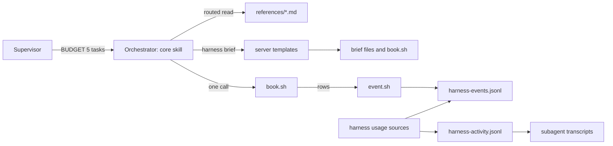

# Design Document — lean-orchestrators

## Overview

This design adds W and a per-source transcript breakdown to `harness usage`, then cuts orchestrator context with step-scoped skills, server-side briefs, short worker report blocks, one batched bookkeeping script and a 5-task implementation budget. The server changes sit in `src/watch/` (pure folds) and `src/tools/harness.ts` (actions); the harness changes sit in `harness/skills/`, `harness/agents/` and the supervisor skill. It reuses the usage fold, the `orient` and `brief` actions, the task parser, and the run's `event.sh` and `retro.sh`.

## Steering Document Alignment

### Technical Standards (tech.md)
No `tech.md` exists; the design follows `.spec-workflow/agent-rules.md`: pure functions with tests beside them, `harness/` as the source of truth with `plugins/` synced by script.

### Project Structure (structure.md)
No `structure.md` exists; new modules go to `src/watch/sources.ts`, `src/watch/transcripts.ts` and `src/tools/brief-templates.ts`, and routed skill text to each skill's `references/` directory.

### Design System (design-system.md) — if applicable
N/A.

## Architecture

The orchestrator holds a core skill and reads a routed reference file only when a step needs it. Briefs, prompt blocks and the bookkeeping script come from `harness` `brief`, so their fixed text never enters orchestrator context. Workers end with a key block; between two spawns the orchestrator makes one `book.sh` call, which writes rows only through `EVENT_SCRIPT`.



## Components and Interfaces

### C1 — W fold (`src/watch/usage.ts`)
- **Purpose:** Requirement 1 criteria 1 and 8.
- **Interfaces:**
  - `spawnW(row: LedgerEvent): number | undefined` returns `input + 1.25·cacheWrite5m + 2·cacheWrite1h + 0.1·cacheRead + 5·output` from a `spawn.end` row, or `undefined` when any of the five is not a digit string.
  - `UsageCell` gains `w` and `wUnknown`; W comes from the row that sets tokens (`src/watch/usage.ts:259-275`), and a spawn with tokens only from `spawn.usage`, or undefined W, adds 1 to `wUnknown`.
  - `listSpawns(events: LedgerEvent[]): SpawnSummary[]`: each reduced spawn, same pairing (`src/watch/usage.ts:137-155`) and phase rule (`src/watch/usage.ts:290-296`), with the latest `spawn.end` row's `agentId` and W from the row that sets tokens (`src/watch/usage.ts:259-275`), as in C1.
  - `unitCount(events: LedgerEvent[], phase: string): number`: `round` rows whose `phase` key matches, for a document phase; for `implementation`, `task.done` rows inside an implementation window (`src/watch/usage.ts:116-124`).
  - `UsagePhase` gains `orchW` (the two orchestrator cells' W), `units` and `orchWPerUnit: number | null` (null at 0 units).
  - `formatUsageTable(report, compare?, opts?: { perUnit?: boolean })`, trailing parameter optional: a `W` column after `tokens` in every row, ` (+N unknown)` as in `src/watch/usage.ts:365-367`; with `perUnit`, phase totals add `orch W/round` or `orch W/task`, and the compare table prints both and the delta.
  - `UsageDelta` gains `w` and `orchWPerUnit`.
- **Reuses:** `buildUsageReport` (`src/watch/usage.ts:126-231`), `usageDelta` (`src/watch/usage.ts:302-314`), the formatters (`src/watch/usage.ts:403-457`).

### C2 — Source breakdown (`src/watch/sources.ts`, pure)
- **Purpose:** Requirement 1 criteria 4 and 5.
- **Interfaces:** `breakdownTranscript(text: string): TranscriptBreakdown | null`. It returns null when the text holds no assistant line with `message.usage`.
- **Algorithm (normative):**
  1. Parse each line as JSON; skip lines that do not parse.
  2. A call is the assistant lines sharing a `message.id` (a line with no id is its own call). Its usage is its **last** line's, as `readUsage` keeps it (`harness/hooks/sdd-activity.sh:68-87`); its context is the blocks appended before its **first** line.
  3. Label blocks with the table below. Size is characters; a tool result sums its text parts and takes JSON length for a non-text part.
  4. Per call, `ctx = input_tokens + cache_creation_input_tokens + cache_read_input_tokens` and `inW = input_tokens + 1.25·ephemeral_5m + 2·ephemeral_1h + 0.1·cache_read_input_tokens`; a missing field counts 0.
  5. `base = max(0, ctx₁ − C₁/3.5)`, sized once from the transcript's first call, `C₁` its preceding characters. For call k, `b = min(base, ctx_k)`: `base` gets `inW·b/ctx_k`, source s gets `inW·((ctx_k − b)/ctx_k)·(chars_s/C_k)`; when `C_k` or `ctx_k` is 0, `base` gets all of `inW`.
  6. `own-output` gets every call's `5·output_tokens`.
- **Outputs:** `calls`, `peak = max ctx_k`, `w = Σ(inW + 5·output)` and rows sorted by W, highest first. Source totals equal `w` by construction.

| Block | Source |
| --- | --- |
| Assistant text, thinking, `tool_use` input (JSON length) | `own-output` |
| Result of an `Agent` or `Task` call; user text holding `<task-notification>` | `worker-report` |
| User text with `isMeta: true`; a `Skill` result; a `Read` result whose `file_path` holds `/skills/` | `skill` |
| Other `Read` result: `file_path` holds `/.spec-workflow/`, else not | `read:spec-store`, `read:other` |
| Result of a tool named `mcp__` + server + `__` + tool, with `input.action` when present | `mcp:` + tool + `.` + action |
| `Bash` result | `bash` |
| Any other tool result | `tool:` + name |
| Other user text | `prompt` |

### C3 — Transcript locator (`src/watch/transcripts.ts`)
- **Purpose:** Requirement 1 criterion 3 and the Security NFR.
- **Interfaces:**
  - `projectsDir(env: NodeJS.ProcessEnv = process.env, home: string = homedir()): string` returns `$CLAUDE_CONFIG_DIR/projects` when the variable is set, else `<home>/.claude/projects`.
  - `resolveSession(activity: ActivityEvent[], agentId: string): string | undefined` returns the first activity row's `session` that carries this `agentId` (`src/watch/ledger.ts:26-36`).
  - `findTranscript(session: string, agentId: string, dir: string = projectsDir()): Promise<TranscriptLookup>`: either id failing `^[A-Za-z0-9-]+$` gives `invalid-id`. It lists `dir` with `withFileTypes`, keeps directory entries only (a symlinked entry reports `isDirectory` false), tries `<dir>/<entry>/<session>/subagents/agent-<agentId>.jsonl`, skips a candidate whose realpath is not under `realpath(dir)`, and returns the first readable one, else `missing`. Probe: `/tmp/scratchpad/sdd/lean-orchestrators/design-probe-fs.mjs` (node 22, 24); both calls exist in node 20, and tests assert only these two behaviours.

### C4 — `usage` action (`src/tools/harness.ts`)
- **Purpose:** Requirement 1 criteria 2, 7 and 9.
- **Interfaces:** the schema gains `sources: { type: 'boolean' }`. The description (`src/tools/harness.ts:30-43`) gains this text: "Pass `sources: true` to also read each document and implementation orchestrator spawn's subagent transcript under `$CLAUDE_CONFIG_DIR/projects`, else `~/.claude/projects`, and print its W by context source. Without it the action reads only the spec store." The existing "never spawns a process" sentence stays.
- **Flow:** `usageAction` (`src/tools/harness.ts:1215-1244`), then with `sources`: `listSpawns`, keep the two orchestrator agents, and run `resolveSession`, `findTranscript`, `readFile`, `breakdownTranscript` per spawn, for both specs, with `perUnit` set; `data` adds `sources` and `compareSources`.
- **Block** (illustrative; the numbers come from `/tmp/scratchpad/sdd/lean-orchestrators/design-probe-base.js` run on the baseline implementation spawn):

```
sources tdd-task-loop  spawns 5  unknown 0  (shares are estimates; W totals are floors)
implementation | sdd-implementation-orchestrator | a46fec387251fb6c6 | calls 127 | peak 229,380 | W 2,682,602 | ledger W 2,682,602 | diff 0.00%
  base | 662,322 | 24.7%
```

### C5 — `orient` task queue (`src/tools/harness.ts:311-364`)
- **Purpose:** Requirement 4 criteria 2 and 3.
- **Interfaces:** for `implementation`, `data` adds:
  - `queue: QueuedTask[]`: the `[-]` task, then the `[ ]` tasks in file order, without header tasks (the rule at `src/core/task-parser.ts:490-492`).
  - `nextTask`: `queue[0]` or null.
  - `decomposition: { title: string | null; scenario: string | null }`, only when `nextStep` is `Completion gate` or `Repair`. It reads `spec-decomposition/decomposition.md` through `safeJoin`; the entry runs from the first `### ` line holding the backticked slug to the next `### ` or `## ` line; the title is the heading text after the slug; the scenario runs from the line starting `**End-to-end verification` (`.**` form, `.spec-workflow/spec-decomposition/decomposition.md:771`; the parser also accepts the `**:` form) to before the next line starting `**` or `#`. Anything missing gives null.

### C6 — Server brief templates (`src/tools/brief-templates.ts`)
- **Purpose:** Requirement 3 criteria 3 and 4.
- **Interfaces:** `BRIEF_TEMPLATES` (`src/tools/harness.ts:493-557`) moves here as `Record<string, BriefTemplate>`. `briefAction` (`src/tools/harness.ts:595-765`) keeps its behaviours (unknown kind, all missing values at once, agent-rules line, `taskBlock`, graph append at `src/tools/harness.ts:572-588`, `safeJoin` write) and adds append mode, which fails on a missing target.
- Each kind's text is the matching `references/briefs.md` section, word for word, with slots as values and phase and D conditionals rendered on the server.

| Kind | Mode, target | Values beyond `path`, `title` |
| --- | --- | --- |
| `drafter` | write `reviews/drafter-brief-<PHASE>.md` | `phase`, `docPath`, `specDir`, `specStoreRoot`, `codeRoot`, `carried` |
| `gate-a` | write `reviews/gate-a-brief-requirements.md` | `docPath` |
| `reviewer` | append to `promptOutputPath` | `phase`, `D`, `specDir`, `lintChecks`, `lintOpen`, `reDecided` (path or `none`), `overCap`, `lens`, `closedByRuling`, `memoryPath`, `codeRoot`, `specStoreRoot` |
| `reviser` | write | `phase`, `D`, `docPath`, `specDir`, `findings`, `memoryPath`, `closedByRuling`, `variant` (`round`, `should-fix-only`, `revision`, `lint-fix`) |
| `adjudicator` | write | `items`, `phase`, `docPath` or `taskId` |
| `checker` | write over `promptOutputPath` | `phase`, `items`, `specDir`, `codeRoot` |
| `impl-standing`, `verify-standing` | write to scratch | `codeRoot`, `mainCheckout`, `specStoreRoot`, `specDir` |
| `implementer` | write | `taskId`; `authorFiles`, `authorReport` build the red-tests section |
| `test-author` | write | as today |
| `fix` | write | `taskId`, `round`, `variant` (`gate`, `verifier`, `repair`, `ci`, `reconcile`), `findings` (text or path), `commit` |
| `verifier` | write | `variant` (`task`, `batch`, `narrow`, `e2e`, `ci`), `taskIds`, `files`, `round`, `gateResults`, `scenario` |
| `book-script` | write to scratch | `eventScript`, `retroScript`, `specDir`, `specStoreRepo`, `codeRoot`, `handoff`, `spec` |

Illustrative, verify against the test fake: `type BriefTemplate = { mode: 'write' | 'append'; required: string[]; optional?: string[]; render(v: Record<string, string>): string }`.

Both skills' `references/briefs.md` files are deleted; the drift-guard test reading one (`src/tools/__tests__/harness.test.ts:491-495`) becomes one snapshot test per kind.

### C7 — Bookkeeping script `book.sh`
- **Purpose:** Requirement 6 and Requirement 3 criterion 5.
- **Interfaces:** `/tmp/scratchpad/sdd/<SPEC>/book.sh`. Step 0 writes it with `harness` `brief`, `template: book-script`, when the file is missing. Invocation: `bash book.sh <segment> [-- <segment>]...`. The segments run in order. The script reads the run id and ledger path from `EVENT_SCRIPT`'s `SDD_RUN` and `SDD_LEDGER` lines (`harness/skills/sdd-continue/references/formats.md:164-183`).

| Segment | Effect | Already landed when |
| --- | --- | --- |
| `event <type> key=value…` | `bash <EVENT_SCRIPT> <type> key=value…` | this run has a row after its latest `phase.start` with the same type and every passed key equal |
| `check <N> todo\|doing\|done` | sets the checkbox with the `updateTaskStatus` pattern (`src/core/task-parser.ts:446-485`) | the line is already in that state |
| `retro <stage> <ref> <category> <body> <evidence> <cost>` | `bash <retroScript>` (`harness/skills/sdd-continue/references/formats.md:101-117`), with ` · mark <run> <h>` added to the evidence, where h is the first 8 hex of the SHA-1 of stage, ref, category and body | `grep -F` finds the marker in the retro log |
| `state <text>` | rewrites the `\| State \|` row of `## <SPEC> — implementation` in HANDOFF, and creates the section when it is missing | idempotent by overwrite |
| `commit <message>` | the commit script logic (`harness/skills/sdd-document-phase/references/cleanup.md:71-97`) | nothing staged |
| `head` | prints `head: <sha>` of `CODE_ROOT` | read only |
| `changes <phase> <D> <prompt>` | the round-diff logic (`harness/skills/sdd-document-phase/references/cleanup.md:127-159`) | the prompt already holds a `## Changes` heading |
| `edit <file> <old> <new>` | one exact replacement (`harness/skills/sdd-document-phase/references/cleanup.md:99-125`) | `old` is absent and `new` is present |

- **Output:** one line per segment, `book: <step> ok|skipped`; on failure stderr `book: segment <i> <step> failed: <cause>`, exit 1, no later segment runs; usage error exit 2. After a non-zero exit the orchestrator re-runs the same command (Requirement 6 criteria 6 and 7).
- **Compositions** (pinned in the skills):
  - First pick of a spawn: `check N doing -- event task.pick task=N "title=T" -- head`.
  - Close plus next pick (pick omitted when the budget is full): `event spawn.usage … -- event task.done … -- check N done -- retro implementation "task N" … -- state "…" -- commit "docs(sdd): SPEC task N" -- check M doing -- event task.pick task=M "title=…" -- head`.
  - After a gate that routes on: `event note "text=gate: task N fail risk high round r" -- event judge …`.
  - Document round: `event spawn.usage … -- event round … -- retro PHASE vD …`.
- **Uniqueness rule:** one spawn never passes two identical rows; the gate note text and verify role add ` round <r>` for r ≥ 1, and the `logged: no` re-spawn role adds ` retry`. Row types and keys do not change.

### C8 — Skill split
- **Purpose:** Requirement 3 criteria 1, 2, 5 and 6, and Requirement 4 criterion 1.

| File | Holds |
| --- | --- |
| `sdd-document-phase/SKILL.md` | Standing rules, Step 0, Step 1, Lint step (with the lint disposition rules inline), Step 2, Step 3, Step 5, Step 6, Budget |
| `sdd-document-phase/references/gates.md` | Gate A, Design scope-cut gate, Gate B |
| `sdd-document-phase/references/convergence.md` | Standoff check, Circling check, Cap convergence check, Step 4a, Step 4b |
| `sdd-document-phase/references/revision.md` | Step R, Legacy rules that stay in force |
| `sdd-implementation-phase/SKILL.md` | Standing rules, Step 0, Per-task loop, Deferral bar |
| `sdd-implementation-phase/references/completion.md` | Completion gate (Live verification, Reconcile a red PR), Repair |
| `sdd-implementation-phase/references/stops.md` | Design defect, Escalate, Resume recovery, Stop conditions and their reports |

- **Routers:** one line replaces each moved step. Reads happen at these points:
  - `gates.md`: Step 1 item 6 in requirements; Step 5 in design; Step 6 in tasks.
  - `convergence.md`: a Step 2 item 9 `iterate` at round 2 or later or at D ≥ 4, the SHOULD_FIX-only route, or a Step 0 `nextStep` of Step 4a or 4b. Round 1 goes straight to Step 3 because no check can fire on round 1 (`harness/skills/sdd-document-phase/SKILL.md:224-273`).
  - `revision.md`: Step R.
  - `completion.md`: a Step 0 `nextStep` of Completion gate or Repair.
  - `stops.md`: `resume task`, a `DESIGN-DEFECT`, `ESCALATE` or `SEAM-DEFECT` flag, or any stop other than Budget.
- **Edits to kept text:**
  - Own reads (`harness/skills/sdd-implementation-phase/SKILL.md:6-13`) become `orient` data, the HANDOFF section and worker blocks; the budget default and rationale (`harness/skills/sdd-implementation-phase/SKILL.md:14-20`) are rewritten for 5.
  - The briefs reads (`harness/skills/sdd-document-phase/SKILL.md:14-17`, `harness/skills/sdd-implementation-phase/SKILL.md:22`) and the prompt read before the overwrite (`harness/skills/sdd-document-phase/SKILL.md:175-176`) are removed.
  - Edits, commits (`harness/skills/sdd-implementation-phase/SKILL.md:49-58`) and the round diff (`harness/skills/sdd-document-phase/SKILL.md:181-182`) go through `book.sh`.
  - Pick and Gate take `nextTask`; the gate's `files` are `nextTask.files` (`src/tools/review-task.ts:263-267`). Step 7 adds Requirement 7 criterion 5.
- `references/cleanup.md` is read only in document Step 6, never by the implementation orchestrator; close-out and retro keep using it.

### C9 — Worker report blocks
- **Purpose:** Requirement 5.
- Each agent file replaces its report bullet with: "End with this block, at most 8 lines; the whole report is at most 80 words; put more in a file under `/tmp/scratchpad/sdd/<spec>/` and name it in one line." The `impl-standing` and `verify-standing` text says the same.

| Agent (bullet replaced) | Keys |
| --- | --- |
| `sdd-drafter` (`harness/agents/sdd-drafter.md:30`) | `doc`, `words`, `context`, `re-decided` (count, path or `none`), `scope-cut` (count, path or `none`), `gate-a`, `flags` |
| `sdd-reviewer` (`harness/agents/sdd-reviewer.md:26`) | `verdict`, `escalate`, `analysis` |
| `sdd-reviser` (`harness/agents/sdd-reviser.md:35`) | `version`, `words`, `accepted`, `partial`, `rejected` (ids), `cut-scope`, `flags` |
| `sdd-adjudicator` (`harness/agents/sdd-adjudicator.md:29`) | `version` or `commit`, `fixed`, `ruled-out` (ids), `notes` (path), `flags` |
| `sdd-checker` (`harness/agents/sdd-checker.md:25`) | `verified`, `deferred`, `analysis` |
| `sdd-implementer` (`harness/agents/sdd-implementer.md:38`) | `logged`, `commit`, `checks`, `checks-file` (path of a JSON array of the commands run), `green`, `flag`, `retro` |
| `sdd-test-author` (`harness/agents/sdd-test-author.md:32`) | `commit`, `tests`, `folds` (path or `none`), `flag`, `retro` |
| `sdd-verifier` (`harness/agents/sdd-verifier.md:34`) | `verdict`, `findings` (path or `none`), `retro` |

- The orchestrator passes the `findings`, `folds`, `notes` and `re-decided` paths into the next brief as values, unread; it reads only the few-line `checks-file` for the gate's `checks`.

### C10 — Supervisor (`harness/skills/sdd-continue/SKILL.md`)
- **Purpose:** Requirement 7 criteria 1 to 3.
- The launch line (`harness/skills/sdd-continue/SKILL.md:291`) reads `BUDGET: <4 review rounds | 5 tasks | all items | n/a>`. Resume does not change (`harness/skills/sdd-continue/SKILL.md:350-351`).
- The runaway guard (`harness/skills/sdd-continue/SKILL.md:379-380`): for implementation, more than `max(12, ceil(T/B) + 4)` spawns is an error, T being `data.tasks.total` from a `harness` `orient` call the supervisor makes before its first implementation spawn of the run and B the budget; other phases keep 12.

### C11 — Baseline file (Requirement 2)
- The first task after C1 to C4 writes `.spec-workflow/specs/lean-orchestrators/baseline-sources.md`: date, HEAD, and both `sources: true` messages verbatim (`trading-rules` through `projectPath: /home/mcf/repo/tradr-hosted`). It also runs scenario 1 (Requirement 1 criterion 6).
- Probe, 2026-10-02: all 5 `tdd-task-loop` and all 3 `trading-rules` orchestrator transcripts resolve; the latter sit under slug `-home-mcf-repo-tradr--claude-worktrees-trading-rules`, dated 2026-09-28, and the oldest transcript under `-home-mcf-repo-tradr` is dated 2026-09-04.

## Data Models

Illustrative, verify against the test fake.

```ts
interface UsageCell { /* existing fields */ w: number; wUnknown: number }
interface UsagePhase { /* existing fields */ orchW: number; units: number; orchWPerUnit: number | null }
interface UsageDelta { phase: string; spawns: number; tokens: number; w: number; orchWPerUnit: number | null }
interface SpawnSummary { phase: string; agent: string; agentId: string | undefined; w: number | undefined }
interface SourceRow { source: string; w: number; share: number }
interface TranscriptBreakdown { calls: number; peak: number; base: number; w: number; rows: SourceRow[] }
type TranscriptLookup = { ok: true; path: string } | { ok: false; reason: 'invalid-id' | 'missing' }
type SpawnSources =
  | { phase: string; agent: string; agentId: string; ledgerW: number | null; ok: true; breakdown: TranscriptBreakdown; diff: number | null }
  | { phase: string; agent: string; agentId: string | undefined; ledgerW: number | null; ok: false; reason: 'no-agent-id' | 'no-session' | 'invalid-id' | 'missing' | 'unreadable' }
interface SourcesReport { spec: string; spawns: SpawnSources[]; unknown: number }
interface QueuedTask { id: string; title: string; status: 'pending' | 'in-progress'; files: string[] }
```

`data.sources` is a `SourcesReport`; `data.compareSources` is `SourcesReport | null`.

## Error Handling

1. **No `agentId`, no session, invalid id, no or unreadable transcript, no usage line, or no projects directory:** `SpawnSources.ok: false` with `reason`; the block prints `sources unknown (<reason>)` and the ledger W, the header counts it, and the action returns `success: true`.
2. **W unknown** (non-digit tokens or cache field): `wUnknown` increments; the cell prints ` (+N unknown)`.
3. **Transcript W differs from ledger W:** the block prints `diff`; evidence for scenario 1, not an error.
4. **Ledger or activity read error:** as today, `success: false` naming the path (`src/tools/harness.ts:1139-1207`).
5. **Brief:** unknown kind or missing values return `success: false` as in `src/tools/harness.ts:595-765`; a missing append target returns `success: false`, `brief: <path> missing; nothing appended`, and writes nothing.
6. **No decomposition file, entry or label:** null fields; the e2e `verifier` gets `scenario: read the decomposition entry for <SPEC> yourself`.
7. **`book.sh` step failure:** exit 1 with `book: segment <i> <step> failed: <cause>`; the orchestrator re-runs once, and a second failure is that step's failure as today. Exit 2 (usage) is `PHASE: error`.
8. **Report without its block:** a stall; re-spawn once, then `PHASE: error` (Requirement 5 criterion 3).
9. **Runaway guard tripped:** the supervisor reports `error` with the count and the allowance.

## Testing Strategy

- **Unit:**
  - `src/watch/__tests__/usage.test.ts`: `spawnW`, `wUnknown`, `unitCount` per phase kind, per-unit and compare delta, the W column (update existing table assertions).
  - New `src/watch/__tests__/sources.test.ts`, fixture transcripts: one per source kind; a multi-line message counted once with its last usage; no usage line gives null; totals equal `w`; `base` sizing; a zero-character call.
  - New `src/watch/__tests__/transcripts.test.ts` (temp dirs): env override, invalid ids, symlinked project entry skipped, escaping session symlink skipped, first match wins.
  - `src/tools/__tests__/harness.test.ts`: `usage` with `sources` (stubbed `CLAUDE_CONFIG_DIR`), the description, `queue`, `nextTask`, `decomposition` (both label forms, missing entry), one snapshot per brief kind, append mode and its missing target.
- **Integration:**
  - New `src/__tests__/skill-split.test.ts` (Requirement 3 criterion 6): a frozen list of today's rule headings of both skills; each is in `SKILL.md` or exactly one of that skill's `references/*.md`; neither `SKILL.md` names `briefs.md`.
  - New `src/__tests__/book-script.test.ts`: renders `book-script` into a temp git store with stub `event.sh` and `retro.sh`, runs every segment, forces a commit failure (a held `index.lock`), re-runs, and asserts no doubled row or retro entry, exit codes 1 and 2, and the step name. It asserts only on exit codes and file contents.
- **End-to-end:**
  - Scenario 1 runs in the C11 task; the design probe already gives 0.000% between last-line transcript W and ledger W on all five baseline spawns (`/tmp/scratchpad/sdd/lean-orchestrators/design-probe-w.js`).
  - Scenarios 2 and 3 need a restarted session, so they stay pending in a tracked `verification-evidence.md` (Requirement 8 criterion 5); the 6-task fixture is dry-run in a scratch store first, and the retro prints per-unit W against `baseline-sources.md` with the Requirement 8 criterion 4 signals. Scenario 4 is the four checks.

## Decisions taken in this document

- D1 — Usage of a call: the last transcript line per message id (chosen) over the probe's first line; chosen because the first line misses 0.3 to 6.3 percent of ledger W in the design probe, failing the 1 percent check, while the last line matches exactly.
- D2 — Base scope (narrow-check deferred note): the first call of the spawn's own transcript (chosen) over the first call overall; chosen because one transcript holds one agent id and a resumed segment keeps its prefix.
- D3 — Breakdown modules: a pure source module plus a locator module (chosen) over code in the tool file; chosen because Requirement 1 criterion 10 wants pure, tested functions in the watch directory.
- D4 — Batch shape: one generic segment script (chosen) over four verb scripts or server actions; chosen because commits need git and one script keeps one writer per row.
- D5 — Script delivery: the brief action writes it from a server template (chosen) over a Write from reference text or a copy from the skill directory; chosen because the text stays out of context and a preloaded skill's base directory is uncertain.
- D6 — Row idempotency: exact row match after the run's latest phase start, with unique values for repeats (chosen) over stamp files or a new key; chosen because Requirement 6 criterion 5 freezes keys and stamps die with the scratch directory.
- D7 — Retro marker: a short hash of stage, ref, category and body (chosen) over a task-number match; chosen because a ruling and a task entry can share a number.
- D8 — Close also picks the next task (chosen) over separate calls; chosen because Requirement 6 criterion 1 allows one bookkeeping call between spawns.
- D9 — Task routing: an open-task queue from orient (chosen) over orient per task or script-side parsing; chosen because it is one read per spawn and keeps one parser.
- D10 — Gate file scope: the task's declared files (chosen) over the implementer's list; chosen because Requirement 5 forbids file lists in reports and the gate takes the paths a change must stay within.
- D11 — Lint rules: inline in the kept Lint step (chosen) over a lint template; chosen because the orchestrator fixes lint itself and would have to read a brief back.
- D12 — Brief source: server templates only, both phase briefs files deleted (chosen) over a kept copy with a sync test; chosen because two copies drift.
- D13 — Skill grouping: reference files by trigger (chosen) over one file per step; chosen to follow requirements decision D5.
- D14 — Runaway guard basis: the task total (chosen) over open tasks at phase start; chosen because the total never shrinks, so a restarted supervisor gets the same allowance (R2-4).
- D15 — Transcript expiry (R2-3): baseline task first, ledger-only per-unit W as fallback (chosen) over a snapshot; chosen because per-unit W needs no transcript, every baseline transcript is present, and a snapshot commits large files.
- D16 — Round section: appended by the server (chosen) over read-then-overwrite; chosen because the scaffold leaves context.
- D17 — Gate checks: an implementer-named checks file (chosen) over commands in the report or a rules-file read; chosen because the report stays within 80 words and Requirement 4 criterion 1 forbids the read.

## Scope notes

- Carried items: R2-3 resolved by D15 and C11; R2-4 by D14 and C10; R2-5 by citing the whole object, `src/tools/harness.ts:493-557`; the narrow-check note by D2.
- Unchanged: the cheaper-model lever (requirements D10), approval calls, the base prefix, the close-out and retro orchestrators and their `references/cleanup.md`.
- The retro computes the Requirement 8 criterion 4 signals from the ledger; no tool prints them.
- `docs/TOOLS-REFERENCE.md` and `docs/SDD-HARNESS.md` get the new fields and skill layout in the same tasks.

## Revision History

- **v2** (2026-10-02) — Round-1 adversarial response (adversarial-analysis-design.md, verdict iterate 0/1/2).
  - **R1-1 — Accepted (SHOULD_FIX).** Cut the two consumerless fields from the open-task queue entry (the test-file list and the integration flag), leaving only its id, title, status and file list, and deleted the paragraph that defined them off an absent test-bullet convention.
  - **R1-2 — Accepted (MINOR).** Data Models now pins both source-breakdown response fields, the compare field as a nullable source report.
  - **R1-3 — Accepted (MINOR).** The spawn-listing function now states its weighted-token figure comes from the same token-setting row as the usage fold, so it cannot diverge on an unknown re-fire.
- **v1** (2026-10-02) — Initial draft.
  - **Lint pass.** 2 fixed (readUsage citation tightened to the line the symbol starts on; cross-repo absolute path dropped from the C5 scenario-form note, keeping the in-repo citation); rejected: the 45 remaining citation-identifier warnings — all name design-introduced identifiers (new types and fields such as the W and unknown-W cells, per-unit fields, the orient queue and next-task, and the new worker report keys), data values matched against behaviour code, or cross-file tokens the rule mis-associated with a correct behavioural citation; each cited range was re-verified to anchor its adjacent claim.
