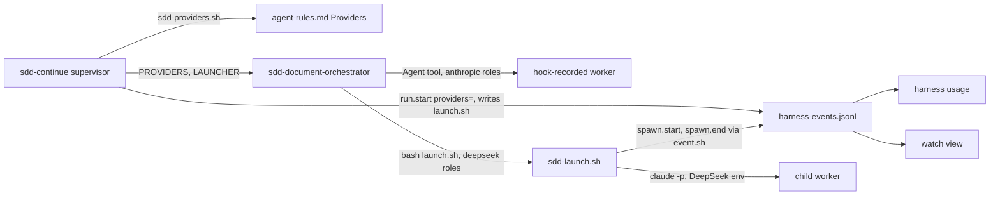

# Design Document — provider-per-role

## Overview

This design adds a shipped map validator and a shipped launcher body under `harness/skills/sdd-continue/references/`, a per-run `launch.sh` beside `event.sh`, two launch-prompt lines, a `provider` key on launcher-written ledger rows, and a provider split in `src/watch/usage.ts`, `src/watch/ledger.ts` and `src/watch/render.ts`. It sits between the supervisor skill and the document-phase skill, which today spawn every worker with the Agent tool. It reuses the event script (`harness/skills/sdd-continue/references/formats.md:170-182`), the hook's usage sum (`harness/hooks/sdd-activity.sh:37-49`), the shipped-script pattern (`harness/skills/sdd-continue/references/harness-source.sh:13-18`) and the hook integration test (`src/__tests__/hook-spawn-events.test.ts:13-41`).

## Steering Document Alignment

### Technical Standards (tech.md)
No `steering/tech.md` exists; the design follows `.spec-workflow/agent-rules.md` (tests beside modules, `harness/` as source of truth, node 20 assertions).

### Project Structure (structure.md)
No `steering/structure.md` exists; new scripts go beside `harness-source.sh`, new tests beside the hook and watch tests, and the preflight record to `docs/` beside `docs/step-0-answers.md`.

### Design System (design-system.md) — if applicable
N/A: no `design-system.md` exists.

## Architecture

The supervisor validates the map and the key once, before any ledger row, with a shipped script; it records the map on `run.start`, writes `launch.sh` when a DeepSeek row exists, and passes `PROVIDERS` and `LAUNCHER` to the orchestrator. The orchestrator swaps only the spawn call for a DeepSeek-provider worker: `bash LAUNCHER AGENT "MESSAGE"` instead of the Agent tool. The launcher body spawns `claude -p` as a child with its own environment, writes `spawn.start` and `spawn.end` through `event.sh`, and prints the worker's report. The two folds read `provider` off those rows and default a row without it to `anthropic`.



## Components and Interfaces

### Component 1 — `harness/skills/sdd-continue/references/sdd-providers.sh`
- **Purpose:** Parse and validate the `## Providers` section and check the key before the run ledger exists (Req 1 crit 1-4, Req 4 crit 2, D5).
- **Interfaces:** `bash sdd-providers.sh AGENT_RULES_PATH`; the path may be `none`. Stdout on success: one line `providers=VALUE` (Data Models). Exit 0 with `providers=none` when the path is `none`, the file is missing, the heading `## Providers` is absent, or it has no bullet before the next `## ` heading. Exit 2 with one stderr line `providers: REASON` and no stdout on: a bullet outside the row grammar, an agent outside `ELIGIBLE`, an unknown provider, a `deepseek` row without a model, an `anthropic` row with one, a duplicate agent. Exit 3 with `providers: DEEPSEEK_API_KEY unset; AGENT runs on deepseek` when a `deepseek` row exists and `DEEPSEEK_API_KEY` is empty in the calling environment. `ELIGIBLE` is one shell variable at the top of the script, `sdd-reviewer sdd-checker`; the task recording preflight (b) appends `sdd-reviser` only on a pass (Req 6 crit 4).
- **Dependencies:** bash, node (the `node -e` body pattern of `harness/hooks/sdd-activity.sh:32-35`).
- **Reuses:** the section-heading convention `src/core/gate-rules.ts:17-23` machine-reads.

### Component 2 — Supervisor skill (`harness/skills/sdd-continue/SKILL.md`) and `formats.md`
- **Purpose:** Read the map once, refuse before any row, record it, write the per-run launcher, pass both values to every orchestrator (Req 1 crit 3-5, Req 2 crit 1, Req 4 crit 2).
- **Interfaces:** Roots step, after the agent-rules bullet (`harness/skills/sdd-continue/SKILL.md:71-72`): run `bash BASE_DIR/references/sdd-providers.sh AGENT_RULES_PATH` (the base dir of `harness/skills/sdd-continue/SKILL.md:49-50`); keep stdout as `PROVIDERS`. On non-zero exit: print the stderr line, the roots line and the status line `PROJECT:- - refused — REASON`, and stop; `harness/skills/sdd-continue/SKILL.md:76-86` never runs, so no run id, `event.sh`, pointer line or `run.start`. Run-ledger start (`:76-86`): `run.start` gains `providers=PROVIDERS`; when `PROVIDERS` contains `:deepseek:`, write `/tmp/scratchpad/sdd/SPEC/launch.sh` with the Write tool from the `formats.md` text (Data Models) and set `LAUNCHER` to that path, else `none`. Launch prompt (`:190-208`): two lines after `EVENT_SCRIPT`, `PROVIDERS: VALUE` and `LAUNCHER: PATH | none`. `formats.md`: the `run.start` row (`harness/skills/sdd-continue/references/formats.md:188`) adds `providers`; the `spawn.start` and `spawn.end` rows (`:192-193`) add "the launcher for a DeepSeek-provider worker" under "Written by" and the keys `provider`, `model`, `effort` (start) and `provider` (end); a new `## Launcher (launch.sh)` section after the event script carries the per-run text.
- **Dependencies:** Component 1, Component 3.
- **Reuses:** the Write-tool script pattern of `event.sh` and `retro.sh` (`harness/skills/sdd-continue/references/formats.md:101-117`).

### Component 3 — The launcher: `launch.sh` (per run) and `harness/skills/sdd-continue/references/sdd-launch.sh` (body)
- **Purpose:** Run one DeepSeek-provider worker as a `claude -p` child with the same launch message and report contract, and write its two ledger rows (Req 2 crit 2-9, Req 3, Req 4 crit 3-4).
- **Interfaces:** `bash launch.sh AGENT "MESSAGE"`. The per-run file only exports `SDD_LAUNCH_BODY`, `SDD_EVENT_SCRIPT`, `SDD_SPEC_DIR`, `SDD_RUN`, `SDD_SPEC`, `SDD_CODE_ROOT` (the main checkout), `SDD_SPEC_STORE_REPO`, `SDD_HARNESS_REPO` and `SDD_PROVIDERS`, then `exec bash "$SDD_LAUNCH_BODY" "$@"`. The body, in order:
  1. Refuse with exit 2, one stderr line `launcher: REASON`, no row, when: `DEEPSEEK_API_KEY` is empty; `SDD_PROVIDERS` has no `AGENT:deepseek:MODEL` entry; `AGENTS_DIR/AGENT.md` is missing, where `AGENTS_DIR` is `dirname SDD_LAUNCH_BODY` then `../../../agents` (`harness/agents/` linked, or the plugin root's `agents/`); `claude` is not on `PATH`; `SDD_EVENT_SCRIPT` is missing.
  2. `ALIAS` is `claude-opus-4-8` for `deepseek-v4-pro` and `claude-sonnet-5` for `deepseek-flash` (`.spec-workflow/spec-decomposition/decomposition.md:255-258`). `ROLE` is `AGENT` without `sdd-`. `TOOLS` is the frontmatter list (`harness/agents/sdd-reviewer.md:7-12`) joined with commas; `MCP_TOOLS` is its `mcp__` subset.
  3. Build the `--agents` JSON (Data Models). `effort` comes from the first existing of `SDD_HARNESS_REPO/harness/agent-profiles.json` and `AGENTS_DIR/../agent-profiles.json` (`harness/agent-profiles.json:47-51`), else the frontmatter, since plugin roots get no profiles file (`scripts/sync-plugin-assets.cjs:20`).
  4. `SID` = `node -e 'console.log(require("crypto").randomUUID())'` (probed 2026-09-22), fresh per call. `STATE` = `/tmp/scratchpad/sdd/SDD_SPEC/child-state`, created empty; it never holds `sdd/active-run`, so the hook exits before reading its payload (`harness/hooks/sdd-activity.sh:11-12`) under both layouts (`harness/hooks/hooks.json:4-36`, `scripts/dev-link.sh:47-64`).
  5. `bash "$SDD_EVENT_SCRIPT" spawn.start agent=AGENT role=ROLE provider=deepseek model=MODEL effort=not-applied`.
  6. From `SDD_CODE_ROOT`, run the child command (Data Models), stdout to `/tmp/scratchpad/sdd/SDD_SPEC/launch-SID.out`, stderr to `launch-SID.err`, foreground.
  7. `T` = `CFG/projects/SLUG/SID.jsonl`, where `CFG` is `${CLAUDE_CONFIG_DIR:-$HOME/.claude}` (`harness/skills/sdd-continue/references/harness-source.sh:21`) and `SLUG` is `SDD_CODE_ROOT` with every character outside `A-Za-z0-9` replaced by `-` (probe 2026-09-22: `ls ~/.claude/projects/` holds `-home-mcf-repo-spec-workflow-mcp` and `-home-mcf-repo-spec-workflow-mcp--claude-worktrees-spec-lint`, with one `UUID.jsonl` per session). Sum `T` with a copy of `readUsage` (`harness/hooks/sdd-activity.sh:37-49`); write `spawn.end agent=AGENT provider=deepseek model=JOINED input= output= cacheWrite= cacheRead= tokens=` as digit strings, or `spawn.end agent=AGENT provider=deepseek tokens=unknown` without usage keys or `model` when `T` is missing or sums nothing (`harness/hooks/sdd-activity.sh:114-123`). Never read another file in that directory.
  8. Child exit 0 and a non-empty `.out`: print it, exit 0. Otherwise one stderr line `launcher: AGENT exited CODE, stdout N bytes, stderr FILE`, exit 1. `spawn.end` lands on both paths.
- **Dependencies:** `claude` 2.1.280 (`claude --version`, probed 2026-09-22), node, `event.sh`, Component 1's value format.
- **Reuses:** `harness/hooks/sdd-activity.sh:37-49` (copied sum), `harness/skills/sdd-continue/references/formats.md:170-182`, `.spec-workflow/specs/harness-usage-and-tiers/harness-events.jsonl:105` (the `role` value).

### Component 4 — Document-phase orchestrator (`harness/skills/sdd-document-phase/SKILL.md`, `harness/agents/sdd-document-orchestrator.md`)
- **Purpose:** Route a DeepSeek-provider worker to the launcher, nothing else changes (Req 2 crit 3-4, 9-11).
- **Interfaces:** The variable list (`harness/skills/sdd-document-phase/SKILL.md:8-11`) adds `PROVIDERS` and `LAUNCHER`. The spawn rule (`:23-27`) becomes: Agent tool as today, except that a worker `PROVIDERS` lists with `deepseek` runs as `bash LAUNCHER AGENT "MESSAGE"` with the Bash tool, foreground, the exact message the Agent tool would have got, its report being the command's stdout; when such a worker is due and `LAUNCHER` is `none` or missing, report `PHASE: error`, `REASON: launcher missing for AGENT`, never the Agent tool. Step 2 item 4 (`:160-161`) and Step 4b item 2 (`:278-279`) say "spawn per the standing rule". A launcher non-zero exit is the stall of Step 2 item 5 (`:162-164`). `spawn.usage` (`:44-52`) is unchanged. `harness/agents/sdd-document-orchestrator.md:50` says: the Agent tool, or `bash LAUNCHER` for a DeepSeek-provider worker; never a `model` parameter, never `fork`. The orchestrator already holds Bash (`harness/agents/sdd-document-orchestrator.md:9-16`).
- **Dependencies:** Component 3.
- **Reuses:** `harness/skills/sdd-document-phase/SKILL.md:160-164`, `:278-283`.

### Component 5 — Usage fold (`src/watch/usage.ts`)
- **Purpose:** Split spawns and tokens by provider, moving no existing figure (Req 5 crit 1-4).
- **Interfaces:** `Spawn` (`src/watch/usage.ts:38-43`) gains `provider?: string` from the opening `spawn.start`; `reduceSpawn` (`:163-216`) returns `provider`: the last `spawn.end` row carrying `provider`, else the start's, else `anthropic`. `UsagePhase` and `UsageReport` (`:15-22`) gain `providers: UsageByProvider` (Data Models); `agents` is keyed `AGENT` for an anthropic spawn and `AGENT@deepseek` otherwise. `total`, `kinds`, `orchestratorShare`, `usageDelta` and `headLine` keep their all-provider values (`:138-160`, `:219-231`, `:249-251`). `formatOne` (`:258-269`) appends `  anthropic N  deepseek N` (grouped digits) to each phase total line and the spec total line; `formatCompare` (`:271-298`) appends the pair after each spec's total cell. `src/tools/harness.ts:1063-1084` is unchanged; `data.report` carries the new fields.
- **Dependencies:** `LedgerEvent` (`src/watch/ledger.ts:18-24`).
- **Reuses:** `src/watch/usage.ts:76-161`.

### Component 6 — Watch model and render (`src/watch/ledger.ts`, `src/watch/render.ts`)
- **Purpose:** Provider per spawn, tokens by provider, the run's map (Req 5 crit 5-7).
- **Interfaces:** `SpawnNode` (`src/watch/ledger.ts:94-114`) gains `provider?: string`, set from `spawn.start.provider` at open (`:265-275`) and overwritten by `spawn.end.provider` (`:276-287`). `RunModel` (`:142-163`) gains `providers?: string` (from `runStart?.providers`, `:403-422`) and `tokensByProvider: { anthropic: number; deepseek: number }`, summing `s.tokens` by `s.provider ?? 'anthropic'` beside the unchanged `tokensTotal` (`:357`). Header (`src/watch/render.ts:77`): `tokens A`, then ` deepseek D` only when `D` is above zero; the `tokens 0` and `tokens -` branches key on `tokensTotal` as today. A dim line `providers VALUE` follows the header rule (`:79`) only when `model.providers` is set and not `none`. Tier line (`:204-211`): `actual` prints `PROVIDER MODEL` when `s.provider` is set and not `anthropic`, else `MODEL`; the `!=` test stays on `s.model` against `profile.model`; `!=` depends on DeepSeek's echoed `message.model` (Component 7).
- **Dependencies:** `AGENT_PROFILES` (`src/watch/ledger.ts:81`).
- **Reuses:** `src/watch/ledger.ts:262-332`, `src/watch/render.ts:60-79`, `:178-218`.

### Component 7 — Preflight task and the implementer `ESCALATE` flag
- **Purpose:** Prove the DeepSeek facts with the launcher itself, record them, stop the spec on a failed (a) (Req 6).
- **Interfaces:** The first task runs the body (Component 3) with the `SDD_*` exports pointed at a scratch spec dir under `/tmp/scratchpad/sdd/provider-per-role/preflight/` holding its own `event.sh` copy, a fixture requirements document and a review prompt built as `harness/skills/sdd-document-phase/references/briefs.md:125-176` builds it; for (b), the reviser (`harness/agents/sdd-reviser.md:7-16`) with a prompt making one `adversarial-response` call. Because the reviser's frontmatter lists `mcp__` tools, the body passes `--mcp-config SDD_CODE_ROOT/.mcp.json` and `--allowedTools MCP_TOOLS` for it (D10); the reviewer and checker get neither. The record is `docs/deepseek-preflight.md` in the `docs/step-0-answers.md:1-17` shape: `Date`, `Source` (the commands run, key redacted), a seven-row summary table — (a) reviewer run, (b) reviser MCP call, auth token alone, `--agents` `tools` and `model` keys, transcript path and `--session-id`, child hooks, effort — and one section per row with the evidence and the consequence Req 6 crit 5 names. The `message.model` string (a) records is what Req 7 crit 1 asserts on `spawn.end`. Implementer flag `ESCALATE: LINE` (added to `harness/skills/sdd-implementation-phase/references/briefs.md:38-45` and `harness/skills/sdd-continue/references/formats.md:130-132`): the orchestrator (`harness/skills/sdd-implementation-phase/SKILL.md:100-106`) reverts the task to `[ ]`, appends a retro-log entry (`escalation`), writes the HANDOFF section, commits, and reports `PHASE: escalate`, `REASON: LINE`; the supervisor already stops on it (`harness/skills/sdd-continue/SKILL.md:247-248`). The preflight task reports `ESCALATE:` on a failed (a) and on an unset key, writing no outcome (Req 6 crit 6-7).
- **Dependencies:** Component 3, `DEEPSEEK_API_KEY` in the session environment.
- **Reuses:** `docs/step-0-answers.md:1-17`, `harness/skills/sdd-implementation-phase/SKILL.md:177-184` (revert-and-report shape).

### Component 8 — Docs
- **Purpose:** Req 1 crit 6, Req 3 crit 6, Req 5 crit 8.
- **Interfaces:** `docs/SDD-HARNESS.md:271-280`: the count word becomes five and a bullet names `## Providers` with its row grammar, the eligible set and the two model names; a paragraph after `docs/SDD-HARNESS.md:284-303` says a DeepSeek role is a `claude -p` child with its own environment and the session never changes provider; `docs/SDD-HARNESS.md:330-333` says the header's `tokens` figure is the Anthropic total, the Max plan number, with DeepSeek beside it. `docs/TOOLS-REFERENCE.md:574-577` adds the provider split.
- **Dependencies:** none.
- **Reuses:** those sections.

## Data Models

### The `## Providers` section and the `providers=` value
Bullets under the heading `## Providers`, up to the next `## ` heading:
```
- sdd-reviewer: deepseek deepseek-v4-pro
- sdd-checker: anthropic
```
Row grammar: `- AGENT: PROVIDER [MODEL]`, single spaces, `AGENT` in `ELIGIBLE`, `PROVIDER` in `anthropic | deepseek`, `MODEL` in `deepseek-v4-pro | deepseek-flash`, required for `deepseek`, forbidden for `anthropic`. Value: `providers=sdd-reviewer:deepseek:deepseek-v4-pro,sdd-checker:anthropic` in section order; `providers=none` when absent or empty. The same string is `PROVIDERS:` in the launch prompt and `SDD_PROVIDERS` in `launch.sh`.

### Ledger rows the launcher writes (string values, through `event.sh`)
```
{"ts":..,"run":RUN,"spec":SPEC,"type":"spawn.start","agent":"sdd-reviewer","role":"reviewer","provider":"deepseek","model":"deepseek-v4-pro","effort":"not-applied"}
{"ts":..,"run":RUN,"spec":SPEC,"type":"spawn.end","agent":"sdd-reviewer","provider":"deepseek","model":MESSAGE_MODEL,"input":"..","output":"..","cacheWrite":"..","cacheRead":"..","tokens":".."}
{"ts":..,"run":RUN,"spec":SPEC,"type":"spawn.end","agent":"sdd-reviewer","provider":"deepseek","tokens":"unknown"}
```
`run.start` adds `"providers":VALUE`. Anthropic rows are unchanged (`harness/hooks/sdd-activity.sh:112`, `:117-120`).

### Per-run `launch.sh` (the `formats.md` text after a shebang and usage comment as in `event.sh`; uppercase values filled by the supervisor)
```bash
export SDD_LAUNCH_BODY="BASE_DIR/references/sdd-launch.sh"
export SDD_EVENT_SCRIPT="/tmp/scratchpad/sdd/SPEC/event.sh"
export SDD_SPEC_DIR="SPEC_DIR"
export SDD_RUN="RUN_ID"
export SDD_SPEC="SPEC"
export SDD_CODE_ROOT="MAIN_CHECKOUT"
export SDD_SPEC_STORE_REPO="SPEC_STORE_REPO"
export SDD_HARNESS_REPO="HARNESS_REPO_OR_none"
export SDD_PROVIDERS="PROVIDERS_VALUE"
exec bash "$SDD_LAUNCH_BODY" "$@"
```

### The child command and environment (body step 6)
```
env -u ANTHROPIC_API_KEY \
  ANTHROPIC_BASE_URL=https://api.deepseek.com/anthropic \
  ANTHROPIC_AUTH_TOKEN="$DEEPSEEK_API_KEY" ANTHROPIC_MODEL=ALIAS XDG_STATE_HOME=STATE \
  claude -p "MESSAGE" --agents "AGENTS_JSON" --agent AGENT --model ALIAS --tools "TOOLS" \
    --strict-mcp-config --permission-mode auto --permission-prompts none \
    --output-format text --session-id SID \
    [--add-dir SDD_SPEC_STORE_REPO]  [--mcp-config SDD_CODE_ROOT/.mcp.json --allowedTools MCP_TOOLS]
```
`--add-dir` only when `SDD_SPEC_STORE_REPO` is not `SDD_CODE_ROOT` or under it; the `--mcp-config` pair only when `MCP_TOOLS` is non-empty. Every flag is listed by `claude -p --help` (2.1.280, probed 2026-09-22); `auto` is the mode of the documented headless supervisor line (`docs/SDD-HARNESS.md:244`). Not passed: `--no-session-persistence` (drops the transcript), `--bare` (its help text limits Anthropic auth to `ANTHROPIC_API_KEY`), `--effort`.

### `--agents` JSON
```json
{"sdd-reviewer": {"description": FRONTMATTER_DESCRIPTION, "prompt": AGENT_FILE_BODY,
                  "tools": ["Read","Grep","Glob","Bash","Write"], "model": ALIAS, "effort": PROFILE_EFFORT}}
```
`model` is the request alias, the same value as `--model` (D4). Preflight probe 4 records whether `tools` and `model` are accepted; a rejection changes nothing, since `--tools` carries the list and `--model` the alias.

### TypeScript additions
```ts
// src/watch/usage.ts
export interface UsageByProvider { anthropic: UsageCell; deepseek: UsageCell }
export interface UsagePhase  { /* existing */ providers: UsageByProvider }
export interface UsageReport { /* existing */ providers: UsageByProvider }
// agents keys: 'sdd-reviewer' (anthropic) | 'sdd-reviewer@deepseek'
// src/watch/ledger.ts
export interface SpawnNode { /* existing */ provider?: string }
export interface RunModel  { /* existing */ providers?: string; tokensByProvider: { anthropic: number; deepseek: number } }
```
Both cells always exist, so a ledger without a `provider` key reports `deepseek` as zero cells (Req 5 crit 4).

### `harness usage` and watch lines with a DeepSeek spawn
```
requirements | sdd-reviewer@deepseek | 1 | 181,638
requirements | total | 4 | 2,100,000  orch 60.2%  in .. out .. cw .. cr ..  anthropic 1,918,362  deepseek 181,638

provider-per-role | spec-workflow-mcp | run 20260922-033238 | up 0:41        tokens 1.9M deepseek 182k
providers sdd-reviewer:deepseek:deepseek-v4-pro
     + sdd-reviewer       review v1        6:12  182k tok
        declared claude-opus-4-8 xhigh    actual deepseek deepseek-v4-pro !=
```

## Error Handling

1. **Bad map row, ineligible agent, duplicate, model mismatch:** Component 1 exits 2 with one stderr line; the supervisor prints it and the refusal status line; no ledger row, no orchestrator (Req 1 crit 3, D5).
2. **`DEEPSEEK_API_KEY` unset with a `deepseek` row:** Component 1 exits 3 naming the role and the key; same stop; `--watch --once` shows no entry because nothing was written (Req 4 crit 2, Req 7 crit 3).
3. **Stale launcher run without the key:** the body exits 2 before `spawn.start` (Req 4 crit 3); the orchestrator treats it as a stall (one retry, then `PHASE: error`).
4. **`LAUNCHER: none` or file missing when a DeepSeek worker is due:** `PHASE: error`, `REASON: launcher missing for AGENT`; never the Agent tool (Req 2 crit 4).
5. **Child exits non-zero or prints nothing:** `spawn.end` still lands (digits or `tokens=unknown`); the launcher exits 1 naming the `.err` file; the stall rule applies (Req 2 crit 8).
6. **Transcript missing or unparsable:** `spawn.end` with `tokens=unknown`, no usage keys, no `model`; never a missing row, never a guess from another file (Req 3 crit 2-3).
7. **Permission prompt in the child:** denied by `--permission-prompts none`; the worker continues or fails into case 5.
8. **Preflight (a) fails or the key is unset:** the implementer reports `ESCALATE:`; the orchestrator reverts the task, records `escalation`, reports `PHASE: escalate`; no later task runs until a human rules (Req 6 crit 6-7).
9. **Old ledger (no `provider` key):** every consumer reads `anthropic`; existing totals, the review-gate header and the fixture assertions are unchanged (Req 5 crit 4, 6).
10. **Key leakage:** the launcher text carries no key; the child gets it only as `ANTHROPIC_AUTH_TOKEN`; no row, prompt, log or commit prints it; the folds read no environment (Req 4 crit 4-5).

## Testing Strategy

- **Unit:** `src/watch/__tests__/usage.test.ts:42-73`: provider from `spawn.end`, else `spawn.start`, else `anthropic`; the `@deepseek` key; `providers` cells per phase and spec; the `anthropic N  deepseek N` pair on total lines in one-spec and compare output; the empty-report literal (`src/watch/__tests__/usage.test.ts:263-267`) gains `providers` with zero cells, every number unchanged; the fixture (`src/watch/__tests__/usage.test.ts:270-283`) keeps `4,554,189` with `providers.deepseek.spawns` 0. `src/watch/__tests__/ledger.test.ts:251-263`: `provider` from `spawn.start`, overwritten by `spawn.end`; `tokensByProvider`; `providers` from `run.start`; `tokensTotal` unchanged. `src/watch/__tests__/render.test.ts:122-132`: header `tokens A deepseek D`, no `deepseek` word at zero, the `providers` line, tier line `actual deepseek deepseek-v4-pro !=`. `src/watch/__tests__/index.test.ts:82-94` unchanged. `src/tools/__tests__/harness.test.ts:519-530`: `data.report.providers` with `deepseek` zero on the review-gate-shape ledger.
- **Integration:** `src/__tests__/providers-map.test.ts` drives Component 1 with `execFileSync` on temp `agent-rules.md` files, with and without `DEEPSEEK_API_KEY` in `env` (pattern `src/__tests__/hook-spawn-events.test.ts:36-41`): `none` for a missing path, file, heading or bullets; the two-row value in section order; exit 2 per bad-row case; exit 3 naming the role. `src/__tests__/launcher.test.ts` drives Component 3 with a stub `claude` first on `PATH` (a bash file that dumps its argv and environment, writes the fixture transcript of `src/__tests__/hook-spawn-events.test.ts:58-94` at `CLAUDE_CONFIG_DIR/projects/SLUG/SID.jsonl`, prints a report, exits per a knob file), a temp spec dir with the `formats.md` `event.sh` text, and `HOME`, `CLAUDE_CONFIG_DIR`, `XDG_STATE_HOME` in a temp root. Assertions: exit 2 and no row without the key, for an unmapped agent, for a missing agent file; the `spawn.start` keys; `spawn.end` sums equal to the fixture literals with `model` `claude-opus-4-8+claude-sonnet-5`; the child environment (no `ANTHROPIC_API_KEY`, base URL, token, `ANTHROPIC_MODEL` and `--model` both the alias, `XDG_STATE_HOME` under scratch); a UUID `--session-id` that differs across two calls; `--strict-mcp-config`, `--permission-prompts none`, `--tools` the frontmatter list; `--mcp-config` for the reviser only; stdout equals the stub report with exit 0; stub exit 1 gives exit 1 and still one `spawn.end`; no transcript gives `tokens=unknown` and no `model`. Only node 20 guaranteed fields are read: `execFileSync` options `input`, `env`, `cwd`, the thrown error's `status` and `stdout`, and `fs` read, write, `existsSync` (`.spec-workflow/agent-rules.md:30-32`).
- **End-to-end:** Req 7 at the completion gate. (1) Key set, the map naming `sdd-reviewer: deepseek deepseek-v4-pro`, a fixture requirements round: the analysis has the verdict block; the ledger has the launcher's `spawn.start` (`model=deepseek-v4-pro`) and `spawn.end` (`model` equal to the recorded `message.model`, digit usage, both `provider=deepseek`); the reviser round has today's hook rows. (2) Every role `anthropic`: no `provider` key, `run.start` gains only `providers`. (3) Key unset with the same map: the supervisor stops at the roots step with the Component 1 line; `node dist/index.js --watch . --spec SPEC --once` shows no entry for that run. (4) `harness usage` on (1) prints the reviewer under `deepseek` and an `anthropic` total without it. (5) `node dist/index.js --watch . --spec review-gate --once` prints `tokens 6.3M`. (6) `npm test`, `npx tsc --noEmit`, `claude plugin validate . --strict`, `npm run check:plugin-assets`. Without the key, task 1 halts the spec (Req 6 crit 7); (1) and (4) need the key, not a deferred half.

## Decisions taken in this document

- D1 — Map parsing and the key check live in a shipped script, not supervisor prose: options were the supervisor reading the section itself, a per-run node helper, a shipped script; chosen because a refusal that leaves no ledger row must be deterministic and testable like the hook.
- D2 — The launcher body sits beside harness-source in the sdd-continue references directory, located from the skill base dir: options were the hooks directory (sensitive, and hook registration would not ship it), a new harness bin directory (not copied by the asset sync), the references directory; chosen because the plugin sync copies skills whole and the supervisor already runs a script there.
- D3 — Child hooks are neutralised by pointing the state home at an empty per-run directory: options were bare mode, dropping the user setting source, the state redirect; chosen because bare mode limits Anthropic auth to the API key variable per the CLI help, and the hook exits before reading its payload when the pointer file is absent.
- D4 — The agents JSON model key carries the request alias, the same as the model flag, not the profile's declared model (RE-DECIDED, Req 2 crit 5): options were the profile model, the alias, no key; chosen because the map may put a Sonnet-declared role on v4-pro and two model inputs must never disagree; effort still comes from the profile.
- D5 — Permission mode auto with prompts set to none: options were acceptEdits, bypassPermissions, auto; chosen because the documented headless supervisor line already uses auto and bypass drops every check.
- D6 — Text output format; the child's stdout is the report: options were the json envelope, text; chosen because the requirement puts the report on stdout and an envelope shape cannot be probed here without a key.
- D7 — A DeepSeek spawn's agent row is keyed agent at deepseek: options were a provider field on one merged cell, a separate key; chosen because one agent can run on both providers within a phase across runs, and old ledgers keep their keys.
- D8 — The watch header prints the Anthropic figure as tokens and deepseek beside it while the all-provider total field keeps its sum: options were renaming the total, splitting the field; chosen because the fixture and review-gate assertions hold unchanged.
- D9 — The add-dir flag is passed when the spec store repo is outside the code root (RE-DECIDED, Req 2 crit 7): options were never, always, conditional; chosen because the shared-root layout keeps the store in another repository and a denied write there would fail the round silently.
- D10 — MCP config and allowed MCP tools are passed only when the agent frontmatter lists an mcp tool, from the code root's mcp config file: options were a preflight-only environment knob, always, never; chosen because preflight (b) and a promoted reviser then share one code path and the reviewer and checker stay MCP-free.
- D11 — An ESCALATE flag for implementers and an escalate branch in the implementation orchestrator: options were reusing the design-defect flag, a new flag; chosen because design-defect reopens design, which a failed vendor probe does not need, and the supervisor already stops on escalate.
- D12 — The run's map is its own dim line under the header: options were a header segment, a line; chosen because the header is not truncated and the value can be long.
- D13 — Profile lookup tries the harness repo path, then the agents directory's sibling, then the frontmatter effort: options were fail without the file, fall back; chosen because plugin roots get no profiles file and the key is expected ignored.
- D14 — The refusal status line uses a dash for spec and phase: options were checking after the spec is known, dashes; chosen because the requirement fixes the check at the roots step.
- D15 — Transcript slug rule: every character outside letters and digits becomes a dash: options were probing the CLI, the observed rule; chosen because the observed directory names fit it and preflight probe 5 confirms it.
- D16 — No launcher timeout: options were an optional trailing seconds argument, none; chosen because the Agent tool has none and the stall rule bounds retries.
- D17 — The eligible set is one shell variable in the map script, edited by the task recording preflight (b): options were a docs-only list, a script variable; chosen because the refusal path must enforce it.

## Scope notes

- Carried note (1): Req 6 crit 5's auth probe reads here as "a no answer fails (a)" (Component 7).
- Carried note (2): the CLI version cited is the installed 2.1.280 (Component 3, Data Models).
- Spec 9's `harness-run.json` override and control pane are not built; scenario (3) uses `--watch --once`.
- `sdd-reviser` joins the eligible set only through preflight (b) and the `ELIGIBLE` edit (D17).
- The empty-report literal at `src/watch/__tests__/usage.test.ts:266` gains the `providers` key; no numeric assertion changes (requirements D6).
- A prompt-launched Anthropic reviewer or checker still gets no hook `spawn.start` (`harness/hooks/sdd-activity.sh:106-113`); not fixed here, per the requirements Scope notes.
- `--bare`, `--no-session-persistence` and `--effort` are deliberately not passed (Data Models).

## Revision History

- **v1** (2026-09-22) — Initial draft.
  - **Lint pass.** 7 fixed; rejected: L-1..L-33, L-39..L-46, L-48..L-62, L-64 (false positives: prose words, or citations marking where new material goes, not claims the range already holds it).
- **v2** (2026-09-22) — Round-1 adversarial response (adversarial-analysis-design.md, verdict iterate 0/1/1).
  - **R1-1 — Accepted (SHOULD_FIX).** The Testing Strategy end-to-end paragraph now reads: Without the key, task 1 halts the spec (Req 6 crit 7); (1) and (4) need the key, not a deferred half. This removes the false claim that a keyless run still reaches scenarios (1) and (4) through the implementation phase's deferred-verification mechanism, which covers a missing skill or tool, not a missing key. The preflight component and the matching error-handling entry already reported escalate on a failed proof and reported the missing key without a fabricated outcome on an unset key, matching both preflight acceptance criteria, so neither needed a content change.
  - **R1-2 — Accepted (MINOR).** The watch model and render component now adds that the substitution mark also depends on DeepSeek's echoed model string, the one the preflight task records, so the mark can read unchanged on a DeepSeek run when that echoed string equals the declared profile's model.
  - **Lint pass.** 2 fixed; rejected: L-3..L-51 (false positives: the design's own new vocabulary at insertion-point citations, or prose words bound to a different citation in the same block — unchanged since the v1 lint pass rejected them with that reason; rule 11).
