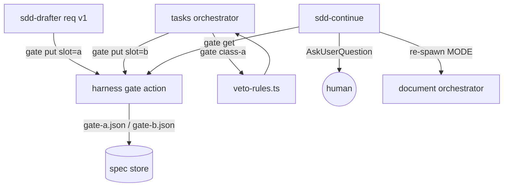

# Design Document

## Overview

`question-gates` adds two bounded human gates to the supervisor: gate A confirms the requirements' direction-setting decisions right after requirements v1, and gate B lets a human veto the task plan before implementation. It reuses `src/core/gate-rules.ts` sensitive-path predicates in a new pure module `src/core/veto-rules.ts`, and carries both gates' payloads to the supervisor through a new `gate` action on the existing `harness` MCP tool so nothing crosses a worker's 150-word report. The decomposition entry (spec 7) and this spec's approved requirements (v4) are the scope authority; no steering document exists.

## Steering Document Alignment

### Technical Standards (tech.md)
N/A — no `steering/tech.md` exists.

### Project Structure (structure.md)
N/A — no `steering/structure.md` exists; new source follows the established `src/core` (pure) plus `src/tools` (I/O) split that `gate-rules.ts`/`review-gate.ts` already use.

### Design System (design-system.md) — if applicable
N/A — this spec has no visual surface and the project has no `design-system.md`.

## Architecture

The change adds no new tool and no new process. One pure module (`veto-rules.ts`) computes gate-B class (a) from a task's declared paths and action keywords; one new `harness` action (`gate`, with ops `class-a`, `put`, `get`) reads the spec store and stores/serves each gate's payload; the two document-phase writers (drafter for gate A, tasks orchestrator for gate B) call `put`; the supervisor calls `get` and drives AskUserQuestion. The only new inter-component seam is the payload surface: a worker writes a JSON payload through `gate put`, and the supervisor reads it back through `gate get`, so the document orchestrator's capped report never carries it (requirements Req 1 AC 6).



## Components and Interfaces

### Component 1 — `src/core/veto-rules.ts` (pure gate-B class (a) module)
- **Purpose:** Compute gate-B class (a): match each task's declared paths against `## Sensitive paths` and scan its block for the six action keywords, ranked path-matches first. Pure, no I/O, tunable in one place (NFR Reliability).
- **Interfaces:**
  - `CLASS_A_KEYWORDS: Record<string, RegExp>` — the six tunable keyword patterns: `migration`, `delete`/`drop`, `auth`, `billing`, `config`, external write (D7 of requirements).
  - `type TaskVetoInput = { id: string; title: string; files: string[]; block: string }`.
  - `type ClassAItem = { taskId: string; title: string; kind: 'sensitive-path' | 'keyword'; reason: string; score: number }`.
  - `computeClassA(tasks: TaskVetoInput[], sensitive: string[] | null): ClassAItem[]` — when `sensitive` is a list, push a `sensitive-path` item per task whose `files` match `isSensitivePath`; always scan `block` for each keyword and push `keyword` items. When `sensitive` is `null`, push no path item (empty match, Req 4 AC 5) yet still scan keywords; it never emits `gate-rules.ts`'s `NO_LIST_REASON`. Returns items sorted path-matches before keyword-matches.
- **Dependencies:** none beyond `gate-rules.ts`.
- **Reuses:** `parseSensitivePaths`, `isSensitivePath` (`src/core/gate-rules.ts:101-135`); it deliberately does not reuse `NO_LIST_REASON` (`src/core/gate-rules.ts:26,260-261`).

### Component 2 — `harness` tool `gate` action (`src/tools/harness.ts`)
- **Purpose:** The server surface both gates' payloads cross. One action, three ops.
- **Interfaces:** the tool schema (`src/tools/harness.ts:36-77`) adds `gate` to the `action` enum and optional `op` (`class-a` | `put` | `get`), `slot` (`a` | `b`), `payload` (object) properties.
  - `op: 'class-a'` — reads `tasks.md` (via `parseTasksFromMarkdown`, each task's `files` and `taskBlock`) and `agent-rules.md` at the spec-store root (via `parseSensitivePaths`; ENOENT gives `null`), calls `computeClassA`, returns `data.items: ClassAItem[]`. Read-only.
  - `op: 'put'` — writes `values.payload` as JSON to `specs/<spec>/gate-<slot>.json` through `PathUtils.safeJoin`; returns `data.path`.
  - `op: 'get'` — reads `specs/<spec>/gate-<slot>.json`; returns `data: { present: boolean; payload: object | null }`; ENOENT gives `present: false` (so the supervisor sees an empty surface without failing).
- **Dependencies:** `selectRoots`, `PathUtils`, `parseTasksFromMarkdown`/`taskBlock`, `veto-rules.ts`.
- **Reuses:** the `briefAction` write pattern — `selectRoots(args, context)`, `PathUtils.safeJoin`, `mkdir`+`writeFile` (`src/tools/harness.ts:517-612`); registration is already wired (`src/tools/index.ts:15,33,83`).

### Component 3 — `sdd-drafter` gate-A extraction (`harness/agents/sdd-drafter.md`)
- **Purpose:** In the requirements phase only, extract and rank at most five direction-setting decisions from the document's own `## Decisions taken in this document` section, build one `{header, question, options}` triple each, and write them to the gate-A surface before the drafter's report.
- **Interfaces:** after writing requirements v1, call `harness gate put slot=a` with `payload` = `{ items: GateADecision[] }` (Data Models). `options[0]` is the recorded choice; the rest are the rejected alternatives from that decision's "options were" clause (Req 2 AC 1).
- **Dependencies:** the `harness` tool.
- **Reuses:** the drafter frontmatter gains the `harness` MCP tool in all three plugin-prefixed forms, mirroring the reviser's single-MCP grant (`harness/agents/sdd-reviser.md:14-16`); the drafter body (`harness/agents/sdd-drafter.md:16-26`) gains one requirements-phase-only step. Design and tasks phases write no gate-A payload.

### Component 4 — document-phase gate emission (`harness/skills/sdd-document-phase/SKILL.md`)
- **Purpose:** Emit gate A and assemble gate B without ever reading the document body.
- **Interfaces:**
  - **Gate A:** in Step 1, in the `requirements` phase and `MODE: normal` only, after the Lint step lands its fix (`SKILL.md:69-120`) and before Step 2's first round, return `PHASE: gate-a`; the drafter's triples already sit on the surface (Component 3). A resume that orients to a later step (`Step 2`/`Step 3`/`Step R`) never re-emits it (Req 2 AC 3), because Step 0's `nextStep` is never `Step 1` on resume.
  - **Gate B:** in the `tasks` phase, `MODE: normal`, on the first `approved` (Step 6, `SKILL.md:236-245`): call `harness gate class-a` for the mechanical class (a) items, judge classes (b) new external dependencies and (c) work beyond the approved requirements from `tasks.md`/`requirements.md`, order all three most-consequential-first into one list, and `harness gate put slot=b` with `payload` = `{ tasks: [{id,title}], veto: VetoItem[] }`. In `MODE: revision` it writes no list (Req 5 AC 6).
- **Dependencies:** the `harness` tool (already called throughout this skill for `orient`/`brief`/`phase-log`).
- **Reuses:** the existing Step 1/Step 6 structure and the `harness` calls the orchestrator already makes.

### Component 5 — supervisor gate execution (`harness/skills/sdd-continue/SKILL.md`)
- **Purpose:** Resolve each gate's mode, ask or record, and route, never stalling.
- **Interfaces:**
  - **Mode resolution:** read `gates: block | record` from `agent-rules.md` when present; otherwise `block` when AskUserQuestion is available and `record` when it is not (Req 1 AC 1-2). A missing, errored or denied AskUserQuestion is `record` and never changes the ledger `headless` flag (Req 1 AC 3-4).
  - **Gate A:** on `PHASE: gate-a` from the dispatch loop (`SKILL.md:146-210`): `harness gate get slot=a`; write the receipt to `specs/<spec>/questions.md` (decisions, no `answer`) and commit best-effort before asking (Req 2 AC 7). In `block`, ask the triples with AskUserQuestion, at most five across at most two calls; a decision whose reply selects `options[0]` with no free text is approve, else needs revision (Req 2 AC 5); a denied/errored/timed-out second call keeps the first call's answers and treats the rest as `no answer` (Req 2 AC 4). Any needing-revision decision re-spawns the document orchestrator once with `MODE: revision` and `REVISION_INPUT` naming each decision's new option and free text; all-approve re-spawns `MODE: normal`. In `record`, write the decisions and `no answer`, a HANDOFF row, and re-spawn `MODE: normal` (Req 3).
  - **Gate B:** before the first implementation spawn and worktree entry (`SKILL.md:215-230`, D9): `harness gate get slot=b`; when `present`, in `block` present `payload.tasks` and `payload.veto` and ask approve-or-annotate; annotate runs exactly one `MODE: revision` tasks round then proceeds; approve proceeds directly (Req 5). In `record`, write the veto list to `questions.md` and a HANDOFF row and proceed (Req 6). It runs at most once: a design-defect re-approval resumes implementation without re-reaching this point (Req 5 AC 6).
- **Dependencies:** the `harness` tool, AskUserQuestion.
- **Reuses:** the retro conversation's AskUserQuestion-with-headless-fallback pattern (`SKILL.md:232-261`); the HANDOFF-row commit path (`SKILL.md:60`); the PHASE dispatch table (`SKILL.md:185-210`).

### Component 6 — contracts (`references/formats.md`, `agent-rules.md`)
- **Purpose:** Register the new PHASE value and the new config key.
- **Interfaces:** `references/formats.md` adds `gate-a` to the `PHASE` enum (`formats.md:28-35`) and one row to the PHASE table (`formats.md:37-50`): *`gate-a` | document orchestrator | run gate A, then re-spawn requirements*. `agent-rules.md` documents the optional top-of-file `gates: block | record` key beside `worktree-per-change` (`agent-rules.md:5-6`); it is absent by default, so existing runs default per mode resolution and need no edit.
- **Reuses:** the existing key style and the PHASE table.

## Data Models

Gate-A payload (`specs/<spec>/gate-a.json`), written by the drafter:
```
{ items: [ { header: string,      // AskUserQuestion header
             question: string,     // the decision's one-line choice
             options: string[] } ] // options[0] = recorded choice, rest rejected
}  // at most 5 items, ranked most direction-setting first
```

Gate-B payload (`specs/<spec>/gate-b.json`), written by the tasks orchestrator:
```
{ tasks: [ { id: string, title: string } ],       // compact plan, for presentation
  veto:  [ { rank: number, class: 'a'|'b'|'c',
             taskId: string, summary: string } ] } // one ranked list (Req 4 AC 4)
```

`ClassAItem` (returned by `gate class-a`, input to the orchestrator's ranking): `{ taskId, title, kind: 'sensitive-path'|'keyword', reason, score }`.

`questions.md` (`specs/<spec>/questions.md`), written by the supervisor: a markdown receipt — one section per gate, each decision or veto item with its text and an `answer:` line (empty in the pre-ask receipt and in `record` mode, filled after AskUserQuestion returns).

## Error Handling

1. **AskUserQuestion absent, errored, or denied:** the gate falls to `record` mode, writes the payload and `no answer` to `questions.md` plus a HANDOFF row, and proceeds; the ledger `headless` flag is untouched (Req 1 AC 3-4, Req 3, Req 6).
2. **Second gate-A call denied after the first answered:** keep the first call's answers, treat the unreturned decisions as `no answer`, proceed under the approve/record branch (Req 2 AC 4).
3. **No `## Sensitive paths` list:** `gate class-a` gets `sensitive: null`; `computeClassA` matches no path but still fires keywords; the gate does not fail (Req 4 AC 5).
4. **Empty surface (`gate get present: false`):** the supervisor treats gate A as nothing to ask (should not occur after a `gate-a` return) and gate B as no veto items; it proceeds without stalling.
5. **Receipt write or commit failure (gate A):** best-effort — logged, the run proceeds (Req 2 AC 7, Req 1 AC 5).
6. **Malformed `payload` on `put`:** the action fails naming the field and writes nothing, mirroring `briefAction`'s missing-value guard (`src/tools/harness.ts:537-544`).

## Testing Strategy

- **Unit:** `src/core/__tests__/veto-rules.test.ts` — `computeClassA` with a sensitive-path list (path item ranks first), with keyword-only tasks, and with `sensitive: null` (no path item, keywords still fire, no `NO_LIST_REASON`); each of the six keywords.
- **Integration:** extend `src/tools/__tests__/harness.test.ts` — `gate class-a` over a fixture `tasks.md`+`agent-rules.md`; `gate put` then `gate get` round-trips a payload; `gate get` on an absent file returns `present: false`; a missing sensitive list does not fail. Node-version-independent (pure module; scope notes).
- **End-to-end:** the decomposition entry's four scenarios, run by `npm test` and `claude plugin validate . --strict` (agent-rules.md checks): gate A interactive (one changed answer yields v2 before any round; unchanged answers in `questions.md`), gate A headless (proceeds to round 1 on v1), gate B interactive (sensitive-path item ranks above new-dependency above out-of-scope; one revision round), gate B headless (writes the veto list and proceeds).

## Decisions taken in this document

- D1 — Server surface is a new `gate` action on the existing `harness` tool, not a new MCP tool: options were a new tool, a harness action, or plain file writes; chosen because `harness` already owns spec-store bookkeeping writes and reuses `selectRoots`/`safeJoin` (`src/tools/harness.ts:517-612`), and Req 2 AC 1 requires an MCP write tool.
- D2 — The drafter's granted MCP write tool (Req 2 AC 1 / requirements D2) is `harness`: options were a dedicated gate tool or `harness`; chosen because it adds no new tool surface and the drafter needs only the one write.
- D3 — Payloads are two JSON files (`gate-a.json`, `gate-b.json`) separate from the human `questions.md` receipt: options were one combined file or embedding in HANDOFF; chosen because each gate writes and reads independently and JSON is machine-parseable, while `questions.md` stays human-readable (requirements D5).
- D4 — The gate-A triple's `options[0]` is the recorded choice, so approve equals selecting `options[0]` with no free text: options were an explicit `chosen` field or positional; chosen because Req 2 AC 1 already lists "chosen option plus rejected alternatives," so position carries it and the triple shape is unchanged.
- D5 — Only class (a) is mechanized in `veto-rules.ts`; classes (b)/(c) and the final cross-class ordering are the tasks orchestrator's judgment: options were an all-mechanical or all-orchestrator gate B; chosen to match requirements D6 — path/keyword matching is mechanizable, new-dependency and out-of-scope judgment is not.
- D6 — The gate-B payload carries a compact `tasks` list plus the ranked `veto` items so the supervisor can present the plan: options were the supervisor reading `tasks.md` or a self-contained payload; chosen because the supervisor never reads spec documents (`SKILL.md:14`).
- D7 — Gate mode resolution stays supervisor skill logic (read `gates:` from `agent-rules.md`, default by AskUserQuestion availability), with no new server code: options were a server helper or skill logic; chosen because it is a single scalar key like `worktree-per-change` the supervisor already reads (`agent-rules.md:5-6`).
- D8 — The `class-a` keyword scan runs over each task's whole block (title and detail lines from `taskBlock`), not only `- File:` paths: options were file-only or block scan; chosen because keywords such as `migration` and `auth` appear in task prose and Req 4 AC 2 names both a path match and a keyword match.

## Scope notes

- Carried from requirements: none.
- Consumed, not re-specified here: the ledger `headless` flag and the supervisor report contract (from `harness-bookkeeping`, spec 6), and `gate-rules.ts` predicates plus the `## Sensitive paths` convention (from `review-gate`, spec 4).
- Nothing the decomposition entry (spec 7) lists is cut or deferred: gate A interactive and headless, gate B interactive and headless, mode resolution, and all three veto classes are covered.
- The `veto-rules.ts` module is pure TypeScript with no node-version-sensitive behaviour, so the node 20 CI / node 24 local split does not constrain it (requirements scope notes).

## Revision History
- **v1** (2026-09-16) — Initial draft.
