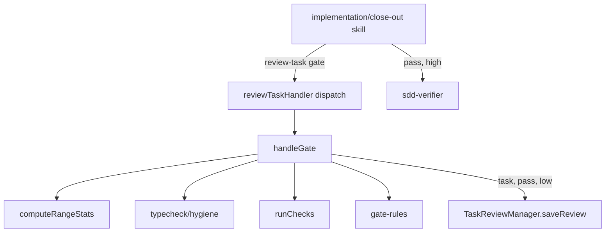

# Design Document

## Overview

`review-gate` adds a third `review-task` action, `gate`: a deterministic verdict (`pass | fail`) and risk score (`low | high`) per task or close-out item, recording a `reviewer: gate` review when low risk. It sits beside `prepare` and `record` (`src/tools/review-task.ts:251-260`), called first by the implementation and close-out skills (Components 8-9), reusing `runProjectTypecheck`, `computeHygieneSignals`, `task-diff.ts`'s git plumbing, `TaskReviewManager` and `agent-rules.md`'s machine-read convention.

## Steering Document Alignment

### Technical Standards (tech.md)
No `tech.md`; stand-in: `docs/harness-efficiency-plan.md:8-9` (tokens first) and its conservative risk default (`:126-128`), implemented by Component 4.

### Project Structure (structure.md)
No `structure.md`; `.spec-workflow/agent-rules.md` fixes the layout: pure logic in `src/core/`, handlers in `src/tools/`, tests beside the module, skills/agents under `harness/`, `plugins/` regenerated.

### Design System (design-system.md)
N/A: no visual surface.

## Architecture

One new handler, `handleGate`, drives a range-statistics function beside `computeTaskDiff`, the two pre-computations, a sequential check runner, a rules module and `TaskReviewManager`. The skills change only routing: gate first, then fix round, tick or verifier, per the gate's two fields.



## Components and Interfaces

### Component 1 — `gate` dispatch and input schema (`src/tools/review-task.ts`)
- **Purpose:** Accept `action: "gate"`, route it; keep `prepare` and `record` unchanged (Req 1.1, 8.1, 8.2).
- **Interfaces:** The `action` enum gains `'gate'` (`:179-183`). New optional properties `baseRef: string`, `commit: string`, `checks: string[]`, `files: string[]`, `root: string` join the schema (`:178-223`). The description's "Two actions" list (`:160-162`) gains a `gate` bullet. The dispatch (`:251-260`) gains `else if (action === 'gate') return handleGate(args, specPath, specName, taskId, projectPath, workspacePath, context)`. `required` stays `['action', 'specName', 'taskId']` (`:224`).
- **Dependencies:** Component 2.
- **Reuses:** `selectRoots` (`src/tools/root-selection.ts:202-221`): `projectPath` is the workflow root, `workspacePath` default `root`. Byte-pinned constants (`:743-791`), `handlePrepare`, `handleRecord`: untouched.

### Component 2 — `handleGate` (`src/tools/review-gate.ts`, new)
- **Purpose:** Run the gate end to end and shape the response (Req 1.2-1.8, 4.5, 5.1, 5.2, 7.2).
- **Interfaces:** `export async function handleGate(args: GateArgs, specPath: string, specName: string, taskId: string, workflowRoot: string, workspacePath: string, context: ToolContext): Promise<ToolResponse>`. Steps:
  1. `root = args.root ?? workspacePath`. Not absolute, or not an existing directory ⇒ `success: false` (1.8).
  2. Read `<specPath>/tasks.md`; missing ⇒ empty task list (D25). `task = parseTasksFromMarkdown(text).tasks.find(t => t.id === taskId)`. Found ⇒ `mode = 'task'`: `getTaskLogs(taskId)` empty ⇒ `success: false` (1.5, `src/tools/review-task.ts:357-366`). Not found ⇒ `mode = 'item'`: no `commit`, no non-empty `files` ⇒ `success: false` (1.5).
  3. `filesOnly = mode === 'item' && !commit && !baseRef && files.length > 0` (D23, R1-2): a task-mode call with only `files` still takes step 5's git path.
  4. Read `PathUtils.getWorkflowRoot(workflowRoot)/agent-rules.md` (`src/core/path-utils.ts:208-210`): ENOENT ⇒ `sensitive = null`; other error ⇒ `success: false`; else `parseSensitivePaths` (2.1-2.4).
  5. Git path (not `filesOnly`): `range = commit ? { commit } : { baseRef: baseRef ?? 'HEAD' }` (D17). `computeRangeStats(root, range)` not ok ⇒ `success: false` with its `message` (D19, R3-1). `touchedAbs = touched.map(p => path.join(root, p))`. Then `Promise.allSettled([runProjectTypecheck(root, workflowRoot, touchedAbs, { enabled }), computeHygieneSignals(touchedAbs)])`, `enabled` from `isTypecheckEnabled(loadSettings(workflowRoot))` (`:431-432`), unwrapped per `:79-113`. `typecheck = worstTypecheckState(results.map(computeTypecheckMethodologyState))` (`:54-73`).
  6. Files-only path: `touched = files`; `missing` = listed paths absent under `root`; `stats = null`; `typecheck = { kind: 'skipped' }`; `hygiene = {}` (1.3).
  7. `checks = await runChecks(root, args.checks ?? [])` (Component 6), after step 5 or 6.
  8. `verdict = decideGate(...)`; `risk = filesOnly ? { risk: 'low', reasons: [] } : scoreRisk(...)` (Component 4); `reasons = [...verdict.reasons, ...risk.reasons].map(truncateLine)` (1.7, R1-3).
  9. Task mode, `gate: pass`, `risk: low` ⇒ `saveReview({ taskId, specName, verdict: 'pass', summary, findings: [], reviewer: 'gate' })` (`src/core/task-review-manager.ts:108-132`) and `recorded = { reviewId, version }`; else `recorded = null`. No prepare marker written or checked (5.1).
  10. Return `success: true`, `GateData`, `nextSteps` by outcome, and `handlePrepare`'s `projectContext` block (`:493-498`).
- **Dependencies:** Components 3-7; `ImplementationLogManager.getTaskLogs` (`src/dashboard/implementation-log-manager.ts:461`); `parseTasksFromMarkdown` (`src/core/task-parser.ts:153`).
- **Reuses:** The `prepare` prelude (`src/tools/review-task.ts:347-366`) and its pre-computations (`:440-449`).

### Component 3 — Sensitive-path list (`src/core/gate-rules.ts`, new)
- **Purpose:** Read and match the machine-read list (Req 2).
- **Interfaces:** `SENSITIVE_PATHS_HEADING = '## Sensitive paths'`. `parseSensitivePaths(markdown: string): string[] | null` returns the bullet entries under the heading to the next `## ` line or EOF, stripped of backticks, whitespace, a leading `./`; non-bullet lines ignored; no heading or bullet ⇒ `null` (D26). `isSensitivePath(relPath: string, entries: string[]): boolean`: an entry ending in `/` matches by prefix, any other by equality; `relPath` is forward-slash, relative to `root` (2.3).
- **Dependencies:** None.
- **Reuses:** The `## PR body` convention (`harness/skills/sdd-implementation-phase/references/briefs.md:211-216`), untouched (2.5); `.spec-workflow/agent-rules.md` holds a six-bullet list.

### Component 4 — Risk and verdict rules (`src/core/gate-rules.ts`)
- **Purpose:** One module of exported constants and predicates, one unit test per rule (Req 3, 4.1-4.3, 4.6).
- **Interfaces:**
  - Constants: `RISK_LINE_THRESHOLD = 200`; `TEST_WORD_RE = /\b(test|tests)\b/i`; `TEST_FILE_BASENAME_RE = /\.(test|spec)\./`; `TEST_DIR_SEGMENTS = ['__tests__', 'tests', 'test']`; `TASK_CHECKBOX_RE = /^\s*[-*]\s+\[([ x\-])\]/` (from `src/core/task-parser.ts:167`); `MAX_TOUCHED_LISTED = 100`; `MAX_LINE_CHARS = 200`; `NO_LIST_REASON = 'sensitive-paths: no list; every path is sensitive'`; `TYPECHECK_STATE_RANK = ['timeout', 'unavailable-other', 'success-with-diagnostics-and-partial-coverage', 'success-with-diagnostics', 'success-partial-coverage', 'unavailable-feature-disabled', 'success-clean-full']` (D20).
  - `taskBlock(tasksMarkdown: string, lineNumber: number): string`: lines from `ParsedTask.lineNumber` (`src/core/task-parser.ts:112`) to the line before the next `TASK_CHECKBOX_RE` match (mirrors `:167-175`, 3.3).
  - `taskNamesTests(block: string): boolean` = `TEST_WORD_RE.test(block)`.
  - `isTestPath(relPath: string): boolean`: the basename matches `TEST_FILE_BASENAME_RE`, or a segment is in `TEST_DIR_SEGMENTS`.
  - `worstTypecheckState(states: { kind: string }[])`: the element with the lowest index in `TYPECHECK_STATE_RANK` (4.6).
  - `scoreRisk(input: RiskInput): { risk: 'low' | 'high'; reasons: string[] }` and `decideGate(input: GateInput): { gate: 'pass' | 'fail'; reasons: string[] }`: the two tables in Data Models.
  - `truncateLine(s: string): string`: the first line, ≤`MAX_LINE_CHARS` chars; applied once per line at Component 2 step 8, the sole site (1.7, R1-3).
- **Dependencies:** None; pure. Typecheck states arrive as `{ kind }` objects from Component 2, avoiding a `core`→`tools` import.
- **Reuses:** `TypecheckDiagnostic.inScope` (`src/core/typecheck.ts:8-15`); `HygieneSignal.pattern` (`src/core/hygiene-signals.ts:4-9`).

### Component 5 — Range statistics (`computeRangeStats`, new function in `src/core/task-diff.ts`)
- **Purpose:** Touched paths and line counts over the selected range, not limited to logged files (Req 1.4, 8.3).
- **Interfaces:** `export type RangeSelector = { commit: string } | { baseRef: string }`; `export type RangeStatsResult = { ok: true; stats: { filesChanged: number; linesAdded: number; linesRemoved: number }; touched: string[] } | { ok: false; message: string }`; `export async function computeRangeStats(root: string, range: RangeSelector): Promise<RangeStatsResult>`.
  - Repo check: `git rev-parse --show-toplevel`; exit 128 outside a repo (probed) ⇒ `{ ok: false, message: 'no git repository at <root>' }` (R3-1).
  - Resolve: `git rev-parse --verify <ref>^{commit}`, `<ref> = commit ?? baseRef ?? 'HEAD'`; not ok ⇒ `{ ok: false, message: '<selector> <ref> does not resolve in <root>' }` (R3-3) — an unborn `HEAD` instead returns `{ ok: true, stats: zero, touched: [] }` (R3-5, D12).
  - `commit`: `git -c core.quotePath=false log --first-parent -1 --numstat --format= --no-renames <commit>` (probe, git 2.43.0, correct for a merge, an ordinary and a root commit — R1-1, raw UTF-8 — R2-1). No sha header, so `:277` never fires.
  - `baseRef` (and the `HEAD` fallback): `git -c core.quotePath=false diff --numstat --no-renames <baseRef>` (working tree vs. ref, committed and uncommitted) plus `git -c core.quotePath=false ls-files --others --exclude-standard`. Each untracked file adds `filesChanged += 1` and `linesAdded += newline count` of its bytes, `0` when unreadable (D18); `root` must gitignore the spec store and generated artifacts (R2-2).
  - `touched` = numstat paths plus untracked paths, sorted, deduplicated, one encoding throughout (R2-1). A rename is a delete plus an add (D16).
- **Dependencies:** `runGit` (`:36-48`) and `parseNumstat` (`:263-291`), both file-private, hence the placement (D15).
- **Reuses:** `scrubbedGitEnv` through `runGit` (`src/core/git-utils.ts:45-51`). `computeTaskDiff` (`:135-234`) unedited.

### Component 6 — Check runner (`src/core/check-runner.ts`, new)
- **Purpose:** Run the caller's commands in order, one output line each (Req 1.3, 4.1a, 4.4, NFR Security).
- **Interfaces:** `CHECK_TIMEOUT_MS = 300_000`; `CHECK_MAX_BUFFER = 16 * 1024 * 1024`; `export type CheckResult = { command: string; status: 'pass' | 'fail' | 'timeout'; exitCode: number | null; output: string }`; `export async function runChecks(root: string, commands: string[], opts?: { timeoutMs?: number }): Promise<CheckResult[]>`; `export function lastLine(stdout: string, stderr: string): string` = the last non-empty line of `stdout + '\n' + stderr`, trimmed, ≤200 chars (D22).
  - Each command: `child_process.exec(command, { cwd: root, env: { ...scrubbedGitEnv(), FORCE_COLOR: '0', NO_COLOR: '1' }, timeout, killSignal: 'SIGTERM', maxBuffer })`, awaited before the next starts. Probe, node v24.13.0: expiry ⇒ `error.killed === true`, `error.signal === 'SIGTERM'`, `error.code === null` ⇒ `timeout`; non-zero exit ⇒ `error.code` is the exit code ⇒ `fail`; `error === null` ⇒ `pass`; `ERR_CHILD_PROCESS_STDIO_MAXBUFFER` ⇒ `fail`, `exitCode: null`.
  - `exec` uses the platform shell; only the strings in `commands` run (NFR Security).
- **Dependencies:** `scrubbedGitEnv`.
- **Reuses:** The env shape of `spawnTsc` (`src/core/typecheck.ts:187`).

### Component 7 — `reviewer` on `TaskReview` (`src/types.ts`, `src/core/task-review-manager.ts`)
- **Purpose:** Tell gate-recorded from agent-recorded reviews (Req 5.3-5.6).
- **Interfaces:** `TaskReview.reviewer?: 'gate' | 'agent'` (`src/types.ts:253-262`). `reviewToMarkdown` writes `reviewer: ${review.reviewer ?? 'agent'}` after the `verdict:` line (`:195`) (D31). `parseReviewMarkdown` reads `get('reviewer')` (`:243-246`) and returns `reviewer: value === 'gate' ? 'gate' : 'agent'` in the object at `:307` (D7).
- **Dependencies:** None.
- **Reuses:** `saveReview` (`:108-132`) and `getNextVersion` (`:62-66`): a later `record` is the next version (5.6). `validateVerdictConsistency` (`:10-27`), `get-task-review` (`:106`, `:129`), `spec-status` (`src/tools/spec-status.ts:179-193`) and dashboard routes (`src/dashboard/multi-server.ts:1913-1960`) are unchanged; `reviewer` travels through all of them with no code change (5.4, 5.5).

### Component 8 — Implementation skill routes on the gate (`harness/`)
- **Purpose:** Gate first; verifier only on high risk (Req 6).
- **Interfaces (edits):**
  - `harness/skills/sdd-implementation-phase/SKILL.md:40-51`: the ledger adds `note "text=gate: task <N> <pass|fail> risk <low|high>"` per gate call, and `task.done` accepts `outcome=<pass|adjudicated|gate>` (6.4, 6.6).
  - `:71-72` Pick: after marking `[-]`, run `git -C <CODE_ROOT> rev-parse HEAD`, keeping the sha as `base=<sha>` in the task-list item per gate call; a Step-0 `[-]` task (`:59-61`) has none (6.1).
  - `:84-88` Step 4 becomes **Gate**: call `review-task` with `action: gate`, `specName`, `taskId`, `baseRef` when known, `checks` per 6.2 (D2). Route: `fail` ⇒ step 5, gate-fix brief, no verifier, then Gate again; `pass`/`low` ⇒ step 6, `rounds=0`, `outcome=gate`; `pass`/`high` ⇒ step 4b, verifier brief with gate results (6.2-6.5).
  - `:89-96` Fix rounds: gate fails count against the cap of 3; after three, the adjudicator then narrow verification via `prepare`/`record`, re-running the failing checks (6.3). A gate `success: false` after `logged: yes` (item 9) is a tool error, not a fix round: the same resume escape `sdd-closeout-phase/SKILL.md:96-98` uses for a stuck batch (R3-4).
  - `references/briefs.md:66-82`: a gate variant of the fix brief: "The gate returned `fail`", and `## Gate output` holding `data.reasons` and `data.checks` verbatim (6.3).
  - `:112-131` verifier brief: a `## Gate results` section (`data.reasons`, `data.checks`, `data.stats`, `data.touched`, `data.typecheck`, verbatim) and line 124 becomes "Run only checks the gate did not run." (6.5). `:133-137` narrow brief adds "re-run the checks listed as failing" (6.3).
  - `harness/agents/sdd-verifier.md:26`: "run the task's checks yourself" becomes "run only the checks the brief says the gate did not run" (6.5).
  - `harness/agents/sdd-implementation-orchestrator.md:9-36` and `harness/agents/sdd-closeout-orchestrator.md:9-24`: add the three `review-task` names per `sdd-verifier.md:12-14` (6.7).
  - Untouched: completion gate (`:126-139`), PR checks gate (`:159-178`), Repair (`:214-224`) (6.8).
- **Dependencies:** Components 1-7, plugin refreshed (`CLAUDE.md`).
- **Reuses:** The cap of 3 (`:89-96`); `PickRow.outcome` is a free string (`src/watch/ledger.ts:94-99`, `:279-281`).

### Component 9 — Close-out skill gates per item (`harness/`)
- **Purpose:** `store` and `home` items never see a verifier; `harness` and `code` items route as tasks do (Req 7).
- **Interfaces (edits):**
  - `harness/skills/sdd-closeout-phase/SKILL.md:39-50`: the ledger adds `note "text=gate: item <id> <pass|fail> risk <low|high>"` (7.7).
  - `:118-120` Implement gains step 3b **Gate**: per item reported `done <sha>`, call `gate` with `taskId: <id>`, `commit: <sha>`, `root: <landing root>`, `files` = paths the item text or `Target:` line names, `checks` = the class's checks (`references/briefs.md:5-14`). A `home` item passes `files`, no `commit`; one naming no path gets no gate call (R4-2, D24). `to-do`/`skipped` items skip the gate (7.5).
  - `:121-124` Verify: spawn `sdd-verifier` only for `harness`/`code` items that are `pass` and `high`; the brief lists those; none ⇒ no spawn. A `store`/`home` item is `ok` on `pass` whatever its risk (7.3, 7.4, 7.6).
  - `:125-131` Fix rounds: a `gate: fail` item enters the fix brief with `data.reasons`/`data.checks` as its line, same cap, adjudication (7.3, 7.4).
  - `references/briefs.md:112-138` verify brief: a `## Gate results` block per item and the sentence "Do not re-run the gate's checks."; `:140-158` fix brief accepts `gate:` where it shows `verifier:`.
- **Dependencies:** Component 2 item mode.
- **Reuses:** The class table (`SKILL.md:66-72`); the commit script (`briefs.md:44-60`) yields one sha per item.

### Component 10 — Docs and plugin copies
- **Purpose:** Req 9.3, 9.4.
- **Interfaces:** `docs/TOOLS-REFERENCE.md:399-437`: the `action` row gains `'gate'`; rows for `baseRef`, `commit`, `checks`, `files`, `root`; a **Gate** paragraph naming `data` fields and routing rules. `docs/SDD-HARNESS.md:75-78`: the per-task sentence gains "the gate runs first; `sdd-verifier` only on `risk: high`"; `:98-113` gains the item-gate sentence; `:233-238` gains a third bullet, `## Sensitive paths`. Plugin copies regenerate per Testing Strategy (`scripts/sync-plugin-assets.cjs:1-12`).
- **Dependencies:** None.
- **Reuses:** None.

## Data Models

### GateArgs (tool input)
```ts
type GateArgs = {
  action: 'gate'; specName: string; taskId: string;
  baseRef?: string;     // revision
  commit?: string;      // one sha
  checks?: string[];    // commands, run in order
  files?: string[];     // paths relative to root
  root?: string;        // absolute directory
  projectPath?: string; // unchanged, ignores root
};
```

### GateData (response `data`)
```ts
type GateData = {
  gate: 'pass' | 'fail';
  risk: 'low' | 'high';
  reasons: string[];                                   // one per fired rule, ≤200 chars
  checks: CheckResult[];
  stats: { filesChanged: number; linesAdded: number; linesRemoved: number } | null;
  touched: { paths: string[]; total: number };        // ≤100 paths, relative to root
  typecheck: TypecheckMethodologyState | { kind: 'skipped' };
  hygiene: Partial<Record<'console' | 'todo' | 'fixme' | 'debugger', number>>;
  recorded: { reviewId: string; version: number } | null;
};
```
No diff body, no file contents (1.7). `CheckResult`, `RangeSelector`, `RangeStatsResult`: Components 5 and 6.

### Risk rules (`scoreRisk`; the inputs behind each outcome, R4-1)
| Rule | Fires when | Reason line |
| --- | --- | --- |
| a `sensitive-path` | `sensitive === null`, or a `touched` path satisfies `isSensitivePath` | `NO_LIST_REASON`, or `sensitive-path: <path> matches <entry>` |
| b `line-count` | `stats.linesAdded + stats.linesRemoved > 200` | `line-count: <n> changed lines exceed 200` |
| c `tests-not-touched` | task mode, `taskNamesTests(block)`, and no `touched` path satisfies `isTestPath` | `tests-not-touched: task names tests; no touched path is a test file` |
| d `no-diff` | `touched.length === 0` | `no-diff: no path changed in the range` |
| e `typecheck-unavailable` | worst state is `unavailable-other` or `timeout` | `typecheck-unavailable: <reason or timeout>` |
| f `no-range` | task mode and `baseRef`, `commit`, `files` all absent | `no-range: ranged against HEAD; pass baseRef` |
| g `hygiene-rejected` | `unwrapHygiene` reported a rejection | `hygiene-rejected: <message>` (D21) |

`risk` is `high` when any row fires. Item mode sets c/f false. Files-only skips `scoreRisk`, reports `low` (7.2).

### Gate rules (`decideGate`)
| Rule | Fires when | Reason line |
| --- | --- | --- |
| a `check-failed`, `check-timeout` | a `CheckResult.status` is not `pass` | `check-failed: <command> exit <code> — <output>`, or `check-timeout: <command> after 300 s` |
| b `typecheck-diagnostic` | a result with `status: 'success'` holds a diagnostic with `inScope: true` | `typecheck-diagnostic: <file>:<line> <code> (+<n> more)` |
| c `debugger` | a hygiene signal has `pattern: 'debugger'` | `debugger: <file>:<line>` |
| d `file-outside-list` | `files` given and a `touched` path is not in the normalised `files` list | `file-outside-list: <path>` |
| e `listed-file-missing` | files-only and a listed path is absent under `root` | `listed-file-missing: <path>` |

`console`, `todo` and `fixme` never fire (4.2). `unavailable` and `timeout` never fire (4.3). Rules d/e normalise `files` like `touched`: forward-slash, root-relative, `./` stripped (R1-4).

### Recorded review (task mode, `pass`, `low`)
A `TaskReview` with `verdict: 'pass'`, `findings: []`, `reviewer: 'gate'` and `summary` = `gate pass, risk low: <filesChanged> files, +<added>/-<removed>; checks <passed>/<total> pass; typecheck <kind>; hygiene console <n> todo <n> fixme <n>` (D28).

## Error Handling

1. **`root` not absolute or not a directory:** `success: false`; message names the path; nothing runs (1.8).
2. **No git repository at `root` (git path):** `computeRangeStats`'s repo check not ok ⇒ `success: false`, message names `root`; files-only is exempt (1.3, R3-1).
3. **`baseRef` or `commit` does not resolve:** `computeRangeStats`'s resolve step not ok ⇒ `success: false`, message `'<selector> <x> does not resolve in <root>'` naming the argument given, or `HEAD` on the fallback (D19, R3-3).
4. **`taskId` unknown (or `tasks.md` missing) with no `commit` or `files`:** `success: false`; message: an item gate needs `commit` or `files` (1.5, 1.8, D25).
5. **Task without an implementation log:** `success: false`, the `prepare` text (`src/tools/review-task.ts:357-366`).
6. **`agent-rules.md` unreadable for a reason other than ENOENT:** `success: false` (1.8). ENOENT ⇒ every path sensitive, `NO_LIST_REASON` (2.4).
7. **A check exceeds 300 s or 16 MiB:** `status: 'timeout'` or `fail` with `exitCode: null`; the gate fails; later checks run (4.4).
8. **Typecheck rejects or times out:** degraded to `unavailable` or `timeout` ⇒ risk high, gate unaffected (3.1e, 4.3). **Hygiene rejects:** risk high (D21).
9. **`saveReview` throws:** `success: false` with the cause; written in one call (`src/core/task-review-manager.ts:126`); no partial review remains.
10. **`gate: fail`:** `risk` is computed, returned; `recorded: null` (4.5).

## Testing Strategy

- **Unit** (`vitest`; `vitest.config.ts:7` includes `src/**/*.test.ts`):
  - `src/core/__tests__/gate-rules.test.ts` (new): one `it` per row of both rule tables; `parseSensitivePaths` for heading absent, no bullet, backticks, a non-bullet line, a `dir/` prefix entry, an exact entry; `isTestPath`; `taskBlock` (a heading doesn't bound; a checkbox line does); `worstTypecheckState` order.
  - `src/core/__tests__/check-runner.test.ts` (new): pass, non-zero exit, timeout (`node -e "setTimeout(()=>{}, 5000)"` with `timeoutMs: 100`), `lastLine`'s 200-character cut, sequential order.
  - `src/core/__tests__/task-diff.test.ts` (extend; git helpers at `:23-41`, `execFile` mock at `:3-9`): `computeRangeStats` for root/later/merge commits (first-parent only), `baseRef` with committed, uncommitted and untracked changes, an ignored file excluded, a rename as two paths, a bad ref ⇒ `ok: false`.
  - `src/core/__tests__/task-review-manager.test.ts` (extend, round-trip suite at `:207`): `reviewer: 'gate'` round-trips; a keyless file parses `agent`; a save without `reviewer` serialises `agent`.
  - `src/tools/__tests__/get-task-review.test.ts` (extend, `:85`): `data.review.reviewer` present.
- **Integration** (`src/tools/__tests__/review-gate.test.ts`, new; fixture per `review-task.test.ts:63-113`, `gitInit` per `task-diff.test.ts:23-41`, typecheck mocked per `:13-20`): a task gate, `baseRef` ⇒ `pass`/`low`, review file `reviewer: gate`, no `.prepare-` marker; an item gate (`taskId: 'P3'`, `commit`) ⇒ no review file; a files-only gate, one missing path ⇒ `fail`, `stats: null`, `typecheck.kind === 'skipped'`; each Error Handling 1-6 cause ⇒ `success: false`; an extra touched path, `files` given, ⇒ `file-outside-list`; `record` after a gate review ⇒ `version: 2`; `reasons`/`checks[].output` at most 200 characters, no `diff` key in `data`.
- **End-to-end** (`src/tools/__tests__/review-gate.e2e.test.ts`, new; Req 9.2, D29): one temp dir, both roots; `gitInit`; `.spec-workflow/agent-rules.md` names `src/auth.ts` sensitive; typecheck `feature-disabled` (`adversarial-settings.json`); `tasks.md`: tasks 1-3 `[-]`; `C0` adds a `.gitignore` (ignoring `.spec-workflow`) plus `src/auth.ts` (R2-2, R3-2). (1) `docs/a.md`, logged, `gate { taskId: '1', baseRef: C0 }` ⇒ `pass`/`low`, `recorded` set; `get-task-review` ⇒ `reviewer: 'gate'`; commit `C1`. (2) edit `src/auth.ts`, logged, `gate { taskId: '2', baseRef: C1 }` ⇒ `high` (`sensitive-path: src/auth.ts`), `recorded: null`; `prepare`/`record` `pass` ⇒ v1; commit `C2`. (3) `docs/b.md`, logged, `gate { taskId: '3', baseRef: C2, checks: [D29's failing check] }` ⇒ `fail`, `checks[0].output === 'boom'`, no review file; re-gate, passing check ⇒ `pass`, `recorded` set. All `[x]`; `specStatusHandler` ⇒ `reviewCoverage.reviewed === 3` (`spec-status.test.ts:80-89`); `npm test` green = PR checks gate (`.github/workflows/ci.yml:12`).
- **Harness:** `node scripts/sync-plugin-assets.cjs`, `npm run check:plugin-assets`, `claude plugin validate . --strict`.

## Decisions taken in this document

D1-D12 are the requirements' decisions; numbering continues here.

- D13 — Handler file: `review-task.ts`, or new `review-gate.ts`; chosen new, so byte-pinned `review-task.ts` changes only schema and dispatch; reusing `:54-73`/`:79-113` makes a benign, call-time-only import cycle (R2-3).
- D14 — Module split: one module, or rules plus a runner; chosen `gate-rules.ts` (pure, one test per rule, 3.4) and `check-runner.ts`, so rules test without spawning.
- D15 — Range function placement: a new file, or beside `computeTaskDiff`; chosen `task-diff.ts`, since `runGit`/`parseNumstat` stay private.
- D16 — Git commands: those in Component 5, `--no-renames` and `-c core.quotePath=false` throughout (R2-1); a rename counts twice, erring high.
- D17 — `HEAD` fallback: the literal `git diff HEAD` of 1.4, or the `baseRef` path with `HEAD`; chosen the latter (untracked included), since 3.1f marks it high. RE-DECIDED 1.4.
- D18 — Untracked line count: `git add -N`, or read and count newlines; chosen the read — the index stays untouched.
- D19 — Unresolvable `baseRef`/`commit`: risk high, or `success: false`; chosen the latter: a caller error.
- D20 — Worst typecheck state: the `TYPECHECK_STATE_RANK` order (Component 4), so 3.1e/4.1b read one reported state.
- D21 — Hygiene rejection: ignore as `prepare` does, or risk high; chosen risk high per NFR Reliability. RE-DECIDED 3.1 (rule g).
- D22 — Check output: stdout then stderr, last non-empty line; env as Component 6; a 16 MiB overflow is `fail`, matching `spawnTsc`.
- D23 — Files-only detection: `files` non-empty with no `commit`/`baseRef`, item mode only (R1-2); `[]` counts as absent, so it never yields a trivial pass and a task-mode call with no range gets real pre-computations.
- D24 — `home` item naming no path (R4-2): trivial pass, or no gate call; chosen no gate call, closed as today — the tool never sees `files: []`.
- D25 — `tasks.md` missing: always `success: false`, or treat as no tasks; chosen no tasks: an item gate runs, a task gate fails with cause.
- D26 — Sensitive entry normalisation and section end as Component 3.
- D27 — Response shapes: `data.touched` as `{ paths, total }`, `data.hygiene` as counts by pattern, both bounded.
- D28 — Recorded summary: one fixed line (Data Models), so the dashboard shows rules, counts and checks.
- D29 — E2E inputs (R4-1): every case passes the previous commit as `baseRef`; case 3's check is a `node -e` one-liner printing `boom`, exiting 1, so case 1 is `low` by construction.
- D30 — Typecheck `allFiles` = touched paths absolutised under `root`, so `inScope` means "in this change".
- D31 — `reviewer` written on every new review file (`agent` when absent), so only pre-existing files rely on the parser default.

## Scope notes

- No `## Checks` parsing from `agent-rules.md` (D2): the skill assembles `checks`.
- Windows not verified (`exec` uses `ComSpec`; CI is Ubuntu-only).
- The version bump and release happen after merge (9.5).
- The `debugger` hygiene scan is whole-file and extension-blind: a `store` item's commit with the word in prose can fail the gate; uncarved (4.1c, R1-5).

## Revision History

- **v1** (2026-09-14) — Initial draft.
- **v2** (2026-09-14) — Round-1 adversarial response (adversarial-analysis-design.md, verdict iterate 2/1/2).
  - **R1-1 — Accepted (MUST_FIX).** Component 5's commit-mode command is now `git log --first-parent -1 --numstat --format= --no-renames`, probed correct for merge, ordinary and root commits.
  - **R1-2 — Accepted (MUST_FIX).** `filesOnly` (step 3, D23) now requires item mode, so a task-mode call with only `files` gets the real pre-computations.
  - **R1-3 — Accepted (SHOULD_FIX).** Step 8 now maps `reasons` through `truncateLine`, the sole truncation site.
  - **R1-4 — Accepted (MINOR).** Rules d/e now normalise `files` like `touched` before comparing.
  - **R1-5 — Accepted (MINOR).** Scope notes now flag the whole-file `debugger` scan's effect on prose `store` items; unfixed, since 4.1c carves out no path.
- **v3** (2026-09-14) — Round-2 adversarial response (adversarial-analysis-design-r2.md, verdict iterate 0/2/1).
  - **R2-1 — Accepted (SHOULD_FIX).** Commit-mode `git log` and `git ls-files` now carry `-c core.quotePath=false`; re-probed on git 2.43.0 with a non-ASCII path, all three producers emit raw UTF-8.
  - **R2-2 — Accepted (SHOULD_FIX).** Component 5 states the gitignore assumption; the e2e fixture adds a `.gitignore` before commit `C0`.
  - **R2-3 — Accepted (MINOR).** D13 now names the `review-task ↔ review-gate` import cycle and why it is benign.
- **v4** (2026-09-14) — Round-3 adversarial response (adversarial-analysis-design-r3.md, verdict iterate 0/1/4).
  - **R3-1 — Accepted (SHOULD_FIX).** `computeRangeStats` now checks repo existence before resolving, each step with its own message.
  - **R3-2 — Accepted (MINOR).** Commit `C0` now adds `.gitignore` too, so it stops re-entering `touched`.
  - **R3-3 — Accepted (MINOR).** The resolve message now names `commit`, `baseRef` or `HEAD`, not always "baseRef".
  - **R3-4 — Accepted (MINOR).** Component 8 routes a post-checks `success: false` to close-out's stuck-batch resume escape.
  - **R3-5 — Accepted (MINOR).** An unborn `HEAD` now yields a clean empty range, so rule f still scores `high` (D12/AC 6.1).
