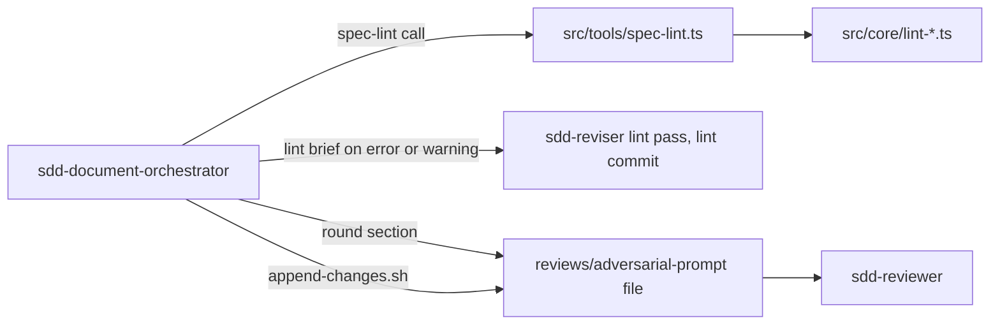

# Design Document

Document version: v3

## Overview

`spec-lint` is one new MCP tool (`src/tools/spec-lint.ts`) over six pure `src/core/lint-*.ts` modules that check one spec document and return findings as `{ file, line, column?, rule, severity, message }`. It takes roots from `selectRoots` and reuses the MDX validator, tasks validator, task-parser regexes, `truncateLine`. The document-phase skill gains a Lint step after every checkpoint commit, a lint brief for `sdd-reviser`, and a script that appends the version diff to the round prompt.

## Steering Document Alignment

### Technical Standards (tech.md)
No `tech.md`; the design follows the code: ESM `.js` imports (`package.json` `"type": "module"`), `core` never imports `tools` (`src/core/gate-rules.ts:1-9`), vitest suites beside the module (`.spec-workflow/agent-rules.md` Layout).

### Project Structure (structure.md)
No `structure.md`; new server files go to `src/core/lint-*.ts` and `src/tools/spec-lint.ts` with tests beside them; harness edits go to `harness/`, copied to `plugins/` by `scripts/sync-plugin-assets.cjs:1-13`.

### Design System (design-system.md) — if applicable
N/A.

## Architecture

The tool is a thin handler: validate arguments, select roots, read the document and `agent-rules.md`, call one pure function per rule family, sort, cap, shape the response. The rule modules never import `tools`, never spawn, read cited files through one per-call cache (2.7). The harness gains two seams: the Lint step after a checkpoint commit, a script that appends git output to the prompt file so the orchestrator never holds a diff.



## Components and Interfaces

### Component 1 — `spec-lint` tool and registration (`src/tools/spec-lint.ts`, `src/tools/index.ts`, `src/tools/root-selection.ts`)
- **Purpose:** Requirements 1.1-1.9, 3.1-3.2, the `agent-rules.md` read of 6.3, NFR Security.
- **Interfaces:** `export const specLintTool: Tool` — `name: 'spec-lint'`, properties `specName` (string), `phase` (string, `enum: ['requirements', 'design', 'tasks']`), `projectPath` (string, the override text of `src/tools/adversarial-review.ts:36-39`), `required: ['specName', 'phase']`, `additionalProperties: false`, `annotations: { title: 'Spec Lint', readOnlyHint: true }` (shape: `src/tools/get-task-review.ts:6-42`). `export async function specLintHandler(args: any, context: ToolContext): Promise<ToolResponse>`, in order: (1) `specName` non-empty, `phase` in the enum, else `success: false` naming the three values (`src/tools/adversarial-review.ts:63-68`); (2) `const { workflowRoot, workspacePath } = selectRoots(args, context)` (`src/tools/root-selection.ts:202-221`); (3) `specDir = PathUtils.getSpecPath(workflowRoot, specName)`, `docPath = PathUtils.safeJoin(specDir, phase + '.md')`, `readFile(docPath, 'utf-8')`, any error is `success: false` naming `docPath`; (4) `agent-rules.md` at `path.join(PathUtils.getWorkflowRoot(workflowRoot), 'agent-rules.md')` (`src/tools/review-gate.ts:176-188`): ENOENT keeps the defaults, any other error is `success: false`, `Failed to read agent-rules.md: …`; (5) `parseWordCaps` (Component 6); (6) `validateMarkdownForMdx(content)` (`src/core/mdx-validator.ts:26-45`; `src/tools/approvals.ts:369-391`), each issue to `{ rule: 'mdx', severity: 'error', line, column, message }`; (7) `checkCitations` with bases `[workspacePath, workflowRoot, specDir]`; (8) by phase — `requirements`: `checkEars`, `checkDocWords`; `design`: `checkDocWords`; `tasks`: `checkTasksFormat`, `checkRequirementIds`, `checkTaskWords`, `checkCoverage`, `checkBridges`, with `requirements.md` and `design.md` read from `specDir`, any read error degraded to the `info` finding of 5.4 or 7.3; (9) `finishLint` and `{ success: true, message, data, projectContext }`, `projectContext = { projectPath: workflowRoot, workflowRoot: PathUtils.getWorkflowRoot(workflowRoot), specName, dashboardUrl: context.dashboardUrl }` (`src/tools/review-gate.ts:293-298`), no `nextSteps`.
- **Registration:** `specLintTool` appended after `getTaskReviewTool` in `registerTools()` (`src/tools/index.ts:16-31`); `case 'spec-lint'` before `default` in `handleToolCall` (`:33-92`). The comment at `src/tools/root-selection.ts:36-40` names five tools, `spec-lint` last, drops "requirement 3.8" (1.3).
- **Dependencies:** Components 2-7; `selectRoots`; `PathUtils`; `validateMarkdownForMdx`.
- **Reuses:** Cited above.

### Component 2 — Finding types and response assembly (`src/core/lint-types.ts`)
- **Purpose:** Requirements 1.6-1.8; the rule-id union and the per-phase `checks` list.
- **Interfaces:** The types in Data Models. `export const CHECKS_BY_PHASE: Record<LintPhase, LintRule[]>` — every phase: `citation-path`, `citation-range`, `citation-unchecked`, `citation-bare`, `citation-identifier`, `mdx`, `caps-invalid`; `requirements` adds `ears-shape`, `doc-words`; `design` adds `doc-words`; `tasks` adds `tasks-format`, `task-requirement-id`, `task-requirement-unchecked`, `task-words`, `coverage-component`, `coverage-unchecked`, `bridge-missing`. `export function finishLint(findings: LintFinding[], phase: LintPhase, caps: LintCaps): LintData` sets every `file` to `<phase>.md`, applies `truncateLine` (`src/core/gate-rules.ts:164-168`, `MAX_LINE_CHARS = 200` at `:42-43`) to every `message`, stable-sorts by `line` then `rule` (string compare), computes `summary`. `lintMessage(specName, phase, summary)` renders the 1.8 message.
- **Dependencies:** `truncateLine`.
- **Reuses:** `src/core/gate-rules.ts:164-168`.

### Component 3 — Markdown scanning helpers (`src/core/lint-markdown.ts`)
- **Purpose:** The shared text model: fence masking (2.1), blocks (2.5), acceptance criteria (4.1, 5.3), task blocks (6.2, 7.2, 7.4).
- **Interfaces:** `export function fencedLines(lines: string[]): boolean[]` — `true` from a line matching `^\s*```` to the next such line, inclusive. `export function blocks(lines, fenced): Block[]` — a block starts at a non-blank unfenced line after a blank or fenced line, or at any line matching `^\s*([-*+]|\d+\.)\s` (list item), `^\s*\|` (table row) or `^#{1,6}\s` (heading); it ends before the next start or blank line (D3). `export function criteria(lines): Criterion[]` — under each `^###\s+Requirement\s+(\d+)\b` line (requirement `N`, `null` before any) and each line whose trimmed text is `#### Acceptance Criteria`, every `^(\d+)\.\s+(.*)$` line (4.1's `^\d+\.\s`) up to the next `^#{1,6}\s` line, continuation lines (non-blank, not numbered, not a heading) joined by one space. `export function taskBlocks(lines): TaskBlock[]` — from each line matching `^\s*[-*]\s+\[([ x\-])\]` (`src/core/task-parser.ts:167`) to the line before the next checkbox line, the next `^##\s` line, or EOF (6.2, requirements D6); `id` from `^(\d+(?:\.\d+)*)\s*\\?\.?\s+` on the text after the checkbox (`:204`), `null` when absent; `promptLines` = the first line containing `_Prompt:` plus, when that line does not end with `_`, its continuation lines up to a blank line or a `^[-*]\s`, `^Files?:` or `^Purpose:` line (`src/core/task-parser.ts:233-259`).
- **Dependencies:** None.
- **Reuses:** The task-parser regexes, copied as `src/core/gate-rules.ts:36-37` copies the checkbox regex.

### Component 4 — Citation checks (`src/core/lint-citations.ts`)
- **Purpose:** Requirements 2.1-2.7, 1.9.
- **Interfaces:** `export const CITATION_RE = /(?<![\w./-])(\/?(?:[\w.-]+\/)*[\w.-]+\.[A-Za-z]{1,6}):(\d+)(?:-(\d+))?(?![\w-])/g` — matches `../x.ts:3` and `/etc/hosts:1` (`citation-path` errors); not `localhost:3000`, `v1.2:3`, `https://x.com:443` (lookbehind rejects a token after `/`) or `path:line`. `export const BARE_RANGE_RE = /`:(\d+)(?:-(\d+))?`/g`. `export function extractCitations(lines, fenced, blocks): Citation[]` scans unfenced lines, inline code included; a bare range resolves against the block's nearest earlier path citation, else `citation-bare` at `info` (2.2). `export function identifierTokens(text): string[]` applies 2.6's filters to every `` `…` `` span: strip a trailing `\([^)]*\)$`, take the last `.`-segment, keep it when it matches `^[A-Za-z_$][A-Za-z0-9_$]{2,}$`. `export async function checkCitations(lines, bases: string[]): Promise<LintFinding[]>` — per distinct path: containing `..` or starting with `/` is `citation-path` at `error` with no read (1.9); else `PathUtils.safeJoin(base, path)` (`src/core/path-utils.ts:183-206`) and `fs.stat` per base in order, first existing wins (2.3); none is `citation-path` at `error`; a directory, a read error, or a buffer where `isUtf8` is false is `citation-unchecked` at `info`; else read once into a `Map<string, string[]>` keyed by path (2.7), split on `\n`, a trailing empty element dropped. The 2.4 range rule gives `citation-range` at `error`. For every block with at least one in-range resolved citation, each identifier token absent from the joined text of every such range is `citation-identifier` at `warning` on the block's first line, naming identifier and citations checked; a block whose citations all failed gets no identifier check (D4).
- **Dependencies:** Component 3; `PathUtils.safeJoin`; `node:fs/promises`; `isUtf8` (node 18.14+; probe 2026-09-14 on v24.13.0: `isUtf8(Buffer.from([0xff]))` is `false`).
- **Reuses:** The bare-range convention at `.spec-workflow/specs/review-gate/tasks.md:60`.

### Component 5 — EARS shape (`src/core/lint-ears.ts`)
- **Purpose:** Requirements 4.1-4.3.
- **Interfaces:** `export function checkEars(criteria: Criterion[]): LintFinding[]` — a criterion passes when `/\bSHALL\b/` matches and, when `/^(WHEN|IF)\b/` matches, `/\bTHEN\b/` also matches; else `ears-shape` at `warning` on the item's line, naming criterion and missing word. Called for `requirements` only (4.3).
- **Dependencies:** Component 3.
- **Reuses:** None.

### Component 6 — Word counts and caps (`src/core/lint-words.ts`)
- **Purpose:** Requirements 6.1-6.3.
- **Interfaces:** `export const DEFAULT_CAPS: LintCaps = { requirements: 3500, design: 4000, task: 150 }` (`src/markdown/templates/requirements-template.md:3`, `design-template.md:3`, `tasks-template.md:3`). `export function wordCount(text): number` = `0` for blank text, else `text.trim().split(/\s+/).length` (probe 2026-09-14, GNU coreutils 9.4, UTF-8 locale: equals `wc -w` on ASCII whitespace, NBSP, em space and zero-width space; D5). `export function checkDocWords(content, cap): LintFinding[]` — `doc-words` at `warning` on line 1, `<count> words, cap <cap>`. `export function checkTaskWords(blocks: TaskBlock[], cap): LintFinding[]` — words of each block's lines minus `promptLines`; over the cap is `task-words` at `warning` on the checkbox line, `task <id | unnumbered>: <count> words, cap <cap>`. `export function parseWordCaps(markdown): { caps: Partial<LintCaps>; invalid: { key: string; value: string }[] }` mirrors `parseSensitivePaths` (`src/core/gate-rules.ts:73-93`): the `## Word caps` heading by trimmed equality (`:77`), bullets `^\s*[-*]\s+(.+)$` (`:87`) to the next `^\s*##\s` line (`:86`), split on its first `:` into a lower-cased key, trimmed value; a key in `requirements | design | task` with a value matching `^[1-9]\d*$` sets that cap; any other value for a known key is `invalid`; unknown keys ignored. The handler emits one `caps-invalid` at `info` on line 1 per `invalid` entry, naming key and value.
- **Dependencies:** Component 3.
- **Reuses:** The bullet scan of `parseSensitivePaths`, mirrored not called (requirements R1-7).

### Component 7 — Tasks checks (`src/core/lint-tasks.ts`)
- **Purpose:** Requirements 5.1-5.4, 7.1-7.4.
- **Interfaces:** `export function checkTasksFormat(content): LintFinding[]` — `validateTasksMarkdown(content)` (`src/core/task-validator.ts:31-248`); each `errors` entry is `tasks-format` at `error`, each `warnings` entry at `warning`, with the validator's 1-based `line` (`:51`) and `message` verbatim (5.1, D8); the missing-id error (`:104-112`) and the prompt warnings (`:205-229`) arrive this way only (5.2). `export function requirementIndex(lines): Map<number, Set<number>>` from Component 3's `criteria`: requirement `N` to its item numbers; every `### Requirement N` heading is a key. `export function checkRequirementIds(lines, index | null): LintFinding[]` — for each unfenced line containing `_Requirements:` and not `_Prompt:` (`src/core/task-parser.ts:264`), the value of `/_Requirements:\s*([^_]+?)_/` (`:266`) split on `,` and trimmed: a token starting `NFR` passes; `^\d+$` must be a key; `^(\d+)\.(\d+)$` a key with that item; a miss is `task-requirement-id` at `error` naming the token; any other token is `task-requirement-unchecked` at `info`; `index === null` is one `task-requirement-unchecked` at `info` on line 1, no per-line check (5.4). `export function designComponents(designLines): { heading: string; label: string; line: number }[] | null` — `null` when no trimmed line is `## Components and Interfaces`; else every `^###\s+(.+)$` up to the next `^##\s` line (`.spec-workflow/specs/review-gate/design.md:34-36`, `:128-134`); `label` is the `^Component\s+\d+` match when present, else the heading up to the first ` — `, `:` or `(`, trimmed, backticks removed (D7). `export function checkCoverage(taskBlocks, components | null): LintFinding[]` — `null` is one `coverage-unchecked` at `info` on line 1 (7.3); a label no task block's joined text (prompt included) matches with `new RegExp('\\b' + escape(label) + '\\b', 'i')` is `coverage-component` at `error` on line 1, naming heading and its `design.md` line. `export function checkBridges(taskBlocks): LintFinding[]` — per block with an id, every `/\btask\s+(\d+(?:\.\d+)*)/gi` match whose id sorts after the block's by numeric segments (segment-wise, a shorter prefix first) while the lower-cased block contains none of `bridge`, `stub`, `cast`, `shim`, `placeholder` as substrings is `bridge-missing` at `warning` on the checkbox line, naming both ids (7.4; `.spec-workflow/specs/review-gate/tasks.md:50-51` passes).
- **Dependencies:** Component 3; `validateTasksMarkdown`.
- **Reuses:** `src/core/task-parser.ts:264-271`; `.spec-workflow/specs/review-gate/tasks.md:34` (`NFR Security`), `:20` (`design Component 5`).

### Component 8 — Document skill Lint step (`harness/skills/sdd-document-phase/SKILL.md`, `references/briefs.md`, `references/cleanup.md`, `harness/agents/sdd-document-orchestrator.md`)
- **Purpose:** Requirements 8.1-8.9.
- **Interfaces:** A new section `## Lint step` between Step 1 and Step 2 (`SKILL.md:98-100`, D11): (1) call `spec-lint` with `specName: <SPEC>`, `phase: <PHASE>`, no `projectPath` (`SKILL.md:27`); a failure naming an unknown tool (`src/tools/index.ts:75-76`) records `note text="spec-lint unavailable; lint skipped"` (`formats.md:177`) and ends the step with `LINT = skipped`; (2) keep `LINT = { checks: data.checks, findings: data.findings }` in the task list, numbering `data.findings` `L-1, L-2, …` in file order; when `summary.error + summary.warning` is 0, `LINT.open` = every `info` finding and the step ends here; (3) write `reviews/lint-brief-<PHASE>-v<D>.md` from the lint brief template; (4) spawn `sdd-reviser` with `Read and execute the instructions in <brief path>` between `spawn.start` and `spawn.end` carrying `role="lint v<D>"` and `round=<A+1>` (`formats.md:172-173`); (5) spot-check `grep -n 'Lint pass' <document>`; (6) commit `docs(sdd): <SPEC> <PHASE> v<D> lint` through the commit script (`cleanup.md:62-85`), D unchanged; (7) if not ended at (2): `LINT.open` = every `L-n` the `v<D>` Lint-pass bullet (rule 4) names rejected, plus every `info` finding (D10); at most once per version (8.5). Each call site gains "Run the Lint step." right after its `D` update, not its commit: `SKILL.md:98`, `:129`, `:144`, `:228`; Step 4a, Step 5 untouched (8.1, 8.9). The lint brief template is a new `## Lint brief — reviews/lint-brief-<PHASE>-v<D>.md` block after the reviser brief (`briefs.md:148-206`), copied from it with: title `# Lint brief — <SPEC> <PHASE> v<D>` (`:151`); Job `Fix the lint findings below in v<D> of <document path> in place` (`:156`); Inputs drop the Findings, Memory and `adversarial-response` bullets (`:169-176`, D12) for `- Findings: the list under ## Revision input`; `## Revision input` (`:178-180`) holds one line per finding, `L-n (<severity>, <rule>, line <line>): <message>`, from `data.findings` only (`sdd-document-orchestrator.md:46`); rule 4 (`:190-195`) becomes `Edit v<D> in place. Add no version line. Append under the v<D> Revision History line one nested bullet: - **Lint pass.** <n> fixed; rejected: <none | L-n reason, …>`; the other rules stay. `cleanup.md:19-20` gains `reviews/lint-brief-<PHASE>-v*.md` (8.7). `sdd-document-orchestrator.md:19-33` gains `mcp__spec-workflow__spec-lint`, `mcp__plugin_spec-workflow-mcp_spec-workflow__spec-lint`, `mcp__plugin_spec-workflow-mcp-with-dashboard_spec-workflow__spec-lint` after the `spec-index` triple (8.8; pattern `:22-24`).
- **Dependencies:** Component 1 on the running server (plugin re-install, Testing Strategy).
- **Reuses:** Cited above.

### Component 9 — Round prompt: Machine-verified, Changes, the changes script (`references/briefs.md`, `references/cleanup.md`, `SKILL.md`, `harness/agents/sdd-reviewer.md`)
- **Purpose:** Requirements 9.1-9.7; the r4 deferred finding (D2).
- **Interfaces:** Two bullets after `- Version under review: v<D>.` (`briefs.md:107`):

```markdown
- Machine-verified: <LINT skipped: omit this bullet.> `spec-lint` ran <LINT.checks> on v<D>
  before the lint pass fixed anything. A rule with no finding listed here passed only that
  pre-fix run: verify meaning only for it. Re-verify only citations the v<D> lint commit
  changed: <no lint pass ran | D = 1: the whole `## Changes since` section below | D > 1: the
  `## Lint commit` section below>. Still open (error = MUST_FIX candidate, warning = your
  call, info = a note): <none | one per line `L-n (<severity>, <rule>, line <line>): <message>`>.
- Changes: the diff from <D = 1: the `docs(sdd): <SPEC> <PHASE> v1` checkpoint | the newest
  commit whose subject holds `docs(sdd): <SPEC> <PHASE> v<D-1>`> to the working tree follows
  as `## Changes since <short sha>`, cut at 500 lines.
```

  Step 2 item 3 (`SKILL.md:106-108`) gains, after the overwrite: "Run `bash /tmp/scratchpad/sdd/<SPEC>/append-changes.sh <D> <promptOutputPath>`; read only its exit code." The script, written once per run (`cleanup.md:64-65`), is a new `## Round prompt changes` section of `cleanup.md` (D13):

```bash
#!/bin/bash
set -e
cd "<SPEC_STORE_REPO>"
doc=".spec-workflow/specs/<SPEC>/<PHASE>.md"; D="$1"; prompt="$2"; cap=500
if [ "$D" = 1 ]; then want=1; pat='^docs\(sdd\): <SPEC> <PHASE> v1$'
else want=$((D-1)); pat="^docs\\(sdd\\): <SPEC> <PHASE> v${want}( |$)"; fi
base=$(/usr/bin/git log -1 --format=%H -E --grep="$pat" -- "$doc" 2>/dev/null || true)
if [ -z "$base" ]; then printf '\n## Changes: no checkpoint commit found for v%s\n' "$want" >> "$prompt"; exit 0; fi
append() { local h="$1"; shift; local body n; body=$("$@"); n=$(printf '%s\n' "$body" | wc -l)
  { printf '\n## %s\n\n````diff\n' "$h"; printf '%s\n' "$body" | head -n "$cap"
    [ "$n" -gt "$cap" ] && printf '[truncated at %s lines; read the document]\n' "$cap"
    printf '````\n'; } >> "$prompt"; }
append "Changes since $(/usr/bin/git rev-parse --short "$base")" /usr/bin/git diff "$base" -- "$doc"
if [ "$D" -gt 1 ]; then
  lint=$(/usr/bin/git log -1 --format=%H -E --grep="^docs\\(sdd\\): <SPEC> <PHASE> v${D} lint$" -- "$doc" || true)
  if [ -n "$lint" ]; then append "Lint commit $(/usr/bin/git rev-parse --short "$lint")" /usr/bin/git show --format= "$lint" -- "$doc"; fi
fi
```

  Probe 2026-09-14, git 2.43.0: `-E --grep='^docs\(sdd\): spec-lint requirements v4( |$)' -- <doc>` returns `69ff43f` (a `Signed-off-by` trailer) and `v9( |$)` nothing, so anchors hold per line. `sdd-reviewer.md:20` becomes "Attack the changes since the previous version first — the prompt's `## Changes since` section when present — then the fresh lens the prompt names." (9.7). `src/tools/adversarial-review.ts:318` stays (9.2).
- **Dependencies:** Component 8 (`LINT` state); the `v<D> lint` commit subject.
- **Reuses:** The 500-line cut of `src/core/task-diff.ts:29`; the script pattern at `cleanup.md:62-85`.

### Component 10 — Docs and plugin copies (`docs/TOOLS-REFERENCE.md`, `docs/SDD-HARNESS.md`)
- **Purpose:** Requirements 10.4, 10.5.
- **Interfaces:** `docs/TOOLS-REFERENCE.md:5`: "11 tools" becomes "13 tools" (the array at `src/tools/index.ts:17-30`, 13 entries after registration). `:18-33`: a `spec-lint` row. A `## spec-lint` section before `:475` in the shape of `:458-473`: Purpose, Parameters, Returns, the sixteen rule ids with severity, the `## Word caps` override. `docs/SDD-HARNESS.md:50-71`: steps 1 and 3 name the Lint step and its `v<N> lint` commit; step 2 names the Machine-verified bullet and the `## Changes since` diff; `:73-76` names the `doc-words` finding. `:241-248`: "Three lines are machine-read" becomes "Four", plus a bullet "A `## Word caps` section whose bullets `requirements`, `design`, `task` override the `spec-lint` caps." Every `harness/` edit is followed by `node scripts/sync-plugin-assets.cjs`, `npm run check:plugin-assets`, `claude plugin validate . --strict`, plugin copies in the same commit (`.spec-workflow/agent-rules.md` Checks).
- **Dependencies:** Components 1, 8, 9.
- **Reuses:** None.

## Data Models

### Tool input and response (`src/core/lint-types.ts`, `src/tools/spec-lint.ts`)
```ts
export type LintPhase = 'requirements' | 'design' | 'tasks';
export type LintSeverity = 'error' | 'warning' | 'info';
export type LintRule =
  | 'citation-path' | 'citation-range' | 'citation-unchecked' | 'citation-bare' | 'citation-identifier'
  | 'mdx' | 'ears-shape' | 'tasks-format' | 'task-requirement-id' | 'task-requirement-unchecked'
  | 'doc-words' | 'task-words' | 'caps-invalid'
  | 'coverage-component' | 'coverage-unchecked' | 'bridge-missing';
export interface LintFinding {
  file: string;
  line: number;        // 1-based
  column?: number;     // `mdx` only
  rule: LintRule;
  severity: LintSeverity;
  message: string;
}
export interface LintCaps { requirements: number; design: number; task: number }
export interface LintData {
  findings: LintFinding[];
  summary: { error: number; warning: number; info: number; total: number };
  checks: LintRule[];
  caps: LintCaps;
}
```
Each rule's severity is fixed in Components 1 and 4-7 (1.7).

### Scanning types (`src/core/lint-markdown.ts`, `src/core/lint-citations.ts`)
```ts
export interface Block { start: number; end: number }             // 1-based, inclusive
export interface Criterion { requirement: number | null; index: number; line: number; text: string }
export interface TaskBlock { id: string | null; line: number; start: number; end: number; promptLines: number[] }
export interface Citation {
  path: string; line: number; column: number; start: number; end: number; bare: boolean; block: Block;
}
```

## Error Handling

1. **Bad `phase` or missing `specName`:** `success: false` naming the three phases (1.2).
2. **Document unreadable:** `success: false` with its absolute path (1.4).
3. **`agent-rules.md` unreadable, not ENOENT:** `success: false`, `Failed to read agent-rules.md: …` (1.5); ENOENT keeps the defaults; a bad `## Word caps` value is `caps-invalid` at `info` (6.3).
4. **A cited path with `..` or a leading `/`, or found under no base:** `citation-path` at `error`, nothing read (1.9, 2.3). **A directory, a read error, non-UTF-8 bytes:** `citation-unchecked` at `info` (NFR Reliability).
5. **`requirements.md` or `design.md` missing or unreadable in a `tasks` call:** one `task-requirement-unchecked` or `coverage-unchecked` at `info` on line 1; the call succeeds (5.4, 7.3).
6. **Any other handler exception:** `handleToolCall` wraps it as `success: false` (`src/tools/index.ts:82-88`).
7. **Skill: `spec-lint` unknown to the server:** `note` event, no Lint step, no Machine-verified bullet (8.6). **No base commit, or not a git repository:** the script appends `## Changes: no checkpoint commit found for v<N>`, N (`1` at D = 1, else `D-1`), exit 0 (9.6). **A lint reviser that writes nothing:** the spot-check fails; record a `note`, commit nothing, go to Step 2, every finding open.

## Testing Strategy

- **Unit** (vitest, `src/core/__tests__/`, one file per module, imports as `src/core/__tests__/task-validator.test.ts:1-2`): `lint-markdown.test.ts` — fences, the four block starts, `criteria` continuation, `taskBlocks` bounded by a checkbox line, a `## ` line, EOF, `promptLines` single- and multi-line. `lint-citations.test.ts` — Component 4's examples; first-hit resolution across three bases; `..`/`/` never read; `citation-range` on 0, `A > B`, past EOF; `citation-unchecked` on a directory, `Buffer.from([0xff])`; `citation-bare` with/without an earlier path; `citation-identifier` on the two 2.6 examples; one read per path. `lint-ears.test.ts` — pass, no `SHALL`, `WHEN` without `THEN`. `lint-words.test.ts` — `wordCount` equals `execFileSync('wc', ['-w', file], { encoding: 'utf-8' })` on an ASCII fixture (D5, node 20 `encoding`); prompt lines excluded; the `## ` bound; `parseWordCaps` on a valid override, a non-integer, no heading, an unknown key. `lint-tasks.test.ts` — validator mapping; ids `N`, `N.M`, `NFR Security`, `REQ-001`, a miss, no `requirements.md`; both label shapes; an uncovered component; `coverage-unchecked`; `bridge-missing` and the review-gate task 5 pass.
- **Integration** (`src/tools/__tests__/spec-lint.test.ts`, one temp dir as both roots, `ToolContext` as `src/tools/__tests__/review-gate.e2e.test.ts:7-16`): bad `phase`, missing document, a directory at `agent-rules.md`, `projectContext`, `checks` per phase, sort order, `message`, no child process (`child_process.execFile` uncalled).
- **End-to-end** (`src/tools/__tests__/spec-lint.e2e.test.ts`, through `handleToolCall('spec-lint', …)`): the entry's fixture in a temp dir — `agent-rules.md` with `## Word caps` `- requirements: 100`; `requirements.md` with `src/missing.ts:3`, a bare `<5%`, one criterion without `SHALL`, 300 words; `design.md` with two `### Component N` headings under `## Components and Interfaces`; `tasks.md` with one `_Prompt:` lacking its closing `_` (its three sections present), `_Requirements: 9.9_`, tasks naming `Component 1` only. Requirements returns exactly `citation-path`, `mdx`, `ears-shape`, `doc-words`; tasks exactly `tasks-format`, `task-requirement-id`, `coverage-component`; each with its line; a clean sibling fixture returns `total: 0` for all three phases. Only `isUtf8` and `readFile` (node 20 docs) are runtime behaviours asserted.
- **Harness** (10.3, at the gate, in `retrospective-log.md`): after plugin sync, re-install and restart (`CLAUDE.md`), run one `sdd-document-phase` requirements phase on the fixture spec in a scratch spec store; `reviews/lint-brief-requirements-v1.md` exists before round 1 and the round-1 prompt holds `## Changes since` with the lint diff.
- **Checks:** `npx tsc --noEmit` and `npx vitest run` on touched suites per task; Component 10's three plugin checks after every `harness/` edit; `npm run build` and `npm test` once at the gate.

## Decisions taken in this document

- D1 — Six `src/core/lint-*.ts` modules over one module or a `src/core/lint/` directory: 10.1's tests map one file per rule family; `core` stays flat.
- D2 — Lint commit location in the round prompt (r4 deferred), over a sha in the bullet or a sliced diff, or both: the script appends `## Lint commit <short sha>` when D > 1 and a `v<D> lint` commit exists; Machine-verified names the section holding the diff (D = 1: `## Changes since`); no sha in the bullet — the orchestrator writes the round section first. Four backticks: safe unless a document nests one (probe: none do); a known limit.
- D3 — Blocks also split at list items, table rows and headings, not a plain non-blank run: 2.5 names list items and table rows.
- D4 — Identifiers checked only against in-range resolved citations, not every citation: an out-of-range citation already carries an `error`.
- D5 — `wordCount` splits on `/\s+/`, not the C-locale set: GNU `wc -w` 9.4 in a UTF-8 locale treats NBSP and em space as separators like `\s` (probe); the ASCII fixture holds in any locale.
- D6 — `parseWordCaps` mirrors `parseSensitivePaths` in `lint-words.ts`, not a shared scanner in `gate-rules.ts`: the gate module stays untouched (requirements R1-7).
- D7 — Coverage labels drop backticks: `` ### `spec-lint` tool `` must match "spec-lint tool" in a task.
- D8 — `tasks-format` messages verbatim from the validator, not with a task-id prefix: 5.1 fixes `message` as the validator's.
- D9 — `checks` lists every rule id that can fire for the phase, not a family list: 9.2 reasons per rule id.
- D10 — Open findings for the round prompt: every `L-n` the `v<D>` Lint-pass bullet names rejected, plus every `info` finding, not a re-run of the tool: 8.5 allows one run per version.
- D11 — One `## Lint step` section, one sentence per call site, not inlined four times: the four sites stay identical.
- D12 — The lint brief drops the Memory and `adversarial-response` bullets: lint fixes are mechanical; no memory file before round 1.
- D13 — The changes script lives in `cleanup.md` beside the commit script, taking `D` and the prompt path, not in `briefs.md` or a per-round rewrite: `SKILL.md:39-40` sends orchestrators to `cleanup.md` for scripts.

## Scope notes

- Kept cut (requirements-approved): the adjudicator's Step 4a write is not linted (8.9's fallback stays); worker self-lint deferred (requirements D11); steering and decomposition documents out of scope.
- Nothing else in the decomposition entry is cut or deferred. Carried items: none.

## Revision History

- **v1** (2026-09-14) — Initial draft.
- **v2** (2026-09-14) — Round-1 adversarial response (adversarial-analysis-design.md, verdict iterate 2/1/2).
  - **R1-1 — Accepted (MUST_FIX).** Component 10 states 13 (`src/tools/index.ts:17-30`, 13 after `spec-lint`).
  - **R1-2 — Accepted (MUST_FIX).** The Lint step attaches after each call site's `D` update, not its commit, including the SHOULD_FIX-only site.
  - **R1-3 — Accepted (SHOULD_FIX).** `L-n` numbering moved to sub-step (2); early-exit sets `LINT.open` to every `info` finding.
  - **R1-4 — Accepted (MINOR).** `criteria`'s regex dropped the leading `\s*`, now `^(\d+)\.\s+(.*)$`, matching requirement 4.1's `^\d+\.\s`.
  - **R1-5 — Accepted (MINOR).** D2 flags the four-backtick fence as a known limit (probe: none do today).
- **v3** (2026-09-14) — Round-2 adversarial response (adversarial-analysis-design-r2.md, verdict iterate 0/1/0). SHOULD_FIX-only corrective pass
  - **R2-1 — Accepted (SHOULD_FIX).** Sub-step (7)/D10 drop `partially accepted` (D12: fixes are mechanical, so binary) and now cite the `v<D>` Lint-pass bullet, not an undefined report, as the source.
