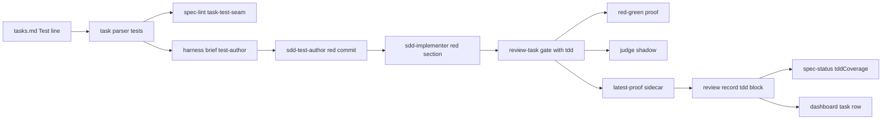

# Design Document — tdd-task-loop

Document version: v2

## Overview

A task with a `- Test:` line gets red tests from a Sonnet-tier test author, hands them to the implementer, and the gate proves in code that they fail on the pre-task code and pass on the finished code. New code is two core modules (`src/core/red-green.ts`, `src/core/judge.ts`), one agent, one brief template and an optional `tdd` gate argument; the parser, lint, review record, `spec-status` and dashboard gain fields. Each component's Reuses line names the existing code it builds on.

## Steering Document Alignment

### Technical Standards (tech.md)
No `tech.md` exists; the design follows the agent rules and the rule that core never imports tools (`src/core/gate-rules.ts:1-8`).

### Project Structure (structure.md)
No `structure.md` exists; server code goes in `src/core/`, the agent in `harness/agents/`, skill text in `harness/skills/sdd-implementation-phase/`, beside their siblings.

### Design System (design-system.md) — if applicable
N/A: no `design-system.md` exists; the one dashboard line reuses its neighbours' secondary-text token (`src/dashboard_frontend/src/modules/pages/TasksPage.tsx:1384-1403`).

## Architecture

The one new runtime seam is the gate handler calling the proof and the judge when the call carries `tdd`; everything else is a field on an existing shape or a skill step. A task without a `Test:` line takes no new branch.



## Components and Interfaces

### Component 1 — Test line parse (R1 AC1-3)
- **Interfaces:** in `src/core/task-parser.ts`:
  - `export const TEST_BULLET_RE = /^[-*]\s+Test:\s*(.*)$/` marks a Test line.
  - `export function parseTestLine(text: string): { test: TaskTest } | { error: 'no-dash' | 'empty-call' | 'not-test-path' }`, where `text` is the capture after `Test:`. It splits on the first space-em-dash-space, trims both sides, strips one wrapping backtick pair from each, and checks the path with `isTestPath`.
  - `ParsedTask.tests?: TaskTest[]`, spread only when non-empty, and counted by the header-task test.
- **Placement:** a new branch before the unanchored `Files?:` branch, so a seam like `readFile: x` never lands in `files`; that branch pushes a malformed Test line to `implementationDetails`.
- **Reuses:** `src/core/task-parser.ts:279-288` (the branch it precedes), `src/core/task-parser.ts:300-306` and `src/core/task-parser.ts:314-332` (`hasDetails` and the literal it extends), `src/core/gate-rules.ts:192-198` (`isTestPath`; the rules module imports no parser code, so no cycle).

### Component 2 — Lint rule `task-test-seam` (R1 AC3-5)
- **Interfaces:** `export function checkTestSeams(lines: string[], blocks: TaskBlock[]): LintFinding[]` in `src/core/lint-tasks.ts`:
  - each block line matching `TEST_BULLET_RE` whose parse fails gives a `warning` on that line, message `Test line: <cause>`;
  - each task parsed from `lines.join('\n')` with no `tests` and a `files` entry that is neither a test path nor a doc path gives an `info` on its checkbox line, message `task <id> changes source and has no Test line`.
- **Wiring:** `task-test-seam` joins the rule union and the `tasks` list only; `spec-lint` calls the rule after the bridges rule.
- **Move:** `isDocPath` moves unchanged from the gate tool into an export of `src/core/gate-rules.ts`; the gate imports it back.
- **Reuses:** `src/core/lint-tasks.ts:276-298` (`checkBridges`, the rule shape followed), `src/core/lint-types.ts:11-15` and `src/core/lint-types.ts:50-63` (`LintRule`, `CHECKS_BY_PHASE`), `src/tools/spec-lint.ts:158-187` (tasks wiring), `src/tools/review-gate.ts:102-106` (`isDocPath`).

### Component 3 — Tasks template and reviewer lens (R1 AC6-8)
- **Template:** the shape-rules line gains "a task that changes source may add `- Test: <test path> — <public call>` after its `File:` lines"; example task 2 gains `- Test: tests/services/FeatureService.test.ts — FeatureService.create(input)`.
- **Lens:** the document-phase reviewer brief gains one tasks-phase bullet, after the gate-B bullet, with the R1 AC7 text.
- **Reuses:** `src/markdown/templates/tasks-template.md:1-36`, `harness/skills/sdd-document-phase/references/briefs.md:205-209`.

### Component 4 — Test author agent and `test-author` template (R2)
- **Agent:** `harness/agents/sdd-test-author.md`. Frontmatter line 2 `name`, line 3 a quoted description opening `SDD test author:`, line 4 `model: claude-sonnet-5`, line 5 `effort: high` (the profile test reads model and effort by line number), then `color` and `tools` Read, Grep, Glob, Bash, Write, Edit; no MCP tool. The body states R2 AC4-10 as standing rules.
- **Template:** `test-author` in the brief template table: `# {{title}}`, the read-and-obey line, `## Job` with `{{job}}`, `## Task text (from tasks.md)` with `{{taskBlock}}`. The existing rule derives the required values `path`, `title`, `job`.
- **No-Test guard:** after the task-block fill, a `test-author` brief whose parsed task has no `tests` returns `success: false` with `brief: task <id> has no Test: line; no file written`.
- **Job text:** the spec dir, code root and spec store as absolute paths, then "Read the files your standing rules name from these roots; commit in the code root."
- **Reuses:** `src/tools/harness.ts:485-535` (`BRIEF_TEMPLATES`), `src/tools/harness.ts:641-659` (task-block fill), `src/tools/harness.ts:661-675` (missing-value check), `src/__tests__/agent-profiles.test.ts:13-31` (reads frontmatter by line), `harness/agents/sdd-implementer.md:1-38` (frontmatter shape).

### Component 5 — Implementer red-tests slot (R3 AC4)
- **Interfaces:** the `implementer` template gains a `{{redTests}}` line after the task block. `OPTIONAL_BRIEF_KEYS = new Set(['redTests'])` in `src/tools/harness.ts` defaults an absent key to `''` before the missing-value check.
- **Section text:** pinned in the implementation-phase `references/briefs.md` by the implementer brief: heading `## Red tests (from the test author)`, the R3 AC5 rules as four bullets, then the author's files, `Test:` lines and report verbatim. Fix briefs carry the same section inside the `reviser` `{{job}}` value.
- **Reuses:** `src/tools/__tests__/harness.test.ts:170-172` and `src/tools/__tests__/harness.test.ts:247-253` (implementer calls with `title` only, which keep passing), `harness/skills/sdd-implementation-phase/references/briefs.md:67-108` (implementer and fix briefs).

### Component 6 — Captured command runner (R4 AC9)
- **Interfaces:** in `src/core/check-runner.ts`:
  - `runOne` resolves `{ result: CheckResult; stdout: string; stderr: string }`; `runChecks` maps to `result` (shape unchanged).
  - `export async function runCaptured(cwd: string, command: string, opts?: { timeoutMs?: number }): Promise<CheckResult & { stdout: string; stderr: string }>` with the same env scrub, colour variables and buffer cap.
- **Reuses:** `src/core/check-runner.ts:1-104` (`lastLine`, `runOne`, `runChecks`, `CHECK_TIMEOUT_MS`, `CHECK_MAX_BUFFER`).

### Component 7 — Red-on-base proof (R4 AC4-12, R5 AC2)
- **Module:** `src/core/red-green.ts`; it never throws.
- **Interfaces:**
  - `export type ProofRules = { testCommand: string | null; setupCommand: string | null; off: boolean }`.
  - `export async function proveRedGreen(root: string, tdd: TddArgs, rules: ProofRules, opts?: { timeoutMs?: number }): Promise<ProofResult>`; `timeoutMs` defaults to `CHECK_TIMEOUT_MS`.
  - `export function classifyRed(output: string): 'assertion-red' | 'structural-red'` gives `assertion-red` when `output` holds `AssertionError` and none of `Cannot find module`, `is not a function`, `SyntaxError`, `error TS`.
  - `export function proofReasons(p: ProofResult): { fail: string[]; risk: string[] }`.
  - `export function parseAgentRuleKey(markdown: string, key: string): string | null` in `src/core/gate-rules.ts`: the first line starting with the key and a colon; a value opening with a backtick yields the first backtick span, else the trimmed rest; empty is `null`. `off` is true when the `red-on-base` value is `off`.
  - `runGit` and `GitRun` in `src/core/task-diff.ts` become exports; the proof makes every git call through them.
- **Steps, in order:**
  1. Resolve `redCommit` and its first parent (`baseSha`); a failure gives base `inconclusive`, cause `red commit does not resolve`.
  2. `git diff --name-only` of the red commit against its first parent: each non-test path goes to `sourcePaths`.
  3. `git diff --name-only <redCommit> -- <testFiles>` in `root` (red commit against the working tree) fills `amended`.
  4. `git show <redCommit>:<path>` per test file fills `redText`.
  5. Base run, skipped as base `inconclusive` when `off` (cause `red-on-base: off`), when `testCommand` is null (cause `no tdd-test-command`) or when `sourcePaths` is non-empty (cause `author changed source`). Otherwise: `git worktree prune`; a fresh `mkdtemp` under `os.tmpdir()`; `git worktree add --detach` of `baseSha` at its `base` child; `setupCommand` through `runCaptured` there, else one directory symlink per `node_modules` directory of `root` (a walk that follows no symlink and skips `node_modules`, `.git` and any directory holding a `.git` entry, i.e. a linked worktree); `redText` written at the same relative paths; `runCaptured` of `testCommand`, `{files}` set to the single-quoted test files; on exit 0 one more run. A `finally` runs `git worktree remove --force`, then recursively removes the temp directory.
  6. Head run: `runCaptured(root, command)` whenever `testCommand` is set; else `not-run`.
- **Outcome table** (`proofReasons`):

| Fact | Base | Head | Gate | Reason |
| --- | --- | --- | --- | --- |
| base non-zero, assertion | `assertion-red` | — | — | — |
| base non-zero, otherwise | `structural-red` | — | — | risk `tdd-structural-red` |
| base exit 0 twice | `vacuous` | — | fail | `tdd: tests pass on base` |
| base exit 0, then non-zero | `inconclusive` | — | — | risk `tdd-inconclusive: flaky base run` |
| git, setup, timeout, key or off cause | `inconclusive` | — | — | risk `tdd-inconclusive: <cause>` |
| head non-zero or timeout | — | `fail` | fail | `tdd: tests fail on HEAD` |
| `sourcePaths` non-empty | — | — | fail | `tdd: author changed source: <path>` per path |
| `amended` non-empty | — | — | — | risk `tdd-amended: <files>` |

- **Probe (2026-09-27, git 2.43.0, node 24.13.0, vitest 4.0.16):** adding a detached worktree of HEAD took 0.24 s; `npx vitest run` of a two-test file there, `node_modules` symlinked, took 1.1 s, exited 1, printing `AssertionError:` and `is not a function`; `git worktree remove --force` and a recursive `fs.rmSync` each removed the link, not its target. A `node` file with a failing `assert.strictEqual` exits 1 printing `AssertionError`; a missing `require` exits 1 printing `Cannot find module`.
- **Reuses:** `src/core/task-diff.ts:69-86` (`runGit`), `src/core/gate-rules.ts:79-99` (`parseHeadingBullets`, the sibling agent-rules parser), `.spec-workflow/agent-rules.md:5-6` (the key-and-backtick form), `src/core/git-utils.ts:45-51` (`scrubbedGitEnv`).

### Component 8 — Gate wiring (R4 AC1-3, AC13-14; R5 AC2-5)
- **Interfaces:** `GateArgs` gains `tdd?: TddArgs`; `GateData` gains `tdd?: TddBlock`; the `review-task` input schema gains a `tdd` object (`testFiles` string array, `redCommit` string) beside the gate-only fields.
- **Handler changes, in order:**
  1. After mode resolution, `tdd` in item mode returns `success: false`, `tdd needs a task: '<taskId>' is not a task in tasks.md`; an empty `testFiles`, non-string entry or empty `redCommit` returns `success: false` naming the field.
  2. The agent-rules text already read gives `ProofRules`; ENOENT gives all-null rules.
  3. The matched task's `tests[]` — from the `tasks.md` parse the gate already runs (`src/tools/review-gate.ts:161`), matched to `testFiles` by path — supply `data.tdd.seams` and the judge's `testLines`; a `testFiles` path with no matching entry gets no `seams` key. After the checks: `proveRedGreen`, then `judgeTdd` (Component 11), then the `TddBlock`, then `writeLatestTdd(taskId, block)`.
  4. Risk inputs (requirements D4): `decideGate` gets `files` merged with `testFiles` when `files` is non-null (else `null`); `scoreRisk` gets `touched` merged with `testFiles` when `touched` is non-empty (else empty). No rule body changes.
  5. `gate` is `fail` when the verdict fails or the proof has fail reasons; reasons run verdict, proof fail, risk.
  6. When the proof has risk reasons, the down-rank is skipped and risk is `high` with them appended, beating the trivial fast path that returns inside `scoreRisk`.
  7. `data.tdd` is set only when `tdd` was given; proof output appears only as a cause in a reason.
- **Reuses:** `src/tools/review-gate.ts:47-70` (`GateArgs`, `GateData`), `src/tools/review-gate.ts:161-186` (tasks parse, task find and mode), `src/tools/review-gate.ts:192-209` (agent-rules read), `src/tools/review-gate.ts:279-354` (checks, `decideGate`, `scoreRisk`, down-rank, recorded review), `src/tools/review-task.ts:249-271` (gate-only schema fields), `src/core/gate-rules.ts:286-365` and `src/core/gate-rules.ts:396-454` (`scoreRisk`, `decideGate`, unchanged).

### Component 9 — Review record (R5 AC6-7)
- **Type:** `TaskReview.tdd?: TddBlock`.
- **Latest proof:** `writeLatestTdd(taskId, block)` and `readLatestTdd(taskId)` on the review manager, over `reviews/.tdd-<sanitized id>.json`, sanitized as the prepare marker is. The loader reads only `review-*.md`, so it never sees the sidecar.
- **Attach:** `saveReview` sets `tdd` to the caller's value or else the sidecar's when either exists, so the gate's record and the verifier's `record` carry it without a caller change.
- **Markdown:** the writer appends, after the findings, `## TDD proof`, a blank line, a `json` fence holding the block as one line of `JSON.stringify`, and a closing fence. The parser reads that fence with `JSON.parse`; no section or a parse error leaves `tdd` absent. Frontmatter, summary and findings parsing do not change.
- **Reuses:** `src/types.ts:253-263` (`TaskReview`), `src/core/task-review-manager.ts:71-132` (prepare marker, `saveReview`), `src/core/task-review-manager.ts:155-177` (`loadAllReviews`), `src/core/task-review-manager.ts:185-313` (`reviewToMarkdown`, `parseReviewMarkdown`), `src/tools/review-task.ts:858-864` (record path, unchanged).

### Component 10 — Visibility (R6 AC1-3)
- **`spec-status`:** each completed task whose latest review has `tdd` counts toward `data.tddCoverage`, present only when that count is above zero.
- **Routes:** the review list route adds `tdd` to each item; the summary route adds `tdd` to each task's latest entry; the version route already returns the whole review.
- **Task row:** the review-summary state type gains `tdd`. Inside the always-shown fragment, before the non-pass findings block, a present `tdd` renders one `div`, class `mt-1 text-xs text-[var(--text-secondary)]`, text `TDD: base <base> · head <head> · amended <yes|no> · <n> file(s)`.
- **Reuses:** `src/tools/spec-status.ts:179-193` and `src/tools/spec-status.ts:207-225` (coverage loop, `data`), `src/dashboard/multi-server.ts:1930-1988` (list, version and summary routes), `src/dashboard_frontend/src/modules/pages/TasksPage.tsx:520-524` and `src/dashboard_frontend/src/modules/pages/TasksPage.tsx:1364-1406` (state, task row).

### Component 11 — Judge (R7)
- **Module:** `src/core/judge.ts`; no SDK; never throws.
- **Interfaces:**
  - `export function judgeMode(env?: NodeJS.ProcessEnv): 'off' | 'shadow' | 'enforce'`: no `TYPESAFE_API_KEY` gives `off`; a key with `SPEC_WORKFLOW_JUDGE_TDD` unset gives `shadow`; a valid value is used as given; an invalid one gives `shadow`.
  - `export async function judgeTdd(input: JudgeInput, opts: { cacheDir: string; env?: NodeJS.ProcessEnv; fetchImpl?: typeof fetch }): Promise<JudgeResult | null>`, which returns `null` at once under `off`.
- **Request:** one `POST https://api.typesafe.ai/v1/systemone`, bearer key, body `{ model: 'jev-1.13.0', state, questions }`. `state` holds `test_files` (each red text under a `// file: <path>` header, cut at 48,000 characters with the marker `…[truncated]`), `success_criteria`, `requirement_criteria`, `test_lines`, `base_outcome`. `questions` holds `tautological`, `through_seam`, `mocks_internals` as noul and `asserts_criteria` as a three-level score, with the memo's question texts. The docs show only placeholders for the outbound score-question `criteria` form and for the inbound extraction of each answer's number from `answers["<id>"]` (`docs/jev-integration-research.md:38-42`), and no key is available to probe either; the implementing task confirms both wires against the `@typesafe-ai/sdk` TypeScript types (which infer the answer shape from the questions, jev doc 1.3) or a live key before a judge event counts as evidence. An unparseable response is a malformed body.
- **Transport:** `AbortSignal.timeout(10_000)` per attempt; one retry after 1 s on 429 or 529; any error, other non-2xx, or a missing or mistyped answer, token count or model returns `null`. Probe: `fetch` and `AbortSignal.timeout` are functions on node 22.14.0 and 24.13.0; CI node 20 is not probed, so tests inject `fetchImpl`.
- **Cache:** `judge/` under the spec store's `.cache`, which typecheck already creates and gitignores; one file per sha256 of the request body holds the result. A hit sends nothing and returns it with `cached: true`.
- **Gate input:** the proof's `redText`; the task's `Success` prompt section; the criteria of `requirements.md` that the task's `_Requirements:` ids name (`N.M` one item, `N` every item of requirement N); the task's `tests`; the base outcome. The result fills only `data.tdd.judged`; `enforce` acts as `shadow`.
- **Reuses:** `docs/jev-integration-research.md:32-54` (endpoint and shapes), `docs/tdd-implementation-research.md:348-356` (question texts), `src/core/typecheck.ts:241-243` and `.gitignore:147-148` (cache directory), `.gitignore:164` (`.mcp.json` ignored), `src/core/lint-markdown.ts:163-202` (`criteria`).

### Component 12 — Implementation-phase skill (R3, R6 AC4)
- **Ledger:** role `author task <N>`; the gate note gains ` tdd <base>` when `data.tdd` is present; a `judge` event (task, `site=tdd`, the four answers, tokens, ms) follows a gate whose `judged` is non-null and not cached.
- **Step 1b**, after the base capture, only when the task block holds a `- Test:` bullet: brief `test-author` to `/tmp/scratchpad/sdd/<SPEC>/author-brief-task-<N>.md` with title, the Component 4 job and the graph values; spawn `sdd-test-author`; record `spawn.usage`. `SEAM-DEFECT`, or `RED-IMPOSSIBLE` on every criterion, takes the design-defect stop with no implementer, so the stop's `REASON` comes from the author's flag, not the implementer's (`harness/skills/sdd-implementation-phase/SKILL.md:209-216`); a partial `RED-IMPOSSIBLE` appends a `doc-gap` retro entry; otherwise keep the author's files and `commit:` sha on the task-list item. A resumed `[-]` marked task spawns the author only when `git log -1 --format=%H --grep "test(<SPEC>): task <N> red"` finds nothing.
- **Other steps:** step 2 passes `redTests`; step 4 passes `tdd` on every marked-task gate call; step 4b copies `data.tdd` into `## Gate results`, adding "Judge the amended author test against the task's criteria first." when `amended`; step 5 fix briefs carry the red section.
- **Reuses:** `harness/skills/sdd-implementation-phase/SKILL.md:55-68` (ledger), `harness/skills/sdd-implementation-phase/SKILL.md:93-181` (pick to fix rounds), `harness/skills/sdd-implementation-phase/SKILL.md:209-216` (design defect), `harness/skills/sdd-implementation-phase/references/briefs.md:134-159` (verifier brief).

### Component 13 — Profiles, rules, docs (R8)
- `node scripts/sync-plugin-assets.cjs` regenerates the profiles with `sdd-test-author` as `claude-sonnet-5`, `high`, role `test author`, cache `default`. The profile test moves from 12 keys to 13 and from "other nine" to "other ten". The members to update and their find command are `grep -rn -iE 'twelve|other nine|worker\*\* agents|\(12 keys\)|toHaveLength\(12\)' scripts/sync-plugin-assets.cjs src/__tests__/agent-profiles.test.ts docs/SDD-HARNESS.md` — six hits to update, including `docs/SDD-HARNESS.md:21` "Eight" worker agents to "Nine" (the R8 AC2 count word); leave the one false positive, `docs/SDD-HARNESS.md:133` "twelve spawns" (a budget figure), unchanged.
- `docs/SDD-HARNESS.md`: nine workers, the model row, and a subsection on the `Test:` line, the author step, the outcomes and the three keys.
- `docs/TOOLS-REFERENCE.md`: `tdd` and `data.tdd` under `## review-task`, `tddCoverage` under `## spec-status`, `test-author` under `## harness`.
- The spec store's `agent-rules.md` gains `tdd-test-command: npx vitest run {files}` after the worktree keys.
- **Reuses:** `scripts/sync-plugin-assets.cjs:90-134` (`buildProfiles`), `src/__tests__/agent-profiles.test.ts:1-53`, `docs/SDD-HARNESS.md:21-23` and `docs/SDD-HARNESS.md:313-320` (worker list, model table).

## Data Models

```ts
// src/core/task-parser.ts
type TaskTest = { path: string; seam: string };

// src/types.ts
type BaseOutcome = 'assertion-red' | 'structural-red' | 'vacuous' | 'inconclusive';
type HeadOutcome = 'pass' | 'fail' | 'not-run';
type TddArgs = { testFiles: string[]; redCommit: string };
type JudgeAnswers = {
  tautological: number;      // 0..1
  asserts_criteria: number;  // 0..2
  through_seam: number;      // 0..1
  mocks_internals: number;   // 0..1
};
type JudgeResult = {
  answers: JudgeAnswers;
  model: string;
  inputTokens: number;
  ms: number;                // fetch wall time, retry included
  cached: boolean;
};
type TddBlock = {
  testFiles: string[];             // as the caller gave them
  seams: Record<string, string>;   // key: a testFiles path with a tests[] entry; no key otherwise
  redCommit: string;
  baseSha: string | null;          // resolved first parent; null when unresolved
  base: BaseOutcome;
  head: HeadOutcome;
  amended: boolean;
  judged: JudgeResult | null;      // null when off, failed, or no red text
};
type TddCoverage = {               // spec-status data.tddCoverage
  tasks: number;
  base: Record<BaseOutcome, number>;  // all four keys present
  amended: number;
};

// src/core/red-green.ts
type ProofResult = {
  baseSha: string | null;
  base: BaseOutcome;
  baseCause: string | null;        // set when base is inconclusive
  head: HeadOutcome;
  sourcePaths: string[];
  amended: string[];
  redText: Record<string, string>; // path -> red-commit content
};

// src/core/judge.ts
type JudgeInput = {
  redText: Record<string, string>;
  successCriteria: string;
  requirementCriteria: string[];
  testLines: TaskTest[];
  base: BaseOutcome;
};
```

`GateData` keeps every existing field and adds `tdd?: TddBlock`.

## Error Handling

1. **`tdd` outside task mode, or malformed:** `success: false`, no git work.
2. **Proof infrastructure fails** (red commit unresolved, git or setup error, base timeout, key absent, switch off): base `inconclusive`, risk high, gate not failed; the verifier decides.
3. **Worktree add fails:** `inconclusive`; the `finally` removes the temp directory; the next prune drops stale metadata and leaves a concurrent gate's live worktree alone.
4. **Judge failure of any kind:** `judged: null`, no ledger event, verdict unchanged.
5. **Unreadable sidecar:** read as absent; the review records without `tdd`. A task later unmarked in `tasks.md` can attach its stale sidecar to that task's next review; with no run stamp this rare mid-spec mis-attach is an accepted limitation.

## Testing Strategy

Child-process assertions use only exit codes and output substrings (CI node 20).
- **Unit:**
  - new `src/core/__tests__/task-parser-tests.test.ts`: promotion, order, absence, each malformed form kept in `implementationDetails`, a seam holding `File:`;
  - `src/core/__tests__/lint-tasks.test.ts`: three warnings, the info, no info for docs-only or test-only tasks;
  - `src/core/__tests__/gate-rules.test.ts`: `parseAgentRuleKey` backtick, plain and absent forms; `isDocPath` after the move;
  - `src/core/__tests__/check-runner.test.ts`: `runCaptured` returns full output; `runChecks` unchanged;
  - new `src/core/__tests__/red-green.test.ts`: a temp git repo, `tdd-test-command: node {files}`, `node:assert` test files; one case per outcome row, quoting, walk skips, temp-dir removal after a throw;
  - new `src/core/__tests__/judge.test.ts`: mode matrix, request shape, 429 then success, `null` on timeout, 500 and malformed body, truncation marker, cache hit sends nothing; `fetchImpl` injected;
  - `src/core/__tests__/task-review-manager.test.ts`: `tdd` round-trips equal; old files parse without it; `saveReview` attaches the sidecar;
  - `src/tools/__tests__/harness.test.ts`: `test-author` brief, its no-Test failure, `redTests` filled and defaulted;
  - `src/tools/__tests__/spec-status.test.ts`: `tddCoverage` present and absent;
  - `src/__tests__/agent-profiles.test.ts`: 13 keys.
- **Integration:** `src/tools/__tests__/review-gate.test.ts` on a temp repo: without `tdd` the response deep-equals today's; item-mode refusal; assertion-red pass at low risk whose recorded review carries `tdd`; vacuous fail (R9 AC2); source-touching red commit fail; amended forcing high over the down-rank; stubbed `off` and `shadow` giving identical verdict, risk and reasons.
- **End-to-end:** R9 AC1, AC3 and AC5 need a rebuilt, restarted session with the new agent. The last task writes and dry-runs the three-task fixture kit and adds `pending` lines to a tracked `verification-evidence.md` that an operator runs with `claude -p`, marking each `passed` before the retrospective. AC2 and AC4 run in the suites above; AC6 at the verification gate.

## Decisions taken in this document

- D1 — The proof's per-file seams are a map keyed by test path, no key for a path lacking a Test line; over an array parallel to the test files with null holes, because one shape round-trips through JSON (R3-2).
- D2 — The latest proof is a per-task sidecar beside the prepare marker, attached by the save routine; over the gate's last recorded review or the verifier passing it, because the gate records no review at high risk.
- D3 — The implementer red slot is an optional key defaulting to empty; over required from every caller, because today's callers keep passing.
- D4 — The documentation-path test moves from the gate tool into the core rules module; over copying it into the lint, because core may not import tools.
- D5 — The author's files join the gate's listed files only when a list was given, and its touched paths only when the range is non-empty; over a new risk input field, because no rule body changes.
- D6 — The review file carries the proof as a one-line JSON section after the findings; over new frontmatter keys, because the frontmatter reader holds no nested values.
- D7 — The head run runs whenever a test command is set, even when the base is inconclusive or off; over only after a usable base run, because a failing head is a fact.
- D8 — The gate handler calls the judge, not the proof module; because the proof stays free of network.
- D9 — The Test-line pattern and parser live in the task parser and the lint imports them; over copying the pattern as the lint does for requirement ids, because lint and parser must partition identically (R2-1).
- D10 — The diff module's git runner is exported for the proof; over a second runner, because it already scrubs the environment.
- D11 — The base worktree goes under the system temp directory; over the scratch store, because the gate knows no scratch path.
- D12 — A resumed marked task finds its red commit by the author's commit message before re-running the author; over always re-running, because a second run would stack a second red commit.
- D13 — The test author's standing rules live in its agent file, and its job value carries the three roots; over a standing brief like the implementer's, because requirements fixed the job value as the root channel (R3-1).
- D14 — The dashboard line is a literal English string; over a translation key, because the neighbouring findings toggle is literal.

## Scope notes

- Carried: R3-2 (seams datatype) is addressed by D1 and Data Models; the requirements-v4 narrow-check note needs no design action.
- Flag: the gate, risk-rule and implementation-brief anchors predate the public-ats-adapters retro (PR 71) that shifted them; this document and the context file cite current ranges.
- Deferred (per requirements): budget measurement, Jev thresholds and enforce, a verifier skip for proven tasks, the author's provider-map line (spec 10), the control-pane task view (spec 9).
- Not probed: the judge's outbound `criteria` form and the inbound answer-number extraction (no key). The fail-open path protects the gate verdict but not the Jev deliverable, so a judge event counts toward R9 AC3 only after Component 11's confirmation.
- Known shadow-data bias (R4 AC9 closed): an assertion failure whose captured output holds a structural marker records `structural-red`; the direction only raises risk.

## Revision History

- **v1** (2026-09-27) — Initial draft.
- **v2** (2026-09-27) — Round-1 adversarial response (adversarial-analysis-design.md, verdict iterate 0/2/4).
  - **R1-1 — Accepted (SHOULD_FIX).** Component 11 and the Scope notes now flag both the outbound criteria form and the inbound extraction of each answer's number as unprobed placeholders, and state a judge event counts toward the closing verification only after the implementing task confirms both wires against the SDK types or a live key.
  - **R1-2 — Accepted (SHOULD_FIX).** Component 13 replaces the unreliable count-word grep with a member-complete find command that surfaces all six hits to update, including the "Eight worker agents" line, and names the one false positive (the "twelve spawns" budget figure) to leave unchanged.
  - **R1-3 — Partially accepted (MINOR).** The Scope notes now record the structural-red misclassification as a known shadow-data bias; the closed classification rule is left as is.
  - **R1-4 — Accepted (MINOR).** Component 8 now states the gate takes each test's seam and the judge's test lines from the task parse it already runs, matched to the test files by path, and cites that parse.
  - **R1-5 — Accepted (MINOR).** Component 12 now states the design-defect stop's reason is sourced from the author's flag on the seam-defect path, where there is no implementer.
  - **R1-6 — Partially accepted (MINOR).** Error Handling now records the stale-sidecar mis-attach after a mid-spec unmark as an accepted limitation; no run-stamp guard is added, as the scenario is rare and unproven.
