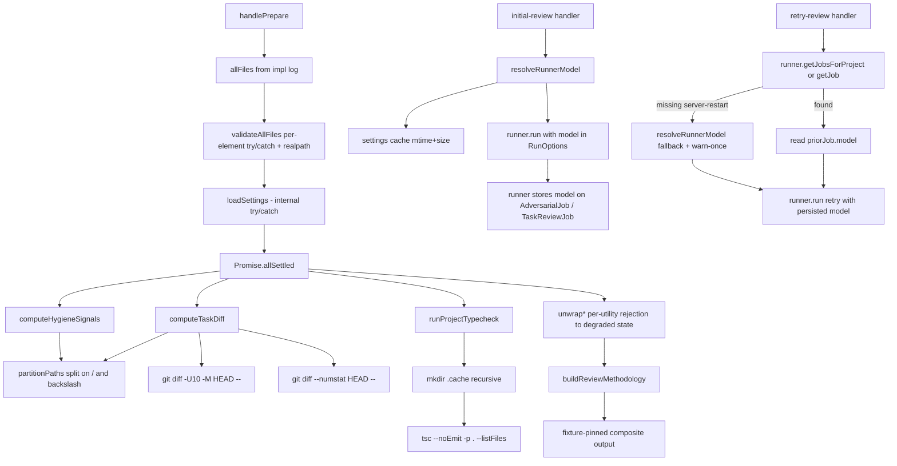

# Design Document

## Overview

`tighter-reviews` extends the `review-task prepare` flow and the per-runner config surface in `spec-workflow-mcp` along three independent tracks that share two integration points (`handlePrepare` in `src/tools/review-task.ts`, settings reads in `src/multi-server.ts`):

- **Track A — Typecheck pre-computation**: `handlePrepare` runs `tsc --noEmit` once and surfaces tagged diagnostics + coverage in the response, instead of asking the reviewer to hunt for type errors.
- **Track B — Diff-first context**: `handlePrepare` returns a `git diff -U10 -M HEAD --` of the in-scope files, so the reviewer reads changed hunks instead of full files. A new shared **path denylist** filters secrets/locks/binaries from both diff and hygiene paths.
- **Track C — Per-runner model selection**: a new `resolveRunnerModel(settings, runner)` helper resolves a grouped `adversarial: { model } / taskReview: { model }` shape with a legacy fallback. A small in-process settings cache (`mtime + size`-keyed) keeps repeated reads cheap. The initial-review HTTP handler resolves the runner's options once and passes them to `runner.run(...)`; the runner stores the resolved `model` on the job object (the `AdversarialJob` and `TaskReviewJob` interfaces gain a `model?: string` field, populated during job construction). The retry HTTP handler — a separate Fastify route, with no shared closure scope to the initial handler — looks up the prior job via the runner's existing `getJob(jobId)` accessor (already exposed at `adversarial-runner.ts:49` and `task-review-runner.ts:44`) and passes `priorJob.model` to the new runner invocation, skipping `resolveRunnerModel`. This makes "retry uses initial's model" structural for the **single-server-process, sequential** path. Two orthogonal failure modes are explicitly handled rather than claimed away: (a) two concurrent initial-reviews against the same `(specName, phase)` — translated from the runner's existing duplicate-guard `Error` throw to `409 Conflict` at the route layer (Error Scenario #16); (b) the prior job is not found in the runner's in-memory map (server restart between initial and retry, or pre-spec deployment that never recorded `model`) — retry falls back to `resolveRunnerModel` against current settings with warn-once (Error Scenario #15). Annotation persistence was considered and rejected: the task-review HTTP route has no approval surface to persist into, and on the adversarial path the existing post-`runner.run` `updateApproval` at `multi-server.ts:836` builds the annotation from scratch and would clobber any pre-stamp.

The new `data` fields (`diff`, `diffStats`, `skippedPaths`, `diffTruncated`, `typecheckResults`) are additive; `filesToReview`, `hygieneSignals`, `methodology`, `taskContext`, `implementationSummary`, `steeringExcerpt` keep their current shape.

`buildReviewMethodology` grows new directives (R4.1, R4.2a, R4.2b, R4.4–R4.7) that compose with the existing item-9 hygiene directive. Composite output is pinned axis-by-axis against fixture files (R4.10), with cross-axis fixtures to catch directive redundancy/contradiction across maximally- and partially-degraded states.

The orchestration in `handlePrepare` uses **`Promise.allSettled`** for the three async utilities, with **internal try/catch in both synchronous prelude steps** (`validateAllFiles` per element, and `loadSettings` over read+parse). Every utility's rejection is converted at the orchestration boundary to a documented absent-with-reason state — including a distinct `reason: 'rejection'` for typecheck and a `diffState: 'rejected'` variant for diff, separate from legitimate empty/unavailable signals.

## Steering Document Alignment

### Technical Standards (tech.md)

There is no `tech.md` steering doc in this repo today. Defaults applied:
- TypeScript ESM, Node `child_process` (`execFile`) for shelling out — matches existing `src/core/git-utils.ts` style.
- Vitest with co-located `__tests__/` directories — matches `src/core/__tests__/hygiene-signals.test.ts`.
- No new runtime dependencies; `tsc` invoked via the project's own `node_modules/.bin/tsc`, never imported as a library.

### Project Structure (structure.md)

There is no `structure.md` steering doc. Conventions inferred from the tree:
- Pure async utilities live in `src/core/`. New modules (`task-diff.ts`, `typecheck.ts`, `path-denylist.ts`, `adversarial-settings.ts`) follow that pattern.
- Tool handlers live in `src/tools/`. `handlePrepare` stays the only orchestrator; the new utilities are called from it, not from `src/dashboard/`.
- Test fixtures: introduce `src/tools/__tests__/__fixtures__/methodology/` (new — no `__fixtures__` directory exists today; this is the first).

## Code Reuse Analysis

### Existing Components to Leverage

- **`computeHygieneSignals`** (`src/core/hygiene-signals.ts:45`) — extended to consume the new `path-denylist` filter before scanning. Public signature unchanged.
- **`PathUtils`** (`src/core/path-utils.ts`) — used as-is for `getWorkflowRoot`. No additions.
- **`AdversarialRunner.run` / `TaskReviewRunner.run`** (`src/dashboard/adversarial-runner.ts:63`, `src/dashboard/task-review-runner.ts:58`) — already accept `model?: string` and forward it as `--model`. **`run` signature unchanged.** Track C extends the `AdversarialJob` and `TaskReviewJob` *interfaces* with a `model?: string` field, populated inside `run` when the job is constructed (alongside the existing `id, projectId, specName, phase, status, ...` fields). At the initial-review callsite, `model` comes from `resolveRunnerModel(settings, runner)` and flows through `RunOptions.model` to the stored `job.model`. At the retry callsite, `model` comes from `priorJob.model` looked up via the runner's existing `getJob(jobId)` accessor (already present in both runners — no new method needed). The task-review retry handler additionally uses the existing `getJobsForProject(projectId).find(...)` pattern to locate the failed job, but **must sort by `startedAt` descending** to handle the multi-historical-retry case (otherwise the oldest failed job's `model` is read, silently violating R3.9 when ≥2 historical retries exist). Initial and retry are separate Fastify route handlers with independent closure scopes — the runner's job map is the cross-request channel.
- **`handlePrepare`** (`src/tools/review-task.ts:118`) — gains a `Promise.allSettled` shell after `allFiles` is computed (line 180). Track A lands the shell; Track B slots the diff utility into the existing seam.
- **`buildReviewMethodology`** (`src/tools/review-task.ts:360`) — gains new arguments (see Components and Interfaces) and emits new directives composed with the existing item-9 hygiene directive (line 422–426).

### Integration Points

- **`multi-server.ts` settings-read callsites**: four separate Fastify route handlers — `POST /approvals/:id/adversarial-review` (line 742), `POST /approvals/:id/adversarial-retry` (line 879), `POST /specs/:specName/tasks/:taskId/review` (line 1723), `POST /specs/:specName/tasks/:taskId/review-retry` (line 1761). The structural contract (R3.9): **`resolveRunnerModel` is invoked exactly once per (approval, runner) pair** — at the initial-review handler. The retry handler looks up the prior job from the runner and reads `job.model`, skipping `resolveRunnerModel` entirely. A test asserts call count = 1 per (approval, runner) pair across an initial+retry sequence on a fresh job; total across both runners' initials = 2 per dual-runner review lifecycle. The retry path's spy on `resolveRunnerModel` SHALL observe zero calls when the prior job is found.

- **Runner job-storage extension**: `AdversarialJob` and `TaskReviewJob` interfaces gain an optional `model?: string` field, populated inside `run(...)` from `RunOptions.model` during job construction. No signature change to `run`. Both runners already expose `getJob(jobId): Job | undefined` (`adversarial-runner.ts:49`, `task-review-runner.ts:44`); the retry handler reads `priorJob.model` via that existing accessor. Backward-compat: jobs from a deployment that predates this spec lack `model`; the retry handler SHALL fall back to `resolveRunnerModel` in that case (logged via warn-once). The same fallback fires when the runner's in-memory map was cleared by a server restart between initial and retry — see Error Scenario #15.
- **`adversarial-settings.json` schema**: extended to optionally include `adversarial: { model }`, `taskReview: { model }`, `features: { typecheck }`. Legacy top-level `model`, `cli`, `cliArgs` continue to work indefinitely.
- **MCP response schema**: permissive (`additionalProperties` allowed). New optional fields ship without a version bump.

## Architecture

`handlePrepare` orchestrates three pre-computation utilities concurrently via `Promise.allSettled`. Each utility owns its external-process invocation, denylist application, and unavailable/timeout fallbacks. Each utility's contract says it "never throws," but the orchestrator does **not trust** that contract — every rejection is caught and converted to a structurally-distinguishable degraded state.

Both synchronous prelude steps — `validateAllFiles` and `loadSettings` — contain their own throws. `validateAllFiles` wraps each per-element step in try/catch (NUL-byte path inputs, Symbol/BigInt-coerced values, and `path.resolve` throws all bucket as "dropped invalid entry" with warn-once). `loadSettings` wraps `statSync`/`readFileSync`/`JSON.parse` (`EBUSY`/`EACCES`/`EISDIR`/`ELOOP`/parse all return `{}` with warn-once). The `safeRealpath` wrapper used inside `validateAllFiles` swallows **ENOENT, ELOOP, EACCES, ENAMETOOLONG, and any other realpath I/O error** (warn-once for non-ENOENT) and returns `undefined`. With these three try/catch shells in place, the synchronous prelude cannot escape unless the underlying Node runtime throws in a way that isn't catchable (e.g. an OOM during the catch itself), which is not a v1 concern.



**Latency framing.** Concurrent execution of the three async utilities themselves means their wall-clock cost is `max(diff, typecheck, hygiene)`, not their sum. Pre-work (settings load, allFiles validation including per-element realpath, cache-dir creation inside the typecheck utility) and post-work (diagnostic tagging) add **linearly** on top of that bound.

### Modular Design Principles

- **Single File Responsibility**: each new utility owns one concern.
- **Component Isolation**: `handlePrepare` is the only orchestrator; utilities don't call each other except through `path-denylist`.
- **Service Layer Separation**: process spawning lives inside utilities.
- **Utility Modularity**: only `partitionPaths` is exported from `path-denylist`. The per-element check stays internal.

## Components and Interfaces

### `src/core/path-denylist.ts` (new)

- **Public interface:**
  ```ts
  export function partitionPaths(paths: string[]): { kept: string[]; skipped: string[] };
  export const TEST_FIXTURE_SEGMENTS: readonly string[];
  ```
- **Path-segment splitting (cross-platform)**: segments are derived by splitting the input on **both `/` and `\`** characters, regardless of platform. A Windows-recorded `secrets\foo.json` reviewed on Linux still matches the `secrets` path-segment denylist; a Linux-recorded `secrets/foo.json` reviewed on Windows likewise matches. Without this, a cross-platform team has a silent bypass on the security-adjacent denylist.
- **Empty-segment filtering**: empty-string segments (produced by leading separators, doubled separators, or UNC paths like `\\server\share\...`) are filtered out before comparison. The denylist constructor also rejects empty entries — defense-in-depth against a config-loading bug producing a `''` denylist entry that would otherwise match every path.
- **Windows drive-letter handling**: on Windows, paths with a drive-letter prefix (`/^[A-Za-z]:/`) have the prefix stripped before segmentation, so `C:\proj\secrets\foo.json` segments as `['proj', 'secrets', 'foo.json']` rather than `['C:', 'proj', 'secrets', 'foo.json']`. This prevents a future denylist entry containing `:` (or a typo introducing `'c:'`) from accidentally matching every Windows path.
- **Match semantics (R1.5):** exact basename, basename suffix, basename prefix, path-segment match. NOT glob; NOT git pathspec wildcards.
- **Case-folding rules:**
  - **Secret-bearing basenames, suffixes, prefixes** (`*.env`, `*.pem`, `*.key`, `id_rsa*`, `.env`, `.npmrc`, `.netrc`, `.pypirc`) are **always** case-folded.
  - **Lock-file basenames and binary-suffix entries** are case-folded only on case-insensitive volumes.
  - **Path-segment matches** (`secrets`, `credentials`, `.aws`, `.kube`, `.docker`) are unconditionally case-insensitive.
- **Test-fixture exception (R1.6, narrowed):** `TEST_FIXTURE_SEGMENTS` carve-out applies **only** to the path-segment denylist. Basename/suffix/prefix rules continue to apply.
- **Dependencies:** `node:path` only.

### `src/core/task-diff.ts` (new)

- **Interfaces:**
  ```ts
  export type TaskDiffResult = {
    diff: string;
    stats: { filesChanged: number; linesAdded: number; linesRemoved: number } | undefined;
    skippedPaths: string[];
    truncated: boolean;
    rejection?: { message: string };
  };
  export async function computeTaskDiff(
    projectPath: string,
    allFiles: string[]
  ): Promise<TaskDiffResult>;
  ```
- **Behavior:**
  1. `partitionPaths(allFiles)` → kept + skipped.
  2. Run `git diff -U10 -M HEAD --` and `git diff --numstat HEAD --` concurrently with `cwd: projectPath`, `env: { ...process.env, GIT_OPTIONAL_LOCKS: '0' }`, kept paths as pathspec, **`maxBuffer: 16 * 1024 * 1024`**.
  3. Strip `Binary files ... differ` sections from the unified diff body.
  4. Apply truncation in two phases (R1.9):
     - **Per-file cap** (500 added+removed lines, counted from numstat): replace with `<diff truncated: <file> per-file cap exceeded>`.
     - **Total cap** (50,000 bytes of remaining body): replace remaining files with `<diff truncated: <file> total budget exhausted, file truncated despite size>`.
  5. On any expected failure (`execFile` rejection, non-zero exit, `ERR_CHILD_PROCESS_STDIO_MAXBUFFER`, not a git repo, `git` missing) return `{ diff: '', stats: undefined, skippedPaths, truncated: false }`. The `rejection` field is omitted on expected failures (the empty result is the documented degraded state). It is set **only** when an unexpected throw escapes — captured by `unwrapDiff` at the orchestrator.
- **Dependencies:** `node:child_process` (`execFile`), `path-denylist`.

### `src/core/typecheck.ts` (new)

- **Interfaces:**
  ```ts
  export type TypecheckDiagnostic = {
    file: string; line: number; column: number;
    code: string; message: string; inScope: boolean;
  };
  export type TypecheckResult =
    | { tsconfigPath: string; status: 'success';
        diagnostics: TypecheckDiagnostic[];
        coverage: { compiled: string[]; excluded: string[] };
        suppressedDenylistedFiles?: number;
        truncated?: boolean }
    | { tsconfigPath: string; status: 'unavailable';
        reason: 'no-tsconfig' | 'project-references' | 'wrapper-config'
              | 'tsc-not-found' | 'no-parseable-output' | 'output-overflow'
              | 'feature-disabled' | 'rejection';
        rejectionMessage?: string }
    | { tsconfigPath: string; status: 'timeout' };
  export async function runProjectTypecheck(
    projectPath: string,
    allFiles: string[],
    opts: { enabled: boolean }
  ): Promise<TypecheckResult[]>;
  ```
- **Behavior:**
  1. If `opts.enabled === false` → `'feature-disabled'`.
  2. Resolve `tsconfig.json` at project root → `'no-tsconfig'` / `'project-references'` / `'wrapper-config'` if unsupported.
  3. Resolve `tsc` from `node_modules/.bin/tsc` → `'tsc-not-found'` if absent.
  4. **Create cache directory**: `await fs.promises.mkdir(<projectPath>/.spec-workflow/.cache, { recursive: true })` before spawning tsc. Idempotent and safe under intra-process concurrent calls.
  5. Spawn `tsc --noEmit -p <projectPath> --incremental --tsBuildInfoFile <projectPath>/.spec-workflow/.cache/tsc.tsbuildinfo --listFiles --pretty false` with `env: { ...process.env, FORCE_COLOR: '0', NO_COLOR: '1' }`, **`maxBuffer: 16 * 1024 * 1024`**, 30 s timeout (SIGTERM → 2 s grace → SIGKILL — **POSIX semantics**; on Windows, `process.kill('SIGTERM')` is `TerminateProcess`-immediate, so the 2 s grace is a no-op there. Deeper Windows process-termination handling is deferred to v2 per Out of Scope).
  6. On timeout → `{ status: 'timeout' }`. On `ERR_CHILD_PROCESS_STDIO_MAXBUFFER` → `'output-overflow'`.
  7. **Parse stdout in two passes (multi-line continuation safe):**
     - **Pass 1** (diagnostics with continuation): walk lines top-to-bottom. A line matching `^(.+?)\((\d+),(\d+)\): error TS(\d+): (.+)$` starts a new diagnostic. **Subsequent lines starting with whitespace AND not matching an absolute-path shape AND not matching a TS/JS source-file shape (`/\.(ts|tsx|js|jsx|mts|cts|mjs|cjs)(:|$)/`)** are appended to the current diagnostic's `message` field (joined with `\n`). The TS/JS-shape exclusion prevents indented relative paths from `--listFiles` (e.g. `   src/foo.ts`, `  packages/utils/foo.ts:42`) being silently absorbed as continuation, which would drop them from `coverage.compiled` and inflate the parent diagnostic's message. This captures TS2345/TS2322/TS2741 type-expansion lines that previously got discarded by Pass 2's path-shape filter. The walker stops appending when it hits another diagnostic-pattern line, an absolute-path-shaped line, a TS/JS-source-file-shaped line, or end-of-stream.
     - **Per-diagnostic message size cap**: after Pass 1 closes a diagnostic, if its `message` exceeds 4 KB, truncate to 4 KB and append `\n<...truncated>`. Prevents 100 × 10 KB = 1 MB payload from deeply-nested type-expansion diagnostics. The 100-cap (R2.13) addresses count; this cap addresses size.
     - **TS2418/TS2417 related-info siblings**: tsc emits `related diagnostic from...` as its own diagnostic-shaped line. Pass 1's "stops on next diagnostic-pattern line" rule treats these as **sibling diagnostics, not absorbed continuation**. The reviewer sees them as independent entries; this is acknowledged behavior, not a bug. A regression test pins this expectation so a future "absorb related-info" change is deliberate.
     - **Pass 2** (listFiles): from lines not consumed by Pass 1, keep only those matching an absolute-path shape (Windows: `^[A-Za-z]:[\\/]`; POSIX: `^/`).
  8. If non-zero exit and zero diagnostics parse → `'no-parseable-output'`. Clean exit with empty `--listFiles` → `'no-parseable-output'`.
  9. **Async path normalization** (R2.4): `fs.promises.realpath` in chunks of 100. Per-path `try/catch` for ENOENT — bucket as `coverage.excluded` using original path. Case-fold to lowercase on case-insensitive volumes.
  10. Compute set ops on normalized form; reported arrays use original `allFiles` paths, deduped by normalized form, preserving first-seen original.
  11. Tag each diagnostic with `inScope`.
  12. **Denylist-filter output**: apply `partitionPaths` to `coverage.compiled`, `coverage.excluded`, `diagnostics[].file`. Surface dropped count as `suppressedDenylistedFiles`.
  13. Cap diagnostics at 100 (in-scope first).
- **Concurrent-prepare warning**: documented unsupported in v1; recovery is `rm <projectPath>/.spec-workflow/.cache/tsc.tsbuildinfo`. No advisory lock. **Latency observability**: when tsc emits a buildinfo-rebuild signature on stderr (e.g. `error TS5083: Cannot read file '...tsbuildinfo'` or matching rebuild messages), the utility surfaces `data.typecheckWarning: 'tsbuildinfo rebuild — concurrent prepare suspected'` on the corresponding `TypecheckResult`. R4.6b prose mentions the cause when this warning is present. Without this, "typecheck takes 30s every prepare" is silently invisible to the reviewer (violates the spec's "no silent under-coverage" stance — extended here to cover degraded latency).
- **Dependencies:** `node:child_process`, `node:fs/promises`, `node:path`, `path-denylist`.

### `src/core/adversarial-settings.ts` (new)

- **Interfaces:**
  ```ts
  export type RunnerKey = 'adversarial' | 'taskReview';
  export type AdversarialSettings = { /* as before */ };
  export function loadSettings(projectPath: string): AdversarialSettings;
  export function resolveRunnerModel(settings: AdversarialSettings, runner: RunnerKey): string | undefined;
  export function isTypecheckEnabled(settings: AdversarialSettings): boolean;
  ```
- **`loadSettings` behavior:**
  - In-process cache keyed by `(absPath, mtime, size)`.
  - **Read-throw containment**: `statSync`/`readFileSync` wrapped in `try/catch` for `EBUSY`/`EACCES`/`EISDIR`/`ELOOP`/`ENOENT`/other. `ENOENT` returns `{}` silently. All other I/O errors return `{}` AND emit a malformed-load warning. JSON-parse failures collapse to `{}` AND warn.
  - **Warning format** (pinned): `[spec-workflow] adversarial-settings.json: <reason> (path: <absPath>); falling back to defaults. <one-line parser/IO error message>`.
  - Warn-once flag is per `(absPath)`, cleared when `(mtime, size)` advances.
- **`resolveRunnerModel` behavior** (unchanged from v3): grouped non-empty string > legacy non-empty string > `undefined`. Non-string `model` warns-once and falls through.
- **`isTypecheckEnabled` behavior** (unchanged from v3): `false` only when `features.typecheck === false`. Non-boolean values warn-once and default to `true`.

### `src/core/hygiene-signals.ts` (modified)

- Filter `files` through `partitionPaths` before scanning. Public signature unchanged.

### `src/tools/review-task.ts` — `handlePrepare` (modified)

After `allFiles` is computed (review-task.ts:180):

```ts
const validatedAllFiles = validateAllFiles(allFiles, projectPath);
const settings = loadSettings(projectPath);
const settled = await Promise.allSettled([
  computeTaskDiff(projectPath, validatedAllFiles),
  runProjectTypecheck(projectPath, validatedAllFiles, { enabled: isTypecheckEnabled(settings) }),
  computeHygieneSignals(validatedAllFiles),
]);
const diffResult        = unwrapDiff(settled[0]);
const typecheckResults  = unwrapTypecheck(settled[1]);
const hygieneSignals    = unwrapHygiene(settled[2]);
```

#### `validateAllFiles` (per-element exception-tolerant)

A local helper inside `review-task.ts`. Per-element behavior with try/catch around every fallible step:

```ts
function validateAllFiles(input: unknown, projectPath: string): string[] {
  if (!Array.isArray(input)) {
    warnOnce('handlePrepare:validateAllFiles', 'allFiles non-array', String(input));
    return [];
  }
  const realProjectPath = safeRealpath(projectPath) ?? projectPath;
  const seen = new Set<string>();
  const kept: string[] = [];
  for (let i = 0; i < input.length; i++) {
    const entry = input[i];
    try {
      if (typeof entry !== 'string') {
        warnOnce('handlePrepare:validateAllFiles', `non-string at index ${i}`, String(entry));
        continue;
      }
      const resolved = path.resolve(projectPath, entry);   // throws on NUL byte, etc.
      const realResolved = safeRealpath(resolved) ?? resolved;
      if (!realResolved.startsWith(realProjectPath + path.sep) && realResolved !== realProjectPath) {
        warnOnce('handlePrepare:validateAllFiles', `path outside projectPath`, realResolved);
        continue;
      }
      if (seen.has(realResolved)) continue;
      seen.add(realResolved);
      kept.push(resolved);  // preserve the symlink-original path for reviewer-visible output
    } catch (err) {
      warnOnce('handlePrepare:validateAllFiles', `path.resolve threw at index ${i}`,
               (err as Error).message);
    }
  }
  return kept;
}
```

Critical points:
- **Try/catch surrounds every fallible per-element step** — no synchronous throw escapes the loop. NUL-byte paths, Symbol/BigInt-coerced values, and `path.resolve` throws all bucket as warn-once "dropped invalid entry."
- **Realpath inside the inside-projectPath check** (Finding 12): both the entry and `projectPath` are realpath'd before the prefix comparison. A symlink in `<projectPath>/packages/foo/src/index.ts` whose target is outside `projectPath` is correctly excluded; without realpath, the literal symlink path "looks inside" while git/tsc operate on the realpath'd target outside.
- **`safeRealpath`** is a wrapper that catches `realpathSync` errors — **ENOENT, ELOOP, EACCES, ENAMETOOLONG, and any other I/O error** — and returns `undefined`. ENOENT is silent (deleted-between-log-and-prepare is benign); all others emit warn-once `[spec-workflow] safeRealpath: <code> on <path>`.
- **Asymmetric undefined handling** (Finding: fail-OPEN risk): `safeRealpath(projectPath)` undefined → fall back to literal `projectPath` for the inside-projectPath check (don't lose the whole helper). `safeRealpath(entry)` undefined → **drop the entry** (warn-once), do NOT fall back to original-path prefix comparison. The asymmetry preserves the symlink-points-outside guarantee for the deleted-target case (where a symlink whose target was outside projectPath is now gone — falling back to the original path's prefix would silently keep it).
- **Windows reparse-point semantics**: `realpathSync` behavior on Windows junctions vs directory symlinks vs other reparse points varies across Node versions; some junctions resolve through the boundary, some stop at it. The inside-projectPath check is **POSIX-primary**; on Windows, the symlink-safety guarantee is best-effort. Deeper Windows hardening (junction-vs-symlink disambiguation, integration tests against Windows reparse points) is deferred to v2.

#### `unwrap*` helpers

- **`unwrapDiff`**: fulfilled → return value; rejected → `{ diff: '', stats: undefined, skippedPaths: [], truncated: false, rejection: { message: error.message } }`.
- **`unwrapTypecheck`**: fulfilled → return value; rejected → `[{ tsconfigPath: '<projectPath>/tsconfig.json', status: 'unavailable', reason: 'rejection', rejectionMessage: error.message }]`.
- **`unwrapHygiene`**: fulfilled → return value; rejected → `{ signals: [], rejection: { message: error.message } }`.
- **Warn-once key for unwrap rejections**: `(utility, error.message)`. Distinct error causes get distinct logs. Same utility throwing the same `error.message` repeatedly dedupes — this matches the legitimate use case ("execFile spawn fails with the same `EMFILE` over and over") without the long-running-daemon failure mode where heterogeneous causes are silently swallowed by a single boolean flag. Log format: `[spec-workflow] handlePrepare: <utility> rejected unexpectedly: <error.message>`.

#### `data` shape additions

```ts
data: {
  taskContext, implementationSummary, steeringExcerpt,
  filesToReview: validatedAllFiles,
  hygieneSignals,
  methodology,
  diff: diffResult.diff,
  diffStats: diffResult.stats,
  skippedPaths: diffResult.skippedPaths,
  diffTruncated: diffResult.truncated,
  diffRejection: diffResult.rejection,         // present iff utility rejection occurred
  typecheckResults,
  hygieneRejection: hygieneResult.rejection,   // present iff utility rejection occurred
}
```

### `src/tools/review-task.ts` — `buildReviewMethodology` (modified)

```ts
function buildReviewMethodology(
  taskContext: { /* unchanged */ },
  hasTechSteering: boolean,
  hasPriorReviews: boolean,
  hasHygieneSignals: boolean,
  diffState: DiffMethodologyState,
  typecheckState: TypecheckMethodologyState
): string;

type DiffMethodologyState =
  | { kind: 'present' }
  | { kind: 'present-truncated' }
  | { kind: 'empty' }
  | { kind: 'rejected'; message: string };       // NEW — surfaces utility-throw rejection

type TypecheckMethodologyState =
  | { kind: 'success-clean-full' }
  | { kind: 'success-with-diagnostics' }
  | { kind: 'success-partial-coverage' }
  | { kind: 'success-with-diagnostics-and-partial-coverage' }
  | { kind: 'unavailable-feature-disabled' }
  | { kind: 'unavailable-other'; reason: string }
  | { kind: 'timeout' };
```

- **Numbering scheme**: diff directive is the unnumbered preamble `**Read first:**`. Items 1–8 unchanged. Item 9 hygiene. Item 10 typecheck.
- **Composition order** (R4.8):
  1. `**Read first:**` preamble — R4.1 (present), R4.2a (empty), R4.2b (rejected), or the truncation note appended to R4.1 (present-truncated).
  2. Items 1–8 unchanged.
  3. Item 9 hygiene.
  4. **Item 10 typecheck** — R4.4, R4.5 (with R4.4 when both diagnostics + partial), R4.6a (feature-disabled), R4.6b (other-unavailable), or R4.7 (timeout).
- **R4.2 split rationale**: when `unwrapDiff` returns a rejection, the reviewer needs to know the utility crashed — not be told one of three innocuous causes from the v3 prose. R4.2b directive surfaces the rejection explicitly via `data.diffRejection.message`. Mirrors R4.6b's treatment of typecheck `'rejection'`.

### `src/dashboard/multi-server.ts` (modified)

The four route handlers (`adversarial-review` at 742, `adversarial-retry` at 879, task-review `/review` at 1723, `/review-retry` at 1761) are independent Fastify routes with no shared closure scope. R3.9 is enforced via **per-job model storage on the runner**, not annotation persistence or closure capture.

**Runner-side change (both runners):**

`AdversarialJob` and `TaskReviewJob` interfaces gain `model?: string`. Inside `run(opts)`, the constructed job object includes `model: opts.model` alongside the existing fields. No `run` signature change. **Both runners already expose `getJob(jobId): Job | undefined`** (verified at `adversarial-runner.ts:49` and `task-review-runner.ts:44`) over their `private jobs: Map<string, Job>` — no new accessor needed. The retry handler uses that existing accessor.

**Initial-review handler (adversarial example, structurally identical for task-review):**

```ts
// Inside POST /approvals/:id/adversarial-review handler:
const settings = loadSettings(projectPath);
const adversarialOpts: RunnerOptions = {
  // ... existing fields (projectId, specName, phase, projectPath, ...) ...
  model: resolveRunnerModel(settings, 'adversarial'),
  cli: settings.cli,
  cliArgs: settings.cliArgs,
};
// Runner stores opts.model on the constructed job. No separate stamp call.
const jobId = await this.adversarialRunner.run(adversarialOpts);
// Existing post-run updateApproval at line 819-829 is unchanged — it does NOT
// need to carry model (model lives on the runner job, not the approval annotation).
```

**Retry handler:**

```ts
// Inside POST /approvals/:id/adversarial-retry handler:
// Existing handler reads approval.annotations to recover specName/phase/promptOutputPath.
// We additionally look up the prior job to recover its model.
const priorJobId: string | undefined = ann?.jobId;  // already in annotation today
const priorJob = priorJobId ? this.adversarialRunner.getJob(priorJobId) : undefined;

let model: string | undefined;
const priorModel = priorJob?.model;
if (typeof priorModel === 'string' && priorModel.trim() !== '') {
  model = priorModel;  // R3.9: same as initial
} else {
  // Server restart cleared the runner's job map, OR job is from a pre-spec deployment
  // that never recorded model, OR the prior job's model was empty/whitespace-only.
  // All degrade identically.
  warnOnce('multi-server:retry-prior-job-not-found', priorJobId ?? '<no-jobId>',
           'prior job not found in runner, re-resolving model from settings');
  const settings = loadSettings(projectPath);
  model = resolveRunnerModel(settings, 'adversarial');
}
const adversarialOpts: RunnerOptions = {
  // ... existing fields ...
  model,
  cli: loadSettings(projectPath).cli,        // cli/cliArgs are not pinned per-review
  cliArgs: loadSettings(projectPath).cliArgs,
};
const jobId = await this.adversarialRunner.run(adversarialOpts);
```

**Job-lookup degraded path (Error Scenario #15)**: server restart between initial and retry clears the runner's `Map<jobId, Job>`. `getJob(priorJobId)` returns `undefined` and the retry falls through to `resolveRunnerModel` against current settings with warn-once. This is documented degraded behavior; persisting job state across restarts is out of scope. The `typeof === 'string' && .trim() !== ''` check on `priorModel` filters out empty-string and whitespace-only model values that would otherwise shell as `--model ` (whitespace-only catch tightens against manually-edited or migrated job state).

**Concurrent initial-review rejection at route entry**: two concurrent `POST /approvals/:id/adversarial-review` requests targeting the same `(specName, phase)` collide on the runner's existing duplicate-guard at `adversarial-runner.ts:71` (which throws `"An adversarial review is already running for ${specName}/${phase}"`). The route handler catches this specific throw and returns `409 Conflict` with body `{ error: 'in-flight-spec-phase', specName, phase }` instead of the existing 500. No `approvalId`-keyed lookup is needed; the check scope is `(specName, phase)`, which matches the actual concurrency hazard. The `loadSettings` and `resolveRunnerModel` calls happen *before* `runner.run(...)` (so they are wasted for the 409 path) — accepted because the cost is sub-millisecond and avoids reordering settings reads around the duplicate check. Same translation pattern applied to the task-review handler against `taskReviewRunner`'s analogous duplicate guard.

- **Single-resolution pin (revised)**: `resolveRunnerModel` is invoked exactly **once per (approval, runner) pair** — at the initial handler. The retry handler skips it when the prior job is found. Tests:
  - `vi.spyOn(settings, 'resolveRunnerModel')` (via `import * as settings from '...'` namespace import in `multi-server.ts`); on a fresh job's initial+retry sequence, expect spy.callCount === 1 (use `equal`, not `lessThanOrEqual`).
  - On a job-not-found retry (clear `runner.jobs` mid-test to simulate server restart), expect callCount === 2 across initial+retry, plus the warn-once log.
- **Per-handler-invocation construction**: `RunnerOptions` are built per-handler-invocation, not at server boot. Runner instances stay long-lived singletons; only the options vary per request.
- **Why per-job storage, not annotation persistence**: (a) the task-review HTTP route has no approval surface — task-review state lives entirely on the runner; (b) on the adversarial path, the existing post-`runner.run` `updateApproval` at multi-server.ts:836 builds the annotation from scratch and would clobber any pre-stamp; (c) per-job storage works uniformly for both runners with a small interface extension (one optional field) and no new persistence layer. The trade-off — losing model across server restart — is acceptable for v1 (see R3.9 server-restart fallback).
- **`cli` / `cliArgs`** continue to read top-level `settings.cli` / `settings.cliArgs` from current settings (not stored on the job). This is intentional — they are global, infrequently changed, and keeping them out of the job avoids per-review state spread. If a future spec wants per-runner `cli`/`cliArgs`, that spec extends the job interface alongside `model`.

## Data Models

### `AdversarialSettings` (file shape)

```jsonc
{
  "adversarial": { "model": "claude-opus-4-7" },
  "taskReview":  { "model": "claude-haiku-4-5" },
  "features":    { "typecheck": true },
  "model":       "claude-sonnet-4-6",
  "cli":         "claude",
  "cliArgs":     ["--print", "..."]
}
```

**Forward-compat scope**: the grouped shape extends cleanly for additional **string-typed** per-runner overrides (`cli` follows the same precedence ladder). **Array-typed extensions like `cliArgs` will require an explicit empty-array semantics decision when added.** v1 makes no claim about array extensions.

### `data.diff` shape

```ts
{
  diff: string;
  diffStats?: { filesChanged: number; linesAdded: number; linesRemoved: number };
  skippedPaths: string[];
  diffTruncated: boolean;
  diffRejection?: { message: string };  // present iff unwrapDiff caught an unexpected throw
}
```

### `data.typecheckResults` shape

`TypecheckResult[]` — see `src/core/typecheck.ts` interface. Length is always 1 in v1. **Multi-config support is forward-compatible at the schema level only — R4.4–R4.7 hardcode `data.typecheckResults[0]`, and a future multi-config spec must update R4 prose in lockstep.**

### Runner job interface extension (Track C)

`AdversarialJob` (`src/dashboard/adversarial-runner.ts:7`) and `TaskReviewJob` (`src/dashboard/task-review-runner.ts:13`) gain an optional `model?: string` field, populated from `RunOptions.model` during job construction inside `run(...)`:

```ts
// Adversarial
export interface AdversarialJob {
  id: string;
  projectId: string;
  specName: string;
  phase: string;
  status: 'pending' | 'generating-prompt' | 'running-review' | 'completed' | 'failed';
  startedAt: string;
  completedAt?: string;
  error?: string;
  analysisOutputPath: string;
  promptOutputPath: string;
  targetFile: string;
  model?: string;            // NEW — Track C; populated from RunOptions.model
}

// Task review
export interface TaskReviewJob {
  id: string;
  projectId: string;
  specName: string;
  taskId: string;
  status: 'pending' | 'running' | 'completed' | 'failed';
  startedAt: string;
  completedAt?: string;
  error?: string;
  verdict?: string;
  version?: number;
  model?: string;            // NEW — Track C; populated from RunOptions.model
}
```

Schema rules:
- `model` is **optional** — covers the case where `resolveRunnerModel` returned `undefined` (CLI default applies).
- Both runners already expose `getJob(jobId): Job | undefined` over their `private jobs: Map<string, Job>` (verified at `adversarial-runner.ts:49` and `task-review-runner.ts:44`).
- The retry handler SHALL only read `priorJob.model` — no mutation. New retry runs construct a fresh job with the resolved model carried over.
- Job storage is in-memory only — server restart clears all jobs and triggers the R3.9 fallback path. Persisting jobs across restarts is out of scope (see requirements Out of Scope).

### `AdversarialSettings` type (full shape)

```ts
export type AdversarialSettings = {
  adversarial?: { model?: string; [k: string]: unknown };
  taskReview?:  { model?: string; [k: string]: unknown };
  features?:    { typecheck?: boolean; [k: string]: unknown };
  model?:       string;        // legacy fallback, preserved
  cli?:         string;        // global, unchanged
  cliArgs?:     string[];      // global, unchanged
};
```

- All fields optional at the type level — `loadSettings` returns `{}` on absent / malformed file.
- `[k: string]: unknown` index signatures on `adversarial` / `taskReview` / `features` encode the forward-compat rule (R3.5 / R3.12: unknown sub-keys silently ignored).
- The legacy top-level `model` is preferred-deprecated, valid indefinitely (Out of Scope: deprecation).

## Error Handling

### Error Scenarios

1. **`git` failures** — `computeTaskDiff` catches all `execFile` rejection shapes, returns `{ diff: '', ... }` (no `rejection` field). R4.2a fires.
2. **`tsc` missing / unsupported tsconfig** — `{ status: 'unavailable', reason }`. R4.6b fires (with the specific reason in prose).
3. **`tsc` timeout** — `{ status: 'timeout' }`. R4.7 fires; names the kill switch.
4. **`tsc` stdout > maxBuffer** — `{ status: 'unavailable', reason: 'output-overflow' }`. R4.6b fires.
5. **`tsc` parse failures** — `{ status: 'unavailable', reason: 'no-parseable-output' }`. R4.6b fires.
6. **Cache directory missing on first run** — `runProjectTypecheck` creates `.spec-workflow/.cache/` via `mkdir({ recursive: true })`.
7. **Concurrent prepare against same project** — documented unsupported; corrupts buildinfo.
8. **Diff truncation** — two distinct messages.
9. **Malformed/inaccessible `adversarial-settings.json`** — `loadSettings` internal catch returns `{}`; warn-once with pinned format.
10. **Concurrent editor `git status` lock** — `GIT_OPTIONAL_LOCKS=0`.
11. **Symlinked workspace paths** — chunked async realpath in normalization.
12. **ENOENT during normalization** — per-path try/catch; bucket as excluded.
13. **Utility throws unexpectedly** — `Promise.allSettled` catches; `unwrap*` converts to structurally-distinguishable rejection state. **For diff: R4.2b directive fires (not R4.2a)** — reviewer is told the utility rejected, not given the three innocuous causes from the empty case. **For typecheck: `reason: 'rejection'` is enumerated in R4.6b's prose** so the reviewer sees the cause. **For hygiene: `data.hygieneRejection.message` is present**; the reviewer reads the warning in the prepare response.
14. **`allFiles` malformed (non-string, NUL-byte path, Symbol-coerced, paths outside projectPath, deleted between log and prepare, symlink to outside)** — `validateAllFiles` per-element try/catch drops invalid entries with warn-once. Realpath-based inside-projectPath check correctly excludes symlinks pointing outside.
15. **Retry against missing prior job (server restart, pre-spec deployment, or empty/whitespace-only `model`)** — retry handler reads `priorJob = runner.getJob(priorJobId)`. If `priorJob` is `undefined` (server restart cleared the in-memory job map, OR the prior jobId is from a deployment that predates this spec) OR `priorJob.model` is not a non-empty trimmed string (whitespace-only, empty, or absent), the retry logs `warnOnce('multi-server:retry-prior-job-not-found', priorJobId, 'prior job not found in runner, re-resolving model from settings')` and falls back to `resolveRunnerModel(loadSettings(projectPath), runnerKey)`. The four "job present but unusable" shapes (job missing, `model` absent, `model` empty, `model` whitespace-only) all degrade identically.
16. **Concurrent initial-review for same `(specName, phase)`** — second concurrent `POST /approvals/:id/adversarial-review` (or task-review equivalent) targeting the same `(specName, phase)` collides on the runner's existing duplicate-guard at `adversarial-runner.ts:71` (or the task-review analogue), which throws `An adversarial review is already running for ${specName}/${phase}`. The route handler catches **specifically that error message shape** and returns `409 Conflict` with body `{ error: 'in-flight-spec-phase', specName, phase }` instead of the existing 500. Other runner throws (e.g. `Maximum 2 concurrent adversarial reviews per project`) continue to surface as 500. The 409 catch is intentionally narrow so unrelated runner failures still bubble. (Note: the previous design's "approvalId-keyed 409" framing is rejected — the runner's existing scope is `(specName, phase)` and adding `approvalId` would require a runner-level interface change with no functional benefit.)
17. **(reserved — annotation read failure no longer applicable; persistence is in-memory job storage)**
18. **(reserved — folded into #16; concurrent-review collision is now `(specName, phase)`-scoped and translated from the runner's existing throw)**

## Testing Strategy

### Unit Testing

- `src/core/__tests__/path-denylist.test.ts` — per-category case-folding rules, narrowed test-fixture exception, **mixed-separator inputs** (Linux + `secrets\foo.json` skips; Windows + `secrets/foo.json` skips). Specific cases as before.
- `src/core/__tests__/task-diff.test.ts` — empty repo, basic hunks, denylist filtering, binary-stripping, per-file truncation message, total-budget truncation message, `git` missing, non-zero exit, `ERR_CHILD_PROCESS_STDIO_MAXBUFFER` synthesized via `maxBuffer: 1024`, `GIT_OPTIONAL_LOCKS=0` propagation.
- `src/core/__tests__/typecheck.test.ts` — clean success, in-scope/out-of-scope diagnostics, partial coverage, all `'unavailable'` reasons, `'timeout'`, `'output-overflow'`, pnpm symlinked path normalization, 100-diagnostic cap, output-side denylist filtering, **multi-line diagnostic continuation parsing** (fixture stdout with TS2345 type-expansion across 4+ lines; assert parsed `message` contains both head and expansion lines joined with `\n`), abs-path-in-error-message excluded from compiled set, per-path ENOENT degrades to `excluded`, **first-run cache-dir creation**.
- `src/core/__tests__/adversarial-settings.test.ts` — R3.10 precedence matrix, cache, automated `utimes()` mid-session edit, **read-throw containment** (`EBUSY`/`EACCES`/`EISDIR`/`ELOOP` simulated via `vi.spyOn(fs, 'readFileSync').mockImplementation(...)`), `isTypecheckEnabled` non-boolean warn, `resolveRunnerModel` non-string `model` warn, **cold-cache integration test** (timed first call, regression bound).
- `src/core/__tests__/hygiene-signals.test.ts` (extended) — denylist-skipped files not scanned.
- **`validateAllFiles` boundary tests**: `validateAllFiles(['ok.ts', 'bad\0.ts'], projectPath)` returns `['<resolved>/ok.ts']` plus warn; non-string element (e.g. `42`); relative path; path resolving outside `projectPath`; symlink whose target is outside `projectPath`; deleted file (`safeRealpath` ENOENT path); duplicates; non-array input. Each surface in the cleaned list and warn-once log.

### Integration Testing

- `src/tools/__tests__/review-task.test.ts` (extended) — full `handlePrepare` flow. **Concurrency assertion** uses start-time/finish-time spies. **`Promise.allSettled` rejection tests for all three utilities**: stub each in turn to throw synchronously; assert `handlePrepare` resolves with the corresponding rejection-distinguished state — diff with `data.diffRejection.message` set AND `diffState: 'rejected'` driving the methodology to emit R4.2b (not R4.2a); typecheck with `reason: 'rejection'`; hygiene with `data.hygieneRejection.message`. **`unwrap*` warn-once heterogeneity test**: stub a utility to throw two distinct errors in sequence within the same process; assert both are logged (key on `(utility, error.message)`).
- **`resolveRunnerModel` call-count assertion**: integration test invokes a synthetic full review (initial + retry); spies on `resolveRunnerModel`; asserts call count equals **1** per (approval, runner) pair (initial only — retry reads `priorJob.model` from the runner), use `equal(1)` not `lessThanOrEqual(1)`. Asserts retry uses the same model as initial when the settings cache is invalidated mid-review (synthesize via `utimes()` between initial and retry — the persisted job model survives). **Job-not-found retry test**: clear the runner's `jobs` map mid-test (simulate server restart); assert callCount === 2 across initial+retry plus the `multi-server:retry-prior-job-not-found` warn-once log. **Whitespace-only model test**: construct a job with `model: '   '`; assert retry's filter rejects the value (whitespace-only is not a non-empty trimmed string) and falls through to `resolveRunnerModel`. **Concurrent-initial 409 translation test**: trigger two concurrent `POST /approvals/:id/adversarial-review` targeting the same `(specName, phase)`; assert the second returns `409 Conflict` with body `{ error: 'in-flight-spec-phase', specName, phase }` (translated from the runner's existing `Error` throw). Assert that throws with other messages (e.g. the per-project concurrency-limit throw) still surface as 500.
- **Composite-pin tests** (R4.10) — see requirements.md for the full scenario list. Comparison normalization: line-by-line `.trimEnd()`, unified `\n` line endings, NFC normalization, em-dash → hyphen, smart quotes → straight, **whitespace-run collapse to single space** (absorbs line-wrap and reflow without softening detection of new sentences). **Boundary detection runs BEFORE whitespace-collapse**: the block extractor first splits on `\n\n` (paragraph breaks) to identify directive boundaries, then applies the whitespace-collapse normalization to each block's interior. Without this ordering, paragraph breaks would collapse to single spaces and a fixture with R4.5 split across two paragraphs would normalize identically to the same prose written as one paragraph in `requirements.md`.
- **Two-way drift test** (replaces v2's substring-only test):
  1. Extract R4.x verbatim blocks from `requirements.md`. Extractor matches both `> ...` block-quote and ` ```...``` ` fenced-block delimiters. Each extracted block is keyed by its R4.x **name** (parsed from the preceding heading, e.g. `#### R4.1 — ...`).
  2. Extract directive blocks from each fixture file. Boundary detection splits on `\n\n` first, then normalizes each block's interior.
  3. Apply normalization (NFC, dash, quote, whitespace-collapse) to both sides — interior only, paragraph boundaries already established by step 2.
  4. **Direction A (R4 → fixtures)**: each R4.x block must appear, normalized, as a contiguous substring in at least one fixture.
  5. **Direction B (fixtures → R4)**: every directive sentence in any fixture must appear, normalized, as a contiguous substring of some R4.x block.
  6. **Expected-name-set guard** (replaces v3's count guard): `EXPECTED_R4_BLOCK_NAMES = ['R4.1', 'R4.2a', 'R4.2b', 'R4.4', 'R4.5', 'R4.6a', 'R4.6b', 'R4.7']`. Test asserts `Array.from(extractedBlocks.keys()).sort()` equals `EXPECTED_R4_BLOCK_NAMES.sort()`. **Failure pinpoints the missing or extra block by name** (rather than just a count mismatch). Closes the silent-loss path where a future R4.x rewritten as a numbered list (`1. **Read X first.** ...`) bypasses the `> ` and ``` ``` ``` delimiters — the missing name appears in the failure message, forcing a deliberate decision rather than a count tweak. Update `EXPECTED_R4_BLOCK_NAMES` in lockstep when adding/removing R4.x blocks.
- **Track-A interim sentinel test** (Finding 11): a regression test asserts no fixture file contains the marker `# SPEC-WORKFLOW:TRACK-A:INTERIM-PIN`. This is distinctive enough that no legitimate fixture will collide. Track A's PR adds the marker; Track B's PR removes it as part of fixture replacement.

### End-to-End Testing

- **Manual E2E**: invoke `review-task action: prepare` against a small TS fixture repo with uncommitted changes and ≥1 in-scope TS error. Confirm dashboard renders new fields and methodology. Repeat with `features.typecheck: false` to confirm R4.6a (no manual-scan ask) reaches the LLM.
- **Multi-server settings E2E**: edit `.spec-workflow/adversarial-settings.json` between reviews, confirm next review picks up the new model (per-handler-invocation `RunnerOptions` construction). Edit between initial and retry within a single review lifecycle — the runner-stored `priorJob.model` still matches the initial. Restart the server between initial and retry — confirm the retry warn-once fires and re-resolves from current settings.

## Out of Scope (v2)

- **Content-hash third cache key for `(mtime, size)` collisions.** Recovery is `touch` or restart.
- **Per-volume case-sensitivity probe on macOS APFS.**
- **`features.typecheckRequired: true` fail-loud setting.**
- **Property-based test for the path-denylist matcher.**
- **Structured dashboard tag for typecheck degradation.**
- **Stale buildinfo distinct reason.** `'no-parseable-output'` covers it.
- **Multi-config typecheck.** Schema is forward-compat; **R4.4–R4.7 prose is not** — multi-config requires a coordinated R4 prose update.
- **Advisory file lock on `tsc.tsbuildinfo`.** Concurrent prepare documented unsupported.

## Non-Functional Requirements (notes carried from requirements.md, refined)

- **Performance**: per requirements.md §Performance, this spec ships no quantitative wall-clock thresholds in v1 — neither requirements nor design pin numeric gates because no CI surface enforces them and decorative thresholds erode trust in the spec's other commitments. Qualitative shape: settings reads are mtime+size-cached; diff is one git-diff invocation; typecheck has a 30s hard kill switch (R2.11); concurrent execution via `Promise.allSettled` bounds prepare-overhead by `max(...)`, not the sum.
- **Performance / path normalization**: chunked async `fs.promises.realpath` (100 paths/chunk) — the chunk size is a structural choice (avoid unbounded fan-out), not a perf-target.
- **Reliability / orchestration**: `Promise.allSettled` for the three async utilities; **internal try/catch in BOTH `validateAllFiles` (per element) and `loadSettings`**. `unwrap*` helpers convert utility rejections to structurally-distinguishable degraded states. Methodology directives surface rejection causes in prose so the reviewer is not silently misled.
- **Reliability / buffer overflow**: both `git diff` and `tsc` invocations specify `maxBuffer: 16 * 1024 * 1024`.
- **Reliability / retry consistency**: `RunnerOptions` constructed per-handler-invocation. R3.9's "retry uses same model" enforced structurally via per-job model storage on the runner; `resolveRunnerModel` invoked exactly once per (approval, runner) pair on the happy path (initial only — retry reads `priorJob.model`), asserted by test. Server-restart between initial and retry triggers the documented R3.9 fallback path (re-resolve from current settings + warn-once).
- **Reliability / inter-review freshness**: `RunnerOptions` constructed per-review (not per-server-boot). Settings edits between reviews are picked up by the next review naturally — no `refreshOptions` API needed.
- **Reliability / concurrent prepare**: documented unsupported in v1.
- **Reliability / unwrap warn-once key**: `(utility, error.message)` so heterogeneous rejection causes get distinct logs in long-running daemons.
- **Reliability / cross-platform denylist**: `partitionPaths` splits path segments on both `/` and `\` regardless of platform; cross-platform agent → reviewer flows can't bypass the denylist via separator choice. Empty-string segments (UNC leading double-separator, doubled separators) are filtered before comparison; on Windows, drive-letter prefixes are stripped before segmentation.
- **Reliability / settings cache size**: `loadSettings` cache and warn-once flags are keyed per absPath; size is O(unique projectPaths served per process). At v1 scale (typical: one project per process; multi-project daemon: ≤100 projects) this is bounded under 1 MB. No eviction policy required at v1.
- **Reliability / Windows process termination**: SIGTERM → 2s grace → SIGKILL escalation is POSIX-primary. On Windows, `process.kill('SIGTERM')` is `TerminateProcess`-immediate; the 2s grace is a no-op there. Deeper Windows hardening deferred to v2.
- **Reliability / Windows symlink/junction semantics**: `validateAllFiles`'s symlink-points-outside check is POSIX-primary. Windows junctions, directory symlinks, and other reparse points behave inconsistently across Node versions; the symlink-safety guarantee is best-effort on Windows. Deeper Windows hardening deferred to v2.
