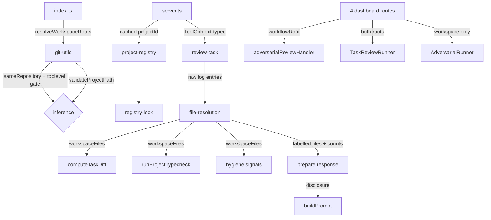

# Design Document

## Overview

Introduce the **workspace** (the worktree an agent is actually in) as a second path root alongside the existing **workflow root** (where the shared `.spec-workflow` lives), and thread it to every operation that touches code while leaving `.spec-workflow` operations on the shared root.

Eight components across four layers:

1. **Resolve** — decide both roots once at process start, from environment, flag, working directory, or path argument, with git invoked in a scrubbed environment.
2. **Propagate** — carry both roots through `ToolContext` and the runner options, with construction sites type-checked so the compiler enforces it.
3. **Consume** — resolve logged paths against both roots, classify each by which root contains it, give each consumer the subset it can use, and disclose what was dropped.
4. **Protect** — make concurrent per-worktree registration lossless, since this spec is what makes it lossy.

Three new modules: `file-resolution.ts`, `root-selection.ts`, `registry-lock.ts`. Two functions move into `src/core/`. Everything else extends existing files.

## Steering Document Alignment

### Technical Standards (tech.md)
N/A — no `.spec-workflow/steering/` documents. The design follows codebase conventions: pure functions in `src/core/`, discriminated-union results over thrown errors for expected failures, `warnOnce` for non-fatal diagnostics, git invocations wrapped so they fail closed.

### Project Structure (structure.md)
N/A — no `structure.md`. Shared logic in `src/core/`, tool handlers in `src/tools/`, dashboard and runners in `src/dashboard/`, tests colocated in `__tests__/`.

### Design System (design-system.md)
N/A — no visual surface, no frontend file changes.

## Code Reuse Analysis

### Existing Components to Leverage

- **`resolveGitRoot`** (`git-utils.ts:38-74`) keeps its signature and its `SPEC_WORKFLOW_SHARED_ROOT` override. Two behaviour changes are stated rather than implied: its git call is scrubbed (R1 AC 9), and the env value it returns is resolved to absolute (R2 AC 9). **Its internal normalization at `:60-66` is not reused** by the new helpers — it strips `.git` and returns the repository *root*, which makes a submodule compare equal to its superproject and makes a filesystem join land on a nonexistent path.
- **`resolveGitWorkspaceRoot`** (`:18-29`) stays the fallback for the workspace path (R1 AC 2). Dropping it would move `projectId`, narrow containment, and break parity for users with no worktrees.
- **`validatePathWithinBases`** (`path-utils.ts:169`) is the codebase's existing two-root containment primitive and is reused by the new resolver rather than reimplemented. `ApprovalStorage.getFilePathCandidates` (`approval-storage.ts:204-239`) and the candidate set at `multi-server.ts:716-738` already implement workspace-first-then-workflow-root ordering; the new resolver matches their order deliberately.
- **`safeRealpath`** (currently `review-task.ts:26-39`) **moves to `src/core/` and gains a return change** — see Component 3. Its `warnOnce` policy (silent on `ENOENT`, warn otherwise) is kept exactly.
- **`ProjectRegistry.registerProject`** already returns the `projectId` (`server.ts:77`), so caching it for symmetric unregistration costs one field.
- **`partitionPaths`** (`path-denylist.ts`): the denylist stays where it is, applied after the root partition.
- **`unregisterProject`'s optional-pid convention** (`project-registry.ts:233-255`) is extended rather than duplicated — see Component 6.

### Integration Points

`src/core/git-utils.ts` · `src/core/project-registry.ts:29-33`, `:190`, `:216`, `:233-264` · `src/core/task-diff.ts:23-27` · `src/core/typecheck.ts:134`, `:139-141` · `src/index.ts:26-36`, `:99-128`, `:166-175`, `:212-215`, `:218-225` · `src/server.ts:77`, `:95-99`, `:135`, `:188` · `src/types.ts:58` · `src/tools/review-task.ts:26-39`, `:276`, `:360-361`, `:380`, `:387-391`, `:410-424` · `src/tools/log-implementation.ts:308` · `src/tools/adversarial-review.ts:51` · `src/tools/adversarial-response.ts:49` · `src/dashboard/task-review-runner.ts:27-35`, `:95`, `:100`, `:144`, `:212`, `:277`, `:368` · `src/dashboard/adversarial-runner.ts:111`, `:147` · `src/dashboard/multi-server.ts:828`, `:852`, `:969`, `:1012`, `:1791`, `:1853`

## Architecture



## Components and Interfaces

### 1. Resolution helpers — `src/core/git-utils.ts`

```ts
/** Absolute, realpath-normalized git common directory. No parent-stripping. */
export function gitCommonDirAbsolute(cwd: string): string | null;

/** Absolute git top-level, or null when the command fails (bare repo, inside .git, non-repo). */
export function gitTopLevel(cwd: string): string | null;

/** True only when both paths are in a repository and it is the same one. */
export function sameRepository(a: string, b: string): boolean;

export function normalizeIdentityPath(p: string): string;

export type WorkspaceSource = 'env' | 'flag' | 'inference' | 'argument';
export interface ResolvedRoots {
  workspacePath: string;
  workflowRootPath: string;
  source: WorkspaceSource;
}

export function resolveWorkspaceRoots(opts: {
  configuredPath: string; cwd: string;
  dashboardMode: boolean; noInference: boolean; noSharedWorktreeSpecs: boolean;
}): ResolvedRoots;
```

- **`gitCommonDirAbsolute`** = `realpath(resolve(cwd, raw))`. Verified forms: bare `.git` at a repo root, `../..`-repeated to depth from a subdirectory, `/main/.git` from a linked or nested worktree, `<super>/.git/modules/<name>` from a submodule, `.` from a bare repository or inside a `.git` directory, and an arbitrary path under `--separate-git-dir`. `resolve` handles all of them without stripping; the `realpath` is what makes a symlinked repo root compare equal to its own linked worktree (R1 AC 6).
- **`sameRepository`** returns `false` if either side is `null`, otherwise compares the two common directories directly — never a derived parent, which is what keeps a submodule distinct from its superproject (R1 AC 5).
- **`gitTopLevel` is a separate, required gate (R1 AC 7).** `--show-toplevel` **fails** in a bare repository and inside a `.git` directory, where `--git-common-dir` still succeeds. Without requiring a successful toplevel on both sides, those failures fall back to their inputs, satisfy the "differing toplevels" precondition, and inference adopts a non-work-tree as the workspace — where the spawn cwd is not a checkout and `git diff` fails.
- **Environment scrubbing (R1 AC 9).** Every git call in this module deletes `GIT_DIR`, `GIT_COMMON_DIR`, `GIT_WORK_TREE`, and `GIT_INDEX_FILE` from a copy of `process.env`. An inherited `GIT_DIR` makes `--git-common-dir` succeed from a **non-repository** and return that value from any directory, so two unrelated repositories compare equal — reachable from a git hook or `rebase --exec`. This is a stated behaviour change to `resolveGitRoot`'s git call, not merely an addition. It also changes the `git --git-dir=$HOME/.dotfiles --work-tree=$HOME` pattern, where the exported variables *are* the configuration; scrubbing is still correct there (we want the directory's own repository) and is called out in Migration.
- **Precedence (R2 AC 3):** `SPEC_WORKFLOW_WORKSPACE` (skipped when `dashboardMode`) → `noInference` → inference → **`resolveGitWorkspaceRoot(configuredPath)`**. The fallback is the git toplevel, not the raw configured path (R1 AC 2).
- **Environment override validation (R2 AC 4-6):** `stat().isDirectory()`, not mere existence — a value naming a file passes an existence test and then throws inside `initialize`, killing the MCP handshake. On failure: log and fall through to inference. When the value is in a different repository from the configured path, warn.
- **Inferred-path validation happens in `initialize`, not in the resolver (R1 AC 8).** `validateProjectPath` is `async` (`path-utils.ts:280`) while `resolveWorkspaceRoots` and `parseArguments` are synchronous, so the resolver cannot await it. The resolver instead reports `source`, and `SpecWorkflowMCPServer.initialize` — which already awaits that predicate at `server.ts:66` — checks the workspace when `source === 'inference'` and **falls back to the configured path with a log rather than throwing**. Today the workspace derives from a path the user chose; under inference it derives from `process.cwd()`, and the predicate rejects non-directories, `/var`-prefixed paths, and paths without write access, any of which would turn a working setup into a failed startup.
- **Workflow root:** `resolve(SPEC_WORKFLOW_SHARED_ROOT)` if set (R2 AC 9 — currently returned verbatim and possibly relative) → `workspacePath` if `noSharedWorktreeSpecs` (R2 AC 8) → `resolveGitRoot(configuredPath)` (R2 AC 7).
- **R1 AC 18 owner:** `index.ts` emits one block when `source === 'inference'`, replacing the existing `:218-225` block rather than printing alongside it.

### 2. Two-root context and override selection — `src/types.ts`, `src/server.ts`, `src/tools/root-selection.ts` (new)

```ts
export interface ToolContext {
  projectPath: string;      // workflow root
  workspacePath: string;    // REQUIRED, untranslated host path
  dashboardUrl?: string;
  lang?: string;
}

export function selectRoots(args: { projectPath?: string }, context: ToolContext):
  { projectPath: string; workspacePath: string };
```

**The typing is the enforcement, verified empirically.** With `workspacePath` required and nothing else changed, `tsc` reports 19 errors and `server.ts` is **not** among them — `setupHandlers(context: any)` (`:135`) launders the unannotated literal at `:95-99`. Annotating the literal and typing the parameter produces the twentieth error. Both changes are required, and the twenty sites must land in one commit because `tsconfig.json` includes `src/**/*` and the build runs bare `tsc` (R3 AC 3).

**Test fixtures (R3 AC 4).** A `{} as ToolContext` assertion **compiles** and passes `undefined` at runtime — the silent default R3 AC 1 forbids, surviving the type check. Fixtures supply real values rather than assertions.

**`selectRoots` (R3 AC 5-9).** With no override, returns the context's two roots. With an override: `workspacePath = <override>`, and `projectPath = resolveGitRoot(<override>)` — derived, not verbatim, because verbatim makes `.spec-workflow` lookups search inside a worktree. `warnOnce` names the override and the discarded `context.workspacePath`.
- **Failed derivation warns (R3 AC 7).** `resolveGitRoot` returns its input unchanged in four cases: `SPEC_WORKFLOW_SHARED_ROOT` set, the git call failing, a common dir with no `.git` substring (verified: `--separate-git-dir`), and a bare repository returning `.`. In those cases the derivation has silently degraded to the behaviour AC 6 forbids, so it warns.
- **Memoized per override value (R3 AC 9)**, because `resolveGitRoot` is a synchronous `execSync` with a five-second timeout and eleven tools accept the argument.
- **Applied to four tools (R3 AC 8):** `review-task.ts:276`, `log-implementation.ts:308`, `adversarial-review.ts:51`, `adversarial-response.ts:49`. The other override-accepting tools read only `.spec-workflow` and are out of scope by criterion.

### 3. File resolution — `src/core/file-resolution.ts` (new)

Replaces `validateAllFiles` (`review-task.ts:41-90`). `safeRealpath`, its `warnOnce` set, and `_resetValidateWarnings` **move from `src/tools/` to `src/core/`** so a core module is not importing upward.

```ts
/** Distinguishes failure causes, which the current signature cannot. */
export type RealpathResult =
  | { ok: true; path: string }
  | { ok: false; code: string };            // 'ENOENT' | 'EACCES' | 'ELOOP' | …

export function safeRealpath(p: string): RealpathResult;

export type DropCause =
  | 'not-array' | 'not-string' | 'resolve-threw'
  | 'missing' | 'realpath-failed' | 'outside-roots';

export interface ResolvedFile {
  path: string;                  // absolute, realpath-normalized
  root: 'workspace' | 'workflow';
  ambiguous: boolean;            // relative entry that anchored under both
}

export interface FileResolution {
  files: ResolvedFile[];
  workspaceFiles: string[];
  workflowFiles: string[];
  drops: Record<DropCause, number>;
}

export function resolveLoggedFiles(
  input: unknown,
  roots: { workspacePath: string; workflowRoot: string }
): FileResolution;
```

- **`safeRealpath` must surface the code (R4 AC 10).** It currently computes the errno, uses it to decide whether to warn, and returns `undefined` for every failure — so `ENOENT` cannot be told from `EACCES`, and neither R4 AC 9's cause accounting nor AC 11's deleted-in-workspace guard is implementable. This is a signature change to an exported function with its own committed test block, including an `ELOOP` message assertion; the `warnOnce` policy itself is unchanged.
- **Input is raw (R4 AC 5).** `review-task.ts:360-361`'s `.map(p => path.resolve(projectPath, p))` is **deleted**; the `new Set` dedupe at `:360` is kept. Pre-absolutizing against the workflow root makes two-root resolution impossible: every relative entry arrives anchored to the wrong root and — because a worktree is a checkout of the same repository — resolves successfully against the wrong tree.
- **Anchoring and classification are different operations (R4 AC 6-8).** `path.resolve` ignores its base for an absolute argument, so a single "resolve against each root in order" function is a no-op for absolute entries and would mark every one of them ambiguous.
  - *Relative* entries: anchor `resolve(workspace, e)`, then `resolve(workflowRoot, e)`. Ambiguous when both anchor successfully.
  - *Absolute* entries: not anchored. Classified by containment alone. Never ambiguous.
- **Drop causes are the six the code actually distinguishes (R4 AC 9)**, each keeping its existing `warnOnce` key where one exists: non-array input, non-string element, `path.resolve` throw, `ENOENT`, non-`ENOENT` realpath failure, containment rejection. The previous draft's four buckets mapped onto a different four and lost the three input-validation causes that have committed tests.
- **Deleted-in-workspace guard (R4 AC 11).** An entry whose workspace resolution fails with `ENOENT` and whose workflow-root resolution succeeds is dropped as `missing`, not substituted — substituting hands the reviewer the main checkout's undeleted copy of a file the task removed. `ENOENT` drops stay silent (R4 AC 12).
- **Containment (R4 AC 13-14)** via `validatePathWithinBases` against `[workspacePath, join(workflowRoot, '.spec-workflow')]` — never the workflow root itself, which in a nested layout contains every sibling worktree. **Both bases are `realpath`-normalized**, since resolved paths are; comparing a normalized path against an unnormalized base rejects every `.spec-workflow` path under a symlinked workflow root.
- **Dedupe by realpath across the whole result (R4 AC 11).** This is load-bearing once the pre-resolution is deleted: the existing `new Set` at `review-task.ts:360` dedupes **raw strings**, so `src/foo.ts` and `./src/foo.ts` survive it, reach the resolver as distinct entries, resolve to one realpath, and would otherwise appear twice in both the file list and the diff pathspec. Note what it does *not* solve: `/wt-a/src/foo.ts` and `/main/src/foo.ts` are distinct realpaths, so dedupe never fires between them — it prevents one file appearing twice, not two same-named files appearing together.
- **Containment throws rather than returning a boolean (R4 AC 12).** `validatePathWithinBases` raises `Path traversal detected: path escapes allowed directories` on failure, so the resolver wraps each entry in a try/catch to produce the `outside-roots` count. The reviewer-facing warning is emitted by the resolver, not by the primitive, whose message names neither root.

### 4. `review-task` consumers and disclosure — `src/tools/review-task.ts`

| Consumer | Root argument | File argument | Criterion |
|---|---|---|---|
| `computeTaskDiff` (`:389`) | **workspace** | `workspaceFiles` | R4 AC 1, 18 |
| `runProjectTypecheck` (`:387`) | **workspace** | `workspaceFiles` | R4 AC 2, 20 |
| `computeHygieneSignals` (`:388`) | — | `workspaceFiles` | R4 AC 21 |
| `unwrapTypecheck` (`:391`) | **workspace** | — | R4 AC 2 |
| `filesToReview` | — | `files` (labelled) | R4 AC 15 |
| spec/steering/settings (`:285`, `:345`, `:381`, `:432`, `:556`) | workflow root | — | R4 AC 22 |

- **Typecheck root split (R4 AC 2-5).** `runProjectTypecheck` uses its root in **five** places that determine which tree is compiled, not three: `tsconfigPath` (`typecheck.ts:113`), `resolveTscBinary` (`:134`), the **`-p` argument** (`:146`), the **`spawnTsc` working directory** (`:153`), and the `tsconfigPath` that `unwrapTypecheck` reports on the rejection arm (`review-task.ts:391`). It gains a **required** second parameter: those five take the **workspace**, while the cache **directory** mkdir (`:139-140`) and `ensureGitignoreEntry` (`:141`) take the **workflow root**. Missing `-p` or the spawn cwd compiles the main checkout while reporting the worktree's `tsconfigPath` — a path that lies about which tree was compiled. Passing the workspace for the cache and ignore write instead creates a `.spec-workflow` directory inside every worktree and leaves each with an uncommitted edit to its tracked `.gitignore`.
- **The cache file is keyed per workspace (R4 AC 4).** The directory belongs on the shared root; the file does not. A single `<workflowRoot>/.spec-workflow/.cache/tsc.tsbuildinfo` is written with `--incremental` against a different `-p` root by every worktree — so in the primary use case the cache is at best useless (every run a full rebuild) and at worst concurrently truncated, tripping `TSBUILDINFO_REBUILD_RE` on unrelated reviews. The filename carries a per-workspace discriminator.
- **The second parameter is required, and its twenty-five test call sites move with it (R4 AC 5).** `src/core/__tests__/typecheck.test.ts` calls `runProjectTypecheck` twenty-five times with a single root, and `tsconfig.json` includes `src/**/*` under a bare `tsc` build, so those are build errors. An optional parameter would compile while leaving the default silently on one root, which an equal-roots parity test cannot detect.
- **Containment asserted before git (R4 AC 18-19).** Every path handed to the diff is asserted under the workspace first. A workflow-root path reaching `git diff -- <pathspec>` with `cwd` set to the workspace makes git exit 128 and discards the whole diff. Asserting is locale-free; matching git's gettext-marked `is outside repository` message is not. **On assertion failure the result carries `TaskDiffResult.rejection`** (`task-diff.ts:9`, already consumed at `review-task.ts:101-102`) rather than an empty diff — otherwise it lands in the benign "already committed" classification.
- **Disclosure counts (R4 AC 19).** The prepare response gains `fileResolution: { workspaceCount, workflowCount, drops }`, reaching the agent on both review paths.
- **The all-drop case is actionable, not merely disclosed (R4 AC 20).** When `workspaceCount === 0` and the task logged files, the prompt's "Read every file listed in 'Files to Review'" instruction (`task-review-runner.ts:281`) and the `nextSteps` guidance (`review-task.ts:426`) are **both replaced** with a statement that no reviewable files were resolved and that a pass must not be returned on that basis. A note added above an unchanged read-every-file instruction leaves the harm fully intact: the agent still receives an empty list, an instruction to read it, and `R4_2A_DIFF_EMPTY`'s fabricated "already committed" explanation. This spec widens the all-drop case three ways — the AC 14 guard, narrowed containment against absolute logged paths, and `tsc-not-found` in fresh worktrees — so disclosure alone is not sufficient.
- **The disclosure must survive the runner (R4 AC 21).** `task-review-runner.ts:110` destructures five fields from an `any`-typed `prepareResponse.data` and discards the rest; `fileResolution` is added there and passed onward. **`buildPrompt`'s eleven positional parameters become a single options object** in the same change: inserting a field into that list silently shifts `methodology` into the new slot, `outputPath` into `methodology`, and the real output path into `priorReviewContext: string | null` — all assignable, so `tsc` reports nothing and the agent gets a prompt that never learns where to write its result. Separately, `filesToReview` changes from `string[]` (`:212`) to the labelled shape and its renderer (`:277`) and two committed assertions update with it. **The compiler catches none of this** because the destructure is `any`.

### 5. Runner contracts and route wiring — `task-review-runner.ts`, `adversarial-runner.ts`, `multi-server.ts`

```ts
interface RunOptions {                       // TaskReviewRunner
  projectId: string; specName: string; taskId: string;
  workflowRoot: string;    // getSpecPath (:95), ToolContext.projectPath (:100)
  workspacePath: string;   // spawn cwd (:144 → :365), ToolContext.workspacePath
  model?: string; cli?: string; cliArgs?: string[];
}
```

**`AdversarialRunner`'s public options stay single-field; the workflow root reaches its spawn as an argument (R5 AC 5).** It uses its path at exactly one place (`:111` → spawn `cwd`), never resolves a spec path, never builds a `ToolContext` — so a second `RunOptions` field would be dead. But R2 AC 13 requires `SPEC_WORKFLOW_SHARED_ROOT` to be set explicitly at that spawn (`:147`), which needs the workflow root. The private spawn helper therefore takes it as a parameter, keeping the public contract single-field without leaving the env unset. Stated here because the two criteria read as contradictory in isolation.

**Four routes, not two (R5 AC 6-8).** The previous draft's wiring list read as exhaustive and omitted the adversarial retry route entirely.

| Route | Handler → workflow root | Runner → workspace |
|---|---|---|
| task-review | — | `:1791` |
| task-review retry | — | `:1853` |
| adversarial-review | `:828` | `:852` |
| adversarial-review **retry** | **`:969`** | **`:1012`** |

The `ToolContext` change surfaces `:969` as a compile error and the runner field rename surfaces `:1012`, so these are discoverable — but the obvious mechanical fix at `:969` (add `workspacePath: project.originalProjectPath`) preserves the bug, which is why the table states the intended value.

**Env at both spawn sites** (`task-review-runner.ts:368`, `adversarial-runner.ts:147`): `SPEC_WORKFLOW_WORKSPACE` and `SPEC_WORKFLOW_SHARED_ROOT` set explicitly to the job's roots; the four `GIT_*` variables removed; path-translation prefixes preserved (R2 AC 13).

**The third git site (R2 AC 12).** `runGit` (`task-diff.ts:23-27`) is `env: { ...process.env, GIT_OPTIONAL_LOCKS: '0' }` — it inherits wholesale. It runs in the **parent** process, so neither spawn-site scrub reaches it. Verified consequence: with `GIT_DIR` pointing elsewhere, `git diff --numstat -M HEAD -- <file>` returns **empty stdout at exit 0**, so `runGit` reports `ok: true`, `computeTaskDiff` takes the success path with no rejection, and the agent is told the changes were already committed. The four variables are deleted there too. `typecheck.ts:153` has the same shape and is included for consistency.

### 6. Identity normalization — `src/core/project-registry.ts`, `src/server.ts`

- **`normalizeIdentityPath` applied inside `generateProjectId`** (`:29-33`), covering all four call sites. Normalizing only at registration would be worse than not normalizing, because `server.ts:188` unregisters by path.
- **The stored path is normalized identically (R1 AC 11).** `registerProject:190` computes `resolve(projectPath)` and `:216` stores that value; normalizing only the *id* leaves identity and stored path as different spellings of one directory, and the stored spelling flows into `ProjectContext.workspacePath`, the spawn cwd, the git cwd, and the containment base. `readRegistry:106` re-normalizes with `resolve()` and is updated to match.
- **Deterministic fallback (R1 AC 12).** When `realpath` fails, both sides of any comparison fall back identically, which is why the normalization lives inside `generateProjectId` rather than at its call sites.
- **Unregistration by cached id (R1 AC 13).** `registerProject` already returns the id; the server caches it and `stop()` (`:188`) uses it. Rather than adding a near-duplicate method name, **`unregisterProjectById(projectId, pid?)` gains the same optional-pid convention `unregisterProject` already uses** — omit the pid to delete the entry, pass it to remove one instance.

### 7. Registry lock — `src/core/registry-lock.ts` (new)

Scoped to the registry writers only (R6 AC 6); the four other shared-root files and the global-directory anchor stay with `worktree-dashboard-concurrency`.

```ts
export async function withRegistryLock<T>(lockPath: string, fn: () => Promise<T>): Promise<T>;
```

- **Why a lock (R6 AC 1-2).** Before per-worktree identity, N worktrees computed the same `projectId` and concurrent registration converged, costing at most a stale `instances` array. After, N worktrees compute N ids, so two agents starting together each read a registry without the other and the second write erases the first — one worktree never appears, and none of Components 4-5's contracts fire for it. No user configuration avoids it. An optimistic re-read cannot fix it: with no registry file present every process observes absence at every check and every process writes.
- **Ensure the directory exists before acquiring.** `ensureRegistryDir` is called only from `readRegistry:87` and `writeRegistry:148` — both *inside* `registerProject`, i.e. inside the critical section. On a first run the global directory does not exist, so `fs.open(lockPath, 'wx')` fails with **ENOENT, not EEXIST** — which is exactly R6 AC 2's scenario. A retry loop treating every failure as contention burns the budget and leaves all N processes unregistered; treating it as fatal throws and kills the handshake. The lock helper mkdirs the directory first and distinguishes `EEXIST` (contention, retry) from every other errno (report, do not spin).
- **Acquire** via `fs.open(lockPath, 'wx')`, releasing in `finally`. Retry within a bounded time budget; on exhaustion **log prominently and continue unregistered** (R6 AC 4) — `registerProject` is awaited before the transport connects (`server.ts:77`, `:113`), so throwing kills the MCP handshake.
- **Unique temp name (R6 AC 3):** `${registryPath}.${pid}.${counter}.tmp`. This — not rename atomicity — is what stops two writers interleaving bytes into one shared temp file.
- **Staleness (R6 AC 5):** judged on the lock file's `mtime` from `fs.stat`, not a self-reported timestamp, and **not** via `isProcessAlive`, which returns `true` unconditionally under path translation (`project-registry.ts:166-171`) and would make a crashed container's lock permanently unbreakable. Breaking is **atomic**: `rename(lockPath, lockPath + '.' + pid + '.stale')` and proceed only if the rename succeeded, so two processes that both judge a lock stale cannot both acquire.
- Wrapped writers: `registerProject`. `cleanupStaleProjects`, `unregisterProject`, and `unregisterProjectById` are left to spec 3 by R6 AC 6 — noted as a known residual, since a shutdown racing a startup can still lose an entry.

### 8. CLI flag registration — `src/index.ts`

Five sites, not two (R1 AC 16): `validFlags` (`:115`), the argument filter (`:166-175`), a boolean read alongside the existing flags (`:109-111`), the return type and `main()` destructure (`:99-108`, `:212-215`), and the `--help` OPTIONS block (`:26-36`). Omitting the `validFlags` entry does not misparse the path — the loop at `:116-128` **throws** and the server refuses to start.

**The `=value` hole fails loudly (R1 AC 17).** The validation loop accepts `--flag=value` by flag name while the filter matches exact strings, so `--no-workspace-inference=true` passes validation, survives filtering, and becomes the project path. **Merely fixing the filter would be worse**: the boolean reads are exact-string matches (`args.includes('--no-open')`), so the argument would then be stripped from the path position and read as `false` — silently discarding the opt-out whose purpose is escaping a bad inference. Instead, a boolean flag in `=value` form is **rejected with an error naming the bare form**, for all three boolean flags.

## Data Models

### ResolvedRoots (in-memory)
```
- workspacePath: absolute, realpath-normalized
- workflowRootPath: absolute, realpath-normalized   ← both, so containment compares like with like
- source: 'env' | 'flag' | 'inference' | 'argument'
```

### FileResolution (in-memory) / RealpathResult
As defined in Component 3. `drops` is keyed by the six causes the code distinguishes.

### Lock file — `<registryPath>.lock`
```
- pid: number, hostname: string
```
Staleness comes from the file's `mtime`, not from a recorded timestamp.

No new on-disk formats otherwise. Per-task state belongs to `worktree-review-signals`.

## Error Handling

1. **Git unavailable or path not a repository** — each invocation wrapped; `gitCommonDirAbsolute` and `gitTopLevel` return `null`, `sameRepository` returns `false`, resolution falls back to the configured path's toplevel. Never throws out of `parseArguments`.
2. **`--show-toplevel` fails on either side** — inference does not fire (R1 AC 7).
3. **Inferred path fails validation** — fall back to the configured path with a log (R1 AC 8).
4. **`SPEC_WORKFLOW_WORKSPACE` is missing, not a directory, or in another repository** — log and fall through to inference, or warn and proceed respectively. Startup is never aborted (R2 AC 4-6).
5. **`realpath` fails during identity computation** — deterministic fallback to the un-normalized absolute path, logged (R1 AC 12).
6. **Lock budget exhausted** — log prominently, continue unregistered (R6 AC 4).
7. **Every logged path drops** — `drops` records the causes and `fileResolution.note` states it, reaching both review paths (R4 AC 16). This is the one silent-failure path the previous draft deferred and this one closes.
8. **Containment assertion fails before git** — `TaskDiffResult.rejection` is set, distinguishable from an empty diff (R4 AC 19).
9. **Worktree directory removed while registered** — dashboard project construction reads only the workflow root, so registration does not fail; the failure surfaces at the runner's `spawn({ cwd })` and at git invocation. Tests target those sites.

## Implementation Order

Where a boundary is not a commit boundary it is not a task boundary either — the sets below are single units of work with one build-green point, not sequences to be split. `tsconfig.json` includes `src/**/*` and the build runs bare `tsc`, so an intermediate state is a **build** failure, not just a test failure.

Two orderings matter beyond compilability:

- **The parity characterization test and the registry lock belong at the front.** Per-worktree identity is what converts registration from benign convergence into a lost-registration race, so every commit between that change and the lock is a window in which a dogfooding user silently loses a worktree. The lock touches only `project-registry.ts` and a new module, so moving it early costs nothing in dependencies.
- **The two-root consumer chain should not be built on a placeholder.** Between the `ToolContext` change and the runner split, every dashboard-spawned review carries a `workspacePath` that is actually the workflow root. Behaviour is unchanged today because the two are equal on that path — which is the problem: several tasks' criteria would go green against a context that is lying. The runner split lands immediately after the context change.

1. **`ToolContext.workspacePath` required + all twenty sites, in one commit.** Compiler-verified: 19 errors from the field alone, 20 with the annotation and typed parameter. Indivisible.
2. **`safeRealpath`'s move to core and its return change** must land with `file-resolution.ts` and with its own test block, including the `ELOOP` assertion.
3. **`review-task.ts:360-361`'s deletion must not land *after* the two-root partition.** Deleting the `.map` alone is safe — the resolver re-anchors against the workflow root, matching today. The reverse order is the defect a prior revision shipped in draft.
4. **The `filesToReview` shape change must land with `buildPrompt`'s signature, `:277`, and the two committed assertions.** Nothing else catches it; the destructure is `any`.
5. **Each runner option change must land with all of its routes**: `TaskReviewRunner` with `:1791` and `:1853`; `AdversarialRunner` with `:852` and `:1012`.
6. **`git-utils.ts`'s new exports must land with `index-args.test.ts`'s `vi.mock` factory**, which declares exactly two exports — an incomplete factory throws every test in the file.

## Migration

- **`projectId` changes wherever `realpath` differs from `resolve`** — a symlinked home, an automounted network home, macOS `/tmp` → `/private/tmp`. The dashboard URL moves and the previous entry orphans. Orphans are **permanent** under path translation, because the liveness check that would reap them returns `true` unconditionally there.
- **Worktrees gain new identifiers.** Prior job history, review artifacts, and approvals stay attributed to the main checkout's identifier and are not migrated.
- **Fresh worktrees lose the typecheck signal.** Compiler resolution moves to the workspace, so a worktree without `node_modules` reports `tsc-not-found` where it previously resolved against the main checkout and ran. Honest, and a behaviour change in the primary use case.
- **`GIT_*` scrubbing changes the dotfiles pattern.** `git --git-dir=$HOME/.dotfiles --work-tree=$HOME` relies on exported variables; scrubbing means resolution sees the directory's own repository. Correct for this purpose, and stated rather than discovered.
- **Exported type shapes change.** `ToolContext` gains a required field, `validateAllFiles` is **removed**, `safeRealpath`'s return changes and it moves module, a new resolver module appears, and both runner option types change field names. The package has no `exports` map and no `types` field, so a deep import of the generated declarations resolves and type-checks today: the surface is **undocumented and unintended**, not unsupported by the packaging. The release states that position and **does not add an `exports` map** — the actual consumption route is `bin` via `npx`, which bypasses `exports` entirely, so it would enforce nothing while requiring a `./package.json` entry and a `types` condition to avoid breaking manifest reads and bare-specifier types.
- **A relative `SPEC_WORKFLOW_HOME` defeats this spec's headline observable.** `getGlobalDir()` resolves it against `process.cwd()`, so per-worktree agents get one registry each and the dashboard sees none. `worktree-dashboard-concurrency` owns the fix; until then, absolute values are required in multi-worktree use.

## Testing Strategy

### Fixtures and ordering

Two pieces of test scaffolding must exist **before** the changes they guard, not after:

- **A unit-level git fixture (R7 AC 1)** creating a real repository with linked worktrees in sibling and nested layouts, torn down after. The resolution helpers and the file resolver both need it. Its submodule case passes `-c protocol.file.allow=always`, without which `git submodule add` from a local path has failed by default since git 2.38.1 and the case silently never runs. It cannot live in `src/core/__tests__/git-utils.test.ts`, which mocks `child_process` wholesale (`:11-13`); real-repository tests get their own file.
- **A characterization test (R7 AC 8)** capturing today's parity observables — file sets, containment decisions, `tsconfigPath`, `projectId` — for a non-worktree project with no path argument. Written after the changes it can only record what the code then does and cannot fail, which makes it no guard at all for the population most at risk.

### Unit Testing
- **`gitCommonDirAbsolute`** against real temporary repositories: repo root, subdirectory at depth, linked worktree, nested worktree, submodule, bare repository, `--separate-git-dir`, `.git`-as-file, symlinked root, and non-git.
- **`gitTopLevel`**: succeeds in a work tree; **fails** in a bare repository and inside `.git` — the cases R1 AC 7 gates on.
- **`sameRepository`**: main vs its own worktree (true); symlinked root vs its worktree (**true** — the R1 AC 6 guard); superproject vs submodule (false); unrelated repos (false); **with `GIT_DIR` exported to an unrelated repository (false)** — the R1 AC 9 guard; two non-git directories (false).
- **`resolveWorkspaceRoots`**: the full precedence matrix; `dashboardMode` suppressing the env override; `--no-shared-worktree-specs` holding the workflow root on the workspace; `SPEC_WORKFLOW_SHARED_ROOT` outranking it and being absolutized; a non-directory env value falling through; a different-repository env value warning; an inferred path failing `validateProjectPath` falling back; and **the fallback returning the git toplevel, not the raw configured path** (R1 AC 2).
- **`safeRealpath`**: `ok: true` for a real path; `code: 'ENOENT'` silent; `code: 'ELOOP'` warned with the existing message.
- **`resolveLoggedFiles`**: a bare relative path resolving to the workspace (the R4 AC 5 guard); a relative path anchoring under both, asserted `ambiguous`; **absolute paths under each root asserted NOT ambiguous** (the R4 AC 7-8 guard); each of the six drop causes; a file deleted in the workspace but present in the workflow root, asserted dropped as `missing`; containment accepting `.spec-workflow` above the workspace while rejecting a sibling worktree in a nested layout; containment against a **symlinked** workflow root (the R4 AC 14 guard); dedupe.
- **`selectRoots`**: no override; override deriving the workflow root; each of the four degradation cases warning; memoization.
- **`withRegistryLock`**: mutual exclusion; `mtime`-based staleness; atomic break with two contending breakers; budget exhaustion.
- **`generateProjectId`**: a symlinked path registers and unregisters under one id; id and stored path agree; unregistration after directory removal deletes the entry.
- **`parseArguments`**: `--no-workspace-inference` in both bare and `=value` forms; `--help` lists it.

### Integration Testing
- `handlePrepare` with workspace ≠ workflow root: bare relative entries resolve to the workspace; `.spec-workflow` entries resolve to the workflow root, appear labelled in `filesToReview`, and appear in none of the diff, typecheck, or hygiene inputs; spec/steering/settings read from the workflow root; `tsconfigPath` identical across arms; **the typecheck cache and `.gitignore` are written to the workflow root, and no `.spec-workflow` appears in the worktree** (R4 AC 3).
- **All-drop path**: every logged entry unresolvable → `fileResolution.note` present in the prepare response **and** in the built prompt.
- `TaskReviewRunner`: two-field contract; `getSpecPath` on the workflow root; spawn `cwd` on the workspace; four `GIT_*` variables absent from the child env.
- `runGit` with `GIT_DIR` exported: the diff is correct, not empty (R2 AC 12).
- All four routes: both adversarial handlers receive the workflow root and locate their target document; both adversarial runners receive the translated workspace; both task-review routes pass both roots.
- Registry: N concurrent registrations against a **nonexistent registry file and a nonexistent global directory** yield N entries — the ENOENT-versus-EEXIST case, not merely a contended one.
- **Non-regression for the "SHALL continue" criteria (R7 AC 9):** settings still load from the workflow root on both adversarial routes (`multi-server.ts:836` and the retry equivalent), and the job scheduler still passes the workflow root to `cleanupSpecs` / `cleanupArchivedSpecs` (`job-scheduler.ts:176`, `:184`). These break silently under a sweeping rename of a runner's `projectPath` field, with no compiler error.
- **Parity for a non-worktree project with no path argument**: file sets, containment decisions, `tsconfigPath`, and `projectId` unchanged (R3 AC 11, R7 AC 8).

### End-to-End Testing
`e2e/helpers/worktree-harness.ts` is **rewritten, not extended** (R7 AC 2). It runs only in `--no-shared-worktree-specs` mode, seeds `.spec-workflow` inside each worktree, and spawns the server with `cwd: serverRoot` (`:202`) — this repository — so inference can never fire. The replacement sets the child `cwd` to the worktree, which **requires changing the invocation from `npm run` to a direct `node`/`tsx` call with an absolute entry path** (R7 AC 3), because the temporary repository has no `package.json`. It seeds `.spec-workflow` in the main repository for shared mode and builds both sibling and nested layouts.

Scenarios: two worktrees register as distinct projects sharing one spec list; a review triggered from worktree A diffs A's files and not B's; a task whose logged paths are bare relative filenames produces a non-empty diff from a worktree; an adversarial review triggered from a worktree locates its target document; two agents starting simultaneously both appear.
