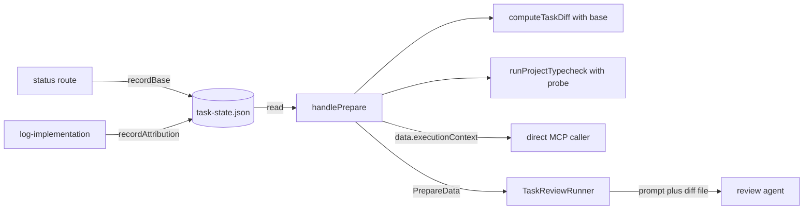

# Design Document

Document version: v1

## Overview

This design adds one per-task record under the shared spec directory, a dependency probe with `observed` statements in the typecheck, a base-aware `computeTaskDiff`, and one `executionContext` object that `handlePrepare` builds once and both review paths carry to the agent. It sits in `src/core` (store, git helpers, typecheck), `src/tools` (prepare, log, adversarial scaffold) and `src/dashboard` (status route, runner). It reuses `withRegistryLock` and `uniqueTempPath` for the store, `runGit` for every new git call, and `normalizeIdentityPath` for path identity.

## Steering Document Alignment

### Technical Standards (tech.md)
No `tech.md` exists; `.spec-workflow/agent-rules.md` governs checks and layout.

### Project Structure (structure.md)
No `structure.md`; new modules go beside their peers (`src/core/task-state-store.ts` next to `registry-lock.ts`), tests in the adjacent `__tests__/`.

### Design System (design-system.md) — if applicable
N/A: no visual surface.

## Architecture

Two writers and one reader share the record: the dashboard status route writes a base keyed by workspace, `log-implementation` writes attribution, `handlePrepare` reads both and never writes. `handlePrepare` resolves the base (validated by ancestry), passes it to `computeTaskDiff`, folds the typecheck's `observed` text and the attribution comparison into `executionContext`, and returns it in `data`; the runner reads `data` through a typed interface, renders the same object, and moves the diff body to a file. The all-drop state becomes a fifth `DiffMethodologyState` kind with its own constants, so no pinned byte moves. The encoder change is a dependency bump proven by probe.



## Components and Interfaces

### Component 1 — `TaskStateStore` (`src/core/task-state-store.ts`, new)
- **Purpose:** One JSON record per spec holding, per task, the bases keyed by workspace and the shared attribution; two owners, one lock.
- **Interfaces:**
  ```ts
  export const TASK_STATE_FILE = 'task-state.json';
  export class TaskStateStore {
    constructor(specPath: string);   // file <specPath>/task-state.json, lock <specPath>/task-state.json.lock
    read(taskId: string): Promise<TaskStateRecord | null>;   // never throws
    recordBase(taskId: string, workspacePath: string, commit: string): Promise<boolean>;
    recordAttribution(taskId: string, attribution: TaskAttribution): Promise<boolean>;
  }
  ```
  Both writers run `withRegistryLock(lockPath, fn)`; inside `fn`: read, parse, mutate one field, write `uniqueTempPath(filePath)`, `fs.rename`. `acquired: false` returns false with `console.warn`. `bases` keys are `normalizeIdentityPath(workspacePath)`. `read` takes no lock: rename leaves the file complete or absent; missing, unreadable, malformed or `version !== 1` returns null and warns once per file.
- **Dependencies:** `registry-lock.ts`, `git-utils.ts`, `node:fs/promises`.
- **Reuses:** `withRegistryLock` (`src/core/registry-lock.ts:350-391`), `RegistryLockResult` (`:38-40`), `uniqueTempPath` (`:52-54`), `writeRegistry`'s temp-then-rename (`src/core/project-registry.ts:277-279`), `normalizeIdentityPath` (`src/core/git-utils.ts:101-112`). The registry's own lock (`registry-lock.ts:7-11`) is not shared.

### Component 2 — git helpers and base-aware diff (`src/core/task-diff.ts`)
- **Purpose:** Read `HEAD`, validate ancestry, diff from a base, classify git failure.
- **Interfaces:**
  ```ts
  type GitRun = { stdout: string; ok: boolean; cause?: string };   // :37; cause: err.code when a string, `exit <n>` when a number, else err.message
  export async function readHeadCommit(workspacePath: string): Promise<string | null>;        // rev-parse --verify HEAD^{commit}; null unless 40 hex chars
  export async function isAncestorOfHead(workspacePath: string, commit: string): Promise<boolean>;   // merge-base --is-ancestor <commit> HEAD; true only on exit 0
  export async function computeTaskDiff(workspacePath: string, allFiles: string[], base: string): Promise<TaskDiffResult>;
  export function gitFailureMessage(cause: string, base: string, workspacePath: string): string;
  ```
  `base` replaces the `HEAD` literal in both argument arrays at `:183-184`; required, not defaulted. The `!ok` arm (`:191-193`) returns `diff: ''`, `stats: undefined`, `rejection: { message: gitFailureMessage(cause, base, workspacePath) }`, where `cause` is the first failing run's. Probe in this repository: `git merge-base --is-ancestor HEAD~3 HEAD` exits 0, the reverse exits 1, an unknown sha exits 128; both non-zero results mean "not validated".
  Stated text: "GIT DIFF FAILED. `git diff` from `<base>` in `<workspacePath>` did not complete: `<cause>`. No diff was computed for this task. This is not a benign empty diff and does not show the changes were committed. Read every file in filesToReview, evaluate it against the implementation log, and report this failure in your review summary." Causes seen today: `ENOENT` (no git), `exit 128` (not a repository), `ERR_CHILD_PROCESS_STDIO_MAXBUFFER` (stdout above `MAX_BUFFER`, `:30`).
- **Dependencies:** `runGit` (`:50-62`) with its scrubbed env (`:54`).
- **Reuses:** `runGit`; the stated-text pattern of `containmentRejectionMessage` (`:135-147`); the `rev-parse --verify` form at `:361`.

### Component 3 — typecheck honesty (`src/core/typecheck.ts`)
- **Purpose:** Refuse to spawn `tsc` over a broken install; state what every `unavailable` result observed.
- **Interfaces:** the `unavailable` arm (`:27-42`) becomes
  ```ts
  { tsconfigPath: string; status: 'unavailable';
    reason: 'no-tsconfig' | 'project-references' | 'wrapper-config' | 'tsc-not-found' | 'dependencies-unresolved'
          | 'no-parseable-output' | 'output-overflow' | 'feature-disabled' | 'rejection';
    observed: string; rejectionMessage?: string }
  async function probeDeclaredDependencies(workspacePath: string): Promise<{ declared: number; unresolved: string[] } | null>;
  ```
  `observed` is required, so every construction site states one: `:144`, `:151`, `:156`, `:159`, `:164`, `:199`, `:218`, `:221`, `unwrapTypecheck` (`src/tools/review-task.ts:96-101`), and the probe site. The probe reads `<workspacePath>/package.json`; absent or unparseable returns null and the check proceeds. Names are the keys of `dependencies` and `devDependencies`; `optionalDependencies` are excluded. One `fs.access(<workspacePath>/node_modules/<name>/package.json)` per name, awaited together, against the workspace's own `node_modules` only (D7). It runs after `resolveTscBinary` succeeds (`:162-165`) and before `spawnTsc` (`:188`); any unresolved name returns `reason: 'dependencies-unresolved'` with no spawn. The `no-tsconfig` arm (`:147-152`) adds one `fs.access(<workflowRoot>/tsconfig.json)` so `observed` can state whether the workflow root has one; `tsconfigPath` stays `:141`. The `timeout` (`:193-197`), `output-overflow` (`:198-200`) and `no-parseable-output` (`:217-222`) arms are unchanged apart from `observed`.
- **Dependencies:** `node:fs/promises`.
- **Reuses:** `resolveTscBinary` (`:409-423`); `computeTypecheckMethodologyState` (`src/tools/review-task.ts:55-74`) maps the new reason to `unavailable-other` unchanged; `gate-rules.ts:303-308` prints the reason string unchanged; `R4_6B_TYPECHECK_UNAVAILABLE` (`src/tools/review-task.ts:815-816`) is not edited.

### Component 4 — `handlePrepare` (`src/tools/review-task.ts:348-536`)
- **Purpose:** Resolve base and attribution, run the diff from the base, build `executionContext` once.
- **Interfaces:** inserted after resolution (`:440-457`), before the settled block (`:467-477`):
  1. `record = await new TaskStateStore(specPath).read(taskId)`.
  2. Base: `entry = record?.bases[normalizeIdentityPath(workspacePath)]`. None: `{ commit: 'HEAD', provenance: 'head-expected' }`. Present: `await isAncestorOfHead(workspacePath, entry.commit)`; true gives `{ commit: entry.commit, provenance: 'recorded' }`, false gives `{ commit: 'HEAD', provenance: 'head-degraded' }` with the rejected sha in `detail`. One git spawn, only when an entry exists.
  3. `computeTaskDiff(workspacePath, workspaceFiles, diffBase.commit)` at `:473`.
  4. Attribution: no `record?.attribution` gives `unknown`; else `normalizeIdentityPath(a.workspacePath) === normalizeIdentityPath(workspacePath)` gives `match`, otherwise `mismatch`. Read regardless of workspace.
  5. `diffState = computeDiffMethodologyState(diffResult, noReviewableFiles)` (`noReviewableFiles` from `:457`).
  6. `executionContext` (Data Models) added to `data` (`:494-511`); `data` is typed `PrepareData`; `diffStats: diffResult.stats ?? null`.
  ```ts
  export type DiffMethodologyState = { kind: 'present' } | { kind: 'present-truncated' } | { kind: 'empty' } | { kind: 'no-files' } | { kind: 'rejected'; message: string };
  export function computeDiffMethodologyState(result: TaskDiffResult, noReviewableFiles = false): DiffMethodologyState;
  export interface PrepareData {
    taskContext: TaskContext; implementationSummary: ImplementationSummary; steeringExcerpt: string | null;
    filesToReview: ResolvedFile[]; fileResolution: FileResolutionCounts; hygieneSignals: HygieneSignal[];
    methodology: string; typecheckResults: TypecheckResult[];
    diff: string; diffStats: NonNullable<TaskDiffResult['stats']> | null; skippedPaths: string[]; diffTruncated: boolean;
    diffRejection?: { message: string }; hygieneRejection?: { message: string };
    executionContext: ExecutionContext;
  }
  ```
  Precedence in `computeDiffMethodologyState`: `rejection` first, then `noReviewableFiles`, then `diff === ''`, then truncation. `nextSteps` (`:512-520`) and `projectContext` (`:521-526`) are unchanged.
  `executionContext.notes`, built here and rendered verbatim by the runner:
  - `head-degraded`: "Name in your review summary that the recorded diff base `<sha>` was rejected and the diff was taken from HEAD."
  - `mismatch`: "Name in your review summary that this work was logged from `<path>`, not from the workspace under review."
  - typecheck `timeout`, or `unavailable` with any reason but `feature-disabled`: "Quote `executionContext.typecheck.observed` where the methodology's item 10 asks you to surface the typecheck degradation."
  `head-expected`, `recorded`, `match`, `unknown`, `success` and `feature-disabled` add no note.
- **Dependencies:** Components 1, 2, 3.
- **Reuses:** `hasNoReviewableFiles` (`:317-321`), `PathUtils.getWorkflowRoot` (`src/core/path-utils.ts:208-210`), `normalizeIdentityPath`.

### Component 5 — methodology constants (`src/tools/review-task.ts:661-838`)
- **Purpose:** An all-drop review carries no read-every-file instruction and no already-committed explanation, without moving a pinned byte.
- **Interfaces:** two new exported constants.
  `NO_FILES_METHODOLOGY_HEADER` replaces the `:675` sentence when `diffState.kind === 'no-files'`: "No workspace files are available for this review: none of the files in the implementation log resolved inside the workspace under review, and no diff was computed. For each item below, state what you could and could not check; an absent file is not a pass."
  `NO_FILES_DIFF_PREAMBLE`, the `no-files` case of `renderDiffPreamble` (`:783-802`): "**No diff and no workspace files.** The implementation log's files did not resolve in the workspace under review, so no pathspec reached git. This is not an empty diff of an unchanged tree and is not evidence that the changes were committed; the implementation is not available to read. Report the unresolved files as a critical finding (see the fileResolution counts)."
  `NO_REVIEWABLE_FILES_DISCLOSURE` (`:345-346`): its last sentence becomes "The methodology header and the diff preamble in this review context state the same: no workspace files resolved and no diff was computed."
- **Dependencies:** none new.
- **Reuses:** `R4_1` to `R4_7` (`:771-781`, `:806-819`) unchanged; `FIXTURE_INPUTS` (`src/tools/__tests__/review-task.test.ts:1127`) has no `no-files` entry, so the seventeen fixtures and the drift test (`:1458-1500`) are untouched.

### Component 6 — status route (`src/dashboard/multi-server.ts:1417-1477`)
- **Purpose:** Record the workspace's `HEAD` when the dashboard sets a task in-progress.
- **Interfaces:** after the write and broadcast (`:1465-1467`), when `status === 'in-progress'`: `commit = await readHeadCommit(project.workspacePath)`; non-null runs `new TaskStateStore(PathUtils.getSpecPath(project.projectPath, name)).recordBase(taskId, project.workspacePath, commit)`. Wrapped in try/catch with `console.warn`; the response (`:1469-1473`) is identical on every arm. The same-status early return (`:1450-1456`) records nothing; other status values record nothing; a later in-progress transition overwrites the workspace's entry.
- **Dependencies:** Components 1, 2; `ProjectContext.workspacePath` (`src/dashboard/project-manager.ts:14`).
- **Reuses:** `PathUtils.getSpecPath` (`src/core/path-utils.ts:212-214`).

### Component 7 — `log-implementation` (`src/tools/log-implementation.ts:297-429`)
- **Purpose:** Record where and at which commit the work was logged.
- **Interfaces:** `:316` becomes `const { workflowRoot: projectPath, workspacePath } = selectRoots(args, context)`. After `addLogEntry` (`:390`): `commit = await readHeadCommit(workspacePath)`, then `new TaskStateStore(specTasksPath).recordAttribution(taskId, { workspacePath, commit, source, loggedAt })` with `source = hasProjectPathOverride(args) ? 'override' : 'context'`. Failure warns; the response (`:395-416`) is unchanged. `hasProjectPathOverride(args)` is a new export of `src/tools/root-selection.ts` holding the predicate at `:203-205`.
- **Dependencies:** Components 1, 2.
- **Reuses:** `selectRoots` (`src/tools/root-selection.ts:202-221`); `specTasksPath` (`:341`).

### Component 8 — runner (`src/dashboard/task-review-runner.ts`)
- **Purpose:** Carry the execution context and the diff state into the dashboard prompt; move the diff body to a file.
- **Interfaces:** `:177` becomes `const data: PrepareData = prepareResponse.data;` followed by a destructure naming the six existing fields plus `executionContext, diff, diffStats, diffTruncated, skippedPaths, diffRejection`. `BuildPromptOptions` (`:66-91`) gains `executionContext: ExecutionContext; diff: string; diffStats: NonNullable<TaskDiffResult['stats']> | null; diffTruncated: boolean; skippedPaths: string[]; diffRejection?: { message: string }; diffPath: string | null`. Required fields make an omission a compile error at the `buildPrompt` call (`:205-218`).
  Diff file: when `diff !== ''`, `diffPath = join(tmpdir(), 'task-review-<spec>-<task>-<timestamp>.diff')` beside `outputPath` (`:204`), written before `runAgent` (`:225`), unlinked with `outputPath` (`:272`).
  `buildPrompt` (`:287-434`) inserts between the file-resolution line (`:376`) and `## Review Methodology` (`:378`):
  ```
  ## Execution Context
  - Workspace: <workspacePath>
  - Workflow root: <workflowRoot> (spec store: <specWorkflowDir>)
  - Diff base: <commit> (<provenance>). <detail>
  - Typecheck: <status>[, reason <reason>][. <observed>]
  - Attribution: <state>[. Logged from <workspacePath> at <commit or "unknown commit"> (<source>)]
  <one line per notes entry>

  ## Diff
  <diffPath: "`data.diff` named by the methodology is the file <diffPath> (<bytes> bytes; <filesChanged> files, +<added> -<removed>[, truncated])."
   | diffRejection: "No diff was computed. <message verbatim>"
   | else: "The diff is empty (state: <empty or no-files>).">
  [Skipped paths (denylisted): <skippedPaths>]
  ```
  Facts only, plus the note lines. `runAgent` (`:464-527`) is unchanged, env included (`:483-487`).
- **Dependencies:** `PrepareData`, `ExecutionContext` from `review-task.ts`.
- **Reuses:** the output-file lifecycle (`:204`, `:229-233`, `:272`).

### Component 9 — adversarial scaffold (`src/tools/adversarial-review.ts`)
- **Purpose:** State both roots to the adversarial reviewer.
- **Interfaces:** `:61` becomes `const { workflowRoot: projectPath, workspacePath } = selectRoots(args, context)`. `buildScaffoldedPrompt` (`:342-351`) gains `workspacePath: string; workflowRoot: string`, passed `projectPath` (the directory containing `.spec-workflow`; the local `workflowRoot` at `:70` is the `.spec-workflow` directory and is not passed). After `## Target document` (`:402-403`) the scaffold gains:
  ```
  ## Execution context
  - Workspace: <workspacePath>
  - Workflow root: <workflowRoot>
  ```
  `data.methodology` (`:178`) and `AdversarialRunner` (`src/dashboard/adversarial-runner.ts:111-148`) are unchanged.
- **Dependencies:** `selectRoots`.
- **Reuses:** the scaffold writer at `:157`.

### Component 10 — response encoding (`src/types.ts:288-296`, `package.json:72`)
- **Purpose:** A prepare response decodes with the library that encoded it.
- **Interfaces:** `@toon-format/toon` moves from `^0.8.0` to `^4.1.1`; `toMCPResponse` is unchanged. Probe (`npx tsx`, node 24): under 0.8.0, `decode(encode({ m }))` for the real 4,783-character methodology (empty diff, `tsc-not-found`) throws `Expected 0 inline array items, but got 1` though every line alone round-trips; under 4.1.1 the same value and a prepare-shaped object round-trip; both versions encode `undefined` as `null` and produce byte-identical text for a small nested object; neither declares `engines`; both are ESM. Consequences: `data.diffStats` is `null` rather than `undefined` when absent, so the decoded value equals the response; `stripMethodology` (`e2e/worktree-shared.spec.ts:81-100`) is deleted and its call sites decode the full text.
- **Dependencies:** none.
- **Reuses:** `handleToolCall` (`src/tools/index.ts:37-91`), the single encoding site.

### Component 11 — documentation
- **Purpose:** State the recording site and the new fields where users read.
- **Interfaces:** `docs/TOOLS-REFERENCE.md:401-458` (`review-task`) gains a paragraph on `data.executionContext` (fields, provenance values, attribution states) and the sentence: "The diff base is recorded only when the dashboard Tasks page sets a task in-progress; a task marked in-progress by editing `tasks.md` has no record and reviews from `HEAD`, disclosed as `head-expected`." `:381-399` (`log-implementation`) gains: "Records the workspace and commit the log was written from; a review from another worktree reports `attribution: mismatch`." The `CHANGELOG.md` entry of the shipping release states that dashboard-started tasks diff from the recorded base, so a review of committed work is no longer empty, and that `@toon-format/toon` moved to 4.x.
- **Dependencies:** none.
- **Reuses:** the existing sections.

## Data Models

### `task-state.json` (`<workflowRoot>/.spec-workflow/specs/<spec>/task-state.json`)
```ts
interface TaskStateFile { version: 1; tasks: Record<string, TaskStateRecord>; }   // key: taskId
interface TaskStateRecord {
  bases: Record<string, { commit: string; recordedAt: string }>;   // key: normalizeIdentityPath(workspacePath); status route only
  attribution?: TaskAttribution;                                   // log-implementation only
}
interface TaskAttribution { workspacePath: string; commit: string | null; source: 'context' | 'override'; loggedAt: string; }
```
This repository adds both file names under `.spec-workflow/specs/*/` to `.gitignore` beside `:150`; the server edits no user `.gitignore`.

### `ExecutionContext` (exported from `src/tools/review-task.ts`)
```ts
interface ExecutionContext {
  workspacePath: string;
  workflowRoot: string;      // ToolContext.projectPath: the directory containing .spec-workflow
  specWorkflowDir: string;   // PathUtils.getWorkflowRoot(projectPath): the .spec-workflow directory
  diffBase: { commit: string; provenance: 'recorded' | 'head-expected' | 'head-degraded'; detail: string };
  typecheck: { status: 'success' | 'unavailable' | 'timeout'; reason: string | null; observed: string | null };
  attribution: { state: 'match' | 'mismatch' | 'unknown'; workspacePath: string | null; commit: string | null; source: 'context' | 'override' | null };
  notes: string[];
}
```
`diffBase.commit` is the recorded sha for `recorded` and the ref `HEAD` otherwise. `diffBase.detail`:
- `recorded`: "Recorded when the task was set in-progress from the dashboard at `<recordedAt>`. The diff spans this commit to the working tree, so changes to the same files committed between it and HEAD are included."
- `head-expected`: "No diff base is recorded for this workspace; the diff spans HEAD to the working tree, so committed changes are not shown."
- `head-degraded`: "The recorded base `<sha>` is not an ancestor of HEAD in this workspace and was rejected; the diff spans HEAD to the working tree, so committed changes are not shown."

`typecheck.observed` is the result's `observed` for `unavailable`; for `timeout`, "`tsc` at `<tsconfigPath>` did not finish within 30 s"; `null` for `success`.

### `observed` per `unavailable` reason
| reason | observed |
|---|---|
| `feature-disabled` | "typecheck is disabled by `features.typecheck: false` in `<specWorkflowDir>/adversarial-settings.json`" |
| `no-tsconfig` | "no `tsconfig.json` at `<workspace>/tsconfig.json`; the workflow root has one at `<workflowRoot>/tsconfig.json`" or "...; the workflow root has none either" |
| `project-references` | "`<tsconfigPath>` declares `references`; project references are not compiled" |
| `wrapper-config` | "`<tsconfigPath>` has an empty `files` list and no `include`" |
| `tsc-not-found` | "no `tsc` under `<workspace>/node_modules/.bin`" |
| `dependencies-unresolved` | "`<n>` of `<declared>` packages declared in `<workspace>/package.json` have no `node_modules/<name>/package.json` under `<workspace>`: `<up to five names>`[, and `<k>` more]; `tsc` was not run" |
| `no-parseable-output` | "`tsc` at `<tscPath>` exited `<code>` with no diagnostics and no file list" |
| `output-overflow` | "`tsc` output exceeded the 16 MB buffer" |
| `rejection` | "the typecheck promise rejected: `<message>`" |

## Error Handling

1. **HEAD unreadable at recording:** `readHeadCommit` returns null; the status route responds success with no record; `log-implementation` writes `commit: null` and still writes the log entry.
2. **Lock not acquired:** the writer warns and returns false; the caller continues; the reader never waits on the lock.
3. **Record missing, unreadable, malformed, or wrong version:** `read` returns null; prepare reports `head-expected` and `unknown` and succeeds.
4. **Base not an ancestor:** `head-degraded`, rejected sha in `detail`, one note, diff from `HEAD`.
5. **git fails on the diff:** `rejected` with `gitFailureMessage`; `R4_2B` fires; the message reaches `data.diffRejection` and the `## Diff` section.
6. **Declared dependency unresolvable:** `dependencies-unresolved`, no `tsc` spawn.
7. **All logged files dropped:** `no-files`, both new constants, no read-every-file instruction on either path.
8. **Diff file write fails on the dashboard path:** the job fails with the write error, as the output-file read does at `:229-233`; the body is not inlined.

## Testing Strategy

Node 20 fields asserted (`agent-rules.md`): `execFile`'s callback `error.code` (a string system code such as `ENOENT` or `ERR_CHILD_PROCESS_STDIO_MAXBUFFER`, or the numeric exit code); `fs.open` with `'wx'` failing `EEXIST` on an existing file; `fs.rename` replacing its target.

- **Unit, `src/core/__tests__/task-state-store.test.ts` (new):** missing, malformed and wrong-version files read as null; `recordBase` then `recordAttribution` keeps both; two `recordBase` calls for two workspaces under `Promise.all` are both present afterwards (Requirement 7 AC 6); a lock file held open with `'wx'` and `timeoutMs: 50` gives false and no write.
- **Unit, `src/core/__tests__/task-diff.test.ts`:** every existing call passes `'HEAD'`; a case commits after a recorded base and asserts the committed hunk appears with `base` the recorded sha and not with `'HEAD'`; `:260-293` and `:295-330` are re-asserted as `rejection` naming `ENOENT`, `exit 128` and `ERR_CHILD_PROCESS_STDIO_MAXBUFFER`; `readHeadCommit` on a repository and a plain directory; `isAncestorOfHead` for an ancestor, a commit on a second branch, and garbage.
- **Unit, `src/core/__tests__/typecheck.test.ts`:** with the fake `tsc` (`:38-44`), a `package.json` naming one missing devDependency gives `dependencies-unresolved`, `observed` names it, and `expect(mockedExecFile).toHaveBeenCalledTimes(0)` (pattern at `:252`; Requirement 7 AC 2); a missing `optionalDependencies` entry passes; no `package.json` spawns; `no-tsconfig` `observed` on both workflow-root arms; every `unavailable` literal carries `observed`.
- **Unit, `src/tools/__tests__/review-task.test.ts`** (overrides at `:7-38`): `executionContext` present; `head-expected` with no file; `recorded` with an entry for the reviewing workspace while a sibling's entry is ignored; `head-degraded` with a non-ancestor sha; `match`, `mismatch`, `unknown`; a malformed file gives `head-expected`, `unknown` and success; `notes` per state; a fixture-free all-drop case asserting the methodology contains neither the `:675` sentence nor the first sentence of `R4_2A` and contains both new constants; the seventeen fixtures unchanged; `decode(toMCPResponse(response).content[0].text)` `toEqual` the response, with a context carrying `dashboardUrl` (Requirement 6 AC 4).
- **Unit, `src/tools/__tests__/adversarial-review.test.ts`:** the scaffold names both roots; the response round-trips.
- **Unit, `src/dashboard/__tests__/task-review-runner.test.ts`** (`buildPrompt` bound as at `:159`; stand-in agent at `:396-415`): the execution-context section; the `mismatch` line and note; the containment message verbatim (Requirement 7 AC 5); the diff path in the prompt, the file present when the agent runs and absent after; no file for an empty diff; omitting `executionContext` from the `buildPrompt` call fails `npx tsc --noEmit`.
- **Unit, `src/tools/__tests__/log-implementation.test.ts`:** attribution with `source: 'context'` and, with `args.projectPath`, `'override'`; a non-repository workspace gives `commit: null` and a written entry.
- **Unit, `src/dashboard/__tests__/multi-server.test.ts`** (route URL form at `:110`): `in-progress` writes `task-state.json` keyed by the project's workspace; `completed` writes nothing; a non-repository workspace returns 200 and writes nothing.
- **Parity, `src/__tests__/parity-baseline.test.ts:66`:** the wrapper forwards `'HEAD'` as the third argument; diff bytes unchanged (Requirement 7 AC 4).
- **End-to-end, `e2e/worktree-shared.spec.ts`** (`npm run test:e2e:worktree`): a third seeded task, pending; `PUT /api/projects/<A>/specs/<spec>/tasks/<id>/status` with `{ status: 'in-progress' }` via `fetch` (form at `:400-402`); `writeFile` and `commitAll` on A (`e2e/helpers/worktree-harness.ts:177-179`); `log-implementation` then `review-task prepare` through `callToolFromWorktree` (`:118-175`) from A gives `provenance === 'recorded'`, the committed marker in the diff and `attribution.state === 'match'`; prepare from B gives `mismatch`, and `record` from B succeeds (Requirement 7 AC 3). The dashboard-prompt half of AC 3 is the runner unit case.

## Decisions taken in this document

- D1 — Record file: one `task-state.json` per spec holding a `tasks` map, locked by a sibling `.lock` through `withRegistryLock`: one file per task, a directory of per-workspace files; chosen because one lock guards both owners' fields and the reader opens one file.
- D2 — `computeTaskDiff` takes `base` as a required third parameter: a defaulted `'HEAD'`; chosen because the requirement updates every caller and a default hides a caller that forgot.
- D3 — For `head-expected` and `head-degraded`, `diffBase.commit` is the ref `HEAD`, not its sha: one `rev-parse HEAD` per prepare; chosen because the performance requirement grants one new git spawn per prepare and it is spent on the ancestry check.
- D4 — Any non-zero exit of `merge-base --is-ancestor` is "not validated": distinguishing exit 1 from 128; chosen because both degrade identically and the sha is named either way.
- D5 — Encoding: bump `@toon-format/toon` to 4.x and make the prepare payload free of `undefined`: a JSON fallback in `toMCPResponse`, carrying `methodology` in a file, an array-of-lines carrier; chosen because the probe shows 4.1.1 round-trips the failing value with byte-identical small-object output and no tool changes shape.
- D6 — A repeated in-progress transition overwrites the workspace's base: keep-first; chosen because the route fires only on a real status change and the newer start is the task's current starting point.
- D7 — The dependency probe checks `<workspace>/node_modules/<name>/package.json` only: node resolution walking parent directories; chosen because `resolveTscBinary` already binds the compiler to the workspace's own `node_modules`.
- D8 — The probe runs after `resolveTscBinary` and before `spawnTsc`: before the binary lookup; chosen because a missing `node_modules` stays `tsc-not-found`, the behaviour spec 1 recorded.
- D9 — `observed` is required on the `unavailable` arm, `feature-disabled` included: optional, or new reasons only; chosen because a required field makes the compiler list every site that must state its observation.
- D10 — Degraded-fact sentences live in `executionContext.notes`, built in `handlePrepare` and rendered verbatim: runner-side sentences; chosen because one object, one producer, both paths.
- D11 — `feature-disabled` produces no note: every `unavailable` reason alike; chosen because `R4_6A` tells the reviewer to proceed normally and a summary line about a deliberate setting is noise.
- D12 — The typecheck note tells the reviewer to quote `observed` where item 10 already asks for the degradation: a second "surface this in your summary" sentence; chosen because `R4_6B` and `R4_7` own the directive and `observed` is the one fact they cannot name.
- D13 — `hasProjectPathOverride(args)` exported from `root-selection.ts`: repeating the predicate; chosen because one definition cannot drift.
- D14 — The all-drop kind comes from `hasNoReviewableFiles`, not from `computeTaskDiff`'s empty-`kept` return: a new `TaskDiffResult` field; chosen because an all-denylisted set also has empty `kept` and must stay `empty`.
- D15 — `computeHygieneSignals` keeps `base: ['HEAD']` (`:471`): pass the recorded base; chosen because the requirements bind the base to the diff only; a human may widen it.
- D16 — `PrepareData` is exported from `review-task.ts` and types both the `data` literal and the runner's read: a runner-local interface; chosen because a field renamed on one side then fails to compile on the other.
- D17 — The diff file is named beside `outputPath` and removed at the same site: a per-job temp directory; chosen because it follows the existing file's lifecycle.
- D18 — The adversarial scaffold's `Workflow root` is the directory containing `.spec-workflow`: the `.spec-workflow` directory itself; chosen because it matches `executionContext.workflowRoot`.
- D19 — This repository ignores `task-state.json` in `.gitignore`; the server writes no user `.gitignore`: reuse `ensureGitignoreEntry`; chosen because the requirements do not ask for it and the cache precedent is spec 1's.

## Scope notes

- Hygiene base stays `HEAD` (D15).
- The gate keeps `baseRef ?? 'HEAD'` (`src/tools/review-gate.ts:207`).
- `ImplementationLogEntry` (`src/types.ts:162-212`) and the log markdown gain no field.
- No MCP tool sets `in-progress`; recording serves the dashboard route only, stated in Component 11.
- Adversarial runs disclose roots only.
- Type-shape changes (`TypecheckResult`, `computeTaskDiff`, `PrepareData`, `BuildPromptOptions`, `buildScaffoldedPrompt` arguments) land under spec 1's position (`.spec-workflow/specs/worktree-execution-context/design.md:303`).
- The deferred decision against `tighter-reviews` (Requirement 2 AC 8, Requirement 5 AC 5) is the orchestrator's. `d-6e59490b` and `d-a2233b94` close with this implementation; `d-f3cb6fd8`'s two pinned sites are closed by Component 5 without touching a pinned byte.

## Revision History

- **v1** (2026-09-18) — Initial draft.
