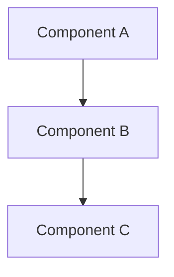

# Design Document

[Cap: 4,000 words for the whole document. Every sentence is for an agent that acts on it: an interface, a shape, a seam, a citation. Describe the existing code in codebase-context.md, not here.]

## Overview

[Three sentences: what is built, where it sits in the system, what it reuses.]

## Steering Document Alignment

### Technical Standards (tech.md)
[One line: which tech.md patterns apply and where the design follows them.]

### Project Structure (structure.md)
[One line: where new files go and why, per structure.md.]

### Design System (design-system.md) — if applicable
[If this spec has a UI or visual surface, one line per design-system.md rule the design honors: semantic roles, component conventions, accessibility and theme parity gates. If this spec has no visual surface, or the project has no design-system.md, write N/A.]

## Architecture

[One paragraph on the shape of the change and the seams it adds or moves. A mermaid diagram only when the flow crosses more than two components.]



## Components and Interfaces

### Component 1
- **Purpose:** [What this component does]
- **Interfaces:** [Public methods, routes or props, with types]
- **Dependencies:** [What it depends on]
- **Reuses:** [Existing code it builds on, cited as path:line]

### Component 2
- **Purpose:** [What this component does]
- **Interfaces:** [Public methods, routes or props, with types]
- **Dependencies:** [What it depends on]
- **Reuses:** [Existing code it builds on, cited as path:line]

## Data Models

### Model 1
```
[The structure of Model1 in the project's language]
- id: [unique identifier type]
- name: [string/text type]
```

## Error Handling

1. **[Scenario]:** [handling; what the user sees]
2. **[Scenario]:** [handling; what the user sees]

## Testing Strategy

- **Unit:** [what is asserted, in which existing suite or new file]
- **Integration:** [which flows, which fixtures]
- **End-to-end:** [the scenario from the decomposition entry and how it is run]

## Decisions taken in this document

[Every call made on the product's or the architecture's behalf, so a human can confirm or overturn it. A call that departs from a requirement's literal is flagged RE-DECIDED in the drafter's report.]

[In `## Revision History` and decision-log bullets, cite findings by id and prose only. Never write a backticked path, line range or code identifier there; the citation lint does not scan these sections.]

- D1 — [decision]: [options considered]; chosen because [one line]

## Scope notes

[What the requirements or the decomposition entry list that this design cuts or defers, with the reason. Carried items from the requirements phase that do not apply here, with the reason. Write "none" when empty.]
