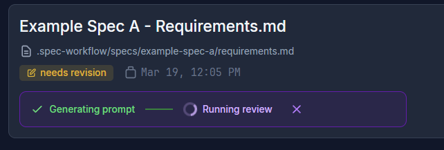

# User Guide

A comprehensive guide to using Spec Workflow MCP for AI-assisted software development.

## Getting Started

### What is Spec Workflow MCP?

Spec Workflow MCP is a Model Context Protocol server that provides structured, spec-driven development tools to AI assistants. It helps you:

- Create detailed specifications before coding
- Track implementation progress
- Manage approvals and revisions
- Maintain project documentation

### Basic Workflow

The full phase sequence is:

```
(Steering) → Decomposition → Requirements → Design → Tasks → Implementation
```

1. **Steering** (optional, once per project) - High-level product/tech/structure docs (plus an optional design-system doc)
2. **Decomposition** (when steering exists) - Break the project into a set of specs
3. **Create a spec** - Requirements → Design → Tasks for one feature
4. **Review and approve** - Each document is approved in the dashboard before the next
5. **Implement tasks** - Execute the plan, logging and reviewing each task
6. **Track progress** - Monitor completion status

## Creating Specifications

### Simple Spec Creation

Ask your AI assistant to create a spec:

```
"Create a spec for user authentication"
```

The AI will automatically:
1. Create a requirements document
2. Design the technical approach
3. Break down implementation into tasks

### Detailed Spec Creation

Provide more context for better specifications:

```
"Create a spec called payment-gateway with the following features:
- Credit card processing
- PayPal integration
- Subscription management
- Webhook handling for payment events"
```

### From Existing Documents

Use your existing PRD or design documents:

```
"Build a spec from @product-requirements.md"
```

## Managing Specifications

### Listing All Specs

```
"List all my specs"
```

Returns:
- Spec names
- Current status
- Progress percentage
- Document states

### Checking Spec Status

```
"Show me the status of the user-auth spec"
```

Provides:
- Requirements approval status
- Design approval status
- Task completion progress
- Detailed task breakdown

### Viewing Spec Documents

Use the dashboard or VSCode extension to:
- Read requirements documents
- Review design documents
- Browse task lists
- Track implementation progress

## Working with Tasks

### Task Structure

Tasks are organized hierarchically:
- **1.0** - Major sections
  - **1.1** - Subtasks
  - **1.2** - Subtasks
    - **1.2.1** - Detailed steps

### Implementing Tasks

#### Method 1: Direct Implementation
```
"Implement task 1.2 from the user-auth spec"
```

#### Method 2: Copy from Dashboard
1. Open the dashboard
2. Navigate to your spec
3. Click "Tasks" tab
4. Click "Copy Prompt" button next to any task
5. Paste into your AI conversation

#### Method 3: Batch Implementation
```
"Implement all database setup tasks from user-auth spec"
```

### Task Status

Tasks have three states (tracked as markers in `tasks.md`):
- ⏳ **Pending** `[ ]` - Not started
- 🔄 **In Progress** `[-]` - Currently being worked on
- ✅ **Completed** `[x]` - Finished

### Completing a Task

Before a task is marked complete, the workflow requires two steps:

1. **`log-implementation`** — record what was built (the artifacts list is mandatory;
   it forms a searchable knowledge base future agents use to avoid duplicating code).
2. **An independent code review** — never self-review. Trigger it from the dashboard
   *Review* button (a fresh-context agent reviews, then the assistant reads the result
   with `get-task-review`), or, when running headless, the agent reviews via
   `review-task`. Only after the review passes is the task marked `[x]`.

## Approval Workflow

### Requesting Approval

When documents are ready for review:

1. The AI automatically requests approval
2. Dashboard shows notification
3. Review the document
4. Provide feedback or approve

### Approval Actions

- **Approve** - Accept the document as-is
- **Request Changes** - Provide feedback for revision
- **Reject** - Start over with new requirements

### Revision Process

1. Provide specific feedback (the approval moves to `needs-revision`)
2. AI revises the document, deletes the old approval, and resubmits with the same file
3. Review updated version
4. Approve or request further changes

> **Approval is read from the dashboard, never from chat.** Saying "approved" in the
> conversation does not advance the workflow — the agent checks approval *status*
> via the `approvals` tool and only proceeds on a real `approved` record, then
> deletes that approval before the next phase. For non-interactive / headless
> operation (where these rules are relaxed), see
> [AUTONOMOUS-USAGE.md](AUTONOMOUS-USAGE.md).

### Adversarial Review

Before approving a critical document, you can run an adversarial review — an automated, independent analysis that stress-tests the document for gaps, contradictions, and unstated assumptions.

From the dashboard approvals page:

1. Click **Adversarial Review** on any pending approval
2. A background subagent generates a tailored critique
3. Progress appears directly on the approval card
4. On completion, the approval moves to **needs-revision** with a link to the analysis
5. Tell your AI assistant to respond to the revision, and it will read the analysis, address valid findings, and resubmit



You can also trigger reviews from the CLI:

```
"Run an adversarial review on the design phase of payment-gateway"
```

Browse past reviews and configure methodology on the **Adversarial Analysis** page in the dashboard sidebar.

## Bug Fixes

There is no dedicated bug-tracking tool in this server. Handle a bug the same way as
any change: create a small, focused spec for it (or, for a trivial fix in an existing
spec, add a task). The normal Requirements → Design → Tasks → Implementation flow,
including review and `log-implementation`, applies.

## Template System

### Using Templates

Spec Workflow includes templates for:
- Requirements documents
- Design documents
- Task lists
- Steering documents

### Custom Templates

The built-in templates live in `.spec-workflow/templates/` (system-managed — don't
edit these). To override one, create a file with the **same name** in
`.spec-workflow/user-templates/`:

- `requirements-template.md`, `design-template.md`, `tasks-template.md`
- `product-template.md`, `tech-template.md`, `structure-template.md`, `design-system-template.md`

The loader checks `user-templates/` first and falls back to the default in
`templates/`. For example, to customize the requirements document, create
`.spec-workflow/user-templates/requirements-template.md`.

## Advanced Features

### Steering Documents

Create high-level project guidance:

```
"Create steering documents for my e-commerce project"
```

Generates:
- **Product steering** - Vision and goals
- **Technical steering** - Architecture decisions
- **Structure steering** - Project organization
- **Design system steering** (optional) - Visual system *direction and rules*: principles, semantic roles, usage rules, accessibility gates (exact values stay in specs/code)

When a `design-system.md` exists, the Design phase of any UI/visual spec is prompted to
align with it (via a "Design System" subsection in the design document); non-visual specs
and projects without the doc simply mark it N/A.

### Decomposition

When steering documents exist, the project is first broken into a set of specs via a
**decomposition** step (the `decomposition-guide` tool), saved to
`.spec-workflow/spec-decomposition/decomposition.md` and approved like any document.
Each resulting spec then goes through the standard Requirements → Design → Tasks →
Implementation flow. See [WORKFLOW.md](WORKFLOW.md#phase-15-decomposition).

### Deferred Decisions

When you consciously postpone a decision — or discover during implementation that
something affects a *future* spec — record it with the `deferrals` tool. Deferrals are
project-level and persist across specs, so they survive after the current spec is
archived. Review open deferrals at the start of new work, and surface unresolved ones
when planning.

### Archive System

Manage completed specs:
- Move finished specs to archive
- Keep active workspace clean
- Access archived specs anytime
- Restore specs when needed

### Multi-Language Support

Change interface language:

1. **Dashboard**: Settings → Language
2. **VSCode Extension**: Extension Settings → Language
3. **Config file**: `lang = "ja"` (or other language code)

## Best Practices

### 1. Start with Steering Documents

Before creating specs:
```
"Create steering documents to guide the project"
```

### 2. Be Specific in Requirements

Good:
```
"Create a spec for user authentication with:
- Email/password login
- OAuth2 (Google, GitHub)
- 2FA support
- Password reset flow"
```

Not ideal:
```
"Create a login spec"
```

### 3. Review Before Implementation

Always review and approve:
1. Requirements document
2. Design document
3. Task breakdown

### 4. Implement Incrementally

- Complete tasks in order
- Test after each major section
- Update task status regularly

### 5. Use the Dashboard

The dashboard provides:
- Visual progress tracking
- Easy document navigation
- Quick approval actions
- Real-time updates

## Common Workflows

### Feature Development

1. Create spec: `"Create spec for shopping-cart feature"`
2. Review requirements in dashboard
3. Approve or request changes
4. Review design document
5. Approve design
6. Implement tasks sequentially
7. Track progress in dashboard

### Refactoring

1. Create spec: `"Create spec for database optimization"`
2. Document current state
3. Design improvements
4. Plan migration steps
5. Implement incrementally
6. Verify each step

## Tips and Tricks

### Efficient Task Management

- Use task grouping for related items
- Copy prompts from dashboard for accuracy
- Mark tasks complete immediately after finishing

### Document Management

- Keep requirements concise but complete
- Include acceptance criteria
- Add technical constraints in design
- Reference external documents when needed

### Collaboration

- Use approval comments for feedback
- Share dashboard URL with team
- Export documents for external review
- Track changes through revision history

## Integration with AI Assistants

### Contextual Awareness

The AI assistant automatically:
- Knows your project structure
- Understands spec relationships
- Tracks implementation progress
- Maintains consistency

### Natural Language Commands

Speak naturally:
- "What specs do I have?"
- "Show me what's left to do"
- "Start working on the next task"
- "Update the design for better performance"

### Continuous Workflow

The AI maintains context between sessions:
- Resume where you left off
- Reference previous decisions
- Build on existing work
- Maintain project coherence

## Related Documentation

- [Workflow Process](WORKFLOW.md) - Detailed workflow guide
- [Prompting Guide](PROMPTING-GUIDE.md) - Example prompts
- [Autonomous Usage](AUTONOMOUS-USAGE.md) - Non-interactive / headless operation
- [Interfaces Guide](INTERFACES.md) - Dashboard and extension details
- [Tools Reference](TOOLS-REFERENCE.md) - Complete tool documentation