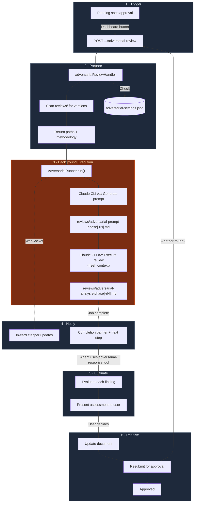

**Title:** feat: adversarial review integration with automated background execution

---

## Summary

Adds adversarial (oppositional) review capabilities to the spec workflow. Users can trigger a review from the dashboard, which automatically spawns background Claude CLI subagents to generate and execute the review — no manual copy-paste required. Progress is shown inline on the approval card, and completed reviews persist with next-step guidance.

The adversarial prompting methodology is informed by [this guide to adversarial prompting](https://www.fightingwithai.com/prompt-engineering/adversarial-prompting/).

## Problem

Spec documents benefit from critical review before approval, but self-review tends to be confirmatory rather than challenging. The adversarial technique uses context separation (a fresh agent session with no collaborative history) and oppositional framing to produce genuinely critical analysis. Previously this would require manual prompting and document management completely outside the spec-workflow environment. — this PR implements an automated process that offers what I'd consider a reasonable baseline of functionality. I've been using it on small-to-medium sized codebases with good results.

## Changes

### MCP Tools
- **`adversarial-review`**: Prepares a review for a spec phase — handles versioning, gathers steering docs and prior phase context, returns methodology for prompt generation
- **`adversarial-response`**: Finds analysis by version (or latest) and returns structured evaluation instructions (assess/reason/propose format). Accepts optional `version` parameter for precise targeting

### Background Execution (`adversarial-runner.ts`)
- Spawns two sequential `claude --print --dangerously-skip-permissions` processes:
  1. **Prompt generation**: Reads spec + context, writes a tailored adversarial prompt file
  2. **Review execution**: Fresh-context agent reads and executes the prompt, writes analysis
- Context separation is preserved — the reviewing agent has no collaborative history
- Job tracking with status transitions: `pending` → `generating-prompt` → `running-review` → `completed`/`failed`
- 10-minute timeout per step, max 2 concurrent reviews per project, duplicate detection
- Configurable model selection via settings (defaults to CLI default)
- WebSocket broadcast on every status change

### Dashboard — Approvals Integration
- **"Adversarial Review" button** on pending spec approvals with confirmation dialog
- **In-card progress stepper** showing the two-step process with spinner/checkmark states
- **Persistent completion banner** with next-step guidance (survives page navigation, driven by approval annotations + server-side file verification)
- **Incomplete state detection**: After server restart, checks if the expected analysis version exists on disk. Shows amber warning with "Resume review" button if missing
- **Failed state**: Shows error with "Retry" and "Dismiss" options
- **Retry/resume endpoint** (`POST .../adversarial-retry`): Checks if the prompt file from a previous attempt exists — if so, skips step 1 and runs only step 2
- **Version-aware verification**: Annotations store `analysisVersion`; completion status is verified against the specific version, not just any existing file

### Dashboard — Adversarial Analysis Page (`/adversarial`)
- **Reviews tab**: Browse analyses by spec, phase, and version with rendered markdown
- **Settings tab**: Optional preamble, required-phase checkboxes, model selector (Opus/Sonnet/Haiku or CLI default), and methodology editors with reset-to-default

### Pending Revisions Section (Approvals page)
- Approvals with `needs-revision` status appear in a separate section below pending items
- Read-only view (no action buttons) — the agent handles revisions
- Adversarial progress/completion banners render here after a review is triggered

### API Endpoints Added
- `GET .../adversarial/jobs` — list active jobs for a project
- `GET .../adversarial/jobs/:jobId` — job status
- `POST .../adversarial/jobs/:jobId/cancel` — cancel a running job
- `POST .../approvals/:id/adversarial-retry` — retry/resume a failed or incomplete review

## How to Review

Suggested reading order:

1. **`src/tools/adversarial-review.ts`** and **`adversarial-response.ts`** — the MCP tool interfaces and methodology. Start here to understand what the feature does
2. **`src/dashboard/adversarial-runner.ts`** — the background execution engine. Self-contained, ~250 lines
3. **`src/dashboard/multi-server.ts`** — search for "adversarial" to find the endpoint changes. The retry endpoint is the most complex
4. **`src/dashboard_frontend/.../ApprovalsPage.tsx`** — the `AdversarialProgress` component at the top of the file, then the `Content` component's job tracking state
5. **`src/dashboard_frontend/.../AdversarialPage.tsx`** — standalone page, can be reviewed independently
6. **Tests** (`__tests__/`) — 24 new tests covering tools and dashboard endpoints

## Testing

- `npx tsc --noEmit` passes
- `npm run build` succeeds
- `npm test` — all tests pass (24 new covering adversarial tools + endpoints)
- Manually tested: trigger review from dashboard, observe stepper progress, verify completion banner appears, navigate away and return (persists), kill server mid-review and restart (shows incomplete state with resume button), retry from incomplete state

## Diagram

