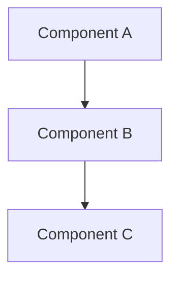

# Design Document

## Overview

[High-level description of the feature: what it does, where it fits in the system, and which requirements it addresses. 2-4 sentences.]

## Steering Document Alignment

### Technical Standards (tech.md)
[How the design follows documented technical patterns and standards]

### Project Structure (structure.md)
[How the implementation follows project organization conventions]

## Code Reuse Analysis

<!-- List existing code that this feature will use, extend, or integrate with.
     Include file paths. This prevents the implementation from rebuilding
     what already exists. -->

| Existing code | How it's used |
|---|---|
| [path/to/file] | [Reused as-is / Extended / Integrated via ...] |
| [path/to/file] | [Reused as-is / Extended / Integrated via ...] |

## Architecture

<!-- Include a diagram ONLY if the feature involves non-obvious data flow,
     multiple interacting components, or cross-feature coordination.
     Omit for straightforward CRUD or single-component features. -->

[Describe the overall architecture and design patterns used]

## Components

<!-- For each component, specify the file path and which requirements it addresses.
     The implementing agent needs paths and requirement traceability, not just descriptions. -->

### [Component Name]
- **File(s):** [path/to/file(s) to create or modify]
- **Purpose:** [What this component does]
- **Interfaces:** [Public methods/APIs/props]
- **Dependencies:** [What it depends on]
- **Reuses:** [Existing code it builds upon, from Code Reuse Analysis]
- **Requirements:** [R1, R2.3, etc.]

### [Component Name]
- **File(s):** [path/to/file(s) to create or modify]
- **Purpose:** [What this component does]
- **Interfaces:** [Public methods/APIs/props]
- **Dependencies:** [What it depends on]
- **Reuses:** [Existing code it builds upon]
- **Requirements:** [R1, R2.3, etc.]

## API Endpoints

<!-- Include this section if the feature adds or modifies API endpoints.
     Omit entirely for features with no API surface. -->

| Method | Path | Purpose | Request body | Response | Requirements |
|---|---|---|---|---|---|
| [GET/POST/...] | [/api/...] | [What it does] | [Schema or "none"] | [Shape] | [Rn] |

## Data Models

<!-- Include this section if the feature adds or modifies persistent data.
     Omit for features with no data model changes. -->

### [Model Name]
- **Table/collection:** [name]
- **Requirements:** [Rn]

| Column/Field | Type | Constraints | Notes |
|---|---|---|---|
| [name] | [type] | [PK/FK/unique/nullable/default] | [purpose if not obvious] |

## Error Handling

<!-- Only list error scenarios specific to this feature.
     Reference the project's standard error handling pattern for common cases. -->

| Scenario | Error type | Status | User impact |
|---|---|---|---|
| [What goes wrong] | [Error class/code] | [HTTP status or equivalent] | [What the user sees] |

## Testing Strategy

<!-- List what needs testing for this feature specifically.
     Reference the project's testing patterns for how tests are structured. -->

- **Unit tests:** [What logic needs unit testing and why]
- **Integration tests:** [What flows need integration testing]
- **E2E tests:** [What user scenarios need E2E coverage, if any]
